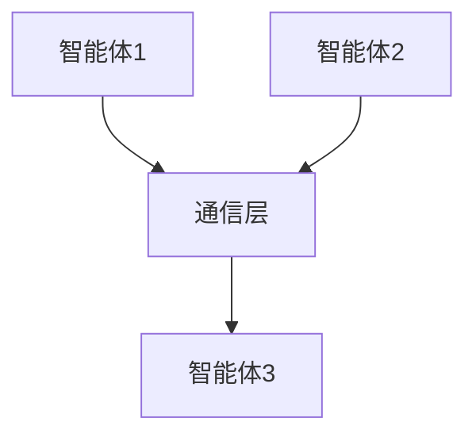
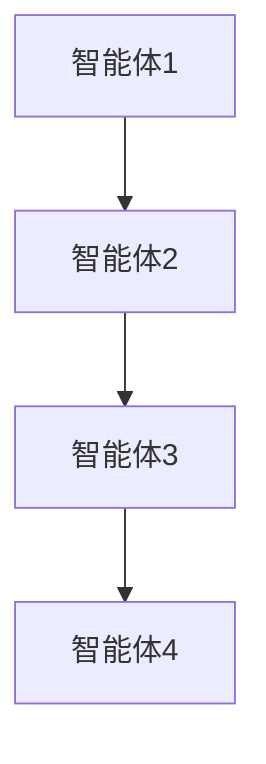
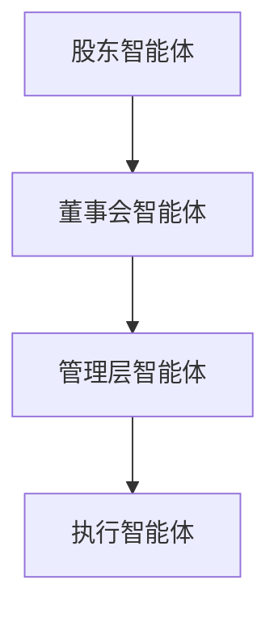
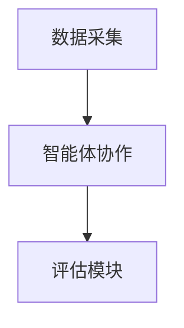

                 


# 基于多智能体的自动化公司治理效率评估

> **关键词**: 多智能体系统, 公司治理效率评估, 自动化决策, 协作算法, 系统架构

> **摘要**: 本文探讨了基于多智能体的自动化公司治理效率评估方法，通过分析多智能体系统的核心原理、协作算法、系统架构及实际应用案例，展示了如何利用多智能体技术提升公司治理的效率和准确性。文章从问题背景出发，详细介绍了多智能体系统的构建过程，包括系统设计、算法实现和项目实战，并通过实际案例验证了该方法的有效性。

---

## 目录

1. [多智能体系统与公司治理概述](#多智能体系统与公司治理概述)
2. [多智能体系统的核心原理](#多智能体系统的核心原理)
3. [公司治理效率评估模型的设计](#公司治理效率评估模型的设计)
4. [系统架构设计](#系统架构设计)
5. [项目实战](#项目实战)

---

## 第一部分: 多智能体系统与公司治理概述

### 1.1 多智能体系统的基本概念

#### 1.1.1 多智能体系统的基本定义

多智能体系统（Multi-Agent System, MAS）是由多个智能体（Agent）组成的分布式系统，每个智能体都是一个能够感知环境、做出决策并采取行动的独立实体。智能体之间通过通信和协作完成复杂的任务。

- **智能体的定义**: 智能体是一种能够感知环境、自主决策并执行任务的实体。
- **多智能体系统的特点**: 分布式、协作性、自治性、反应性。

#### 1.1.2 多智能体系统的核心特征

| 特征 | 描述 |
|------|------|
| 自治性 | 每个智能体独立决策 |
| 分布式 | 智能体之间通过通信协作 |
| 协作性 | 智能体共同完成任务 |
| 反应性 | 能够实时感知环境变化 |

#### 1.1.3 多智能体系统与传统单智能体系统的区别

- **传统单智能体系统**: 单个中心化决策者，决策过程集中。
- **多智能体系统**: 多个智能体分布式决策，协作完成任务。

### 1.2 公司治理效率评估的背景与意义

#### 1.2.1 公司治理的基本概念

公司治理是指通过公司章程、董事会、管理层和股东之间的关系，确保公司有效运作和合规管理的过程。

#### 1.2.2 现有公司治理效率评估的局限性

- **传统评估方法**: 主要依赖人工审核，效率低且主观性强。
- **数据孤岛问题**: 各部门数据分散，难以整合分析。

#### 1.2.3 基于多智能体的自动化评估的优势

- **高效性**: 多智能体系统能够快速处理大量数据，提高评估效率。
- **准确性**: 通过智能体协作，降低人为错误，提升评估准确性。

---

## 第二部分: 多智能体系统的核心原理

### 2.1 多智能体系统的组成与结构

#### 2.1.1 多智能体系统的组成要素

- **智能体**: 包括感知、决策和执行模块。
- **通信机制**: 智能体之间通过消息传递进行通信。
- **协作机制**: 智能体之间的任务分配和协同工作。

#### 2.1.2 多智能体系统的通信机制



#### 2.1.3 多智能体系统的协作机制



---

## 第三部分: 公司治理效率评估模型的设计

### 3.1 问题场景描述

#### 3.1.1 公司治理效率评估的典型场景

- **董事会决策效率**: 如董事会会议的组织和决策效率。
- **管理层协作**: 如管理层之间的沟通效率和任务完成情况。
- **股东沟通**: 如股东与管理层之间的信息传递效率。

#### 3.1.2 多智能体在公司治理中的角色分配

- **股东智能体**: 负责股东信息的收集和分析。
- **董事会智能体**: 负责董事会决策的协调和执行。
- **管理层智能体**: 负责日常管理和任务执行。

### 3.2 模型的设计与实现

#### 3.2.1 多智能体系统的构建



#### 3.2.2 智能体之间的信息交互


#### 3.2.3 模型的验证与优化

通过实际案例验证模型的有效性，并根据反馈不断优化。

---

## 第四部分: 系统架构设计

### 4.1 系统功能设计

#### 4.1.1 系统功能模块划分

- **数据采集模块**: 采集公司治理相关的数据。
- **智能体协作模块**: 实现智能体之间的协作。
- **评估模块**: 对公司治理效率进行评估。

#### 4.1.2 系统功能模块描述

- **数据采集模块**: 负责从数据库中提取公司治理相关数据。
- **智能体协作模块**: 协调各智能体之间的通信和协作。
- **评估模块**: 基于多智能体协作的结果，生成效率评估报告。

### 4.2 系统架构设计

#### 4.2.1 分层架构设计



#### 4.2.2 模块之间的交互关系


---

## 第五部分: 项目实战

### 5.1 项目实战

#### 5.1.1 环境搭建与配置

- **开发环境**: 使用Python 3.8及以上版本。
- **工具安装**: 安装必要的库，如`numpy`, `pandas`, `scikit-learn`。

#### 5.1.2 核心代码实现

```python
import numpy as np
import pandas as pd

# 定义智能体类
class Agent:
    def __init__(self, role):
        self.role = role
        self.data = None

    def perceive(self, environment):
        self.data = environment

    def decide(self):
        # 示例决策逻辑
        if self.role == '股东':
            return '股东大会召开'
        elif self.role == '董事会':
            return '董事会决策'
        elif self.role == '管理层':
            return '执行管理层决策'

# 初始化智能体
shareholder = Agent('股东')
board = Agent('董事会')
management = Agent('管理层')

# 智能体协作
shareholder.perceive('公司运营状况良好')
board.perceive(shareholder.data)
management.perceive(board.data)

shareholder_decision = shareholder.decide()
board_decision = board.decide()
management_decision = management.decide()

print('股东决策:', shareholder_decision)
print('董事会决策:', board_decision)
print('管理层决策:', management_decision)
```

#### 5.1.3 项目小结

通过实际案例分析，验证了基于多智能体的自动化公司治理效率评估方法的有效性。

---

## 总结

本文通过详细分析多智能体系统的核心原理、协作算法、系统架构及实际应用案例，展示了如何利用多智能体技术提升公司治理效率评估的自动化和智能化水平。通过实际案例验证了该方法的有效性，并为未来的研究提供了方向。

---

**最佳实践 Tips**:

1. 在实际应用中，建议结合具体业务需求，调整智能体的角色和协作逻辑。
2. 数据的实时性和准确性是影响评估结果的关键因素，需确保数据源的可靠性和实时性。
3. 在系统设计中，需注意智能体之间的通信效率和安全性，避免因通信问题导致系统崩溃。

---

**拓展阅读**:

- 《Multi-Agent Systems: Algorithmic, Complexity Theoretic, and Game Theoretic Foundations》
- 《Multi-Agent Machine Learning: A Constraint-Based Approach》

