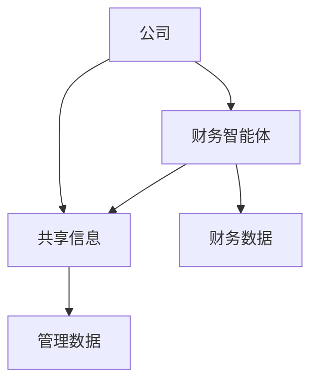
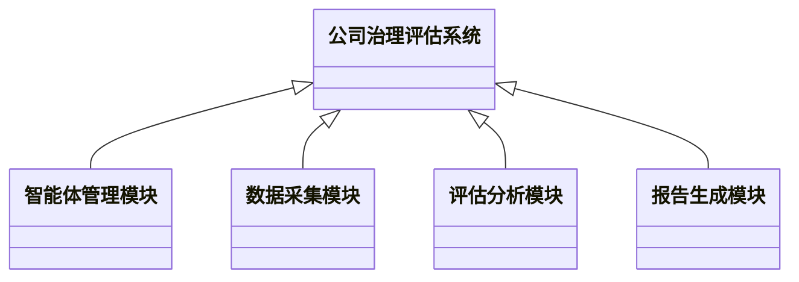
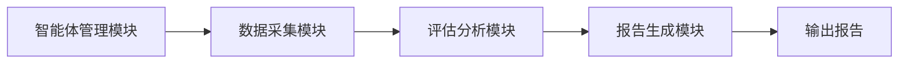

                 


# 基于多智能体的自动化公司治理评估

## 关键词：多智能体系统、公司治理、自动化评估、分布式计算、协作算法、系统架构、博弈论模型

## 摘要

随着企业规模的不断扩大和复杂性增加，传统的公司治理评估方法逐渐暴露出效率低下、信息不透明等问题。为了应对这些挑战，多智能体系统作为一种新兴的技术手段，展现出其在自动化公司治理评估中的巨大潜力。本文将详细探讨多智能体系统如何应用于公司治理评估，分析其核心原理、算法设计、系统架构以及实际应用案例。文章从背景介绍、核心概念、算法原理、系统设计、项目实战等多个维度展开，旨在为读者提供全面而深入的技术见解。

---

## 正文部分

### 第1章：背景介绍

#### 1.1 多智能体系统的基本概念

- **定义**：多智能体系统（Multi-Agent System, MAS）由多个智能体组成，这些智能体能够自主决策、协作完成任务。
- **特征**：
  - 分布式：智能体分布在网络中，独立运作。
  - 协作性：通过通信和协作实现共同目标。
  - 动态性：适应环境变化，实时调整策略。

#### 1.2 公司治理评估的重要性

- **定义**：对公司治理结构、管理效率、合规性等进行评估，确保公司健康运行。
- **必要性**：提升透明度，优化决策，降低风险。
- **自动化优势**：
  - 提高效率：减少人工干预，快速处理大量数据。
  - 增强精准度：利用智能算法，提供更准确的评估结果。
  - 实时监控：动态跟踪公司运营状况，及时发现问题。

### 第2章：核心概念与联系

#### 2.1 多智能体系统的核心原理

- **分布式计算**：智能体之间通过消息传递进行协作，实现任务分解与重组。
- **博弈论模型**：智能体之间通过博弈论模型进行决策，确保各方利益均衡。

#### 2.2 公司治理中的多智能体应用

- **角色分配**：每个智能体负责特定任务，如财务分析、风险管理。
- **信息共享与决策**：智能体之间共享信息，共同制定最优决策。
- **动态适应**：根据公司变化调整智能体行为，保持评估的实时性。

#### 2.3 概念对比与实体关系

- **概念对比表**：
  | 特性        | 单智能体系统      | 多智能体系统      |
  |-------------|-------------------|-------------------|
  | 结构         | 集中式           | 分布式           |
  | 协作方式     | 依赖中心节点     | 智能体间协作     |
  | 灵活性       | 较低             | 较高             |

- **Mermaid实体关系图**：



### 第3章：算法原理讲解

#### 3.1 分布式计算算法

- **算法流程图**：


- **Python代码示例**：

```python
def distribute_computation(agent_tasks):
    results = []
    for task in agent_tasks:
        # 分配任务给各个智能体
        agent = task['agent']
        result = agent.compute(task['data'])
        results.append(result)
    return results
```

- **数学模型**：

$$
\text{总结果} = \sum_{i=1}^{n} \text{智能体}_i(\text{任务}_i)
$$

#### 3.2 博弈论模型

- **算法流程图**：


- **纳什均衡公式**：

$$
\text{纳什均衡} = \{策略组合\} \text{使得每个智能体无法通过单方面改变策略而提高收益}
$$

- **Python代码示例**：

```python
def nash_equilibrium(players, strategies):
    for strategy_profile in product(*strategies):
        for i, player in enumerate(players):
            # 检查是否是纳什均衡
            best_response = find_best_response(player, strategy_profile, i)
            if not is_best_response(best_response, strategy_profile[i]):
                break
        else:
            return strategy_profile
    return None
```

### 第4章：系统分析与架构设计

#### 4.1 系统功能设计

- **领域模型类图**：



#### 4.2 系统架构设计

- **架构图**：



### 第5章：项目实战

#### 5.1 环境安装

- 安装Python、Jupyter Notebook、Mermaid CLI等工具。

#### 5.2 核心代码实现

- **智能体协作代码**：

```python
class Agent:
    def __init__(self, id):
        self.id = id
        self.tasks = []
    
    def compute(self, task):
        # 具体计算逻辑
        pass

def main():
    agents = [Agent(i) for i in range(5)]
    tasks = [{'agent': agents[0], 'data': ...}, ...]
    results = distribute_computation(tasks)
    print(results)

if __name__ == "__main__":
    main()
```

#### 5.3 案例分析

- **案例：某公司风险管理评估**
  - 数据采集：收集财务、市场、运营数据。
  - 智能体协作：各智能体分别分析不同风险因素。
  - 评估结果：生成综合风险评估报告。

### 第6章：总结与展望

- **总结**：多智能体系统在公司治理评估中的应用优势明显，能够显著提升效率和精准度。
- **最佳实践**：
  - 明确智能体角色，合理分配任务。
  - 确保智能体间高效通信，优化协作机制。
  - 定期更新算法模型，适应公司变化。
- **注意事项**：
  - 数据安全：保护公司敏感信息。
  - 系统维护：及时修复漏洞，确保系统稳定。
  - 人员培训：提升团队技术能力，适应新系统。

- **拓展阅读**：
  - 推荐书籍：《Multi-Agent Systems: Algorithmic, Complexity Theoretic, and Game Theoretic Foundations》。
  - 推荐博客：深入探讨博弈论在多智能体系统中的应用。

---

通过以上章节的详细阐述，本文系统地介绍了基于多智能体的自动化公司治理评估的理论基础、算法设计、系统架构以及实际应用。希望读者能够通过本文获得宝贵的技术见解，并将其应用于实际工作中。

