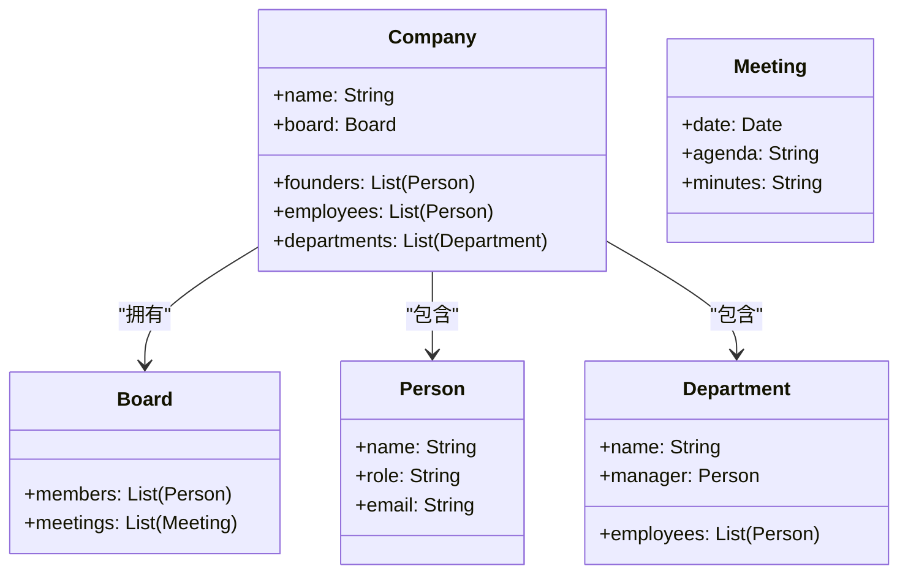
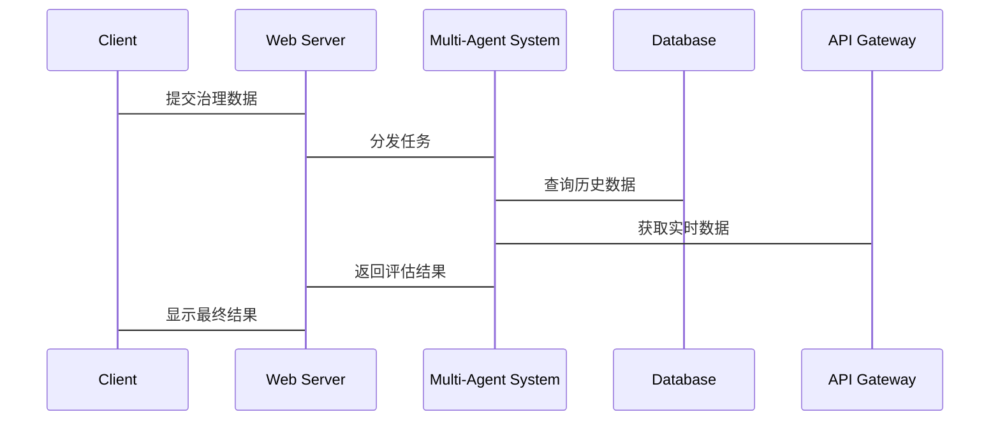

                 


# 基于多智能体的自动化公司治理风险评估

## 关键词：多智能体系统、公司治理、风险评估、自动化、协作算法、系统架构

## 摘要：  
随着企业规模的不断扩大和业务复杂性的增加，公司治理风险评估的传统方法已难以满足现代企业的需求。基于多智能体的自动化公司治理风险评估系统通过分布式计算和协作算法，实现了对治理风险的实时监控和优化管理。本文详细探讨了多智能体系统在公司治理中的应用，从背景介绍、核心概念到算法实现、系统架构，再到项目实战和最佳实践，为读者提供全面的技术指导和实践参考。

---

## 第一部分: 基于多智能体的公司治理风险评估背景介绍

### 第1章: 问题背景与描述

#### 1.1 公司治理风险评估的现状与挑战
- **传统公司治理风险评估的局限性**  
  传统的公司治理风险评估依赖于人工分析，效率低下，且难以覆盖大规模数据。  
- **当前企业面临的治理风险问题**  
  包括合规性风险、内部舞弊、关联交易风险等，这些问题往往涉及多部门和多业务线，难以全面监控。  
- **自动化评估的必要性与优势**  
  自动化评估可以提高效率、降低人为错误，并实时跟踪风险变化。

#### 1.2 多智能体系统的基本概念
- **多智能体系统的定义与特点**  
  多智能体系统是由多个相互作用的智能体组成的系统，具有分布性、协作性和自主性等特点。  
- **多智能体系统与公司治理的结合**  
  通过多智能体系统的协作，可以实现对公司治理风险的实时评估和动态管理。

### 第2章: 问题解决与边界定义

#### 2.1 公司治理风险评估的自动化目标
- **自动化评估的核心目标**  
  包括风险识别、风险量化、风险预警和风险应对。  
- **自动化评估的实现路径**  
  通过多智能体系统的协作，实现对公司治理数据的实时采集、分析和决策。  
- **相关问题的边界与外延**  
  确定自动化评估的范围和边界，避免超出系统能力或遗漏关键风险点。

---

## 第二部分: 多智能体系统的核心概念与联系

### 第3章: 多智能体系统的核心原理

#### 3.1 多智能体系统的组成与功能
- **多智能体系统的组成要素**  
  包括智能体、通信机制、协作协议和环境接口。  
- **多智能体系统的功能模块**  
  包括数据采集、数据分析、决策制定和结果反馈。  
- **多智能体系统的交互机制**  
  智能体之间通过消息传递、状态共享和任务分配实现协作。

#### 3.2 多智能体系统的协作算法
- **协作算法的基本原理**  
  通过分布式计算和博弈论模型，实现智能体之间的任务分配和协作优化。  
- **协作算法的实现机制**  
  包括任务分配、冲突解决和协作优化等步骤。

### 第4章: 多智能体系统与公司治理的实体关系

#### 4.1 实体关系分析
- **公司治理的主要实体**  
  包括公司、董事会、高管、股东和利益相关者。  
- **风险评估的关键实体**  
  包括风险源、风险影响、风险缓解措施和风险预警机制。  
- **多智能体系统中的实体关系**  
  智能体通过数据共享和协作，实现对公司治理风险的全面评估。

#### 4.2 ER实体关系图
```mermaid
erDiagram
    company_header {
        company : Company
        board : Board
        executive : Executive
        shareholder : Shareholder
        stakeholder : Stakeholder
    }
    risk_assessment_header {
        risk_source : Risk Source
        risk_impact : Risk Impact
        risk_mitigation : Risk Mitigation
        risk_warning : Risk Warning
    }
    company --> risk_source : "触发风险"
    board --> risk_impact : "评估影响"
    executive --> risk_mitigation : "制定措施"
    shareholder --> risk_warning : "触发预警"
    stakeholder --> risk_source : "识别风险"
```

---

## 第三部分: 多智能体协作算法的原理与实现

### 第5章: 多智能体协作算法的数学模型

#### 5.1 协作算法的数学建模
- **基于博弈论的数学模型**  
  利用纳什均衡模型，描述智能体之间的策略选择和协作关系。  
- **基于强化学习的数学模型**  
  利用Q-learning算法，实现智能体的策略优化和协作增强。  
- **基于分布式计算的数学模型**  
  利用分布式计算框架，实现多智能体之间的数据同步和协作。

#### 5.2 算法的数学公式
- **博弈论模型**  
  $$ \text{纳什均衡} = \arg\max_{i} \sum_{j} p_{ij}u_{ij} $$
- **强化学习模型**  
  $$ Q(s, a) = (1-\alpha)Q(s, a) + \alpha[r + \max_{a'} Q(s', a')] $$
- **分布式计算模型**  
  $$ \text{分布式计算} = \sum_{i=1}^{n} f_i(x_i) $$

### 第6章: 多智能体协作算法的实现

#### 6.1 协作算法的实现步骤
- **算法初始化与参数设置**  
  初始化智能体状态、参数和目标函数。  
- **算法迭代与优化**  
  通过迭代优化算法参数，实现智能体协作的动态调整。  
- **算法收敛与终止条件**  
  当算法收敛或达到终止条件时，输出最终结果。

---

## 第四部分: 系统分析与架构设计方案

### 第7章: 问题场景介绍

#### 7.1 公司治理风险评估的场景描述
- **场景背景**  
  企业面临多方面的治理风险，需要实时监控和动态评估。  
- **场景目标**  
  实现对公司治理风险的实时评估和动态管理。

### 第8章: 项目介绍与系统功能设计

#### 8.1 领域模型 mermaid 类图


#### 8.2 系统架构设计 mermaid 架构图


#### 8.3 系统接口设计
- **输入接口**  
  接收公司治理数据，包括公司结构、董事会成员和高管信息。  
- **输出接口**  
  输出风险评估结果，包括风险等级、风险描述和应对措施。

#### 8.4 系统交互 mermaid 序列图


---

## 第五部分: 项目实战

### 第9章: 环境安装与核心代码实现

#### 9.1 环境安装
- **安装Python**  
  安装Python 3.8及以上版本。  
- **安装依赖库**  
  使用 pip 安装numpy、pandas、scikit-learn和networkx。

#### 9.2 核心代码实现
- **协作算法实现**  
  ```python
  import numpy as np
  import networkx as nx

  def nash_equilibrium(Q, actions):
      # 计算纳什均衡
      pass

  def q_learning(state, action, reward, next_state, Q, alpha=0.1):
      # 实现Q-learning算法
      Q[state][action] = (1-alpha)*Q[state][action] + alpha*(reward + max(Q[next_state]))
      return Q
  ```

- **分布式计算实现**  
  ```python
  from distributed import Client

  def distributed_task(x):
      return x**2

  client = Client('tcp://127.0.0.1:8786')
  futures = client.map(distributed_task, range(10))
  results = client.gather(futures)
  ```

---

## 第六部分: 最佳实践与总结

### 第10章: 小结与注意事项

#### 10.1 小结
- **文章总结**  
  详细介绍了多智能体系统在公司治理风险评估中的应用，从理论到实践，提供了全面的技术指导。  
- **系统设计总结**  
  强调了系统架构设计的重要性，确保系统的可扩展性和可维护性。

#### 10.2 注意事项
- **数据隐私保护**  
  在实现过程中，需注意数据的隐私保护和合规性。  
- **系统性能优化**  
  需要优化算法性能，确保系统的实时性和稳定性。

### 第11章: 拓展阅读与深入思考

#### 11.1 拓展阅读
- **推荐书籍**  
  推荐阅读《Multi-Agent Systems: Algorithmic, Complexity, and Inferential Issues》。  
- **推荐论文**  
  推荐阅读《A Survey on Multi-Agent Systems and Their Applications in Risk Management》。

#### 11.2 深入思考
- **未来研究方向**  
  探讨多智能体系统在其他领域的应用，如金融风险管理和供应链优化。  
- **技术发展趋势**  
  研究强化学习和分布式计算在多智能体系统中的进一步应用。

---

## 结语
通过本文的详细讲解，读者可以全面了解基于多智能体的自动化公司治理风险评估的核心概念、算法原理和系统架构。希望本文能为相关领域的研究和实践提供有价值的参考和指导。

