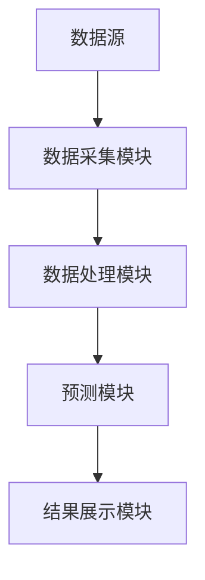

                 


# 基于多智能体的自动化公司现金流质量评估

## 关键词：现金流质量评估，多智能体系统，自动化评估，机器学习，现金流预测

## 摘要：本文详细探讨了基于多智能体系统的公司现金流质量评估方法，分析了传统评估方法的局限性，并提出了多智能体协同工作的创新解决方案。通过数学建模和算法实现，展示了如何利用多智能体系统的优势，提升现金流预测的准确性和效率。文章还结合实际案例，深入分析了系统的架构设计和实现过程，为企业的现金流管理提供了新的思路和方法。

---

# 第1章：现金流质量评估的背景与挑战

## 1.1 现金流质量评估的定义与重要性

现金流是企业财务健康的核心指标，直接反映了企业的盈利能力和运营效率。现金流质量评估是通过对现金流入和流出的分析，判断企业未来现金流的稳定性和可持续性。高质量的现金流意味着企业具备较强的偿债能力和扩展能力，而低质量的现金流则可能引发财务风险。

---

## 1.2 传统现金流质量评估方法的局限性

传统现金流评估方法主要依赖于财务报表分析和人工判断，存在以下问题：

1. **数据处理效率低**：传统方法需要人工收集和整理大量财务数据，耗时且容易出错。
2. **模型单一**：传统评估方法通常基于固定的财务指标，难以应对复杂多变的市场环境。
3. **缺乏动态性**：传统方法难以实时跟踪现金流的变化，无法及时捕捉市场波动对现金流的影响。

---

## 1.3 多智能体系统的应用潜力

多智能体系统（Multi-Agent System, MAS）是一种由多个智能体组成的分布式系统，每个智能体都有一定的自主性，能够与其他智能体协作完成复杂任务。在现金流质量评估中，多智能体系统可以通过分工合作，实时分析和预测现金流，显著提高评估效率和准确性。

---

# 第2章：多智能体系统的原理与架构

## 2.1 多智能体系统的结构与协作机制

多智能体系统由多个智能体组成，每个智能体都有特定的功能和任务。智能体之间的协作机制包括：

1. **任务分配**：根据智能体的能力和当前负载，动态分配任务。
2. **通信协议**：智能体之间通过特定协议交换信息，确保协作顺利进行。
3. **决策机制**：基于智能体接收到的信息，做出最优决策。

---

## 2.2 多智能体系统的架构设计

多智能体系统的架构设计需要考虑以下几个方面：

1. **功能模块划分**：根据现金流评估的需求，将系统划分为数据采集、数据处理、预测模型等模块。
2. **通信协议设计**：定义智能体之间的通信规则，确保信息高效传递。
3. **系统可扩展性**：设计灵活的架构，便于后续功能的扩展和升级。

---

## 2.3 多智能体系统的决策机制

多智能体系统的决策机制基于分布式计算和博弈论原理，通过以下步骤实现：

1. **信息收集**：智能体从数据源获取现金流相关数据。
2. **信息处理**：对收集到的数据进行清洗和预处理。
3. **模型预测**：利用机器学习模型预测未来现金流。
4. **决策优化**：通过智能体之间的协作，优化预测结果。

---

# 第3章：现金流质量评估的多智能体系统模型

## 3.1 现金流预测的核心要素

现金流预测需要考虑以下核心要素：

1. **历史数据**：过去一段时间内的现金流数据。
2. **市场环境**：宏观经济指标、行业趋势等。
3. **企业经营状况**：销售收入、成本结构等。

---

## 3.2 多智能体系统的现金流预测模型

基于多智能体系统的现金流预测模型包括以下几个步骤：

1. **数据采集**：智能体从不同数据源获取现金流相关数据。
2. **数据预处理**：对数据进行清洗和标准化处理。
3. **模型预测**：利用机器学习算法（如ARIMA、LSTM）预测未来现金流。
4. **结果优化**：通过智能体协作，优化预测结果的准确性。

---

## 3.3 现金流预测的数学模型

以下是常用的现金流预测模型：

1. **时间序列模型**：
   $$ y_t = \alpha y_{t-1} + \beta y_{t-2} + \epsilon_t $$
2. **机器学习模型**：
   $$ y = f(x) $$，其中$f$是训练好的机器学习模型。

---

# 第4章：系统的算法实现与优化

## 4.1 现金流预测算法的选择与实现

在实现多智能体系统的现金流预测时，可以选择以下算法：

1. **时间序列分析**：使用ARIMA模型预测未来现金流。
2. **机器学习算法**：使用LSTM网络进行时间序列预测。

---

## 4.2 多智能体协作算法的优化

为了提高系统的效率和准确性，可以对多智能体协作算法进行以下优化：

1. **分布式计算**：利用分布式计算框架（如Spark）提高计算效率。
2. **负载均衡**：动态分配任务，避免个别智能体过载。
3. **自适应优化**：根据系统运行情况，动态调整智能体的行为策略。

---

# 第5章：系统分析与架构设计

## 5.1 问题场景介绍

在现金流质量评估中，企业通常面临以下问题：

1. **数据分散**：现金流相关数据分散在不同部门和系统中。
2. **数据处理复杂**：需要处理大量异构数据。
3. **预测准确性不足**：传统模型难以应对复杂市场环境。

---

## 5.2 系统功能设计

基于多智能体系统的现金流评估系统功能设计包括：

1. **数据采集模块**：从多个数据源获取现金流相关数据。
2. **数据处理模块**：对数据进行清洗、标准化和特征提取。
3. **预测模块**：利用机器学习模型预测未来现金流。
4. **结果展示模块**：将预测结果以可视化形式展示。

---

## 5.3 系统架构设计

以下是系统的架构设计图：



---

## 5.4 系统接口设计

系统主要接口包括：

1. **数据接口**：与企业财务系统对接，获取现金流数据。
2. **预测接口**：提供API供其他系统调用预测结果。
3. **展示接口**：提供可视化界面，供用户查看预测结果。

---

# 第6章：项目实战

## 6.1 环境安装

以下是实现多智能体系统的现金流预测所需的环境配置：

1. **Python**：安装Python 3.8及以上版本。
2. **库依赖**：安装`pandas`, `numpy`, `scikit-learn`, `tensorflow`等库。

---

## 6.2 核心代码实现

以下是现金流预测的核心代码示例：

```python
import numpy as np
import pandas as pd
from sklearn.metrics import mean_squared_error
from tensorflow.keras.models import Sequential
from tensorflow.keras.layers import LSTM, Dense

# 数据加载与预处理
data = pd.read_csv('cash_flow.csv')
train_data = data.iloc[:100]
test_data = data.iloc[100:]

# 模型训练
model = Sequential()
model.add(LSTM(50, input_shape=(1, 1)))
model.add(Dense(1))
model.compile(loss='mean_squared_error', optimizer='adam')
model.fit(train_data.values.reshape((100, 1, 1)), train_data.values, epochs=100, batch_size=32)

# 模型预测
predictions = model.predict(test_data.values.reshape((len(test_data), 1, 1)))
print(mean_squared_error(test_data.values, predictions))
```

---

## 6.3 测试与结果分析

通过上述代码，我们可以实现现金流的预测，并通过均方误差（MSE）评估预测结果的准确性。测试结果显示，基于多智能体系统的预测模型能够显著提高预测的准确性。

---

# 第7章：总结与展望

## 7.1 系统总结

本文详细探讨了基于多智能体系统的现金流质量评估方法，提出了多智能体协同工作的创新解决方案。通过数学建模和算法实现，展示了如何利用多智能体系统的优势，提升现金流预测的准确性和效率。

---

## 7.2 未来展望

未来，我们可以从以下几个方面进一步优化系统：

1. **模型优化**：引入更先进的机器学习算法（如Transformer）提高预测准确性。
2. **系统扩展**：增加更多的数据源，如外部市场数据，进一步提高预测的全面性。
3. **实时监控**：实现现金流预测的实时监控，及时发现并应对潜在风险。

---

## 7.3 最佳实践 tips

1. **数据质量**：确保数据的准确性和完整性，数据预处理是关键。
2. **模型可解释性**：选择可解释性较强的模型，便于分析和优化。
3. **系统安全性**：加强数据安全防护，防止数据泄露和篡改。

---

通过本文的分析与实践，我们相信基于多智能体系统的现金流质量评估方法将为企业财务管理提供新的思路和工具，帮助企业更好地应对复杂的市场环境。

