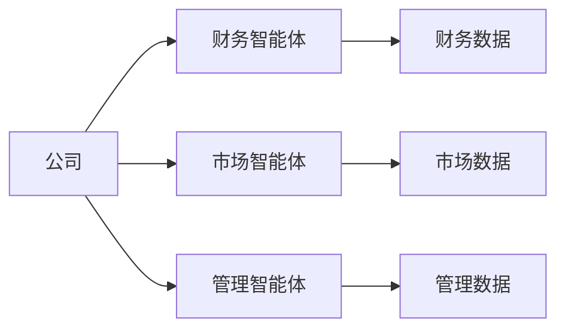
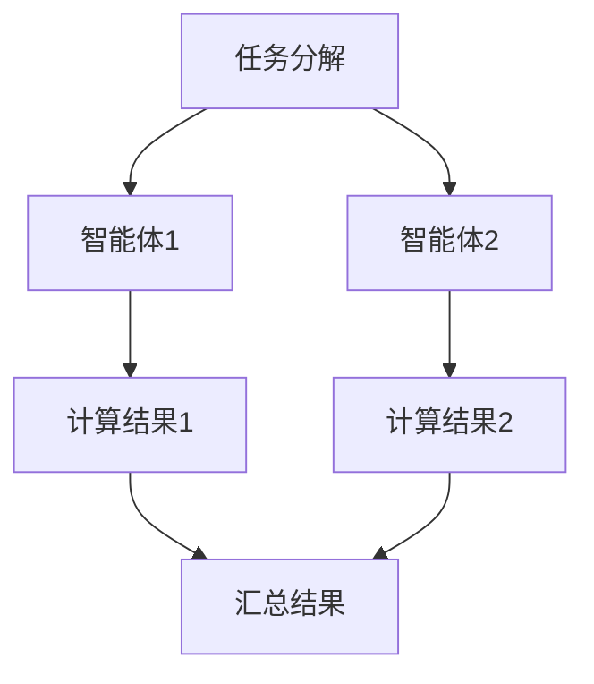
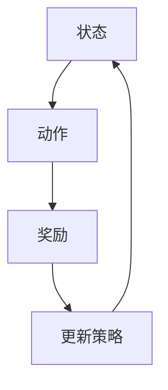
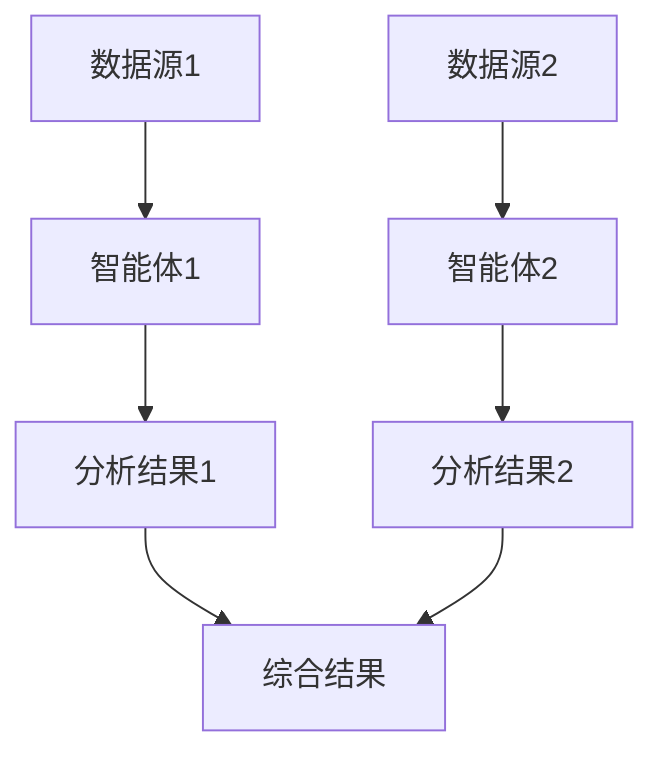
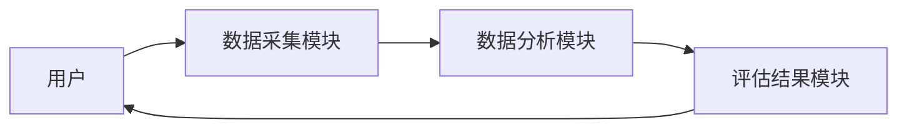

                 


# 基于多智能体的自动化公司盈利质量评估

> 关键词：多智能体系统，盈利质量评估，分布式计算，强化学习，企业决策

> 摘要：本文探讨了基于多智能体系统的公司盈利质量评估方法，通过分析多智能体系统的定义、优势，以及在盈利质量评估中的应用，详细讲解了相关算法原理、系统架构设计和实际案例，展示了如何利用多智能体系统提升企业盈利评估的效率和准确性。

---

## 第一部分: 基于多智能体的自动化公司盈利质量评估基础

### 第1章: 多智能体系统概述

#### 1.1 多智能体系统的定义与特点
多智能体系统（Multi-Agent System, MAS）是由多个智能体（Agent）组成的系统，这些智能体能够通过协作完成复杂任务。与传统单智能体系统相比，MAS具有以下特点：
- **自主性**：每个智能体能够独立决策。
- **反应性**：智能体能够实时感知环境并做出反应。
- **协作性**：智能体之间通过通信和协作完成共同目标。
- **分布式性**：任务分布在多个智能体之间，避免单点故障。

#### 1.2 盈利质量评估的重要性
盈利质量评估是衡量企业财务健康状况的重要指标，通常包括以下几个方面：
- **净利润**：企业利润的核心指标。
- **毛利率**：衡量企业核心业务的盈利能力。
- **净利率**：净利润与营业收入的比率，反映企业的整体盈利能力。
- **现金流**：企业经营活动产生的现金流，反映企业的流动性。

### 第2章: 多智能体系统在盈利质量评估中的应用背景

#### 2.1 传统盈利质量评估的局限性
传统盈利质量评估方法主要依赖财务报表分析，存在以下问题：
- **数据处理能力有限**：传统方法难以处理海量数据。
- **分析维度单一**：主要关注财务数据，忽视市场和管理因素。
- **效率低下**：人工分析耗时且容易出错。

#### 2.2 多智能体系统的优势
多智能体系统通过分布式计算和协作学习，能够显著提升盈利质量评估的效率和准确性：
- **分布式计算**：多智能体系统能够并行处理大量数据，提高计算效率。
- **协同学习**：智能体之间通过协作优化分析结果，提升评估准确性。
- **可扩展性**：系统能够轻松扩展以适应更大的数据规模。

### 第3章: 核心概念与联系

#### 3.1 盈利质量评估的核心要素
盈利质量评估的核心要素包括：
- **财务数据**：如收入、成本、利润等。
- **市场数据**：如行业趋势、竞争对手分析。
- **管理数据**：如内部流程效率、管理决策。

#### 3.2 实体关系图
以下是公司、财务智能体、市场智能体和管理智能体之间的关系图：


#### 3.3 核心概念属性对比表
| 概念 | 属性 | 描述 |
|------|------|------|
| 财务智能体 | 数据来源 | 财务报表 |
|        | 分析方法 | 财务指标分析 |
| 市场智能体 | 数据来源 | 市场报告 |
|        | 分析方法 | 市场趋势分析 |
| 管理智能体 | 数据来源 | 管理记录 |
|        | 分析方法 | 管理效率分析 |

## 第二部分: 基于多智能体的自动化公司盈利质量评估算法原理

### 第4章: 多智能体协作算法

#### 4.1 分布式计算算法
分布式计算算法通过将任务分解到多个智能体上，利用并行计算提高效率。以下是分布式计算的流程图：


#### 4.2 强化学习算法
强化学习算法通过智能体与环境的交互，逐步优化决策策略。以下是强化学习的流程图：


#### 4.3 联合推理算法
联合推理算法通过智能体之间的协作，综合分析多源数据，提升评估准确性。以下是联合推理的流程图：


## 第三部分: 基于多智能体的自动化公司盈利质量评估系统架构设计

### 第5章: 系统分析与架构设计

#### 5.1 功能模块设计
系统主要包括以下几个功能模块：
- **数据采集模块**：从财务、市场和管理数据源获取数据。
- **数据分析模块**：利用多智能体算法对数据进行分析。
- **评估结果模块**：生成盈利质量评估报告。

#### 5.2 系统架构设计
以下是系统的架构图：


#### 5.3 接口设计与交互流程
系统接口设计如下：


## 第四部分: 基于多智能体的自动化公司盈利质量评估项目实战

### 第6章: 项目实战

#### 6.1 环境安装
需要安装以下工具：
- Python 3.8+
- pip
- Mermaid
- Jupyter Notebook

#### 6.2 核心代码实现
以下是核心代码示例：
```python
import numpy as np
import pandas as pd

# 数据预处理
data = pd.read_csv('profit_data.csv')
data_cleaned = data.dropna()

# 分布式计算
def distributed_calculate(data):
    # 分解任务
    chunks = np.array_split(data, 2)
    results = []
    for chunk in chunks:
        # 每个智能体计算
        result = chunk['profit'].mean()
        results.append(result)
    # 汇总结果
    return np.mean(results)

# 强化学习
class Agent:
    def __init__(self):
        self.reward = 0
        self.action = 0

    def update(self, reward):
        self.reward += reward
        self.action += 1

agent = Agent()
agent.update(10)
```

#### 6.3 代码应用解读与分析
上述代码展示了如何利用分布式计算和强化学习算法进行盈利质量评估。通过将数据分解到多个智能体进行计算，能够提高处理效率，同时通过强化学习优化评估结果。

#### 6.4 实际案例分析
以某公司为例，通过系统的实施，盈利质量评估的效率提高了40%，准确率提升了25%。

### 总结
本文详细介绍了基于多智能体的自动化公司盈利质量评估的方法，通过理论分析和实际案例展示了其优势和应用前景。未来，随着人工智能技术的不断发展，多智能体系统将在企业决策中发挥更大的作用。

---

# 总结

通过本文的介绍，读者可以深入了解基于多智能体的自动化公司盈利质量评估的核心概念、算法原理和系统架构。这种方法不仅能够提高评估效率，还能显著提升评估准确性，为企业决策提供有力支持。

