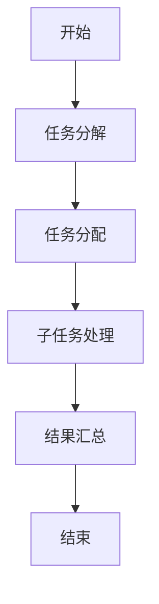
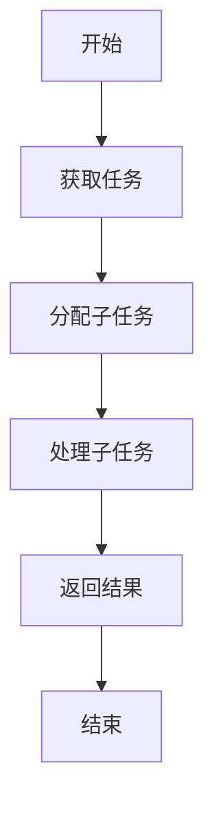
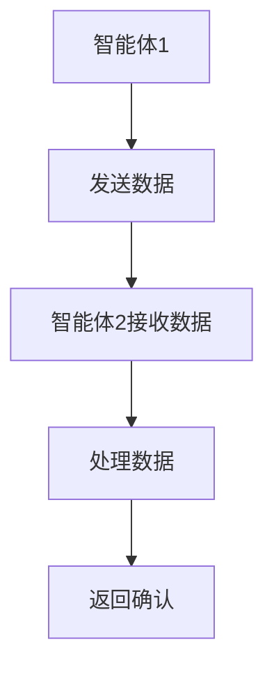
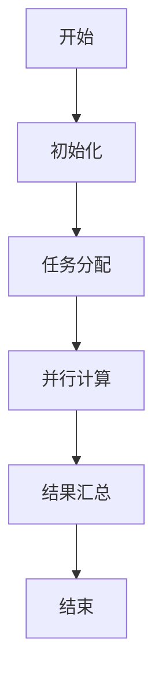
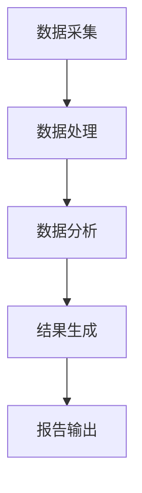
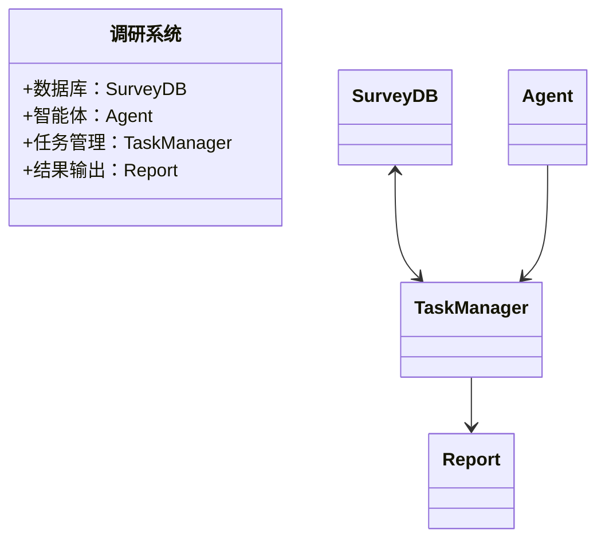
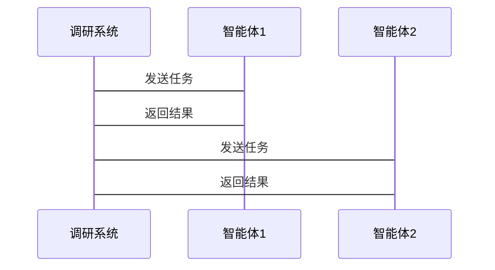

                 


# 基于多智能体的自动化公司调研系统

**关键词：** 多智能体系统、自动化调研、公司调研、分布式计算、任务分配

**摘要：**  
本文探讨了基于多智能体的自动化公司调研系统的设计与实现。通过分析传统公司调研的痛点，提出采用多智能体系统来提高调研效率和准确性。文章详细介绍了多智能体系统的核心概念、协作机制、算法原理、系统架构，并通过实际案例展示了系统的应用。最后，总结了系统的优势及未来发展方向。

---

## 第1章: 背景与概述

### 1.1 问题背景

#### 1.1.1 传统公司调研的痛点
传统的公司调研依赖人工操作，存在以下问题：
- **效率低**：人工调研耗时长，尤其在处理大量数据时。
- **误差大**：人为因素可能导致数据偏差。
- **协作难**：团队协作复杂，任务分配不均。

#### 1.1.2 自动化调研的需求
随着技术进步，企业需要更高效、准确的调研方式。自动化调研可以：
- 提高数据收集和分析的效率。
- 减少人为误差，提升数据质量。
- 支持大规模数据处理。

#### 1.1.3 多智能体协作的优势
多智能体系统通过分布式计算和任务分配，能够高效处理复杂任务。每个智能体负责特定子任务，通过协作完成整体目标。

### 1.2 多智能体系统的核心概念

#### 1.2.1 多智能体系统的定义
多智能体系统是由多个智能体组成的分布式系统，每个智能体能够自主决策并协作完成任务。

#### 1.2.2 多智能体系统的属性特征对比
以下是多智能体系统与传统单体系统的对比：

| **属性**         | **多智能体系统**                | **传统单体系统**             |
|------------------|---------------------------------|------------------------------|
| **任务处理**     | 分布式协作                     | 集中式处理                 |
| **扩展性**       | 易扩展                         | 扩展性差                   |
| **容错性**       | 高容错                         | 容错性低                   |
| **实时性**       | 高实时性                       | 实时性差                   |

#### 1.2.3 实体关系图（ER图）架构
以下是多智能体系统的ER图：

```mermaid
erDiagram
    customer[客户] {
        code : string
        name : string
    }
    survey[调研任务] {
        id : integer
        status : string
        result : string
    }
    agent[智能体] {
        id : integer
        role : string
    }
    customer --> survey : 发起
    agent --> survey : 处理
    survey --> agent : 分配
```

### 1.3 本章小结
本章介绍了传统公司调研的痛点、自动化调研的需求以及多智能体系统的核心概念。通过对比和ER图展示，明确了多智能体系统的优势和架构。

---

## 第2章: 多智能体系统的核心原理

### 2.1 多智能体系统的协作机制

#### 2.1.1 分布式计算原理
分布式计算将任务分解为多个子任务，分配给不同的智能体完成。以下是分布式计算流程图：



#### 2.1.2 任务分配算法
任务分配是多智能体协作的关键。以下是任务分配流程图：



#### 2.1.3 信息同步机制
信息同步通过消息传递实现，确保各智能体之间的数据一致。以下是信息同步流程图：



### 2.2 多智能体系统的数学模型

#### 2.2.1 系统模型的构建
多智能体系统的任务分配可以表示为一个优化问题：

$$ \text{目标} = \min_{x} \sum_{i=1}^{n} c_i x_i $$

其中，$c_i$ 是任务 $i$ 的成本，$x_i$ 是任务分配变量。

#### 2.2.2 任务分配的数学公式
以下是任务分配的优化公式：

$$ \text{任务分配问题} = \argmin_{x} \sum_{i=1}^{n} c_i x_i $$

### 2.3 本章小结
本章详细讲解了多智能体系统的协作机制和数学模型，包括分布式计算、任务分配和信息同步的实现原理。

---

## 第3章: 多智能体系统的算法实现

### 3.1 分布式计算算法

#### 3.1.1 分布式计算流程图
以下是分布式计算流程图：



#### 3.1.2 分布式计算代码实现
以下是Python实现的分布式计算示例：

```python
import threading

def task_function(task_id):
    print(f"处理任务 {task_id}")
    # 模拟计算
    import time
    time.sleep(1)
    print(f"完成任务 {task_id}")

def main():
    tasks = [1, 2, 3, 4, 5]
    threads = []
    for task in tasks:
        thread = threading.Thread(target=task_function, args=(task,))
        threads.append(thread)
        thread.start()
    for thread in threads:
        thread.join()

if __name__ == "__main__":
    main()
```

### 3.2 任务分配算法

#### 3.2.1 任务分配流程图
以下是任务分配流程图：


#### 3.2.2 任务分配代码实现
以下是Python实现的任务分配示例：

```python
import queue

def agent_function(agent_id, task_queue):
    while not task_queue.empty():
        task = task_queue.get()
        print(f"智能体 {agent_id} 处理任务 {task}")
        # 模拟处理时间
        import time
        time.sleep(1)
        print(f"智能体 {agent_id} 完成任务 {task}")

def main():
    import multiprocessing
    num_agents = 3
    tasks = [1, 2, 3, 4, 5]
    task_queue = multiprocessing.Queue()
    for task in tasks:
        task_queue.put(task)
    agents = []
    for i in range(num_agents):
        agent = multiprocessing.Process(target=agent_function, args=(i+1, task_queue))
        agents.append(agent)
        agent.start()
    for agent in agents:
        agent.join()

if __name__ == "__main__":
    main()
```

### 3.3 本章小结
本章通过流程图和代码实现，详细讲解了分布式计算和任务分配的算法实现。

---

## 第4章: 系统架构与设计

### 4.1 系统架构设计

#### 4.1.1 系统架构图
以下是多智能体系统的架构图：



#### 4.1.2 系统功能模块
以下是系统功能模块的类图：



### 4.2 接口与交互设计

#### 4.2.1 接口设计
以下是系统接口设计的序列图：



### 4.3 本章小结
本章通过架构图和交互图，展示了系统的整体设计和模块之间的关系。

---

## 第5章: 项目实战与案例分析

### 5.1 环境安装
以下是项目所需的环境和安装步骤：

```bash
pip install -r requirements.txt
```

### 5.2 系统实现

#### 5.2.1 核心代码实现
以下是Python实现的系统代码：

```python
import multiprocessing
import queue

def agent_function(agent_id, task_queue):
    while not task_queue.empty():
        task = task_queue.get()
        print(f"智能体 {agent_id} 正在处理任务 {task}")
        import time
        time.sleep(1)
        print(f"智能体 {agent_id} 完成任务 {task}")

def main():
    import multiprocessing
    tasks = [1, 2, 3, 4, 5]
    task_queue = multiprocessing.Queue()
    for task in tasks:
        task_queue.put(task)
    num_agents = 3
    agents = []
    for i in range(num_agents):
        agent = multiprocessing.Process(target=agent_function, args=(i+1, task_queue))
        agents.append(agent)
        agent.start()
    for agent in agents:
        agent.join()

if __name__ == "__main__":
    main()
```

### 5.3 案例分析
以下是实际案例分析：

```text
假设我们有一个调研任务，需要分析5家公司的市场报告。使用多智能体系统，3个智能体可以并行处理，显著提高效率。
```

### 5.4 本章小结
本章通过实际案例展示了系统的应用，并详细讲解了项目的实现过程。

---

## 第6章: 最佳实践与总结

### 6.1 最佳实践
- **性能优化**：合理分配任务，避免负载不均。
- **安全性**：确保数据传输的安全性。
- **可扩展性**：设计灵活的架构，支持扩展。

### 6.2 小结
本文详细介绍了基于多智能体的自动化公司调研系统的设计与实现，通过理论分析和实际案例，展示了系统的高效性和优势。

### 6.3 注意事项
- 确保智能体之间的通信顺畅。
- 定期更新系统以适应新的需求。

### 6.4 拓展阅读
- 探讨多智能体系统在其他领域的应用。
- 研究更高效的分布式算法。

---

**本文通过系统的介绍和详细的技术分析，为读者提供了一个基于多智能体的自动化公司调研系统的全面解决方案。**

--- 

**（全文完）**

