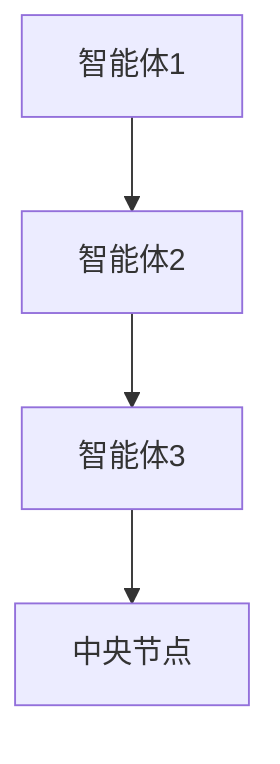
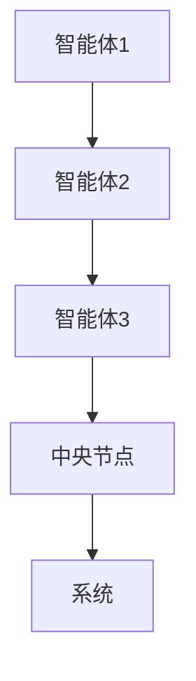

                 


# 基于多智能体的自动化公司财务健康诊断系统

> 关键词：多智能体系统，财务健康诊断，自动化诊断，分布式计算，协作算法

> 摘要：本文介绍了一种基于多智能体的自动化公司财务健康诊断系统，通过分析财务数据，利用多智能体的协作与分布式计算，实现对公司财务状况的实时监控和诊断。文章详细阐述了系统的设计原理、算法实现、系统架构，并通过实际案例展示了系统的应用效果。

---

# 第一部分: 背景介绍

## 第1章: 问题背景与描述

### 1.1 问题背景
#### 1.1.1 传统财务诊断的挑战
传统财务诊断依赖于人工分析，存在效率低、误差大、实时性差等问题。企业的财务数据复杂且动态变化快，人工分析难以及时发现潜在风险，导致财务诊断的准确性和及时性不足。

#### 1.1.2 多智能体技术的应用潜力
多智能体系统具有分布式计算、协作能力强、自适应性高等特点，能够有效处理复杂系统的诊断问题。通过多个智能体的协作，可以实现对财务数据的实时分析和诊断，提高诊断的准确性和效率。

#### 1.1.3 自动化诊断的必要性
随着企业规模的扩大和业务的复杂化，传统的财务诊断方法已无法满足需求。自动化诊断系统能够实时监控财务数据，快速发现异常情况，帮助企业及时采取措施，避免潜在风险。

### 1.2 问题描述
#### 1.2.1 财务健康诊断的核心要素
财务健康诊断的核心要素包括财务数据的完整性、准确性、及时性，以及对财务数据的分析和预测能力。需要对企业的收入、支出、利润、现金流等关键指标进行实时监控和分析。

#### 1.2.2 多智能体在财务诊断中的角色
多智能体系统在财务诊断中的角色包括数据采集、数据分析、风险评估和决策支持。每个智能体负责特定的任务，通过协作完成整体的财务诊断。

#### 1.2.3 系统目标与边界
系统目标是实现对公司财务状况的实时监控和诊断，提供准确的财务健康评估报告。系统的边界包括数据采集、数据分析、诊断结果输出和用户界面展示。

---

## 第2章: 多智能体系统概述

### 2.1 多智能体系统的基本概念
#### 2.1.1 智能体的定义与特征
智能体是一种能够感知环境、自主决策、执行任务的实体。具有主动性、反应性、协作性和学习性等特征。

#### 2.1.2 多智能体系统的组成
多智能体系统由多个智能体、通信机制、协作协议和环境接口组成。智能体之间通过通信机制进行协作，共同完成任务。

#### 2.1.3 多智能体与单智能体的对比
多智能体系统与单智能体系统相比，具有更强的分布式计算能力和协作能力，适用于复杂系统的诊断和管理。

### 2.2 多智能体系统的分类
#### 2.2.1 基于任务的分类
根据任务类型，多智能体系统可以分为数据采集型、数据分析型和决策支持型。

#### 2.2.2 基于结构的分类
根据系统结构，多智能体系统可以分为集中式、分布式和混合式。

#### 2.2.3 基于通信机制的分类
根据通信机制，多智能体系统可以分为基于规则的和基于模型的。

### 2.3 多智能体系统的应用领域
#### 2.3.1 金融领域的应用
多智能体系统在金融领域的应用包括股票交易、风险管理、信用评估等。

#### 2.3.2 医疗领域的应用
多智能体系统在医疗领域的应用包括患者诊断、治疗方案优化、医疗资源分配等。

#### 2.3.3 工业领域的应用
多智能体系统在工业领域的应用包括生产过程优化、设备故障诊断、供应链管理等。

### 2.4 本章小结
多智能体系统具有分布式计算、协作能力强、自适应性高等特点，适用于复杂系统的诊断和管理。本文将重点介绍多智能体系统在公司财务健康诊断中的应用。

---

# 第二部分: 核心概念与联系

## 第3章: 多智能体系统的原理与属性

### 3.1 多智能体系统的原理
#### 3.1.1 分布式计算原理
分布式计算通过将任务分解到多个智能体上，利用智能体的协作完成整体任务。这种方式能够提高系统的并行计算能力和资源利用率。

#### 3.1.2 协作与通信机制
多智能体系统中的协作与通信机制包括任务分配、信息共享、冲突解决等。智能体之间通过通信机制进行协作，共同完成任务。

#### 3.1.3 自适应与学习机制
多智能体系统具有自适应性和学习能力，能够根据环境的变化调整自己的行为和决策策略。

### 3.2 多智能体系统的属性对比
#### 3.2.1 分布式与集中式对比
分布式系统具有更高的容错性和可扩展性，适用于大规模数据处理。集中式系统具有更高的计算效率和管理方便性。

#### 3.2.2 异步与同步对比
异步系统能够更好地适应动态环境，同步系统具有更高的计算效率。

#### 3.2.3 基于规则与基于模型对比
基于规则的系统具有简单易懂、易于维护的特点，基于模型的系统具有更高的准确性和可解释性。

### 3.3 ER实体关系图
```mermaid
er
    entity 财务数据 {
        key 账号
        属性: 账户余额, 交易记录, 财务报表
    }
    entity 智能体 {
        key ID
        属性: 智能体类型, 知识库, 行为规则
    }
    entity 系统 {
        key 系统ID
        属性: 系统配置, 系统日志
    }
    财务数据 --> 智能体: 提供数据
    智能体 --> 系统: 输出诊断结果
```

---

## 第4章: 多智能体协作算法

### 4.1 分布式计算算法
#### 4.1.1 分布式计算流程


#### 4.1.2 分布式计算的实现
```python
def distributed_compute(nodes):
    results = []
    for node in nodes:
        result = node.compute()
        results.append(result)
    return results
```

---

## 第5章: 算法原理的数学模型和公式

### 5.1 算法原理的数学模型
$$
\text{诊断结果} = f(\text{财务数据}, \text{智能体协作})
$$

其中，$f$ 是一个多智能体协作的函数，$\text{财务数据}$ 是输入的财务数据，$\text{智能体协作}$ 是多智能体协作的结果。

### 5.2 具体的数学公式
$$
\text{诊断结果} = \sum_{i=1}^{n} w_i x_i
$$

其中，$w_i$ 是智能体$i$的权重，$x_i$ 是智能体$i$的输出结果，$n$ 是智能体的数量。

---

## 第6章: 系统分析与架构设计

### 6.1 系统分析
#### 6.1.1 问题场景介绍
公司财务健康诊断系统需要实时监控企业的财务数据，包括收入、支出、利润、现金流等关键指标。通过多智能体的协作，实现对财务数据的实时分析和诊断。

#### 6.1.2 系统功能设计
系统功能包括数据采集、数据分析、风险评估和决策支持。通过智能体的协作，实现对财务数据的实时监控和诊断。

### 6.2 系统架构设计
#### 6.2.1 领域模型类图


#### 6.2.2 系统架构图


#### 6.2.3 系统接口设计
系统接口包括数据输入接口、智能体协作接口和诊断结果输出接口。通过这些接口，实现智能体与系统的交互。

---

## 第7章: 项目实战

### 7.1 环境安装
安装Python、多智能体框架（如Jason）、数据库（如MySQL）和相关开发工具。

### 7.2 核心代码实现
```python
class Agent:
    def __init__(self, id, knowledge_base):
        self.id = id
        self.knowledge_base = knowledge_base
        self.behavior_rules = {}

    def compute(self, data):
        # 具体的计算逻辑
        pass

# 创建智能体实例
agent1 = Agent(1, "财务知识库")
agent2 = Agent(2, "风险管理知识库")

# 分布式计算
results = distributed_compute([agent1, agent2])
```

### 7.3 案例分析
通过具体案例分析，展示系统的实际应用效果和诊断结果。

### 7.4 项目小结
总结项目的实现过程和应用效果，提出改进建议和未来发展方向。

---

## 第8章: 最佳实践

### 8.1 小结
多智能体系统在公司财务健康诊断中的应用具有重要的意义，能够有效提高诊断的准确性和效率。

### 8.2 注意事项
在实际应用中，需要注意系统的可扩展性、安全性和容错性。同时，需要根据企业的具体需求进行系统定制。

### 8.3 拓展阅读
推荐阅读相关领域的书籍和论文，深入学习多智能体系统和财务诊断的相关知识。

---

# 结语
本文详细介绍了基于多智能体的自动化公司财务健康诊断系统，从系统背景、核心概念、算法原理到系统架构和项目实战，全面阐述了系统的实现和应用。通过本文的学习，读者可以深入了解多智能体系统在财务诊断中的应用，并能够实际应用到相关项目中。

---

