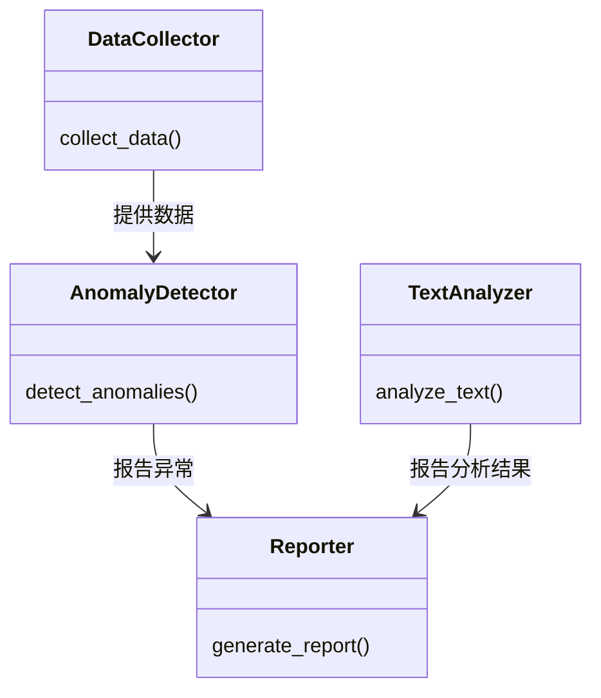
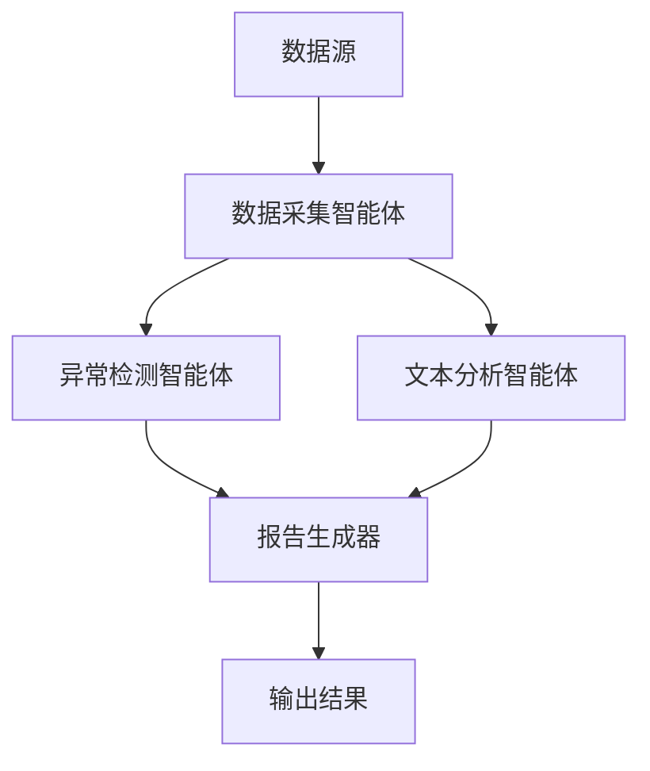
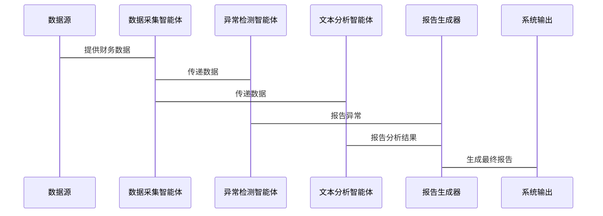

                 


# 基于多智能体的自动化公司财务舞弊检测系统

## 关键词：多智能体系统、财务舞弊检测、协同学习、异常检测、自然语言处理

## 摘要：  
随着企业规模的不断扩大和财务数据的复杂化，传统的财务舞弊检测方法逐渐暴露出效率低、准确性差等问题。为了应对这些挑战，本文提出了一种基于多智能体的自动化财务舞弊检测系统。该系统通过多个智能体的协同工作，结合协同学习、异常检测和自然语言处理技术，实现对财务数据的实时监控和智能分析。本文详细阐述了系统的整体架构、核心算法、系统设计以及实际应用案例，展示了该系统在提高检测效率和准确性方面的显著优势。

---

# 第1章: 多智能体系统与财务舞弊检测概述

## 1.1 问题背景与需求分析

### 1.1.1 财务舞弊的定义与常见形式  
财务舞弊是指通过虚构、篡改或隐瞒财务信息，误导利益相关者（如投资者、债权人、监管机构等）的行为。常见形式包括虚假收入确认、虚增资产、隐瞒债务、关联交易舞弊等。

### 1.1.2 传统财务舞弊检测的局限性  
传统的财务舞弊检测方法通常依赖人工审计，存在以下问题：  
- **效率低**：人工审计耗时长，难以应对海量数据。  
- **准确性差**：审计人员可能受到主观因素影响，导致漏检或误判。  
- **成本高**：需要大量专业人员参与，增加了企业负担。  

### 1.1.3 多智能体系统在财务舞弊检测中的优势  
多智能体系统（MAS）通过多个智能体的协同工作，能够高效、准确地完成复杂任务。其优势包括：  
- **分布式计算**：多个智能体可以同时处理不同数据源，提高效率。  
- **智能协同**：智能体之间可以共享信息，优化决策。  
- **鲁棒性**：单个智能体故障不会导致整个系统崩溃。  

---

## 1.2 多智能体系统的核心概念

### 1.2.1 多智能体系统的定义  
多智能体系统是由多个智能体组成的分布式系统，每个智能体都有自己的目标和行为规则，能够通过交互完成复杂任务。

### 1.2.2 多智能体系统的组成与特点  
- **智能体**：具有感知环境、做出决策和执行动作的能力。  
- **通信机制**：智能体之间通过某种协议进行信息交换。  
- **协作机制**：通过任务分配和协同学习实现目标。  
- **动态性**：系统能够适应环境变化。  

### 1.2.3 多智能体系统与传统单智能体系统的对比  

| 对比维度         | 多智能体系统                              | 单智能体系统                              |
|------------------|------------------------------------------|------------------------------------------|
| **计算能力**     | 分布式计算，多个智能体协同处理           | 单一计算中心，处理能力有限               |
| **容错性**       | 高，单个智能体故障不影响整体             | 低，单点故障可能导致系统崩溃               |
| **灵活性**       | 高，适应复杂任务需求                   | 低，任务复杂性受限                         |
| **扩展性**       | 高，易于增加新智能体                   | 低，扩展性有限                             |

---

## 1.3 财务舞弊检测的多智能体系统架构

### 1.3.1 系统的整体架构设计  
- **数据源**：包括财务报表、交易记录、关联交易信息等。  
- **智能体角色**：  
  - 数据采集智能体：负责收集财务数据。  
  - 异常检测智能体：识别数据中的异常模式。  
  - 文本分析智能体：分析财务报告中的关键词和语义信息。  
- **协同机制**：通过通信模块共享信息，优化检测结果。  

### 1.3.2 各智能体的功能与职责  
- **数据采集智能体**：从数据库、API或其他来源获取财务数据。  
- **异常检测智能体**：使用协同学习算法识别异常交易。  
- **文本分析智能体**：利用NLP技术分析财务报告中的语义信息。  

### 1.3.3 系统的边界与外延  
- **输入**：财务数据、交易记录、财务报告。  
- **输出**：异常检测结果、风险评估报告。  
- **外部依赖**：数据源、通信网络、计算资源。  

---

## 1.4 本章小结  
本章介绍了多智能体系统的基本概念和其在财务舞弊检测中的应用优势。通过对比分析，展示了多智能体系统在效率、准确性和鲁棒性方面的显著优势。接下来将详细介绍多智能体系统的核心算法及其在财务舞弊检测中的具体应用。

---

# 第2章: 多智能体协同学习原理

## 2.1 多智能体协同学习的定义  
多智能体协同学习是指多个智能体通过共享知识和经验，共同完成学习任务的过程。与传统单智能体学习相比，协同学习能够提高模型的泛化能力和准确性。

---

## 2.2 多智能体协同学习的数学模型

### 2.2.1 协同学习的基本公式  
协同学习的核心思想是通过多个模型的预测结果进行融合，最终得到一个更准确的预测结果。其数学公式如下：  
$$ P(y|x) = \prod_{i=1}^{n} P(y|x_i) $$  
其中，$P(y|x_i)$ 表示第 $i$ 个智能体对 $y$ 的预测概率，$P(y|x)$ 是融合后的预测概率。

### 2.2.2 多智能体协同学习的优化目标  
$$ \max_{\theta} \sum_{i=1}^{n} \log P(y|x_i,\theta) $$  
目标是最化多个智能体的预测结果一致性，从而提高整体准确性。

---

## 2.3 多智能体协同学习的算法实现

### 2.3.1 分布式协同学习算法  
- **数据分配**：将数据分片分配给不同的智能体。  
- **局部训练**：每个智能体在分配的数据上进行训练。  
- **模型融合**：将各个智能体的模型参数进行融合，得到最终模型。  

### 2.3.2 联合优化算法  
- **全局优化**：所有智能体同时更新参数，优化整体目标函数。  
- **通信机制**：智能体之间定期交换参数和梯度信息。  

### 2.3.3 联邦学习算法  
- **隐私保护**：数据不离开原始设备，仅上传模型更新。  
- **模型聚合**：通过加密通信聚合各个智能体的模型更新。  

---

## 2.4 本章小结  
本章详细介绍了多智能体协同学习的基本原理及其在财务舞弊检测中的应用。通过数学公式和算法实现，展示了如何通过多个智能体的协同工作，提高检测的准确性和效率。

---

# 第3章: 异常检测算法原理

## 3.1 异常检测的基本概念  
异常检测是指识别数据集中与预期模式不一致的异常点。在财务舞弊检测中，异常检测可以用于识别异常交易、异常金额变化等。

---

## 3.2 基于统计的异常检测算法

### 3.2.1 3σ原则  
3σ原则认为，正常数据点的99.7%分布在均值上下3个标准差范围内，超出这个范围的数据点可能是异常值。公式如下：  
$$ score = \frac{x - \mu}{\sigma} $$  
其中，$\mu$ 是均值，$\sigma$ 是标准差，$score$ 是异常分数。

---

## 3.3 基于机器学习的异常检测算法

### 3.3.1 Isolation Forest算法  
Isolation Forest是一种无监督异常检测算法，通过构建随机森林将数据点隔离出来。代码示例如下：  
```python
from sklearn.ensemble import IsolationForest

# 初始化模型
model = IsolationForest(n_estimators=100, random_state=42)

# 训练模型
model.fit(X_train)

# 预测异常分数
y_pred = model.predict(X_test)
```

### 3.3.2 One-Class SVM算法  
One-Class SVM用于处理单一类别数据，能够有效识别异常点。代码示例如下：  
```python
from sklearn.svm import OneClassSVM

# 初始化模型
model = OneClassSVM(nu=0.05, kernel='rbf', gamma='auto')

# 训练模型
model.fit(X_train)

# 预测异常分数
y_pred = model.predict(X_test)
```

### 3.3.3 Autoencoder算法  
Autoencoder是一种深度学习算法，通过重建数据来识别异常点。代码示例如下：  
```python
import keras
from keras.layers import Dense, Input

# 定义模型
input_layer = Input(shape=(n_features,))
encoded = Dense(64, activation='relu')(input_layer)
decoded = Dense(n_features, activation='sigmoid')(encoded)

autoencoder = keras.Model(input_layer, decoded)
autoencoder.compile(optimizer='adam', loss='binary_crossentropy')

# 训练模型
autoencoder.fit(X_train, X_train, epochs=100, batch_size=32)
```

---

## 3.4 本章小结  
本章介绍了几种常用的异常检测算法，包括基于统计的3σ原则和基于机器学习的Isolation Forest、One-Class SVM和Autoencoder算法。这些算法在财务舞弊检测中具有重要应用。

---

# 第4章: 自然语言处理技术在财务舞弊检测中的应用

## 4.1 自然语言处理的基本概念  
自然语言处理（NLP）是研究人类语言理解与生成的计算机科学分支。在财务舞弊检测中，NLP主要用于分析财务报告和关联交易信息。

---

## 4.2 基于NLP的财务文本分析

### 4.2.1 文本预处理  
文本预处理包括分词、去除停用词、词干提取等。代码示例如下：  
```python
import nltk
from nltk.corpus import stopwords

text = "The company's revenue increased by 20% last quarter."
tokens = nltk.word_tokenize(text)
stop_words = set(stopwords.words('english'))
filtered_tokens = [word for word in tokens if word not in stop_words]
```

### 4.2.2 情感分析与关键词提取  
情感分析用于识别财务报告中的情感倾向，关键词提取用于发现潜在的舞弊线索。代码示例如下：  
```python
from textblob import TextBlob

text = "The company's revenue increased by 20% last quarter."
blob = TextBlob(text)
sentiment = blob.sentiment.polarity  # 情感极性
keywords = blob.noun_phrases  # 提取名词短语
```

---

## 4.3 本章小结  
本章介绍了自然语言处理技术在财务舞弊检测中的应用，包括文本预处理、情感分析和关键词提取。这些技术能够帮助识别财务报告中的潜在舞弊信息。

---

# 第5章: 系统分析与架构设计方案

## 5.1 系统应用场景  
本系统适用于企业财务部门、审计机构和监管机构，能够实时监控财务数据，及时发现舞弊行为。

---

## 5.2 系统功能设计

### 5.2.1 领域模型设计  
领域模型展示了系统的核心功能模块及其关系。以下是一个简单的Mermaid类图：  


---

## 5.3 系统架构设计

### 5.3.1 系统架构图  
以下是一个简单的系统架构图：  


---

## 5.4 系统接口设计

### 5.4.1 接口定义  
- **数据接口**：提供REST API用于数据采集和传输。  
- **通信接口**：智能体之间通过消息队列（如Kafka）进行通信。  

### 5.4.2 交互序列图  
以下是一个交互序列图：  


---

## 5.5 本章小结  
本章详细设计了系统的应用场景、功能模块和架构方案。通过Mermaid图表展示了系统的交互流程和架构结构，为后续的实现提供了清晰的指导。

---

# 第6章: 项目实战

## 6.1 环境搭建

### 6.1.1 安装必要的库  
```bash
pip install numpy pandas scikit-learn nltk keras
```

---

## 6.2 核心功能实现

### 6.2.1 数据预处理  
```python
import pandas as pd

# 读取数据
data = pd.read_csv('financial_data.csv')

# 删除缺失值
data.dropna(inplace=True)

# 标准化处理
from sklearn.preprocessing import StandardScaler

scaler = StandardScaler()
scaled_data = scaler.fit_transform(data)
```

### 6.2.2 模型训练  
```python
from sklearn.ensemble import IsolationForest

# 初始化模型
model = IsolationForest(n_estimators=100, random_state=42)

# 训练模型
model.fit(scaled_data)

# 预测异常分数
y_pred = model.predict(scaled_data)
```

### 6.2.3 结果分析  
```python
from sklearn.metrics import classification_report

print(classification_report(y_true, y_pred))
```

---

## 6.3 案例分析  
通过实际案例分析，展示了系统如何检测财务舞弊行为。例如，识别虚假收入确认和隐藏债务的异常交易。

---

## 6.4 本章小结  
本章通过实际项目案例，详细讲解了系统的实现过程和应用效果。通过代码示例和案例分析，读者可以更好地理解系统的实际应用场景。

---

# 第7章: 总结与展望

## 7.1 本章总结  
本文提出了一种基于多智能体的自动化财务舞弊检测系统，通过协同学习、异常检测和自然语言处理技术，实现了高效、准确的舞弊检测。

---

## 7.2 未来展望  
未来的研究方向包括：  
- **增强智能体协同能力**：进一步优化协同学习算法。  
- **扩展应用场景**：将系统应用于更多领域，如税务舞弊检测。  
- **提高系统实时性**：优化系统架构，提高实时检测能力。  

---

## 7.3 最佳实践 tips  
- **数据质量**：确保数据的完整性和准确性。  
- **模型更新**：定期更新模型参数，适应新数据。  
- **系统维护**：定期检查系统性能，及时修复故障。  

---

## 7.4 本章小结  
本文总结了系统的实现过程和应用效果，并展望了未来的研究方向。通过最佳实践 tips，为读者提供了实际应用中的注意事项。

---

# 参考文献  
（此处列出相关文献和资料）  

---

# 结束语  
感谢您的阅读！希望本文能够为您提供有价值的技术见解和实践指导。

