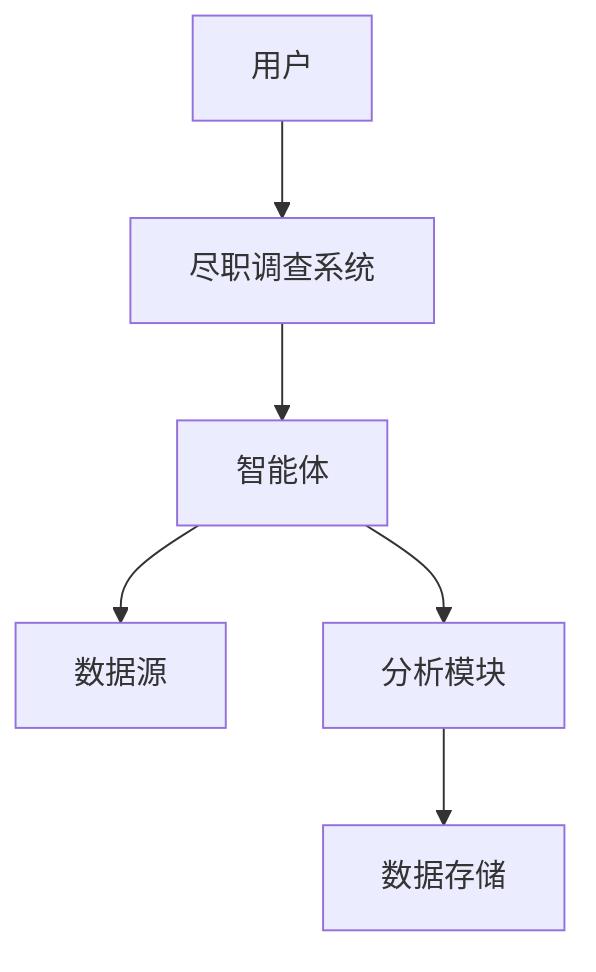
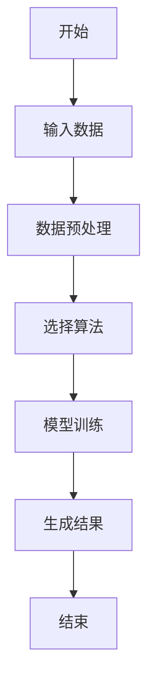
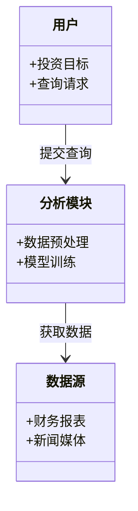
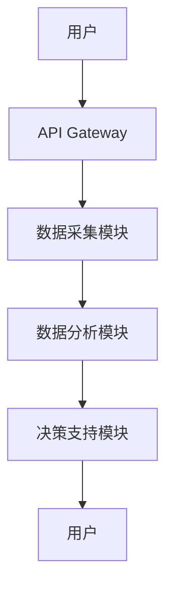
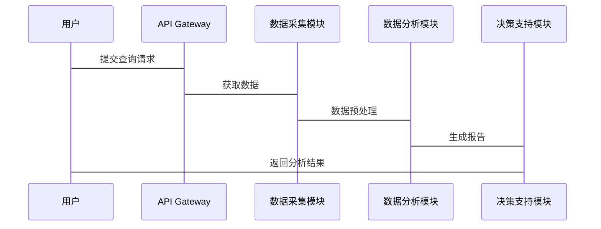

                 


# 基于多智能体的自动化尽职调查系统在价值投资中的应用

> 关键词：多智能体系统，自动化尽职调查，价值投资，金融数据分析，人工智能

> 摘要：本文详细探讨了基于多智能体的自动化尽职调查系统在价值投资中的应用，分析了传统尽职调查的局限性，提出了多智能体协作的解决方案，并通过实际案例展示了系统的实现与应用效果。

---

## 第1章: 问题背景与描述

### 1.1 问题背景

#### 1.1.1 传统尽职调查的局限性
传统的尽职调查主要依赖人工分析，存在以下问题：
- **效率低**：人工收集和分析数据耗时长，难以应对海量数据。
- **主观性强**：依赖分析师的经验和判断，存在人为误差。
- **信息不全**：难以覆盖多源异构数据，可能导致遗漏关键信息。

#### 1.1.2 价值投资中的信息不对称问题
价值投资的核心是通过深入分析企业基本面，发现被市场低估的投资机会。然而，信息不对称和数据分散使得投资者难以快速获取全面的分析数据。

#### 1.1.3 自动化技术在金融领域的应用趋势
随着人工智能和大数据技术的快速发展，自动化技术在金融领域的应用越来越广泛，特别是在数据处理和决策支持方面。

### 1.2 问题描述

#### 1.2.1 尽职调查的核心目标与流程
尽职调查的目标是通过收集、整理和分析目标公司的信息，评估其经营状况、财务健康和潜在风险。传统流程包括数据收集、初步分析、深度分析和总结报告。

#### 1.2.2 传统尽职调查的痛点与挑战
- 数据来源分散，难以整合。
- 分析过程复杂，依赖人工经验。
- 时间成本高，难以快速响应市场变化。

#### 1.2.3 价值投资中的数据需求与效率问题
价值投资者需要快速获取目标公司的财务数据、行业地位、管理团队等信息，传统方法难以满足高效、精准的需求。

### 1.3 问题解决与边界

#### 1.3.1 自动化尽职调查的定义与目标
自动化尽职调查系统通过多智能体协作，自动收集、分析和报告目标公司信息，提高效率和准确性。

#### 1.3.2 系统的边界与外延
- **边界**：仅关注目标公司的财务数据、行业信息和管理团队。
- **外延**：未来可以扩展到市场风险、政策风险等其他因素。

#### 1.3.3 核心要素与组成结构
- 数据采集模块：负责从多源数据中提取相关信息。
- 数据分析模块：利用机器学习算法进行深度分析。
- 决策支持模块：生成分析报告并提供投资建议。

### 1.4 核心概念与联系

#### 1.4.1 多智能体系统的核心原理
多智能体系统通过多个智能体协作，完成复杂任务。每个智能体负责特定任务，通过通信模块进行协作。

#### 1.4.2 自动化尽职调查系统的功能模块
- 数据采集模块：从财务报表、新闻媒体等来源获取数据。
- 数据分析模块：利用算法进行财务分析、风险评估。
- 决策支持模块：生成投资建议和风险预警。

#### 1.4.3 系统的实体关系图



---

## 第2章: 多智能体系统的核心原理

### 2.1 多智能体系统原理

#### 2.1.1 分布式智能与协作机制
多智能体系统通过分布式计算和协作算法，实现任务分配和结果整合。

#### 2.1.2 智能体之间的通信与协调
智能体通过通信模块交换信息，协调行动。常用的通信方式包括发布-订阅模型。

#### 2.1.3 多智能体系统的优缺点对比

| 优点                 | 缺点                 |
|----------------------|--------------------|
| 高效协作             | 复杂性高             |
| 适应性强             | 安全性低             |

### 2.2 自动化尽职调查系统的功能模块

#### 2.2.1 数据采集模块
- 数据来源：财务报表、新闻媒体、行业报告。
- 数据预处理：清洗、转换和标准化。

#### 2.2.2 数据分析模块
- 财务分析：计算关键指标如ROE、毛利率。
- 风险评估：识别潜在风险点。

#### 2.2.3 决策支持模块
- 生成分析报告。
- 提供投资建议。

### 2.3 系统架构设计

#### 2.3.1 分层架构设计
- 数据层：存储原始数据。
- 逻辑层：处理数据并生成分析结果。
- 表现层：展示结果并提供交互界面。

#### 2.3.2 模块化设计
- 每个模块独立开发，便于维护和扩展。

#### 2.3.3 可扩展性与可维护性
通过模块化设计，系统可以轻松添加新功能或优化现有模块。

---

## 第3章: 算法原理与实现

### 3.1 多智能体协作算法

#### 3.1.1 基于协同过滤的算法
协同过滤通过分析用户行为，推荐相似目标。

#### 3.1.2 基于强化学习的算法
强化学习通过奖励机制，优化智能体行为。

#### 3.1.3 算法的数学模型与公式
协同过滤的公式：
$$sim(i, j) = \frac{\sum_{k} (r_{ik} - \bar{r_i})(r_{jk} - \bar{r_j})}{\sqrt{\sum_{k}(r_{ik} - \bar{r_i})^2} \cdot \sqrt{\sum_{k}(r_{jk} - \bar{r_j})^2}}$$

### 3.2 算法实现

#### 3.2.1 算法流程图



#### 3.2.2 Python源代码实现

```python
import numpy as np

def collaborative_filtering(rating_matrix):
    # 数据预处理
    np.nan_to_num(rating_matrix, copy=False)
    
    # 协同过滤计算
    num_users, num_items = rating_matrix.shape
    user_similarity = np.zeros((num_users, num_users))
    
    for i in range(num_users):
        for j in range(num_users):
            # 计算相似度
            user_similarity[i, j] = np.corrcoef(rating_matrix[i], rating_matrix[j])[0, 1]
    
    return user_similarity

# 示例数据
rating_matrix = np.array([
    [4, np.nan, 3],
    [2, 3, np.nan],
    [np.nan, 5, 4]
])

# 调用函数
similarity = collaborative_filtering(rating_matrix)
print(similarity)
```

### 3.3 实际案例分析

#### 3.3.1 投资组合优化案例
通过协同过滤算法，筛选出具有相似收益和风险的股票，构建优化的投资组合。

#### 3.3.2 风险评估案例
利用强化学习算法，评估不同投资组合的风险，优化投资策略。

#### 3.3.3 案例总结与经验
自动化尽职调查系统能够显著提高效率和准确性，为投资者提供更精准的决策支持。

---

## 第4章: 系统分析与架构设计方案

### 4.1 系统分析

#### 4.1.1 问题场景介绍
价值投资者需要快速获取目标公司的财务数据和行业信息。

#### 4.1.2 项目介绍
开发一个多智能体协作的自动化尽职调查系统，实现数据自动采集、分析和报告生成。

### 4.2 系统架构设计

#### 4.2.1 领域模型


#### 4.2.2 系统架构


#### 4.2.3 系统接口设计
- 数据采集接口：REST API。
- 数据分析接口：WebSocket实时通信。

#### 4.2.4 系统交互流程



---

## 第5章: 项目实战

### 5.1 环境安装与配置

#### 5.1.1 安装Python和必要的库
```bash
pip install numpy pandas scikit-learn
```

#### 5.1.2 安装Jupyter Notebook
```bash
pip install jupyter
```

### 5.2 系统核心实现

#### 5.2.1 数据采集模块

```python
import requests
from bs4 import BeautifulSoup

def fetch_data(url):
    response = requests.get(url)
    soup = BeautifulSoup(response.text, 'html.parser')
    # 提取数据
    return extracted_data
```

#### 5.2.2 数据分析模块

```python
from sklearn.metrics.pairwise import cosine_similarity

def analyze_data(data):
    # 特征提取
    features = data.drop(columns=['id'])
    # 计算相似度
    similarity_matrix = cosine_similarity(features)
    return similarity_matrix
```

#### 5.2.3 决策支持模块

```python
def generate_report(similarity_matrix):
    # 生成报告
    report = {
        'similarities': similarity_matrix.tolist(),
        'recommendations': get_recommendations(similarity_matrix)
    }
    return report
```

### 5.3 代码解读与分析

#### 5.3.1 数据采集模块
- 使用`requests`库发送HTTP请求，获取网页内容。
- 使用`BeautifulSoup`解析HTML，提取目标数据。

#### 5.3.2 数据分析模块
- 使用`scikit-learn`库中的`cosine_similarity`计算余弦相似度。

#### 5.3.3 决策支持模块
- 基于相似度矩阵，生成投资建议。

### 5.4 实际案例分析

#### 5.4.1 投资组合优化
假设我们有三支股票，计算它们的相似度矩阵，选择最相似的两只作为投资组合。

#### 5.4.2 风险评估
通过相似度矩阵，识别高风险股票，避免投资风险。

### 5.5 项目小结

#### 5.5.1 最佳实践
- 数据预处理是关键，确保数据质量。
- 选择合适的算法，提高分析准确性。

#### 5.5.2 注意事项
- 数据隐私和安全问题需高度重视。
- 系统的可扩展性需提前设计。

#### 5.5.3 拓展阅读
- 《机器学习实战》
- 《分布式系统设计与实现》

---

## 第6章: 结论与展望

### 6.1 结论
基于多智能体的自动化尽职调查系统能够显著提高价值投资的效率和准确性，为投资者提供更精准的决策支持。

### 6.2 系统的局限性
- 数据来源有限，影响分析结果的全面性。
- 算法的可解释性较弱，影响投资者的信任度。

### 6.3 未来展望
- 结合区块链技术，提高数据安全性和可信度。
- 引入更多先进的AI算法，如图神经网络，提升分析能力。

---

## 第7章: 附录

### 7.1 数据格式与接口说明
- 数据格式：JSON、CSV。
- 接口：REST API。

### 7.2 工具与库安装
- Python库：numpy, pandas, scikit-learn。

### 7.3 术语表
- 多智能体系统：多个智能体协作完成任务的系统。
- 协同过滤：基于相似性推荐的算法。

---

以上是《基于多智能体的自动化尽职调查系统在价值投资中的应用》的技术博客文章目录大纲，每章内容可以根据实际需求进一步展开。

