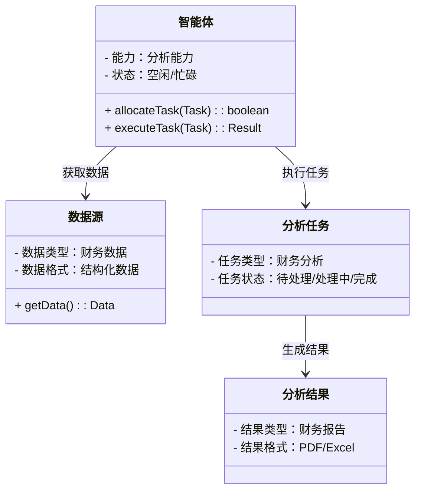
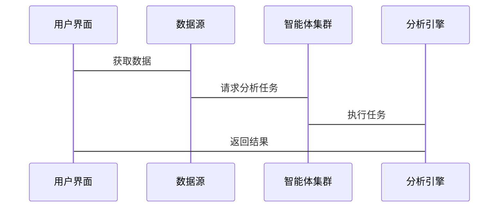

                 


# 基于多智能体的自动化年报和季报分析系统

> 关键词：多智能体系统，自动化年报分析，季报分析，分布式计算，协同过滤，系统架构设计

> 摘要：本文深入探讨了基于多智能体的自动化年报和季报分析系统的设计与实现。通过分析多智能体系统的协作机制、算法原理及系统架构，结合实际案例，展示了如何利用多智能体技术提升财务数据分析的效率和准确性。文章从背景、概念、算法、系统设计到实战实现，全面解析了该系统的构建过程，并总结了在实际应用中的注意事项与优化建议。

---

## 第一部分: 多智能体系统与年报季报分析概述

### 第1章: 多智能体系统的概念与应用

#### 1.1 多智能体系统的基本概念
- **智能体的定义与特征**：智能体（Agent）是能够感知环境并采取行动以实现目标的实体。其核心特征包括自主性、反应性、主动性、协作性和社会性。
- **多智能体系统的定义与特点**：多智能体系统（MAS）是由多个智能体组成的系统，这些智能体通过协作完成复杂任务。其特点包括分布性、协作性、动态性和智能性。
- **多智能体系统与单智能体系统的区别**：MAS强调多个智能体的协作，而单智能体系统则依赖单一智能体完成任务。MAS在复杂任务中更具优势。

#### 1.2 多智能体系统的分类
- **基于任务的多智能体系统**：智能体之间的协作基于具体任务，每个智能体负责特定子任务。
- **基于协作的多智能体系统**：智能体之间通过协作完成任务，强调通信与协调。
- **基于分布式计算的多智能体系统**：利用分布式计算技术，智能体在不同节点上协同工作。

#### 1.3 多智能体系统的应用领域
- **金融领域的应用**：如股票交易、风险管理等。
- **工业自动化中的应用**：如智能制造、设备协同控制。
- **智慧城市中的应用**：如交通管理、能源调度。

### 第2章: 年报和季报分析的背景与挑战

#### 2.1 年报和季报分析的重要性
- **企业财务分析的核心作用**：年报和季报是企业财务状况的重要反映，是投资者、债权人等利益相关者决策的关键依据。
- **典型应用场景**：如财务审计、投资决策、风险管理等。
- **数据量与复杂性对企业分析能力的挑战**：随着企业规模扩大，财务数据量剧增，人工分析效率低下，容易出错。

#### 2.2 传统年报季报分析的痛点
- **数据处理效率低下的问题**：人工处理大量数据耗时长，效率低。
- **分析结果的准确性和及时性不足**：人工分析容易出错，且难以快速响应。
- **人工分析的局限性与成本问题**：人工分析成本高，且难以覆盖所有数据。

#### 2.3 自动化年报季报分析的必要性
- **提高分析效率的需求**：自动化分析可以快速处理大量数据，提高效率。
- **降低人工成本的驱动**：通过自动化减少对大量人工分析的依赖，降低成本。
- **数据驱动决策的时代要求**：现代企业需要基于数据的实时分析做出决策。

---

## 第二部分: 多智能体系统的核心原理与算法

### 第3章: 多智能体系统的协作机制

#### 3.1 分布式计算与多智能体协作
- **分布式计算的基本原理**：分布式计算将任务分解为多个子任务，分布在多个节点上并行处理。
- **多智能体协作中的分布式任务分配**：智能体根据自身能力和当前负载，动态分配任务。
- **分布式计算在年报季报分析中的应用**：如数据采集、清洗、分析等任务的分布式处理。

#### 3.2 协同过滤与多智能体协同
- **协同过滤算法的基本原理**：通过分析用户行为或数据特征，推荐相似的项。
- **多智能体协同中的协同过滤实现**：智能体之间通过共享数据特征，实现协同过滤。
- **协同过滤在财务数据分析中的应用**：如财务指标预测、异常检测等。

#### 3.3 多智能体系统的通信协议
- **智能体之间的通信机制**：包括消息传递、事件驱动等方式。
- **通信协议的设计与实现**：定义智能体之间的交互接口和通信格式。
- **通信协议在年报季报分析中的应用**：如数据传递、任务分配等。

### 第4章: 多智能体系统的算法实现

#### 4.1 分布式计算算法
- **分布式计算的数学模型**：任务分解、负载均衡等。
- **分布式计算在年报季报分析中的实现**：如MapReduce框架的应用。

#### 4.2 协同过滤算法
- **协同过滤的数学模型**：基于用户-物品矩阵的相似性计算。
- **协同过滤在财务数据分析中的实现**：如基于财务指标的协同过滤。

#### 4.3 多智能体系统的通信协议实现
- **通信协议的数学模型**：如消息队列、RPC调用等。
- **通信协议的具体实现**：如HTTP、WebSocket等。

---

## 第三部分: 系统分析与架构设计方案

### 第5章: 问题场景介绍
- **问题场景**：年报和季报分析涉及大量数据，人工分析效率低下，需要自动化解决方案。
- **项目介绍**：构建一个基于多智能体的自动化年报和季报分析系统，实现数据采集、清洗、分析、报告生成的自动化。

### 第6章: 系统功能设计
- **领域模型**：智能体、数据源、分析任务、分析结果等。
- **领域模型的Mermaid类图**：



### 第7章: 系统架构设计
- **系统架构的Mermaid架构图**：


### 第8章: 系统接口设计
- **智能体接口**：任务分配接口、任务执行接口。
- **数据源接口**：数据获取接口、数据清洗接口。
- **分析引擎接口**：数据分析接口、报告生成接口。

### 第9章: 系统交互设计
- **系统交互的Mermaid序列图**：



---

## 第四部分: 项目实战

### 第10章: 环境安装与配置
- **安装Python和相关库**：如`numpy`、`pandas`、`scikit-learn`等。
- **安装分布式计算框架**：如`Dask`或`Spark`。

### 第11章: 核心代码实现
#### 11.1 数据采集模块
```python
import requests

def fetch_data(url):
    response = requests.get(url)
    return response.json()
```

#### 11.2 数据清洗模块
```python
import pandas as pd

def clean_data(data):
    df = pd.DataFrame(data)
    df.dropna(inplace=True)
    return df
```

#### 11.3 数据分析模块
```python
from sklearn.ensemble import RandomForestRegressor

def analyze_data(df):
    model = RandomForestRegressor()
    model.fit(df.drop('target', axis=1), df['target'])
    return model
```

#### 11.4 报告生成模块
```python
import reportlab

def generate_report(results):
    doc = reportlab.Document()
    doc.add_section(results)
    return doc.save()
```

### 第12章: 项目实战案例分析
- **案例分析**：某企业的年报数据自动化分析。
- **详细讲解**：从数据采集到报告生成的完整流程。

---

## 第五部分: 总结与优化建议

### 第13章: 总结
- **多智能体系统的优势**：高效协作、任务分配合理。
- **系统的可扩展性**：支持新增智能体和数据源。
- **系统的稳定性**：分布式架构提高了系统的容错性。

### 第14章: 最佳实践与注意事项
- **性能优化**：合理分配任务，避免单点负载过高。
- **安全性考虑**：数据传输加密，防止数据泄露。
- **可扩展性设计**：模块化设计，方便后续扩展。

### 第15章: 小结
- **多智能体系统的应用前景**：随着AI技术的发展，多智能体系统将在更多领域得到应用。
- **未来展望**：结合深度学习和强化学习，进一步提升系统的智能性。

---

通过以上章节的详细讲解，我们全面解析了基于多智能体的自动化年报和季报分析系统的构建过程，从理论到实践，从设计到实现，为读者提供了一套完整的解决方案。

