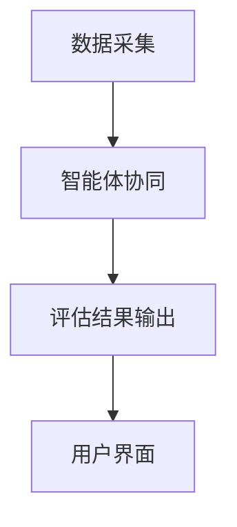
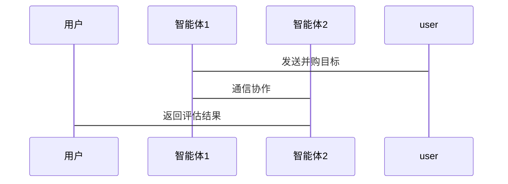

                 


# 基于多智能体的自动化并购机会分析

## 关键词：多智能体系统、自动化并购、并购机会分析、协同学习、强化学习、博弈论、系统架构

## 摘要：本文深入探讨了基于多智能体的自动化并购机会分析的理论与实践。通过分析多智能体系统的协同学习算法和博弈论模型，结合实际案例，展示了如何利用多智能体系统提高并购机会评估的效率和准确性。文章从系统架构设计、算法实现到项目实战，全面解析了基于多智能体的自动化并购机会分析的核心技术与应用价值。

---

# 第1章: 多智能体系统与自动化并购概述

## 1.1 多智能体系统的基本概念

### 1.1.1 多智能体系统的定义
多智能体系统（Multi-Agent System, MAS）是由多个智能体（Agent）组成的复杂系统，这些智能体能够通过交互和协作完成特定任务。每个智能体都有自己的目标、知识和行为规则。

### 1.1.2 多智能体系统的组成部分
- **智能体（Agent）**：具有感知环境、自主决策和行动的能力。
- **通信机制**：智能体之间通过消息传递进行信息交流。
- **协作机制**：智能体之间通过协作完成共同目标。
- **决策机制**：智能体根据环境信息做出决策。

### 1.1.3 多智能体系统的特点与优势
- **分布式计算**：任务分布在多个智能体中，提高系统的并行性和容错性。
- **自主性**：智能体能够自主决策，减少对中心控制的依赖。
- **协作性**：智能体通过协作完成复杂任务，提高整体效率。

## 1.2 自动化并购的基本概念

### 1.2.1 并购的定义与类型
并购是指企业之间的合并或收购行为，常见类型包括横向并购、纵向并购和混合并购。

### 1.2.2 自动化并购的背景与意义
传统并购分析依赖人工判断，效率低且易受主观因素影响。自动化并购通过技术手段提高分析效率和准确性。

### 1.2.3 自动化并购的核心目标
- **快速筛选目标企业**：通过算法快速识别潜在并购目标。
- **评估并购价值**：利用数据模型评估并购的经济效益。
- **风险预警**：识别并购中的潜在风险。

## 1.3 多智能体系统在并购中的应用前景

### 1.3.1 多智能体系统在并购中的潜在应用场景
- **目标筛选**：智能体负责从海量数据中筛选潜在并购目标。
- **价值评估**：多个智能体协同完成企业价值评估。
- **风险预警**：通过协作机制识别并购中的潜在风险。

### 1.3.2 自动化并购的优势与挑战
优势：
- **高效性**：多智能体协同工作，提高分析效率。
- **准确性**：通过数据模型和算法提高评估准确性。

挑战：
- **数据隐私**：并购数据涉及敏感信息，如何保护数据隐私是一个重要问题。
- **算法复杂性**：多智能体协同算法的实现复杂性较高。

### 1.3.3 多智能体系统在自动化并购中的独特价值
多智能体系统能够通过协作和分布式计算，实现高效、精准的并购机会分析，为企业的决策提供有力支持。

## 1.4 本章小结
本章介绍了多智能体系统的基本概念和自动化并购的核心目标，分析了多智能体系统在并购中的应用前景及其独特价值。

---

# 第2章: 多智能体系统的核心概念与联系

## 2.1 多智能体系统的核心原理

### 2.1.1 多智能体系统的通信机制
智能体之间通过消息传递进行信息交流，通信机制需要考虑信息的实时性和可靠性。

### 2.1.2 多智能体系统的协作机制
协作机制包括任务分配、协调和冲突解决。智能体通过协作完成共同目标。

### 2.1.3 多智能体系统的决策机制
智能体根据环境信息和协作需求做出决策，决策机制需要考虑信息的不确定性和动态性。

## 2.2 多智能体系统与传统并购分析的对比

### 2.2.1 传统并购分析方法的局限性
传统方法依赖人工判断，效率低且主观性强。

### 2.2.2 多智能体系统在并购分析中的优势
多智能体系统能够通过协同学习和分布式计算提高分析效率和准确性。

### 2.2.3 多智能体系统与传统方法的结合点
多智能体系统可以与传统方法结合，形成混合式分析模型，既保留传统方法的经验，又利用多智能体系统的高效性。

## 2.3 多智能体系统的核心要素

### 2.3.1 智能体的定义与属性
智能体具有自主性、反应性、协作性和学习性。

### 2.3.2 智能体之间的关系与交互
智能体之间通过通信和协作实现信息共享和任务分配。

### 2.3.3 系统的动态性与适应性
多智能体系统能够根据环境变化动态调整策略，具有较强的适应性。

## 2.4 本章小结
本章详细讲解了多智能体系统的核心原理及其在并购分析中的优势，分析了多智能体系统的动态性和适应性。

---

# 第3章: 多智能体协同学习算法原理

## 3.1 多智能体协同学习的定义与特点

### 3.1.1 协同学习的定义
协同学习是指多个智能体通过协作完成学习任务，共享知识和经验。

### 3.1.2 多智能体协同学习的特点
- **分布式学习**：学习任务分布在多个智能体中。
- **协作性**：智能体通过协作提高学习效果。
- **动态性**：学习过程具有动态性和适应性。

## 3.2 分布式强化学习算法

### 3.2.1 强化学习的基本原理
强化学习通过智能体与环境的交互，学习最优策略。

### 3.2.2 分布式强化学习的实现机制
多个智能体通过分布式计算协同完成强化学习任务。

### 3.2.3 分布式强化学习在并购机会分析中的应用
智能体通过分布式强化学习，快速识别潜在并购机会。

## 3.3 多智能体协同学习的数学模型

### 3.3.1 协同学习的数学表达
智能体之间通过消息传递共享信息，建立协同学习模型。

### 3.3.2 分布式强化学习的数学推导
通过数学公式描述强化学习的策略优化过程。

## 3.4 本章小结
本章介绍了多智能体协同学习的定义和特点，详细讲解了分布式强化学习算法及其在并购机会分析中的应用。

---

# 第4章: 并购机会评估的数学模型与公式

## 4.1 并购机会评估的基本原理

### 4.1.1 并购机会评估的核心指标
包括企业价值、市场地位、财务状况等。

### 4.1.2 多智能体系统在评估中的作用
通过协同学习和分布式计算，提高评估的准确性和效率。

### 4.1.3 评估模型的构建与优化
通过数学模型和数据驱动的方法，构建并购机会评估模型。

## 4.2 并购机会评估的数学模型

### 4.2.1 模型的输入变量与输出变量
输入变量包括企业财务数据、市场数据等，输出变量是并购机会的评估结果。

### 4.2.2 模型的数学表达式
$$ V = \alpha \times EBITDA + \beta \times Market\ Position + \gamma \times Financial\ Risk $$

其中，$V$ 是企业价值，$\alpha, \beta, \gamma$ 是权重系数，$EBITDA$ 是息税折旧前利润，$Market\ Position$ 是市场地位，$Financial\ Risk$ 是财务风险。

### 4.2.3 模型的参数估计与优化
通过机器学习方法优化模型参数，提高评估的准确性。

## 4.3 并购机会评估的公式推导

### 4.3.1 初步模型的建立
$$ V_i = w_1 \times X_i + w_2 \times Y_i $$

其中，$X_i$ 和 $Y_i$ 是两个关键指标，$w_1$ 和 $w_2$ 是权重系数。

### 4.3.2 模型的优化与调整
通过数据拟合和交叉验证，优化模型参数。

### 4.3.3 最终模型的公式表达
$$ V_i = w_1 \times X_i + w_2 \times Y_i + \epsilon $$

其中，$\epsilon$ 是误差项。

## 4.4 本章小结
本章详细讲解了并购机会评估的数学模型，分析了模型的输入变量、输出变量和数学表达式。

---

# 第5章: 基于多智能体的自动化并购系统架构设计

## 5.1 系统架构设计概述

### 5.1.1 问题场景介绍
系统需要实现多智能体协同完成并购机会分析的任务。

### 5.1.2 系统功能设计
包括数据采集、智能体协同、评估结果输出等功能。

### 5.1.3 系统架构图


### 5.1.4 系统接口设计
包括数据接口、智能体通信接口和用户界面接口。

### 5.1.5 系统交互流程


## 5.2 本章小结
本章详细讲解了基于多智能体的自动化并购系统的架构设计，包括系统功能、架构图和交互流程。

---

# 第6章: 项目实战与案例分析

## 6.1 环境安装与配置

### 6.1.1 系统环境要求
- 操作系统：Linux/Windows/MacOS
- 语言：Python 3.6+
- 框架：TensorFlow/PyTorch
- 第三方库：numpy, pandas, matplotlib

### 6.1.2 安装步骤
```bash
pip install numpy pandas matplotlib
```

## 6.2 系统核心实现源代码

### 6.2.1 智能体通信模块
```python
class Agent:
    def __init__(self, id):
        self.id = id
        self.state = None
    def send_message(self, message, agent):
        agent.receive_message(message)
    def receive_message(self, message):
        print(f"Agent {self.id} received message: {message}")
```

### 6.2.2 并购机会评估模块
```python
def evaluate Opportunity(agent, target):
    return agent.value * target.market_position
```

### 6.2.3 分布式强化学习模块
```python
def distributed_rl(trainers, environment):
    for trainer in trainers:
        trainer.update_policy(environment.get_reward())
```

## 6.3 代码解读与分析

### 6.3.1 智能体通信模块
智能体通过消息传递实现通信协作。

### 6.3.2 并购机会评估模块
根据智能体的评估结果和目标企业的市场地位，计算并购机会的价值。

### 6.3.3 分布式强化学习模块
通过分布式训练，优化智能体的策略，提高评估的准确性。

## 6.4 实际案例分析

### 6.4.1 案例背景
某企业计划并购一家目标公司，利用多智能体系统进行机会分析。

### 6.4.2 数据采集与处理
收集目标企业的财务数据、市场数据等。

### 6.4.3 智能体协同与评估
智能体协同完成数据分析和评估，输出并购机会的价值。

## 6.5 本章小结
本章通过项目实战和案例分析，详细讲解了基于多智能体的自动化并购系统的实现过程。

---

# 第7章: 总结与展望

## 7.1 核心内容回顾
本文详细讲解了基于多智能体的自动化并购机会分析的理论与实践，包括系统架构、算法原理和项目实现。

## 7.2 最佳实践 tips
- **数据质量**：确保数据的准确性和完整性。
- **算法优化**：通过不断优化算法参数，提高评估的准确性。
- **系统维护**：定期更新系统和模型，保持系统的高效性和准确性。

## 7.3 注意事项
- **数据隐私**：注意保护企业数据的隐私和安全。
- **算法复杂性**：多智能体系统的实现复杂性较高，需要专业的技术支持。

## 7.4 拓展阅读
- 《Multi-Agent Systems: Complexity, Decentralized Knowledge, and Coordination》
- 《Reinforcement Learning: Theory and Algorithms》

## 7.5 本章小结
本章总结了全文的核心内容，提出了最佳实践建议，并展望了未来的研究方向。

---

# 结语

通过本文的详细讲解，读者可以全面了解基于多智能体的自动化并购机会分析的核心技术与应用价值。多智能体系统通过协同学习和分布式计算，为企业的并购决策提供了有力支持。未来，随着人工智能技术的不断发展，多智能体系统在并购分析中的应用前景将更加广阔。

