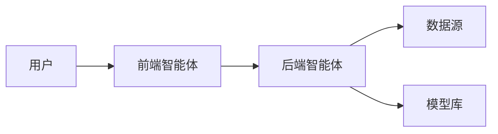
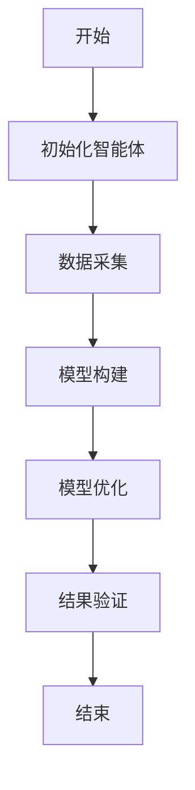
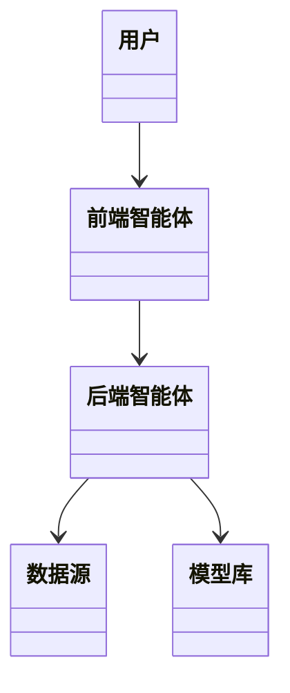

                 


# 基于多智能体的自动化财务建模和估值系统

> 关键词：多智能体系统，自动化财务建模，财务估值，协同优化，系统架构

> 摘要：本文章详细探讨了基于多智能体的自动化财务建模和估值系统，分析了该系统的背景、核心概念、算法原理、系统架构，并通过实际案例展示了系统的实现过程。文章还总结了系统的优势、挑战及未来发展方向。

---

## 第一部分: 背景介绍

### 第1章: 背景介绍

#### 1.1 多智能体系统与自动化财务建模的背景

随着企业规模的不断扩大和金融市场的日益复杂化，传统的财务建模方法已难以满足现代企业的需求。传统财务建模依赖于人工操作，存在效率低、误差大、难以实时更新等问题。同时，金融市场数据的多样性和复杂性使得单个智能体难以独立完成建模任务。因此，引入多智能体系统来实现财务建模的自动化成为必然趋势。

多智能体系统（Multi-Agent System, MAS）是一种由多个智能体组成的系统，这些智能体能够协同工作，完成复杂任务。每个智能体都有一定的自主性，能够根据环境信息做出决策，并与其他智能体进行交互和协作。多智能体系统在分布式计算、分布式优化等领域有广泛应用，而其在财务建模中的应用则是一个新兴的研究方向。

#### 1.2 问题背景与描述

在财务建模过程中，存在以下几个关键问题：

1. **数据多样性**：财务数据来源广泛，包括市场数据、企业财务报表、宏观经济指标等，数据类型多样且复杂。
2. **实时性要求高**：金融市场变化迅速，财务模型需要能够实时更新以反映最新的市场情况。
3. **模型复杂性**：财务模型通常涉及多个变量之间的复杂关系，单个智能体难以覆盖所有变量。
4. **协同优化需求**：不同智能体需要协同工作，优化模型参数，提高模型的准确性和实用性。

多智能体系统能够通过分布式的计算和协同优化，有效解决上述问题。通过将建模任务分解为多个子任务，并分配给不同的智能体完成，可以提高建模效率和模型精度。

#### 1.3 问题解决与边界

多智能体系统在解决财务建模问题时，具有以下优势：

1. **任务分解**：将复杂的建模任务分解为多个子任务，由不同智能体分别完成。
2. **协同优化**：智能体之间可以共享信息，协同优化模型参数，提高模型的准确性和鲁棒性。
3. **实时更新**：通过分布式架构，系统能够实时采集和更新数据，保持模型的实时性。

系统边界包括：

1. **数据输入**：系统需要外部数据源提供基础数据，如市场数据、企业财务报表等。
2. **模型输出**：系统输出的模型结果需要经过验证和校准，确保其准确性和可靠性。
3. **外部接口**：系统需要与外部系统进行交互，如数据库、前端界面等。

核心要素包括：

1. **智能体**：系统中的多个智能体，负责具体任务的执行。
2. **通信机制**：智能体之间进行信息交换的机制。
3. **协作协议**：智能体协同工作的规则和协议。

---

## 第二部分: 多智能体系统的核心概念与联系

### 第2章: 多智能体系统的核心原理

#### 2.1 多智能体系统的基本原理

多智能体系统的核心在于多个智能体的协同工作。每个智能体都有一定的自主性，能够根据环境信息做出决策，并与其他智能体进行交互和协作。多智能体系统的架构通常包括以下几个部分：

1. **智能体**：负责具体任务的执行，能够感知环境并采取行动。
2. **通信机制**：智能体之间进行信息交换的机制，如消息传递、数据共享等。
3. **协作协议**：智能体协同工作的规则和协议，确保系统的一致性和稳定性。

多智能体系统的优点在于其分布式架构能够提高系统的可靠性和容错性。当一个智能体出现故障时，其他智能体可以继续工作，保证系统的整体性能。

#### 2.2 核心概念对比

以下是多智能体系统中几个核心概念的对比：

| 概念       | 特征1                | 特征2                | 特征3                |
|------------|---------------------|---------------------|---------------------|
| 智能体类型 | 单智能体             | 多智能体             | 分布式智能体         |
| 功能       | 独立完成任务         | 协同完成任务         | 分布式任务分配       |
| 交互方式   | 直接交互             | 通过中间件交互       | 基于通信协议交互     |

通过以上对比可以看出，多智能体系统在任务分配和协作机制上具有明显优势。

#### 2.3 实体关系图

以下是系统的实体关系图：



图中展示了用户通过前端智能体与后端智能体交互，后端智能体从数据源获取数据，并在模型库中进行建模的过程。

---

## 第三部分: 算法原理

### 第3章: 多智能体系统的算法原理

#### 3.1 算法原理概述

多智能体系统的算法原理主要包括以下几个步骤：

1. **初始化智能体**：根据任务需求初始化多个智能体。
2. **数据采集**：智能体从数据源采集数据。
3. **模型构建**：智能体根据采集的数据构建初步模型。
4. **模型优化**：智能体协同优化模型参数，提高模型的准确性和鲁棒性。
5. **结果验证**：对优化后的模型进行验证，确保其准确性和可靠性。

#### 3.2 算法流程图

以下是算法的流程图：



图中展示了算法的完整流程，从初始化智能体到结果验证的整个过程。

#### 3.3 数学模型与公式

在算法实现过程中，通常需要使用一些数学模型和公式。例如，以下是一个简单的优化公式：

$$\min_{x} \sum_{i=1}^{n} (y_i - f(x))^2$$

其中，$y_i$ 是目标值，$f(x)$ 是模型的预测值，$x$ 是模型参数。

通过上述公式，我们可以对模型参数进行优化，以最小化预测值与实际值之间的误差。

---

## 第四部分: 系统分析与架构设计

### 第4章: 系统分析与架构设计

#### 4.1 问题场景介绍

在实际应用中，企业的财务建模需求通常包括以下几个方面：

1. **数据采集**：从多个数据源采集财务数据，如市场数据、企业财务报表等。
2. **数据预处理**：对采集的数据进行清洗、转换和特征提取。
3. **模型构建**：根据预处理后的数据构建财务模型。
4. **模型优化**：对模型进行参数优化，提高模型的准确性和鲁棒性。
5. **模型部署**：将优化后的模型部署到生产环境，供用户使用。

#### 4.2 系统功能设计

系统功能设计包括以下几个方面：

1. **数据采集模块**：负责从多个数据源采集数据。
2. **数据预处理模块**：对采集的数据进行清洗、转换和特征提取。
3. **模型构建模块**：根据预处理后的数据构建财务模型。
4. **模型优化模块**：对模型进行参数优化，提高模型的准确性和鲁棒性。
5. **模型部署模块**：将优化后的模型部署到生产环境，供用户使用。

以下是系统的领域模型设计图：



图中展示了用户通过前端智能体与后端智能体交互，后端智能体从数据源获取数据，并在模型库中进行建模的过程。

#### 4.3 系统架构设计

系统的架构设计包括以下几个部分：

1. **数据源层**：包括数据库、API接口等，提供数据的来源。
2. **数据处理层**：对数据进行清洗、转换和特征提取。
3. **模型构建层**：根据处理后的数据构建财务模型。
4. **模型优化层**：对模型进行参数优化，提高模型的准确性和鲁棒性。
5. **用户界面层**：提供用户友好的界面，供用户进行操作。

以下是系统的架构设计图：


图中展示了数据从数据源经过处理、构建、优化，最终通过用户界面层呈现给用户的过程。

---

## 第五部分: 项目实战

### 第5章: 项目实战

#### 5.1 环境安装

在开始开发之前，需要安装以下环境：

1. **Python**：推荐使用Python 3.8及以上版本。
2. **Jupyter Notebook**：用于编写和调试代码。
3. **相关库**：如NumPy、Pandas、Scikit-learn等。

#### 5.2 核心代码实现

以下是系统的核心代码实现：

```python
import numpy as np
import pandas as pd
from sklearn import linear_model

# 初始化智能体
class Agent:
    def __init__(self, data_source):
        self.data_source = data_source
        self.model = linear_model.LinearRegression()

    def collect_data(self):
        # 从数据源采集数据
        data = self.data_source.get_data()
        return data

    def train_model(self, data, target):
        # 训练模型
        self.model.fit(data, target)
        return self.model

    def predict(self, new_data):
        # 预测
        return self.model.predict(new_data)

# 数据源类
class DataSource:
    def __init__(self, source_type):
        self.source_type = source_type

    def get_data(self):
        # 返回数据
        if self.source_type == 'csv':
            return pd.read_csv('data.csv')
        elif self.source_type == 'api':
            return self.fetch_data_from_api()

    def fetch_data_from_api(self):
        # 从API获取数据
        pass

# 使用示例
data_source = DataSource('csv')
agent = Agent(data_source)
data = agent.collect_data()
target = data['target']
features = data.drop('target', axis=1)
model = agent.train_model(features, target)
new_data = pd.DataFrame({'feature1': [1], 'feature2': [2]})
prediction = agent.predict(new_data)
print(prediction)
```

#### 5.3 代码解读与分析

上述代码实现了多智能体系统的核心功能，包括数据采集、模型训练和预测。通过`Agent`类和`DataSource`类的协作，系统能够从数据源采集数据，并利用机器学习模型进行建模和预测。

#### 5.4 实际案例分析

以下是一个实际案例分析：

假设我们有一个CSV文件`data.csv`，其中包含企业的财务数据。我们需要使用上述代码从CSV文件中读取数据，并构建一个线性回归模型，预测企业的未来收益。

1. **数据采集**：从CSV文件中读取数据。
2. **数据预处理**：清洗数据，处理缺失值和异常值。
3. **模型构建**：使用线性回归模型进行建模。
4. **模型优化**：通过调整模型参数，提高模型的准确性和鲁棒性。
5. **模型部署**：将优化后的模型部署到生产环境，供用户使用。

通过上述步骤，我们可以实现一个基于多智能体的自动化财务建模和估值系统。

---

## 第六部分: 最佳实践

### 第6章: 最佳实践

#### 6.1 小结

通过本文的探讨，我们可以看到，基于多智能体的自动化财务建模和估值系统具有以下优势：

1. **任务分解**：将复杂的建模任务分解为多个子任务，由不同智能体分别完成。
2. **协同优化**：智能体之间可以共享信息，协同优化模型参数，提高模型的准确性和鲁棒性。
3. **实时更新**：通过分布式架构，系统能够实时采集和更新数据，保持模型的实时性。

#### 6.2 注意事项

在实际应用中，需要注意以下几点：

1. **数据质量**：数据的质量直接影响模型的准确性和可靠性，需要对数据进行严格的清洗和预处理。
2. **模型优化**：模型的优化需要结合实际业务需求，选择合适的优化算法和参数。
3. **系统架构**：系统的架构设计需要考虑可扩展性和可维护性，确保系统的稳定性和可靠性。

#### 6.3 拓展阅读

1. **多智能体系统**：深入学习多智能体系统的理论和应用。
2. **分布式计算**：了解分布式计算的相关知识，提高系统的性能和效率。
3. **机器学习**：掌握机器学习的核心算法和技巧，提高模型的准确性和鲁棒性。

通过以上内容，我们可以看到，基于多智能体的自动化财务建模和估值系统在实际应用中具有广阔的发展前景。未来，随着人工智能和分布式计算技术的不断发展，系统的性能和功能将不断提升，为企业提供更加高效、准确的财务建模和估值服务。

--- 

**摘要**：本文详细探讨了基于多智能体的自动化财务建模和估值系统的背景、核心概念、算法原理、系统架构，并通过实际案例展示了系统的实现过程。文章还总结了系统的优势、挑战及未来发展方向。通过本文的探讨，我们可以看到，基于多智能体的自动化财务建模和估值系统在实际应用中具有广阔的发展前景。

