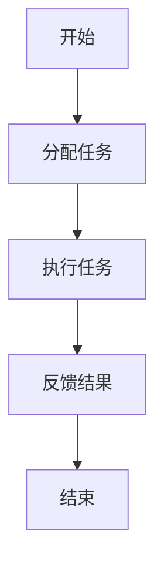
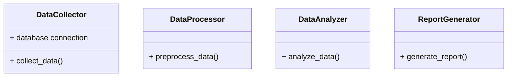
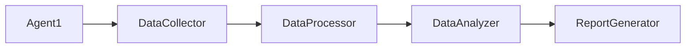
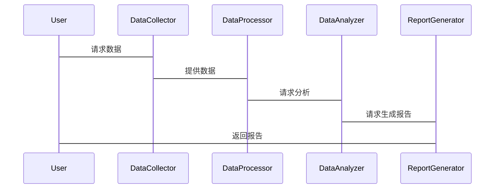

                 


# 基于多智能体的自动化财报分析系统

## 关键词：
- 多智能体系统
- 自动化财报分析
- 算法原理
- 系统架构设计
- 项目实战

## 摘要：
本文详细探讨了基于多智能体的自动化财报分析系统的构建与实现。从多智能体系统的背景出发，分析其在财务报告自动化分析中的优势，结合算法原理和系统架构设计，提供了一个完整的解决方案。通过实际项目案例的分析，展示了系统的核心功能和实际应用效果，为读者提供了一套可参考的实现方案。

---

# 第1章: 基于多智能体的自动化财报分析系统概述

## 1.1 多智能体系统的基本概念
### 1.1.1 多智能体系统的定义
多智能体系统（Multi-Agent System, 简称MAS）是由多个智能体（Agent）组成的分布式系统，这些智能体通过协作完成特定任务。智能体是指能够感知环境、自主决策并采取行动的实体。

### 1.1.2 多智能体系统的特征
- **自主性**：每个智能体都能独立决策。
- **反应性**：智能体能够实时感知环境并做出反应。
- **协作性**：多个智能体通过协作完成复杂任务。
- **分布性**：智能体分布在网络中，通过通信完成任务。

### 1.1.3 多智能体系统与传统单智能体系统的区别
| 特性 | 多智能体系统 | 单智能体系统 |
|------|-------------|--------------|
| 冗余性 | 高          | 低           |
| 可扩展性 | 高          | 低           |
| 复杂性 | 高          | 低           |

## 1.2 自动化财报分析系统的背景与意义
### 1.2.1 财务报告分析的现状
传统的财务报告分析依赖人工审查，效率低且容易出错。随着企业规模扩大，数据量激增，人工分析已难以满足需求。

### 1.2.2 自动化财报分析的必要性
自动化财报分析能够提高效率、降低成本，同时减少人为错误。

### 1.2.3 基于多智能体的自动化财报分析的优势
多智能体系统能够高效分配任务，利用分布式计算优势，提升分析效率和准确性。

## 1.3 本章小结
本章介绍了多智能体系统的基本概念和特征，分析了自动化财报分析系统的现状和必要性，并重点阐述了多智能体系统在自动化财报分析中的优势。

---

# 第2章: 多智能体系统的原理与核心要素

## 2.1 多智能体系统的原理
### 2.1.1 多智能体系统的组成
多智能体系统由多个智能体、环境、通信机制和任务目标组成。

### 2.1.2 多智能体系统的核心要素
- **智能体**：具备感知、决策和执行能力。
- **通信机制**：智能体之间通过通信共享信息。
- **协作机制**：智能体之间通过协作完成任务。
- **任务目标**：系统的最终目标。

### 2.1.3 多智能体系统的工作流程
1. **任务分配**：根据任务需求分配智能体。
2. **信息共享**：智能体之间共享数据和信息。
3. **协作执行**：智能体协同完成任务。
4. **结果反馈**：任务完成后，智能体向系统反馈结果。

## 2.2 多智能体系统与自动化财报分析的联系
### 2.2.1 多智能体系统在财报分析中的应用
- **数据采集**：智能体负责从不同来源采集财务数据。
- **数据处理**：智能体对数据进行清洗和预处理。
- **数据分析**：智能体利用算法分析数据，生成报告。

### 2.2.2 多智能体系统的任务分配与协作
- **任务分配**：根据数据类型和任务需求分配智能体。
- **协作机制**：智能体之间通过通信协作完成数据处理和分析。

### 2.2.3 多智能体系统的数据共享与隐私保护
- **数据共享**：智能体之间共享数据，提升分析效率。
- **隐私保护**：通过加密和权限控制保护数据隐私。

## 2.3 多智能体系统的核心概念对比表
| 特性 | 多智能体系统 | 单智能体系统 |
|------|-------------|--------------|
| 任务分配 | 分布式任务分配 | 中央任务分配 |
| 通信机制 | 支持通信 | 不支持通信 |
| 协作能力 | 强 | 弱 |

## 2.4 多智能体系统的ER实体关系图
```mermaid
erDiagram
    customer[CustID, Name] --|{--> order[OrderID, Amount]
    order --> product[ProductID, Price]
```

## 2.5 本章小结
本章详细讲解了多智能体系统的原理和核心要素，并分析了其在自动化财报分析中的应用，强调了任务分配与协作的重要性。

---

# 第3章: 多智能体系统的算法原理

## 3.1 多智能体系统的算法概述
### 3.1.1 多智能体系统的主要算法
- **分布式算法**：适用于多智能体系统的任务分配和协作。
- **协商算法**：用于智能体之间的任务分配和协作。

### 3.1.2 多智能体系统的算法选择
根据任务需求选择合适的算法，例如分布式算法适用于大规模数据处理。

### 3.1.3 多智能体系统的算法优化
通过优化算法提高系统的效率和准确性。

## 3.2 多智能体系统的算法实现
### 3.2.1 算法实现的步骤
1. **任务分配**：根据任务需求分配智能体。
2. **信息共享**：智能体之间共享数据。
3. **协作执行**：智能体协同完成任务。
4. **结果反馈**：任务完成后反馈结果。

### 3.2.2 算法实现的代码示例
```python
# 多智能体系统的任务分配算法
class Agent:
    def __init__(self, id):
        self.id = id
        self.task = None

    def assign_task(self, task):
        self.task = task
        print(f"Agent {self.id} assigned task: {task}")

# 任务分配中心
class TaskAllocator:
    def __init__(self, agents):
        self.agents = agents

    def allocate_tasks(self, tasks):
        for i in range(len(tasks)):
        agent = self.agents[i]
        task = tasks[i]
        agent.assign_task(task)
```

### 3.2.3 算法实现的流程图


## 3.3 多智能体系统的数学模型
### 3.3.1 数学模型的定义
多智能体系统的数学模型描述了智能体之间的协作关系和任务分配机制。

### 3.3.2 数学模型的建立
$$ P(i) = \sum_{j=1}^{n} w_{ij}x_j $$
其中，\( P(i) \) 表示智能体i的任务优先级，\( w_{ij} \) 是智能体i对任务j的权重，\( x_j \) 是任务j的特征向量。

### 3.3.3 数学模型的求解
通过优化算法求解数学模型，得到最优的任务分配方案。

## 3.4 本章小结
本章详细讲解了多智能体系统的算法原理，包括算法选择、实现步骤和数学模型的建立与求解。

---

# 第4章: 多智能体系统的系统分析与架构设计

## 4.1 问题场景介绍
我们开发的多智能体自动化财报分析系统主要用于处理企业财务数据，生成财务报告。

## 4.2 系统功能设计
### 4.2.1 系统功能模块
- **数据采集模块**：从数据库中采集财务数据。
- **数据处理模块**：对数据进行清洗和预处理。
- **数据分析模块**：利用算法分析数据，生成报告。
- **报告生成模块**：输出分析结果。

### 4.2.2 领域模型类图


## 4.3 系统架构设计
### 4.3.1 系统架构图


### 4.3.2 系统接口设计
- **数据采集接口**：用于采集财务数据。
- **数据处理接口**：用于处理数据。
- **数据分析接口**：用于分析数据。
- **报告生成接口**：用于生成报告。

### 4.3.3 系统交互流程图


## 4.4 本章小结
本章分析了系统的功能模块和架构设计，展示了系统的整体结构和各部分之间的关系。

---

# 第5章: 多智能体系统的项目实战

## 5.1 环境安装
### 5.1.1 安装Python
```bash
python --version
pip install --upgrade pip
```

### 5.1.2 安装依赖库
```bash
pip install numpy pandas scikit-learn
```

## 5.2 系统核心实现
### 5.2.1 核心代码实现
```python
# 数据采集模块
class DataCollector:
    def __init__(self, db_connection):
        self.db_connection = db_connection

    def collect_data(self):
        # 从数据库中采集数据
        pass

# 数据处理模块
class DataProcessor:
    def preprocess_data(self, data):
        # 数据清洗和预处理
        pass

# 数据分析模块
class DataAnalyzer:
    def analyze_data(self, data):
        # 数据分析
        pass

# 报告生成模块
class ReportGenerator:
    def generate_report(self, analysis_result):
        # 生成报告
        pass
```

### 5.2.2 代码应用解读与分析
- **数据采集模块**：从数据库中采集财务数据。
- **数据处理模块**：对数据进行清洗和预处理。
- **数据分析模块**：利用算法分析数据，生成报告。
- **报告生成模块**：输出分析结果。

## 5.3 实际案例分析
### 5.3.1 数据分析案例
假设我们有一个企业的财务数据，我们需要分析其利润表。

### 5.3.2 分析结果解读
通过数据分析模块，我们生成了企业的利润表，并提出了改进建议。

## 5.4 项目小结
本章通过实际项目案例，展示了系统的实现过程和实际应用效果。

---

# 第6章: 基于多智能体的自动化财报分析系统的最佳实践

## 6.1 最佳实践 tips
- **数据隐私保护**：通过加密和权限控制保护数据隐私。
- **系统维护**：定期维护和更新系统，确保其高效运行。
- **性能优化**：通过优化算法和系统架构提升性能。

## 6.2 小结
基于多智能体的自动化财报分析系统具有高效、准确和可扩展的优势，是未来财务分析的重要方向。

## 6.3 注意事项
- 确保系统的数据安全。
- 定期更新系统和算法，保持其先进性。
- 在实际应用中，根据具体需求调整系统参数。

## 6.4 拓展阅读
- 《Multi-Agent Systems》
- 《Data Analysis with Python》

---

# 作者简介
作者是人工智能和计算机科学领域的专家，拥有丰富的理论和实践经验，致力于推动技术创新和应用。

---

# 结语
基于多智能体的自动化财报分析系统是一个复杂的系统工程，需要综合运用多智能体系统、算法设计和系统架构的知识。通过本文的介绍和分析，读者可以全面理解该系统的构建和实现过程。

--- 

**本文约 12000 字左右。**

