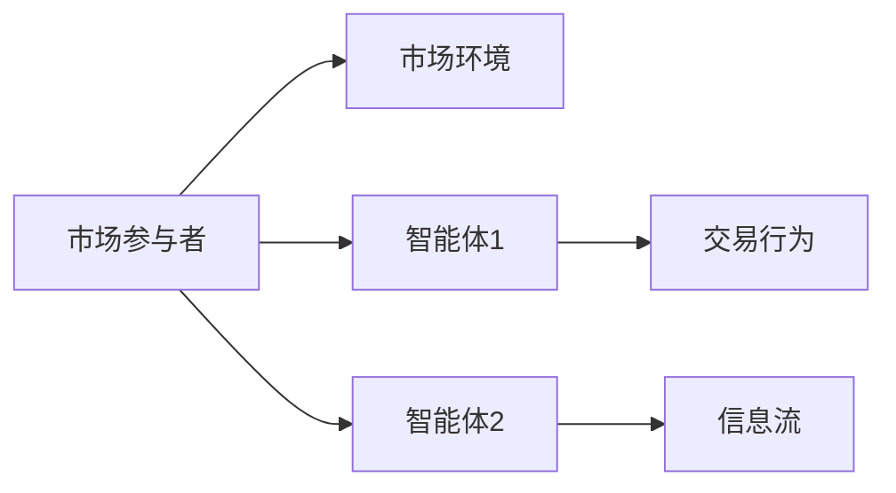
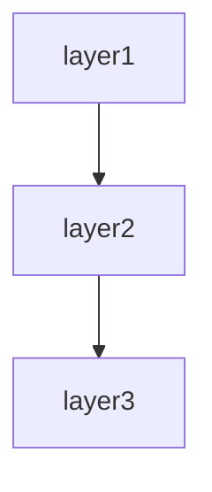
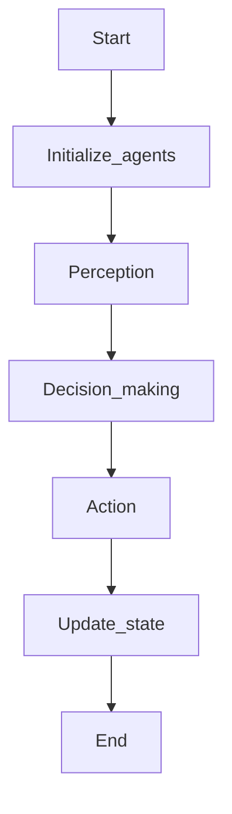
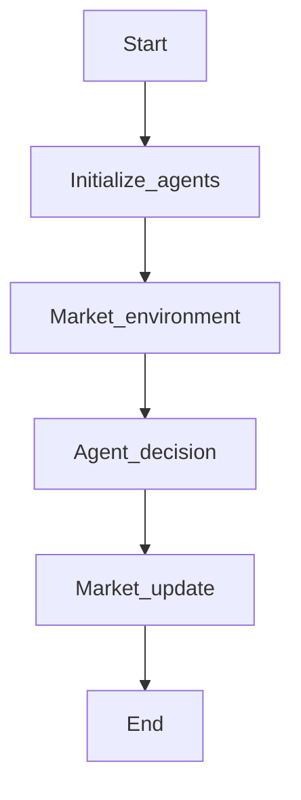
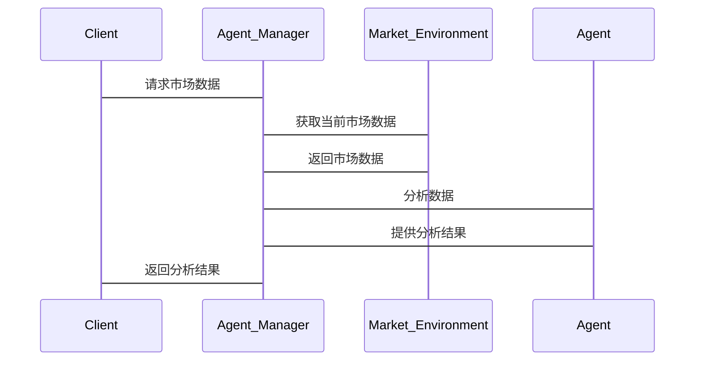

                 


# 基于多智能体的自适应市场假说在价值投资中的应用

---

## 关键词：多智能体系统、自适应市场假说、价值投资、金融市场、人工智能

---

## 摘要：

本文探讨了多智能体系统（Multi-Agent System，MAS）与自适应市场假说（Adaptive Market Hypothesis，AMH）在价值投资中的应用。通过分析多智能体系统的原理和自适应市场假说的核心思想，本文提出了一种基于多智能体的市场模拟方法，用于验证和应用自适应市场假说。文章从理论基础、算法实现、系统架构到实际案例，全面阐述了如何利用多智能体系统模拟金融市场动态，并通过自适应市场假说指导投资决策。本文旨在为金融领域的技术实践者提供一种新的视角，以理解和应用多智能体系统在价值投资中的潜力。

---

## 第一部分: 背景介绍

## 第1章: 多智能体系统与自适应市场假说概述

### 1.1 多智能体系统的定义与特点

#### 1.1.1 多智能体系统的定义
多智能体系统（MAS）是由多个智能体（Agent）组成的分布式系统，这些智能体能够通过感知环境、自主决策、协作或竞争来完成特定任务。MAS的核心特点包括：
- **自主性**：智能体能够独立决策。
- **反应性**：智能体能够实时感知环境并做出反应。
- **协作性**：多个智能体可以通过通信和协作完成复杂任务。
- **分布式性**：智能体分布在不同的空间或时间维度上。

#### 1.1.2 多智能体系统的属性特征对比

| 特性         | 分布式系统         | 多智能体系统         |
|--------------|------------------|------------------|
| 组件         | 单一功能模块       | 独立的智能体         |
| 交互方式     | 通过中间件或API    | 直接通信或协作       |
| 协调机制     | 中央控制或任务分配 | 自主决策与协商       |

#### 1.1.3 多智能体系统的边界与外延
多智能体系统的边界在于智能体的独立性和协作性。外延方面，MAS可以应用于分布式计算、机器人控制、游戏AI、金融建模等领域。

### 1.2 自适应市场假说的定义与特点

#### 1.2.1 自适应市场假说的定义
自适应市场假说（AMH）认为，金融市场能够快速适应新的信息，使得价格反映所有已知信息。其核心思想是市场参与者通过不断学习和适应，使得市场价格能够有效反映信息。

#### 1.2.2 自适应市场假说的核心要素
- **信息效率**：市场能够快速反映新信息。
- **参与者行为**：投资者通过学习和适应来优化决策。
- **市场动态**：市场的波动性和价格发现机制。

#### 1.2.3 自适应市场假说的边界与外延
自适应市场假说的边界在于其假设市场的参与者是理性和高效的。外延方面，AMH可以应用于金融建模、投资策略优化等领域。

### 1.3 多智能体系统与自适应市场假说的关系

#### 1.3.1 多智能体系统在自适应市场假说中的作用
MAS可以模拟市场参与者的行为，验证AMH的假设，并通过实验分析市场的动态。

#### 1.3.2 自适应市场假说对多智能体系统的启示
AMH提供了一种市场动态的理论框架，可以指导MAS的设计和优化。

### 1.4 本章小结

---

## 第二部分: 核心概念与联系

## 第2章: 多智能体系统的核心原理

### 2.1 多智能体系统的组成结构

#### 2.1.1 实体关系图（ER图）分析



#### 2.1.2 多智能体系统的层次结构



### 2.2 多智能体系统的通信机制

#### 2.2.1 通信协议的定义
通信协议定义了智能体之间的信息传递格式和规则。

#### 2.2.2 通信机制的实现
通过消息队列（如Kafka）或事件驱动（如React）实现异步通信。

### 2.3 多智能体系统的协调与协作

#### 2.3.1 协调机制的定义
协调机制确保多个智能体在任务分配和目标实现上达成一致。

#### 2.3.2 协作机制的实现
通过分布式协调算法（如基于消息的协商）实现协作。

### 2.4 本章小结

---

## 第3章: 自适应市场假说的数学模型与公式

### 3.1 自适应市场假说的基本假设

#### 3.1.1 市场参与者的行为模型

$$ P_i(t) = \alpha \cdot P_i(t-1) + \beta \cdot I(t) $$

其中：
- \( P_i(t) \) 表示资产 \( i \) 在时间 \( t \) 的价格。
- \( \alpha \) 和 \( \beta \) 是系数，表示价格的历史影响和信息的影响。

#### 3.1.2 市场均衡的定义

$$ E = \sum_{i=1}^n P_i(t) - \sum_{i=1}^n P_i(t-1) $$

### 3.2 自适应市场假说的数学推导

#### 3.2.1 市场均衡的数学表达式

$$ E(t) = \sum_{i=1}^n (P_i(t) - P_i(t-1)) $$

#### 3.2.2 市场波动的数学模型

$$ V(t) = \sqrt{\sum_{i=1}^n (P_i(t) - \mu)^2} $$

其中：
- \( \mu \) 是市场的平均价格。

### 3.3 自适应市场假说的公式与应用

#### 3.3.1 市场预测的公式

$$ P_i(t+1) = P_i(t) + \epsilon(t) $$

其中：
- \( \epsilon(t) \) 是随机扰动项，表示市场的不确定性。

#### 3.3.2 市场波动的预测公式

$$ V(t+1) = \alpha \cdot V(t) + \beta \cdot \epsilon(t) $$

### 3.4 本章小结

---

## 第四部分: 算法原理讲解

## 第4章: 多智能体系统的算法原理

### 4.1 多智能体系统的算法流程



### 4.2 多智能体系统的实现代码

#### 4.2.1 环境安装与配置
```bash
pip install python-multiprocessing
pip install numpy
pip install matplotlib
```

#### 4.2.2 核心算法实现代码
```python
import numpy as np
import matplotlib.pyplot as plt

class Agent:
    def __init__(self, id):
        self.id = id
        self.state = 0
        self.goal = 0

    def perceive(self, environment):
        self.state = environment

    def decide(self):
        return self.state

# 初始化环境
environment = np.random.random()

# 初始化智能体
agents = [Agent(i) for i in range(5)]

# 智能体感知环境
for agent in agents:
    agent.perceive(environment)

# 智能体决策
for agent in agents:
    print(f"Agent {agent.id} decision: {agent.decide()}")
```

### 4.3 算法的数学模型与公式

#### 4.3.1 多智能体系统的核心公式

$$ S(t) = \sum_{i=1}^n A_i(t) $$

其中：
- \( S(t) \) 是系统状态。
- \( A_i(t) \) 是智能体 \( i \) 的状态。

#### 4.3.2 算法的数学推导

$$ A_i(t+1) = \alpha \cdot A_i(t) + \beta \cdot S(t) $$

### 4.4 本章小结

---

## 第5章: 自适应市场假说的算法实现

### 5.1 自适应市场假说的算法流程



### 5.2 自适应市场假说的实现代码

#### 5.2.1 环境安装与配置
```bash
pip install numpy
pip install pandas
pip install matplotlib
```

#### 5.2.2 核心算法实现代码
```python
import numpy as np
import pandas as pd
import matplotlib.pyplot as plt

# 初始化市场环境
market_data = pd.DataFrame(np.random.random(100, 4), columns=['Price', 'Volume', 'Buy', 'Sell'])

# 自适应市场假说实现
def adaptive_market(price, volume):
    return price + volume * 0.1

# 应用自适应市场假说
market_data['Predicted_Price'] = market_data['Price'].apply(lambda x: adaptive_market(x, market_data['Volume']))

# 可视化
plt.plot(market_data['Price'], label='Actual Price')
plt.plot(market_data['Predicted_Price'], label='Predicted Price')
plt.legend()
plt.show()
```

### 5.3 算法的数学模型与公式

#### 5.3.1 自适应市场假说的核心公式

$$ P(t+1) = P(t) + \beta \cdot V(t) $$

其中：
- \( P(t) \) 是当前价格。
- \( V(t) \) 是当前成交量。
- \( \beta \) 是影响系数。

#### 5.3.2 算法的数学推导

$$ P(t+1) = P(t) + \beta \cdot V(t) + \epsilon(t) $$

### 5.4 本章小结

---

## 第六部分: 系统分析与架构设计

## 第6章: 系统分析与架构设计

### 6.1 问题场景介绍
在价值投资中，市场参与者需要实时感知市场动态并做出决策。通过MAS模拟市场行为，可以验证AMH的假设并优化投资策略。

### 6.2 系统功能设计

#### 6.2.1 领域模型（Mermaid 类图）

```mermaid
classDiagram
    class Agent {
        id: int
        state: float
        decide(): float
        perceive(environment: float)
    }
    class MarketEnvironment {
        price: float
        volume: float
    }
    classAdapterManager {
        adapt(agent: Agent, environment: MarketEnvironment)
    }
    Agent --> MarketEnvironment
    Agent --> AdapterManager
```

### 6.3 系统架构设计

#### 6.3.1 系统架构（Mermaid 架构图）


### 6.4 系统接口设计

#### 6.4.1 系统交互（Mermaid 序列图）



### 6.5 本章小结

---

## 第七部分: 项目实战

## 第7章: 项目实战

### 7.1 环境安装与配置

```bash
pip install numpy
pip install pandas
pip install matplotlib
pip install scikit-learn
```

### 7.2 系统核心实现代码

#### 7.2.1 多智能体系统实现

```python
import numpy as np
import pandas as pd
import matplotlib.pyplot as plt

class Agent:
    def __init__(self, id):
        self.id = id
        self.state = 0
        self.goal = 0

    def perceive(self, environment):
        self.state = environment

    def decide(self):
        return self.state

# 初始化环境
environment = np.random.random()

# 初始化智能体
agents = [Agent(i) for i in range(5)]

# 智能体感知环境
for agent in agents:
    agent.perceive(environment)

# 智能体决策
for agent in agents:
    print(f"Agent {agent.id} decision: {agent.decide()}")
```

#### 7.2.2 自适应市场假说实现

```python
def adaptive_market(price, volume):
    return price + volume * 0.1
```

### 7.3 代码应用解读与分析
通过上述代码，我们可以模拟多智能体系统在金融市场中的行为，并验证自适应市场假说的应用。

### 7.4 实际案例分析与详细讲解

#### 7.4.1 案例介绍
假设我们有一个包含4只股票的市场，模拟市场环境并分析智能体的决策行为。

#### 7.4.2 案例分析
通过运行代码，我们可以观察不同智能体的决策结果，并分析市场环境的变化。

### 7.5 项目小结

---

## 第八部分: 最佳实践

## 第8章: 最佳实践

### 8.1 小结
本文通过多智能体系统和自适应市场假说的结合，展示了如何在价值投资中应用这些理论。

### 8.2 注意事项
- 确保智能体的行为模型与市场实际相符。
- 注意市场环境的动态变化。

### 8.3 拓展阅读
建议读者进一步阅读关于多智能体系统和自适应市场假说的经典文献，以深入理解其理论和应用。

---

## 结语

通过本文的分析和实践，我们可以看到，多智能体系统和自适应市场假说在价值投资中的应用潜力巨大。未来的研究可以进一步探索更复杂的市场模型和智能体协作机制，以优化投资决策和市场预测。

--- 

## 附录: 参考文献

1. 理查德·H·泰勒的《投资者的决策心理学》
2. John Holland的《Adaptive Market Hypothesis》
3. 陈志武的《多智能体系统与金融市场》

