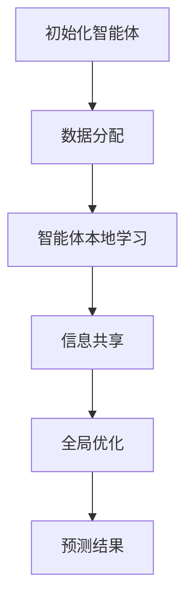
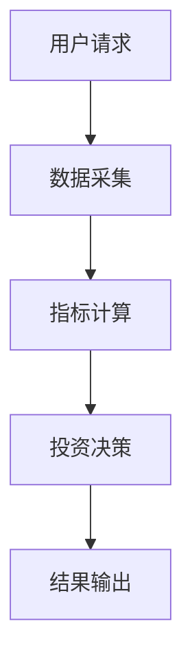

                 


# 基于多智能体的自适应经济周期指标在价值投资中的应用

## 第一部分: 背景介绍

### 第1章: 多智能体系统与经济周期指标概述

#### 1.1 多智能体系统的定义与特点
- 1.1.1 多智能体系统的定义
  - 多智能体系统（Multi-Agent System, MAS）是由多个相互作用的智能体组成的系统，这些智能体能够通过感知环境、协作和竞争来实现特定目标。
- 1.1.2 多智能体系统的特性
  - 分布式：智能体分布在整个系统中，各自独立。
  - 协作性：智能体之间通过协作完成复杂任务。
  - 反应性：智能体能够实时感知环境并做出反应。
  - 自适应性：智能体能够根据环境变化调整行为。
- 1.1.3 多智能体系统的优势与挑战
  - 优势：能够处理复杂问题，提高系统的可靠性和容错性。
  - 挑战：设计复杂，通信和协调成本高。

#### 1.2 经济周期指标的定义与作用
- 1.2.1 经济周期的基本概念
  - 经济周期包括繁荣、衰退、萧条和复苏四个阶段，反映了经济活动的波动。
- 1.2.2 经济周期指标的分类
  - 主要指标：GDP、失业率、工业生产指数。
  - 次要指标：消费者信心指数、企业利润、零售销售。
- 1.2.3 经济周期指标在金融分析中的应用
  - 用于预测市场趋势，指导投资决策。

#### 1.3 价值投资的基本原理
- 1.3.1 价值投资的核心理念
  - 以低于内在价值的价格买入优质资产，长期持有，获得收益。
- 1.3.2 价值投资的关键要素
  - 公司基本面分析：收入、利润、负债。
  - 市场情绪分析：市场恐慌或乐观时的买入机会。
- 1.3.3 价值投资与经济周期的关系
  - 经济周期影响资产价格，价值投资者寻找周期性低估的资产。

#### 1.4 多智能体系统在经济周期指标中的应用背景
- 1.4.1 经济周期指标的传统分析方法
  - 依赖经验丰富的分析师，分析存在主观性和滞后性。
- 1.4.2 多智能体系统在经济周期分析中的优势
  - 提高分析效率和准确性，能够处理大量数据。
- 1.4.3 多智能体系统与价值投资的结合
  - 利用MAS实时分析经济指标，辅助投资决策，提高投资效率。

## 第二部分: 核心概念与联系

### 第2章: 多智能体系统与自适应机制

#### 2.1 多智能体系统的协同学习
- 2.1.1 协同学习的基本原理
  - 智能体通过协作共享信息，共同完成任务。
- 2.1.2 多智能体协同学习的实现方法
  - 基于通信的协作：智能体之间共享信息。
  - 基于博弈论的协作：智能体通过竞争和协作达到平衡。
- 2.1.3 协同学习在经济周期指标分析中的应用
  - 不同智能体分别分析不同经济指标，协同得出综合结论。

#### 2.2 自适应机制的定义与实现
- 2.2.1 自适应机制的定义
  - 系统根据环境变化自动调整参数和策略。
- 2.2.2 自适应机制的实现步骤
  - 监测环境变化：实时收集经济指标数据。
  - 分析变化：判断是否需要调整模型参数。
  - 调整策略：优化投资组合，适应市场变化。
- 2.2.3 自适应机制与经济周期指标的关系
  - 通过自适应机制，系统能够及时捕捉经济周期变化，优化投资策略。

#### 2.3 多智能体系统与经济周期指标的关联
- 2.3.1 经济周期指标的数据特征
  - 多样性：涉及多个经济领域。
  - 动态性：指标随时间变化。
- 2.3.2 多智能体系统如何处理经济周期指标
  - 每个智能体负责一个或多个指标，协同分析整体经济状况。
- 2.3.3 多智能体系统的自适应性如何增强经济周期指标分析
  - 实时更新数据，快速响应市场变化。
  - 通过协作学习，提高分析准确性。

## 第三部分: 算法原理讲解

### 第3章: 多智能体协同学习算法

#### 3.1 算法概述
- 3.1.1 算法的目标
  - 通过多智能体协同学习，准确预测经济周期指标。
- 3.1.2 算法的核心思想
  - 每个智能体学习特定任务，通过协作提高整体性能。

#### 3.2 协同学习算法的实现步骤
- 3.2.1 初始化智能体
  - 设置智能体数量、初始参数。
- 3.2.2 数据分配
  - 将经济指标数据分配给不同智能体。
- 3.2.3 智能体本地学习
  - 每个智能体使用分配的数据进行训练。
- 3.2.4 信息共享
  - 智能体之间共享知识，更新全局模型。
- 3.2.5 全局优化
  - 根据共享信息优化模型参数。

#### 3.3 算法的数学模型
- 3.3.1 智能体本地学习模型
  - 使用神经网络进行预测，损失函数为均方误差。
  - $$ L_i = \frac{1}{n} \sum_{j=1}^n (y_j - \hat{y}_j)^2 $$
- 3.3.2 全局优化模型
  - 使用分布式优化算法，如异步更新。
  - $$ \theta_{new} = \theta_{old} + \eta \sum_{i=1}^k (\theta_i - \theta_{old}) $$

#### 3.4 算法流程图


## 第四部分: 系统分析与架构设计

### 第4章: 系统功能设计

#### 4.1 功能模块划分
- 数据采集模块：实时采集经济指标数据。
- 指标计算模块：分析经济指标，判断经济周期阶段。
- 投资决策模块：根据经济周期和价值评估结果，制定投资策略。

#### 4.2 系统功能流程图


## 第五部分: 项目实战

### 第5章: 项目实现

#### 5.1 环境搭建
- 安装Python、TensorFlow、Keras、Flask等库。
- 配置开发环境，如Jupyter Notebook或PyCharm。

#### 5.2 核心代码实现
- 智能体本地学习代码：
  ```python
  import numpy as np
  import tensorflow as tf

  class Agent:
      def __init__(self, input_dim):
          self.model = self.build_model(input_dim)
          self.optimizer = tf.keras.optimizers.Adam()

      def build_model(self, input_dim):
          model = tf.keras.Sequential([
              tf.keras.layers.Dense(64, activation='relu', input_dim=input_dim),
              tf.keras.layers.Dense(32, activation='relu'),
              tf.keras.layers.Dense(1)
          ])
          return model

      def train(self, x, y, epochs=100):
          for epoch in range(epochs):
              with tf.GradientTape() as tape:
                  y_pred = self.model(x)
                  loss = tf.reduce_mean(tf.square(y - y_pred))
              gradients = tape.gradient(loss, self.model.trainable_weights)
              self.optimizer.apply_gradients(zip(gradients, self.model.trainable_weights))
  ```

- 全局优化代码：
  ```python
  import numpy as np
  import tensorflow as tf

  class GlobalOptimizer:
      def __init__(self, agent):
          self.agent = agent

      def optimize(self, agents):
          average_weights = np.mean([agent.model.get_weights() for agent in agents], axis=0)
          self.agent.model.set_weights(average_weights)
  ```

#### 5.3 实际案例分析
- 数据预处理：收集和清洗经济指标数据。
- 模型训练：训练多智能体协同学习模型。
- 投资决策：根据模型预测结果，制定投资策略。

## 第六部分: 总结与展望

### 第6章: 总结

#### 6.1 最佳实践 tips
- 数据质量至关重要，确保数据来源可靠。
- 定期更新模型参数，保持模型适应性。
- 合理配置智能体数量，避免过载。

#### 6.2 小结
- 多智能体系统能够有效分析经济周期指标，辅助价值投资决策。
- 通过协同学习和自适应机制，提高投资策略的准确性和效率。

#### 6.3 注意事项
- 数据隐私和安全问题需重视。
- 模型的泛化能力有限，需结合市场实际情况进行调整。
- 系统维护和更新成本较高，需投入足够资源。

#### 6.4 拓展阅读
- 推荐阅读相关书籍《多智能体系统的协同学习》和《价值投资实战策略》。
- 关注最新研究成果，如强化学习在经济预测中的应用。

通过以上步骤，我们可以系统地设计和实现一个多智能体协同学习系统，用于自适应经济周期指标分析，辅助价值投资决策，提高投资效率和准确性。

