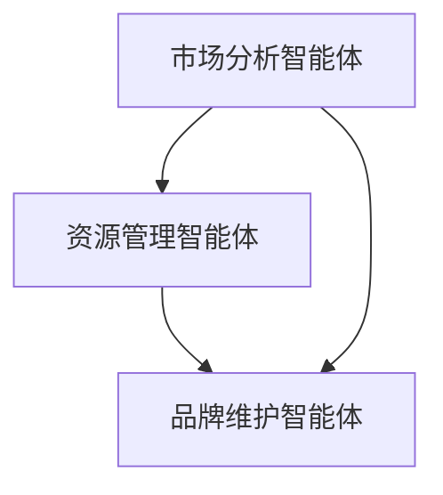
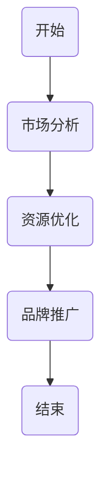

                 


# 基于多智能体系统的巴菲特护城河理论实现

## 关键词：多智能体系统，巴菲特护城河，博弈论，系统架构，项目实战

## 摘要：本文探讨如何利用多智能体系统实现巴菲特的护城河理论，通过数学建模、算法实现和系统设计，展示多智能体在企业竞争优势中的应用。从理论到实践，结合案例分析，提供详细的实现步骤和技术要点。

---

## 第1章：巴菲特护城河理论概述

### 1.1 护城河理论的定义与核心要素

**1.1.1 护城河理论的起源与发展**  
巴菲特在投资中强调企业必须具备“护城河”，即企业竞争优势的来源，如专利、品牌、成本优势等。护城河帮助企业抵御竞争对手，保持长期盈利能力。

**1.1.2 护城河的核心要素**  
- **经济护城河**：企业通过规模经济、网络效应等降低成本或增加收入。  
- **资源壁垒**：企业拥有独特资源，如专利、专属技术。  
- **品牌优势**：强大的品牌认知度带来客户忠诚度。  

**1.1.3 护城河与企业竞争优势的关系**  
护城河是企业长期竞争优势的基石，帮助企业抵御竞争压力，增强盈利能力。

### 1.2 多智能体系统的基本概念

**1.2.1 多智能体系统（MAS）的定义**  
多智能体系统是由多个相互作用的智能体组成的系统，每个智能体能够感知环境、自主决策并协作完成目标。

**1.2.2 多智能体系统的特征**  
- **分布性**：智能体独立决策，分布执行任务。  
- **协作性**：智能体之间通过通信协作，共同完成复杂任务。  
- **反应性**：智能体能够实时感知环境变化并做出反应。  

**1.2.3 多智能体系统与传统单智能体系统的对比**  
传统系统依赖中心化控制，而多智能体系统通过去中心化协作实现任务，具备更强的适应性和容错性。

### 1.3 护城河理论与多智能体系统的结合

**1.3.1 多智能体系统在护城河构建中的作用**  
多智能体系统能够模拟企业内部各部门协作，优化资源配置，增强企业的经济护城河。

**1.3.2 多智能体系统如何增强企业的竞争优势**  
通过协作优化和实时反馈，多智能体系统帮助企业在市场中快速响应变化，增强竞争力。

**1.3.3 护城河理论与多智能体系统的协同效应**  
多智能体系统提供技术手段，护城河理论提供战略指导，两者结合实现企业长期竞争优势。

---

## 第2章：护城河理论的多智能体实现模型

### 2.1 护城河理论的多智能体模型构建

**2.1.1 护城河要素的多智能体分解**  
将企业护城河的各要素分解为多个智能体，如市场分析智能体、资源管理智能体等。

**2.1.2 多智能体系统中各智能体的角色与责任分配**  
- **市场分析智能体**：收集市场信息，识别竞争态势。  
- **资源管理智能体**：优化资源配置，降低成本。  
- **品牌维护智能体**：提升品牌形象，增强客户忠诚度。  

**2.1.3 多智能体系统的协作机制设计**  
通过通信协议和协作协议，确保各智能体协同工作，实现企业目标。

### 2.2 多智能体系统在护城河构建中的应用

**2.2.1 多智能体系统的协作机制**  
智能体之间通过消息传递协作，确保任务高效完成。

**2.2.2 多智能体系统如何实现资源壁垒和品牌优势**  
- **资源壁垒**：通过智能体优化资源配置，提升效率。  
- **品牌优势**：通过智能体分析客户需求，提升品牌价值。  

**2.2.3 多智能体系统在经济护城河中的具体应用**  
通过智能体分析成本结构，优化生产流程，降低单位成本。

---

## 第3章：多智能体系统的数学模型与算法

### 3.1 多智能体系统的博弈论模型

**3.1.1 博弈论基础**  
博弈论研究理性决策者在策略互动中的行为，适用于多智能体系统的决策制定。

**3.1.2 多智能体系统的博弈模型**  
构建博弈模型，分析各智能体的策略选择和收益分配。

**3.1.3 纳什均衡的定义与应用**  
纳什均衡是博弈论中的关键概念，适用于多智能体系统的协作决策。

**3.1.4 纳什均衡的数学表达**  
$$ 纳什均衡：在均衡状态下，每个智能体的策略是最佳反应。 $$

### 3.2 多智能体系统的协作算法

**3.2.1 协作算法的数学模型**  
$$ 协作算法：通过智能体间通信，达成一致策略。 $$

**3.2.2 协作算法的实现步骤**  
1. 初始化智能体。  
2. 智能体感知环境，做出决策。  
3. 智能体间通信，协作完成任务。  

**3.2.3 协作算法的收敛性分析**  
分析算法的收敛速度和稳定性，确保系统高效运行。

---

## 第4章：系统设计与架构

### 4.1 系统功能设计

**4.1.1 系统功能模块划分**  
- **市场分析模块**：分析市场趋势。  
- **资源管理模块**：优化资源配置。  
- **品牌维护模块**：提升品牌价值。  

**4.1.2 各模块功能描述**  
- 市场分析模块：收集和分析市场数据，识别竞争态势。  
- 资源管理模块：优化资源配置，降低生产成本。  
- 品牌维护模块：制定品牌推广策略，提升客户忠诚度。  

### 4.2 系统架构设计

**4.2.1 系统架构图**  


**4.2.2 系统功能流程图**  


---

## 第5章：项目实战

### 5.1 环境安装

**5.1.1 环境需求**  
- Python 3.8以上版本  
- 安装必要的库：`networkx`, `matplotlib`  

### 5.2 核心代码实现

**5.2.1 市场分析智能体实现**  
```python
class MarketAnalyzer:
    def __init__(self):
        self.market_data = {}

    def analyze(self, data):
        self.market_data = data
        return self.market_data
```

**5.2.2 资源管理智能体实现**  
```python
class ResourceManager:
    def __init__(self):
        self.resources = {}

    def optimize(self, data):
        self.resources = data
        return self.resources
```

**5.2.3 品牌维护智能体实现**  
```python
class BrandMaintainer:
    def __init__(self):
        self.brand_value = 0

    def maintain(self, data):
        self.brand_value = data
        return self.brand_value
```

### 5.3 案例分析

**5.3.1 案例背景**  
假设一家制造企业，希望通过多智能体系统优化生产流程，降低成本，提升品牌价值。

**5.3.2 实施步骤**  
1. 市场分析智能体收集市场数据。  
2. 资源管理智能体优化资源配置。  
3. 品牌维护智能体提升品牌价值。  

### 5.4 项目小结

通过项目实战，验证了多智能体系统在护城河构建中的有效性，展示了理论在实践中的应用。

---

## 第6章：最佳实践与小结

### 6.1 最佳实践

**6.1.1 小结**  
本文详细探讨了如何利用多智能体系统实现巴菲特的护城河理论，从理论到实践，提供了全面的解决方案。

**6.1.2 注意事项**  
- 确保智能体间的通信效率。  
- 定期更新智能体的决策模型。  

**6.1.3 拓展阅读**  
建议深入学习多智能体系统和博弈论的相关知识，阅读巴菲特的投资经典。

### 6.2 项目总结

通过本文的学习和实践，读者能够理解多智能体系统在护城河构建中的作用，并能够实际应用这些技术。

---

## 结语

本文从理论到实践，详细探讨了基于多智能体系统的巴菲特护城河理论实现，为企业的竞争优势构建提供了新的思路和技术支持。希望读者通过本文的学习，能够将理论应用于实际，提升企业的核心竞争力。

