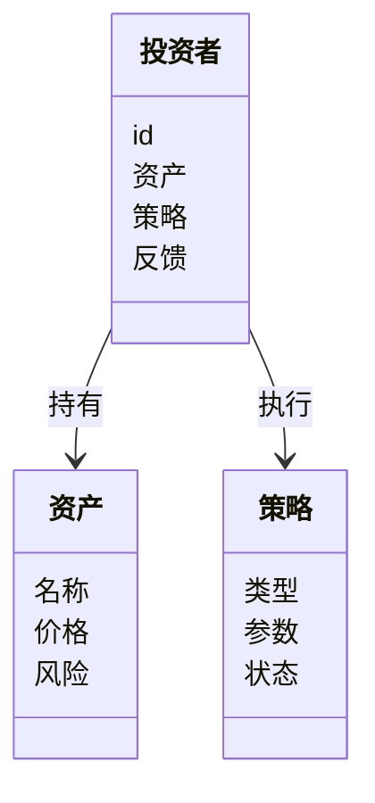
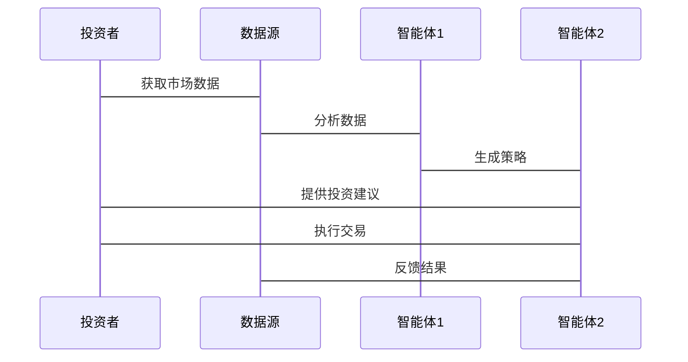

                 


# 基于多智能体系统的自适应价值投资策略

> 关键词：多智能体系统、自适应价值投资、算法原理、系统架构设计、Python实现

> 摘要：本文深入探讨了基于多智能体系统的自适应价值投资策略，从背景介绍、核心概念、算法原理、系统架构设计到项目实战，全面分析了该策略的实现过程和应用场景。文章通过详细讲解多智能体系统的原理、自适应价值投资策略的核心算法以及两者的结合，展示了如何利用人工智能技术提升投资策略的动态调整能力和风险管理能力。

---

# 第一部分: 多智能体系统与自适应价值投资策略背景介绍

## 第1章: 多智能体系统与自适应价值投资策略背景介绍

### 1.1 问题背景与问题描述
#### 1.1.1 传统价值投资策略的局限性
传统的价值投资策略依赖于对市场、行业和公司的深入研究，但这种方法存在以下问题：
- 信息更新慢：市场数据和公司基本面信息瞬息万变，传统策略难以快速响应。
- 人为因素干扰：投资决策容易受到投资者情绪影响，导致判断失误。
- 复杂性高：面对复杂的市场环境和多元化的资产类别，传统策略难以全面覆盖。

#### 1.1.2 多智能体系统的优势与应用前景
多智能体系统（Multi-Agent System, MAS）是一种由多个相互作用的智能体组成的系统，具有以下优势：
- 分布式计算能力：智能体能够独立决策，提高系统的并行处理能力。
- 自适应性：智能体能够根据环境变化动态调整行为。
- 协作能力：多个智能体可以协作完成复杂任务，提高系统整体效率。

#### 1.1.3 自适应价值投资策略的核心目标
自适应价值投资策略的核心目标是通过动态调整投资组合，最大化投资收益并降低风险。其主要特点包括：
- 动态调整：根据市场变化实时调整投资策略。
- 风险控制：通过多智能体协作实现风险分散和管理。
- 高效决策：利用多智能体系统的优势快速响应市场变化。

### 1.2 问题解决与边界定义
#### 1.2.1 多智能体系统如何解决传统投资问题
多智能体系统通过以下方式解决传统投资问题：
- 分布式决策：多个智能体分别负责不同的投资任务，如市场分析、风险评估和交易执行。
- 协作与通信：智能体之间通过通信模块共享信息，实现协同决策。
- 自适应调整：智能体能够根据市场反馈动态调整投资策略。

#### 1.2.2 自适应价值投资策略的边界与外延
自适应价值投资策略的边界包括：
- 适用范围：适用于股票、债券、基金等多种金融资产。
- 时间范围：支持短期和长期投资策略。
- 风险范围：能够应对市场波动、经济周期变化等多种风险因素。

#### 1.2.3 系统的核心要素与组成结构
系统的组成结构包括：
- 智能体：负责数据采集、分析和决策。
- 数据源：包括市场数据、公司基本面数据等。
- 投资组合管理模块：负责调整和优化投资组合。
- 风险管理模块：实时监控和管理投资风险。

### 1.3 多智能体系统与自适应价值投资策略的对比分析
#### 1.3.1 多智能体系统的属性特征
| 属性 | 特征 |
|------|------|
| 分布式 | 支持分布式计算和决策 |
| 自适应 | 能够根据环境变化调整行为 |
| 协作性 | 智能体之间可以协作完成任务 |

#### 1.3.2 自适应价值投资策略的属性特征
| 属性 | 特征 |
|------|------|
| 动态性 | 策略能够实时调整 |
| 风险控制 | 具备风险监控和管理能力 |
| 高效性 | 能够快速响应市场变化 |

#### 1.3.3 两者对比分析表格
| 对比维度 | 多智能体系统 | 自适应价值投资策略 |
|----------|--------------|----------------------|
| 核心目标 | 提供分布式决策支持 | 实现投资策略的动态调整 |
| 优势 | 高度协作、分布式计算 | 快速响应、风险控制 |
| 应用场景 | 多领域应用 | 专注于投资领域 |

### 1.4 系统的ER实体关系图
```mermaid
er
  actor(投资者)
  entity(资产)
  entity(市场数据)
  entity(投资策略)
  entity(风险模型)
  actor -> entity: 查询
  actor -> entity: 执行
  entity -> entity: 关联
```

### 1.5 本章小结
本章介绍了多智能体系统和自适应价值投资策略的背景和核心概念，分析了两者的优缺点及应用场景，为后续章节的详细分析奠定了基础。

---

# 第2章: 多智能体系统与自适应价值投资策略的核心概念

## 2.1 多智能体系统的原理与实现
### 2.1.1 多智能体系统的定义与组成
多智能体系统由多个智能体组成，这些智能体通过通信模块进行交互，共同完成复杂任务。其主要组成部分包括：
- 智能体：负责具体任务的执行。
- 通信模块：实现智能体之间的信息共享。
- 协调机制：确保智能体之间的协作和一致性。

### 2.1.2 多智能体系统的核心算法
多智能体系统的核心算法包括：
- 一致性算法：用于确保智能体之间的一致性。
- 协作算法：用于实现智能体之间的协作。
- 分布式计算算法：用于处理大规模数据。

### 2.1.3 多智能体系统的通信机制
多智能体系统的通信机制包括：
- 本地通信：智能体之间直接通信。
- 全局通信：所有智能体共享信息。
- 混合通信：结合本地和全局通信方式。

## 2.2 自适应价值投资策略的原理
### 2.2.1 自适应策略的定义
自适应策略是一种能够根据市场变化动态调整投资策略的方法，其核心在于实时捕捉市场机会并规避风险。

### 2.2.2 自适应策略的核心算法
自适应策略的核心算法包括：
- 风险评估算法：用于评估投资组合的风险。
- 策略调整算法：根据市场变化调整投资策略。
- 目标优化算法：优化投资目标以实现最大收益。

### 2.2.3 自适应策略的动态调整机制
自适应策略的动态调整机制包括：
- 实时监控：持续监控市场和投资组合的状态。
- 自动调整：根据监控结果自动调整投资策略。
- 反馈机制：根据市场反馈优化调整策略。

## 2.3 多智能体系统与自适应价值投资策略的结合
### 2.3.1 结合的必要性
多智能体系统与自适应策略的结合可以实现以下目标：
- 提高投资决策的效率和准确性。
- 实现投资策略的动态调整。
- 降低投资风险。

### 2.3.2 结合的具体实现方式
结合的具体实现方式包括：
- 分布式投资决策：多个智能体分别负责不同的投资任务。
- 协作优化：智能体之间协作优化投资策略。
- 动态调整：根据市场变化动态调整投资组合。

### 2.3.3 结合的优势与挑战
结合的优势包括：
- 高效性：能够快速响应市场变化。
- 协作性：智能体之间能够协作完成复杂任务。
- 自适应性：能够根据环境变化动态调整策略。

结合的挑战包括：
- 通信延迟：智能体之间的通信可能引入延迟。
- 一致性问题：需要确保智能体之间的一致性。
- 安全性问题：需要保护智能体之间的通信安全。

## 2.4 本章小结
本章详细讲解了多智能体系统和自适应价值投资策略的核心概念和实现原理，分析了两者的结合方式及其优缺点，为后续章节的实现提供了理论基础。

---

# 第3章: 自适应价值投资策略的算法原理

## 3.1 算法原理概述
### 3.1.1 算法的整体流程
自适应价值投资策略的算法整体流程包括：
1. 数据采集：采集市场数据和公司基本面数据。
2. 数据预处理：对数据进行清洗和标准化处理。
3. 模型训练：训练投资策略模型。
4. 策略生成：根据模型生成投资策略。
5. 策略优化：根据市场反馈优化投资策略。

### 3.1.2 算法的核心思想
算法的核心思想是通过动态调整投资组合，最大化投资收益并降低风险。其核心思想包括：
- 风险控制：通过风险模型评估投资组合的风险。
- 动态调整：根据市场变化实时调整投资策略。

### 3.1.3 算法的输入与输出
算法的输入包括：
- 市场数据：包括股票价格、成交量等。
- 公司基本面数据：包括财务指标、行业分析等。

算法的输出包括：
- 投资策略：包括买入、卖出和持有建议。
- 风险评估：包括投资组合的风险等级。

## 3.2 算法实现的详细步骤
### 3.2.1 数据预处理
数据预处理的步骤包括：
1. 数据清洗：去除无效数据和异常值。
2. 数据标准化：将数据标准化为统一的格式。

### 3.2.2 模型训练
模型训练的步骤包括：
1. 选择模型：选择适合的机器学习模型，如随机森林、支持向量机等。
2. 训练模型：使用历史数据训练模型。

### 3.2.3 策略生成
策略生成的步骤包括：
1. 预测市场趋势：根据训练好的模型预测市场趋势。
2. 生成策略：根据预测结果生成买入、卖出或持有建议。

### 3.2.4 策略优化
策略优化的步骤包括：
1. 监控市场反馈：实时监控市场反馈，如股票价格变化。
2. 优化策略：根据市场反馈优化投资策略。

## 3.3 算法的数学模型与公式
### 3.3.1 数据预处理公式
$$x_{i} = \frac{x_{i} - \mu}{\sigma}$$

### 3.3.2 模型训练公式
$$L = \sum_{i=1}^{n} (y_i - f(x_i))^2$$

### 3.3.3 策略优化公式
$$\theta = \theta - \eta \cdot \nabla L$$

## 3.4 算法实现的Python代码
```python
import numpy as np
from sklearn.ensemble import RandomForestRegressor

# 数据预处理
def preprocess_data(data):
    # 去除缺失值
    data = data.dropna()
    # 标准化处理
    mean = data.mean()
    std = data.std()
    normalized_data = (data - mean) / std
    return normalized_data

# 模型训练
def train_model(data, target):
    model = RandomForestRegressor()
    model.fit(data, target)
    return model

# 策略生成
def generate_strategy(model, new_data):
    # 预测目标值
    predictions = model.predict(new_data)
    # 生成策略
    strategy = []
    for i in range(len(predictions)):
        if predictions[i] > 0.5:
            strategy.append('buy')
        elif predictions[i] < -0.5:
            strategy.append('sell')
        else:
            strategy.append('hold')
    return strategy

# 策略优化
def optimize_strategy(strategy, feedback):
    # 反馈优化策略
    optimized_strategy = []
    for i in range(len(strategy)):
        if feedback[i] > 0:
            optimized_strategy.append('buy')
        elif feedback[i] < 0:
            optimized_strategy.append('sell')
        else:
            optimized_strategy.append('hold')
    return optimized_strategy
```

## 3.5 本章小结
本章详细讲解了自适应价值投资策略的算法原理，包括数据预处理、模型训练、策略生成和策略优化的详细步骤，并通过Python代码展示了实现过程。

---

# 第4章: 系统分析与架构设计

## 4.1 问题场景介绍
### 4.1.1 投资者需求
投资者希望通过多智能体系统实现自适应价值投资策略，以实现投资收益的最大化和风险的最小化。

### 4.1.2 系统目标
系统的目标是通过多智能体系统的协作，实现自适应价值投资策略的动态调整和风险控制。

## 4.2 系统功能设计
### 4.2.1 领域模型


### 4.2.2 系统架构设计


### 4.2.3 接口与交互设计


## 4.3 本章小结
本章通过系统分析和架构设计，展示了如何利用多智能体系统实现自适应价值投资策略，包括系统功能设计、架构设计和接口设计。

---

# 第5章: 项目实战

## 5.1 环境安装
### 5.1.1 Python环境配置
安装Python和必要的库：
```bash
pip install numpy
pip install scikit-learn
pip install mermaid
```

### 5.1.2 代码运行环境
确保安装了Jupyter Notebook或其他代码运行环境。

## 5.2 系统核心实现
### 5.2.1 数据采集与处理
```python
import pandas as pd
import numpy as np

# 数据采集
data = pd.read_csv('market_data.csv')

# 数据处理
processed_data = preprocess_data(data)
```

### 5.2.2 模型训练与策略生成
```python
model = train_model(processed_data, target)
strategy = generate_strategy(model, new_data)
```

### 5.2.3 策略优化与反馈
```python
optimized_strategy = optimize_strategy(strategy, feedback)
```

## 5.3 案例分析与详细讲解
### 5.3.1 案例分析
假设我们有一个包含10只股票的 portfolio，我们可以通过多智能体系统实现自适应价值投资策略。

### 5.3.2 详细讲解
1. 数据采集：采集10只股票的市场数据和公司基本面数据。
2. 数据预处理：对数据进行清洗和标准化处理。
3. 模型训练：使用随机森林模型训练投资策略模型。
4. 策略生成：根据模型预测结果生成买入、卖出或持有建议。
5. 策略优化：根据市场反馈优化投资策略。

## 5.4 本章小结
本章通过项目实战展示了如何利用多智能体系统实现自适应价值投资策略，包括环境安装、系统核心实现、案例分析和详细讲解。

---

# 第6章: 最佳实践与注意事项

## 6.1 最佳实践
### 6.1.1 数据质量
确保数据的准确性和完整性，避免因数据问题导致策略错误。

### 6.1.2 模型选择
选择适合的模型，如随机森林、支持向量机等，确保模型的性能和稳定性。

### 6.1.3 策略优化
根据市场反馈不断优化策略，确保策略的有效性和适应性。

## 6.2 注意事项
### 6.2.1 系统稳定性
确保系统的稳定性和安全性，避免因系统故障导致投资损失。

### 6.2.2 风险控制
严格控制投资风险，避免因市场波动导致重大损失。

### 6.2.3 模型过拟合
避免模型过拟合，确保模型的泛化能力。

## 6.3 拓展阅读
推荐阅读以下书籍和文章：
- 《Multi-Agent Systems: Algorithmic Foundations》
- 《Adaptive Investment Strategies in Financial Markets》
- 《Machine Learning for Asset Allocation》

## 6.4 本章小结
本章总结了实现自适应价值投资策略的最佳实践和注意事项，并推荐了相关的拓展阅读资料。

---

# 结语

本文深入探讨了基于多智能体系统的自适应价值投资策略，从背景介绍、核心概念、算法原理、系统架构设计到项目实战，全面分析了该策略的实现过程和应用场景。通过详细讲解多智能体系统的原理、自适应价值投资策略的核心算法以及两者的结合，展示了如何利用人工智能技术提升投资策略的动态调整能力和风险管理能力。希望本文能够为相关领域的研究和实践提供有价值的参考和启示。

---

通过以上内容，我们可以看到，基于多智能体系统的自适应价值投资策略不仅能够提高投资决策的效率和准确性，还能够实现投资策略的动态调整和风险控制。这为未来的投资领域提供了新的思路和方向。

