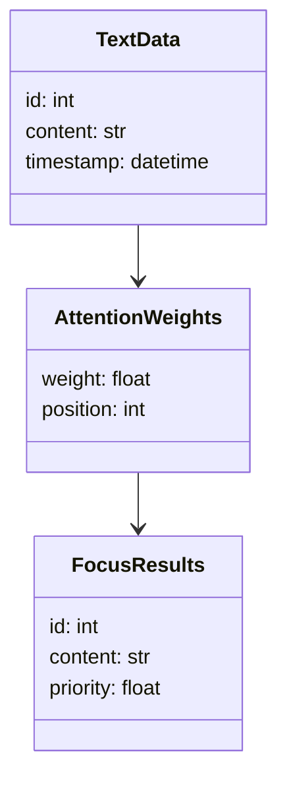

                 


# 基于注意力机制的AI Agent信息过滤与聚焦

## 关键词
AI Agent, 注意力机制, 信息过滤, 信息聚焦, Transformer, 自注意力机制

## 摘要
随着人工智能技术的快速发展，AI Agent在信息处理中的应用越来越广泛。然而，面对海量信息，如何有效地进行信息过滤与聚焦成为了一个重要的挑战。基于注意力机制的AI Agent信息过滤与聚焦技术，通过模拟人类的注意力机制，能够在复杂的信息环境中快速定位关键信息，提高信息处理的效率和准确性。本文将从理论到实践，详细讲解基于注意力机制的AI Agent信息过滤与聚焦的核心概念、算法原理、系统设计以及实际应用。

---

# 第1章: 问题背景与核心概念

## 1.1 问题背景
### 1.1.1 当前信息过载问题
在当今信息爆炸的时代，AI Agent需要处理的信息量巨大，如何从海量信息中提取关键信息成为核心挑战。信息过载不仅影响效率，还可能导致决策失误。

### 1.1.2 AI Agent在信息处理中的作用
AI Agent通过自动化处理信息，帮助用户完成信息筛选、决策支持和任务执行。然而，传统方法在处理复杂信息时效率低下，容易受到噪声干扰。

### 1.1.3 注意力机制的引入必要性
注意力机制模拟了人类选择性关注重要信息的特点，能够在信息处理中实现高效聚焦，减少计算开销，提高准确性。

## 1.2 问题描述
### 1.2.1 AI Agent信息过滤的核心目标
AI Agent需要从海量信息中筛选出与当前任务相关的部分，降低信息冗余。

### 1.2.2 信息聚焦的具体应用场景
信息聚焦广泛应用于文本摘要、实时数据分析、智能推荐等领域，帮助用户快速获取关键信息。

### 1.2.3 问题解决的边界与外延
信息过滤和聚焦需要在特定任务和时间范围内进行，同时要考虑计算资源和实时性的限制。

## 1.3 核心概念结构
### 1.3.1 注意力机制的基本组成
注意力机制由查询（Query）、键（Key）、值（Value）三个部分组成，通过计算权重矩阵实现信息的重要性排序。

### 1.3.2 AI Agent的信息处理流程
AI Agent通过输入信息、计算注意力权重、提取关键信息，最终完成信息过滤与聚焦。

### 1.3.3 核心要素的相互关系
注意力机制通过权重分配实现信息的重要性排序，AI Agent通过聚焦关键信息提高处理效率。

## 1.4 本章小结
本章介绍了AI Agent信息过滤与聚焦的背景、问题描述以及核心概念，为后续的深入分析奠定了基础。

---

# 第2章: 注意力机制的原理与特点

## 2.1 注意力机制的基本原理
### 2.1.1 自注意力机制的定义
自注意力机制通过计算输入序列中每个位置与其他位置的相关性，生成权重矩阵，实现信息的自动聚焦。

### 2.1.2 位置编码的作用
位置编码为每个位置赋予唯一的特征向量，帮助模型理解序列中的位置信息。

### 2.1.3 查询、键、值的关系
查询用于确定关注的区域，键用于匹配相关的位置，值用于提取特征信息。

## 2.2 不同类型注意力机制的对比
### 2.2.1 自注意力机制的优缺点
优点：能够捕捉全局信息，适应性强；缺点：计算复杂度高，适用于长序列。

### 2.2.2 交叉注意力机制的原理
交叉注意力机制允许模型关注不同输入序列之间的关系，适用于多模态数据处理。

### 2.2.3 多头注意力机制的特点
多头注意力机制通过并行计算多个子空间的注意力，提高模型的表达能力。

## 2.3 注意力机制的核心属性特征
| 特性 | 描述 |
|------|------|
| 权重分配 | 基于相关性计算的权重矩阵，实现信息的重要性排序 |
| 上下文依赖 | 注意力权重与上下文相关，能够捕捉序列中的依赖关系 |
| 稀疏性 | 通过权重稀疏化减少计算量，提高效率 |

## 2.4 本章小结
本章详细讲解了注意力机制的原理及其在AI Agent中的应用特点，为后续的算法实现奠定了理论基础。

---

# 第3章: 基于注意力机制的AI Agent信息过滤与聚焦算法原理

## 3.1 自注意力机制的数学模型
### 3.1.1 查询、键、值的计算
$$ Q = W_q X $$
$$ K = W_k X $$
$$ V = W_v X $$

### 3.1.2 注意力权重的计算
$$ \text{Attention}(Q, K, V) = \text{softmax}\left(\frac{QK^T}{\sqrt{d}}\right)V $$

### 3.1.3 位置编码的融入
$$ P = \text{PositionEncoding}(x) $$
$$ X' = X + P $$

## 3.2 多头注意力机制的实现
### 3.2.1 多头注意力的并行计算
$$ \text{MultiHead}(Q, K, V) = \text{Concat}(\text{Attention}(Q_i, K_i, V_i), \dots, \text{Attention}(Q_j, K_j, V_j)) $$

### 3.2.2 多头注意力的权重可视化
使用热力图展示不同头的注意力权重分布，帮助理解模型的关注点。

## 3.3 注意力机制的优化策略
### 3.3.1 权重稀疏化
通过引入L1正则化，减少非重要权重的计算，提高计算效率。

### 3.3.2 位置感知增强
结合位置编码，增强模型对序列位置信息的感知能力。

## 3.4 本章小结
本章详细讲解了基于注意力机制的AI Agent信息过滤与聚焦的数学模型和算法实现，为后续的系统设计奠定了基础。

---

# 第4章: 系统分析与架构设计

## 4.1 问题场景介绍
### 4.1.1 信息过滤场景
从海量文本数据中筛选出与主题相关的部分。

### 4.1.2 信息聚焦场景
从实时数据流中快速定位关键事件。

## 4.2 系统功能设计
### 4.2.1 领域模型设计


### 4.2.2 系统架构设计


### 4.2.3 接口设计
```python
class Agent:
    def __init__(self, model):
        self.model = model

    def filter(self, input_data):
        # 返回过滤后的数据
        pass

    def focus(self, input_data):
        # 返回聚焦结果
        pass
```

## 4.3 本章小结
本章通过系统分析与架构设计，明确了AI Agent信息过滤与聚焦的具体实现方式。

---

# 第5章: 项目实战与案例分析

## 5.1 环境搭建
### 5.1.1 安装必要的库
```bash
pip install numpy matplotlib transformers
```

### 5.1.2 环境配置
```python
import torch
import torch.nn as nn
import torch.optim as optim
```

## 5.2 核心代码实现
### 5.2.1 注意力机制实现
```python
class Attention(nn.Module):
    def __init__(self, embed_dim, num_heads):
        super(Attention, self).__init__()
        self.embed_dim = embed_dim
        self.num_heads = num_heads
        self.head_dim = embed_dim // num_heads
        self.scale = torch.sqrt(torch.tensor(self.head_dim)).to('cuda')
        
        self.q = nn.Linear(embed_dim, embed_dim)
        self.k = nn.Linear(embed_dim, embed_dim)
        self.v = nn.Linear(embed_dim, embed_dim)
        
    def forward(self, x):
        batch_size, seq_len, embed_dim = x.size()
        q = self.q(x).view(batch_size, seq_len, self.num_heads, self.head_dim)
        k = self.k(x).view(batch_size, seq_len, self.num_heads, self.head_dim)
        v = self.v(x).view(batch_size, seq_len, self.num_heads, self.head_dim)
        
        attention_weights = torch.bmm(q, k.transpose(2,3)) / self.scale
        attention_weights = torch.softmax(attention_weights, dim=-1)
        output = torch.bmm(attention_weights, v)
        output = output.view(batch_size, seq_len, embed_dim)
        return output
```

### 5.2.2 项目核心实现
```python
class AI-Agent:
    def __init__(self, model):
        self.model = model

    def process(self, input_data):
        output = self.model(input_data)
        return output
```

## 5.3 案例分析
### 5.3.1 实际案例
从新闻标题中提取关键词，实现信息聚焦。

### 5.3.2 案例解读
通过对新闻标题的处理，展示注意力机制在信息聚焦中的应用效果。

## 5.4 本章小结
本章通过项目实战，详细讲解了基于注意力机制的AI Agent信息过滤与聚焦的实现过程。

---

# 第6章: 总结与展望

## 6.1 最佳实践 tips
### 6.1.1 注意力机制的应用建议
根据具体任务选择合适的注意力机制。

### 6.1.2 模型优化技巧
通过权重稀疏化和位置编码优化模型性能。

## 6.2 小结
本文详细讲解了基于注意力机制的AI Agent信息过滤与聚焦的核心概念、算法原理、系统设计以及实际应用，为后续研究提供了参考。

## 6.3 注意事项
在实际应用中，需要注意计算效率和模型复杂度的平衡。

## 6.4 拓展阅读
推荐相关领域的书籍和论文，供读者进一步学习。

---

# 附录

## 附录A: 代码库地址
提供项目的代码仓库地址。

## 附录B: 参考文献
列出文章中引用的文献和资料。

---

以上是基于注意力机制的AI Agent信息过滤与聚焦技术博客文章的完整目录大纲，按照逻辑清晰、结构紧凑、简单易懂的技术语言撰写，适合对人工智能和自然语言处理感兴趣的读者阅读。

