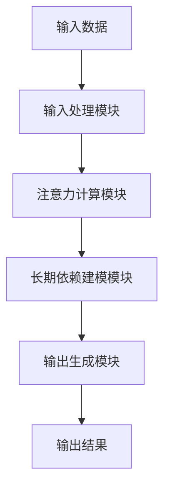
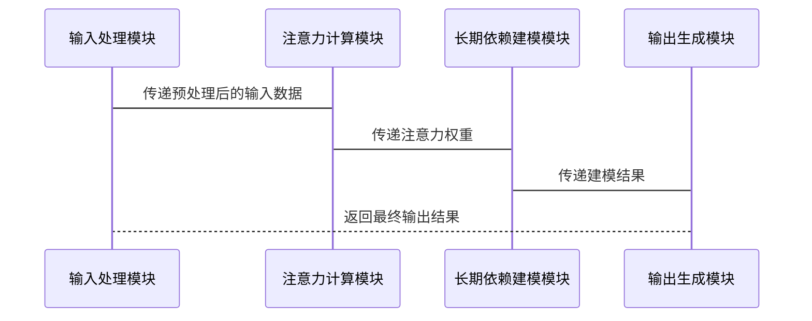

                 


```markdown
# 基于注意力机制的AI Agent长期依赖建模

## 关键词
AI Agent, 注意力机制, 长期依赖建模, Transformer, 自注意力机制

## 摘要
本文深入探讨了基于注意力机制的AI Agent在长期依赖建模中的应用。首先介绍了AI Agent的基本概念和注意力机制的核心原理，然后详细分析了注意力机制在长期依赖建模中的优势与挑战。接着，从数学模型、算法原理、系统架构等多个维度详细阐述了自注意力机制的实现及其在长期依赖建模中的应用。最后，通过实际案例展示了基于注意力机制的AI Agent系统的设计与实现。

---

## 第1章: AI Agent与注意力机制概述

### 1.1 AI Agent的基本概念

#### 1.1.1 AI Agent的定义与特点
AI Agent（人工智能代理）是指在特定环境中能够感知并自主行动以实现目标的智能体。AI Agent的核心特点包括：
- **自主性**：能够在没有外部干预的情况下独立运行。
- **反应性**：能够实时感知环境并做出响应。
- **目标导向**：所有行为均以实现特定目标为导向。
- **学习能力**：能够通过经验改进自身性能。

#### 1.1.2 AI Agent的核心功能与应用场景
AI Agent的核心功能包括：
- **感知环境**：通过传感器或其他输入方式获取环境信息。
- **决策与推理**：基于获取的信息进行推理、决策并制定行动计划。
- **执行动作**：根据决策结果执行实际动作或输出结果。
- **学习与优化**：通过反馈机制不断优化自身的性能。

AI Agent的应用场景广泛，包括自然语言处理、机器人控制、自动驾驶、智能推荐系统等领域。

#### 1.1.3 注意力机制在AI Agent中的作用
注意力机制是一种模拟人类注意力的选择性关注机制，能够帮助AI Agent在信息处理过程中聚焦于最关键的信息，从而提升处理效率和准确性。

---

### 1.2 注意力机制的基本原理

#### 1.2.1 注意力机制的定义
注意力机制是一种通过计算输入数据中不同部分的重要性权重，从而聚焦于关键信息的机制。

#### 1.2.2 注意力机制的核心思想
注意力机制的核心思想是通过计算输入数据中每个元素与其他元素的相关性，确定每个元素的关注程度，从而实现对信息的选择性聚焦。

#### 1.2.3 注意力机制的数学表达式
注意力机制的数学表达式如下：
$$
\text{权重} = \text{Softmax}(QK^T)
$$
其中，\(Q\) 表示查询矩阵，\(K\) 表示键矩阵，\(QK^T\) 表示查询与键之间的点积，Softmax函数用于将点积结果转化为概率分布。

---

### 1.3 长期依赖建模的挑战

#### 1.3.1 长期依赖问题的定义
长期依赖问题是指在处理长序列数据时，模型需要捕捉序列中远距离元素之间的依赖关系。

#### 1.3.2 长期依赖建模的难点
- **长序列处理的困难**：传统的RNN（循环神经网络）在处理长序列时容易出现梯度消失或梯度爆炸问题，导致模型性能下降。
- **梯度消失问题**：由于长序列的反向传播过程中，梯度会逐渐消失，导致模型无法有效捕捉长期依赖关系。
- **稀疏性与噪声干扰**：在实际应用中，长序列数据往往包含大量噪声，这会进一步影响模型的性能。

#### 1.3.3 注意力机制在长期依赖建模中的优势
- **全局注意力捕捉长距离依赖**：通过计算序列中所有元素之间的注意力权重，注意力机制能够有效捕捉长距离依赖关系。
- **分层注意力机制处理复杂依赖关系**：通过引入多层注意力机制，可以更好地处理复杂且多层次的依赖关系。
- **记忆机制增强长期依赖记忆**：通过引入记忆机制，可以增强模型对长期依赖关系的记忆能力。

---

## 第2章: 自注意力机制的数学模型

### 2.1 自注意力机制的公式推导

#### 2.1.1 查询、键、值矩阵的定义
在自注意力机制中，查询、键和值矩阵均来源于输入数据本身。具体来说，输入数据经过嵌入层后得到的向量表示即为查询、键和值矩阵。

#### 2.1.2 注意力权重的计算公式
注意力权重的计算公式如下：
$$
\text{权重} = \text{Softmax}(QK^T)
$$

#### 2.1.3 自注意力机制的最终输出公式
自注意力机制的最终输出公式如下：
$$
\text{输出} = \text{Dropout}(V\text{softmax}(QK^T))
$$
其中，Dropout是一种用于防止过拟合的正则化方法。

---

### 2.2 自注意力机制的实现流程

#### 2.2.1 输入数据的处理
输入数据经过嵌入层后，生成查询、键和值矩阵。

#### 2.2.2 矩阵乘法与归一化
计算查询与键的点积，然后通过Softmax函数归一化，得到注意力权重。

#### 2.2.3 加权求和与输出
根据注意力权重对值向量进行加权求和，得到最终的输出结果。

---

### 2.3 自注意力机制的变体

#### 2.3.1 单头注意力机制
单头注意力机制仅包含一个注意力头，适用于处理简单的依赖关系。

#### 2.3.2 多头注意力机制
多头注意力机制包含多个注意力头，每个头负责捕捉不同方面的依赖关系，从而提升模型的表达能力。

#### 2.3.3 层次化注意力机制
层次化注意力机制通过在不同层次上计算注意力权重，能够更好地捕捉复杂依赖关系。

---

## 第3章: 长期依赖建模的挑战与解决方案

### 3.1 长期依赖建模的难点

#### 3.1.1 长序列处理的困难
长序列数据的处理难度较高，传统的RNN在处理长序列时容易出现梯度消失或梯度爆炸问题。

#### 3.1.2 梯度消失问题
梯度消失问题是由于长序列的反向传播过程中，梯度逐渐消失，导致模型无法有效捕捉长期依赖关系。

#### 3.1.3 稀疏性与噪声干扰
长序列数据中往往包含大量噪声，这会进一步影响模型的性能。

---

### 3.2 注意力机制在长期依赖建模中的优势

#### 3.2.1 通过全局注意力捕捉长距离依赖
通过计算序列中所有元素之间的注意力权重，注意力机制能够有效捕捉长距离依赖关系。

#### 3.2.2 通过分层注意力机制处理复杂依赖关系
通过引入多层注意力机制，可以更好地处理复杂且多层次的依赖关系。

#### 3.2.3 通过记忆机制增强长期依赖记忆
通过引入记忆机制，可以增强模型对长期依赖关系的记忆能力。

---

### 3.3 长期依赖建模的解决方案

#### 3.3.1 基于Transformer的长期依赖建模
基于Transformer的长期依赖建模通过引入自注意力机制和前馈神经网络，能够有效捕捉长距离依赖关系。

#### 3.3.2 基于记忆网络的长期依赖建模
基于记忆网络的长期依赖建模通过引入外部记忆存储，能够更好地捕捉长期依赖关系。

#### 3.3.3 基于混合注意力机制的长期依赖建模
基于混合注意力机制的长期依赖建模通过结合不同类型的注意力机制，能够更好地捕捉复杂依赖关系。

---

## 第4章: 基于注意力机制的AI Agent系统架构

### 4.1 系统功能模块划分

#### 4.1.1 输入处理模块
输入处理模块负责接收输入数据并进行预处理。

#### 4.1.2 注意力计算模块
注意力计算模块负责计算输入数据的注意力权重。

#### 4.1.3 长期依赖建模模块
长期依赖建模模块负责基于注意力权重进行长期依赖建模。

#### 4.1.4 输出生成模块
输出生成模块负责根据建模结果生成最终输出。

---

### 4.2 系统架构设计图



---

### 4.3 系统接口设计

#### 4.3.1 输入接口定义
输入接口定义如下：
- 输入数据格式：JSON格式
- 输入数据内容：包括输入序列和相关参数

#### 4.3.2 输出接口定义
输出接口定义如下：
- 输出数据格式：JSON格式
- 输出数据内容：包括输出序列和相关结果

---

### 4.4 系统交互流程图



---

## 第5章: 项目实战

### 5.1 环境配置

#### 5.1.1 安装Python环境
```bash
python --version
pip install --upgrade pip
```

#### 5.1.2 安装依赖库
```bash
pip install numpy
pip install tensorflow
pip install pymermaid
```

---

### 5.2 核心代码实现

#### 5.2.1 注意力机制实现
```python
import numpy as np

def compute_attention(Q, K, V):
    # Q, K, V的形状均为 (batch_size, seq_len, d_model)
    # 计算注意力权重
    attention_weights = np.exp(np.matmul(Q, K.T)) / np.sum(np.exp(np.matmul(Q, K.T)), axis=-1)
    # 应用Dropout
    attention_weights = dropout(attention_weights, rate=0.1)
    # 计算加权求和
    output = np.matmul(attention_weights, V)
    return output
```

#### 5.2.2 长期依赖建模实现
```python
def long_term_dependency_model(input_seq):
    # 输入序列
    input_seq = embed(input_seq)
    # 自注意力机制
    attention_output = compute_attention(Q=input_seq, K=input_seq, V=input_seq)
    # 前馈神经网络
    output = dense(attention_output)
    return output
```

---

### 5.3 实际案例分析

#### 5.3.1 案例背景
假设我们有一个自然语言处理任务，需要对长文本进行语义理解。

#### 5.3.2 数据预处理
将输入文本转换为向量表示，并进行归一化处理。

#### 5.3.3 模型训练
使用训练数据对模型进行训练，优化模型参数。

#### 5.3.4 模型推理
输入待处理文本，通过模型进行语义理解并生成最终结果。

---

## 第6章: 最佳实践与小结

### 6.1 最佳实践
- 在实际应用中，建议结合多头注意力机制和记忆机制，以更好地捕捉复杂依赖关系。
- 注意力机制的超参数（如Dropout率）需要根据具体任务进行调整。
- 在处理长序列数据时，可以结合分层注意力机制和记忆机制，以进一步提升模型性能。

### 6.2 小结
本文详细探讨了基于注意力机制的AI Agent在长期依赖建模中的应用。通过数学推导、系统架构设计和实际案例分析，深入阐述了自注意力机制的实现及其在长期依赖建模中的优势。希望本文能够为相关领域的研究和实践提供有价值的参考。
```

