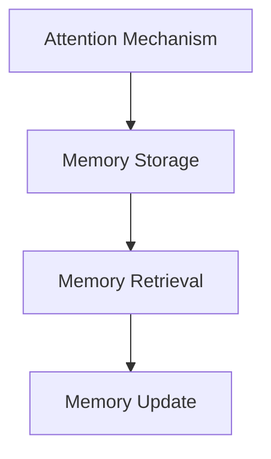
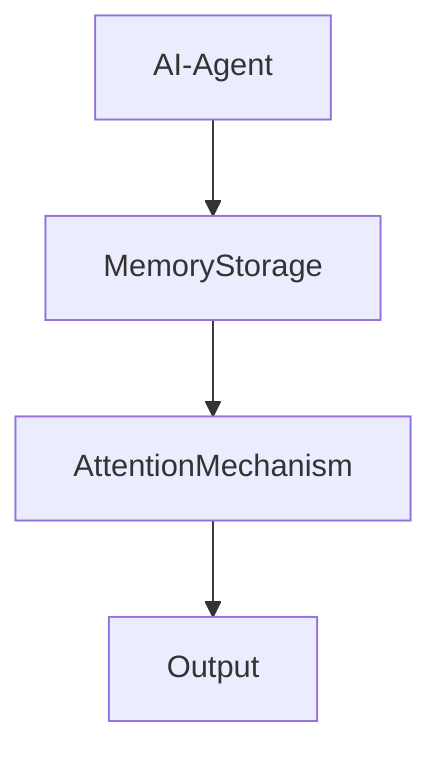
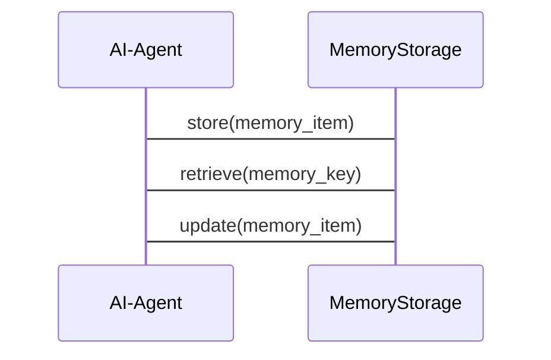
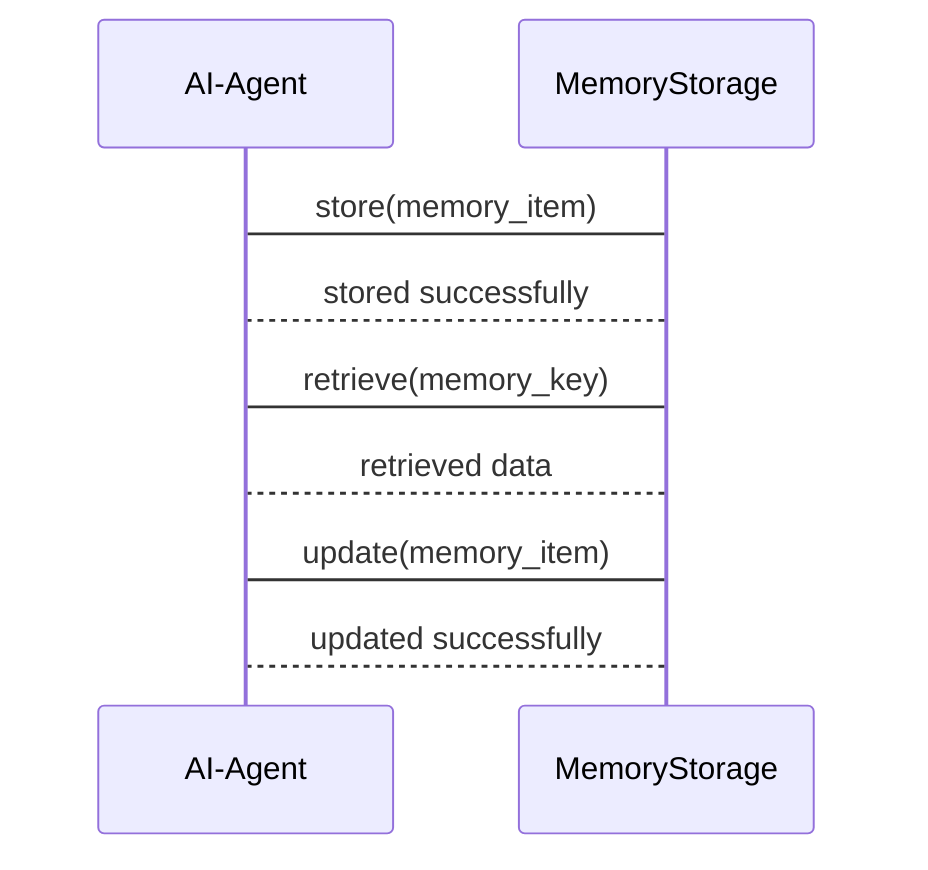

                 


# 基于注意力机制的AI Agent长期记忆管理

## 关键词：
- 注意力机制
- AI Agent
- 长期记忆管理
- 深度学习
- 自然语言处理
- 自注意力机制
- 模型训练

## 摘要：
本文深入探讨了基于注意力机制的AI Agent长期记忆管理的理论与实践。从注意力机制的发展历程到其在AI Agent中的应用，详细分析了其在长期记忆管理中的核心原理、优势及挑战。通过具体案例展示了如何利用自注意力机制实现高效的长期记忆管理，并结合系统架构设计和项目实战，为读者提供全面的技术指导。本文还总结了最佳实践，展望了未来的研究方向。

---

# 第1章: 基于注意力机制的AI Agent长期记忆管理概述

## 1.1 注意力机制的发展历程

### 1.1.1 从传统机器学习到深度学习的演进

传统机器学习依赖于特征工程，模型通过人工提取特征进行分类或回归。深度学习的兴起带来了自动特征提取的能力，如卷积神经网络（CNN）和循环神经网络（RNN）。这些模型在处理序列数据时表现出色，但存在计算复杂度高、难以捕捉长距离依赖等问题。

### 1.1.2 注意力机制的提出与应用

为了解决上述问题，注意力机制在自然语言处理领域被提出。最初在“Attention Is All You Need”论文中，注意力机制通过自注意力机制（self-attention）实现了高效的序列建模。这种机制能够捕捉到序列中任意位置的依赖关系，被广泛应用于机器翻译、文本摘要等任务。

### 1.1.3 基于注意力机制的AI Agent研究现状

近年来，注意力机制在AI Agent领域的研究逐渐增多。AI Agent需要处理复杂环境中的信息，长期记忆管理成为关键。注意力机制通过动态权重分配，帮助AI Agent聚焦于重要的信息，提升决策和交互能力。

## 1.2 长期记忆管理的挑战与意义

### 1.2.1 长期记忆管理的核心问题

长期记忆管理需要解决数据持久性、关联性以及可检索性等问题。数据持久性指信息在长期存储中的稳定性和可靠性；关联性指信息之间的联系和语义理解；可检索性指快速定位所需信息的能力。

### 1.2.2 AI Agent记忆管理的难点

AI Agent在处理长期记忆时，面临信息过载、信息关联复杂、动态更新等问题。传统的记忆管理方法难以应对这些挑战，导致记忆效率低下，影响决策能力。

### 1.2.3 基于注意力机制的记忆管理优势

注意力机制通过动态权重分配，能够有效捕捉重要信息，减少信息过载。同时，注意力机制能够建立信息之间的关联，提升信息检索效率，为AI Agent提供更高效的长期记忆管理。

## 1.3 AI Agent与注意力机制的结合

### 1.3.1 AI Agent的基本概念

AI Agent是一种智能体，能够感知环境、自主决策并执行任务。它需要具备感知、推理、学习和记忆等能力，以在动态环境中完成复杂任务。

### 1.3.2 注意力机制在AI Agent中的作用

注意力机制通过动态权重分配，帮助AI Agent聚焦于重要信息，提升感知和决策能力。在长期记忆管理中，注意力机制能够筛选关键信息，优化记忆存储和检索效率。

### 1.3.3 基于注意力机制的长期记忆管理的意义

基于注意力机制的长期记忆管理能够提升AI Agent的信息处理能力，使其在复杂任务中表现更优。通过动态权重分配和信息关联，AI Agent能够更高效地利用长期记忆，提升整体智能水平。

## 1.4 本章小结

本章介绍了注意力机制的发展历程，分析了长期记忆管理的挑战与意义，并探讨了注意力机制在AI Agent中的应用。注意力机制的引入为AI Agent的长期记忆管理提供了新的解决方案，为后续研究奠定了基础。

---

# 第2章: 注意力机制的核心原理

## 2.1 自注意力机制的数学模型

### 2.1.1 注意力机制的三要素：查询、键、值

自注意力机制通过查询（Query）、键（Key）和值（Value）三部分实现。查询用于确定关注的区域，键用于匹配输入序列中的位置，值用于输出结果。

### 2.1.2 自注意力机制的公式推导

自注意力机制的计算公式如下：

$$
\text{Attention}(Q, K, V) = \text{softmax}\left(\frac{QK^T}{\sqrt{d_k}}\right)V
$$

其中，$Q$、$K$和$V$分别是查询、键和值矩阵，$d_k$是键的维度。

### 2.1.3 自注意力机制的计算流程

1. 对输入序列进行线性变换，得到查询、键和值矩阵。
2. 计算查询与所有键的点积，除以键的维度开平方，进行Softmax归一化。
3. 将归一化后的权重与值矩阵相乘，得到最终的注意力输出。

## 2.2 长期记忆管理的结构与属性

### 2.2.1 长期记忆管理的核心属性

| 属性 | 描述 |
|------|------|
| 持久性 | 数据存储的持久性和可靠性 |
| 关联性 | 数据之间的关联性和语义理解 |
| 可检索性 | 数据的快速定位和检索能力 |

### 2.2.2 基于注意力机制的记忆管理结构



## 2.3 基于注意力机制的记忆管理与传统方法的对比

### 2.3.1 传统记忆管理方法

传统方法通常使用哈希表或数据库存储信息，缺乏动态权重分配和信息关联能力。

### 2.3.2 基于注意力机制的记忆管理方法

基于注意力机制的方法通过动态权重分配，优化信息存储和检索效率，提升信息关联能力。

### 2.3.3 对比分析

| 方法 | 优点 | 缺点 |
|------|------|------|
| 传统方法 | 实现简单 | 信息检索效率低 |
| 注意力机制 | 提高检索效率 | 实现复杂 |

---

# 第3章: 基于注意力机制的长期记忆管理算法实现

## 3.1 算法实现的背景与目标

在AI Agent中，长期记忆管理需要高效地存储、检索和更新信息。注意力机制通过动态权重分配，优化信息处理效率，是实现长期记忆管理的理想选择。

## 3.2 算法实现的核心步骤

### 3.2.1 输入序列处理

将输入序列转换为查询、键和值矩阵。

### 3.2.2 注意力权重计算

计算查询与所有键的点积，归一化后得到注意力权重。

### 3.2.3 输出结果生成

将注意力权重与值矩阵相乘，得到最终的输出结果。

## 3.3 算法实现的代码实现

```python
import numpy as np

def compute_attention(Q, K, V):
    # 计算点积
    scores = np.dot(Q, K.T)
    # 归一化
    d_k = K.shape[1]
    scores = scores / np.sqrt(d_k)
    attention_weights = np.softmax(scores, axis=1)
    # 计算输出
    output = np.dot(attention_weights, V)
    return output

# 示例输入
Q = np.random.randn(2, 5)
K = np.random.randn(2, 5)
V = np.random.randn(2, 5)

output = compute_attention(Q, K, V)
print(output)
```

---

# 第4章: 系统分析与架构设计方案

## 4.1 问题场景介绍

AI Agent需要处理多轮对话和复杂任务，长期记忆管理在其中起着关键作用。如何高效地存储、检索和更新信息是系统设计的核心问题。

## 4.2 系统功能设计

```mermaid
classDiagram
    class MemoryStorage {
        store(memory_item)
        retrieve(memory_key)
        update(memory_item)
    }
    class AttentionMechanism {
        compute_attention()
    }
    class AI-Agent {
        +memory_storage: MemoryStorage
        +attention_mechanism: AttentionMechanism
        -memory_items: list
        function process_input(input) {
            // 处理输入
        }
    }
```

## 4.3 系统架构设计



## 4.4 系统接口设计

### 4.4.1 API接口



## 4.5 系统交互流程设计



---

# 第5章: 项目实战与案例分析

## 5.1 环境安装

需要安装以下环境和库：

- Python 3.8+
- NumPy
- TensorFlow或PyTorch
- Mermaid工具（可选）

## 5.2 系统核心代码实现

```python
import numpy as np

class MemoryStorage:
    def __init__(self):
        self.storage = {}

    def store(self, memory_item):
        self.storage[hash(memory_item)] = memory_item

    def retrieve(self, memory_key):
        return self.storage.get(hash(memory_key), None)

    def update(self, memory_item):
        key = hash(memory_item)
        if key in self.storage:
            self.storage[key] = memory_item
        else:
            self.store(memory_item)

class AttentionMechanism:
    def __init__(self):
        pass

    def compute_attention(self, Q, K, V):
        scores = np.dot(Q, K.T)
        d_k = K.shape[1]
        scores = scores / np.sqrt(d_k)
        attention_weights = np.softmax(scores, axis=1)
        output = np.dot(attention_weights, V)
        return output

class AI-Agent:
    def __init__(self):
        self.memory_storage = MemoryStorage()
        self.attention_mechanism = AttentionMechanism()

    def process_input(self, input_data):
        # 处理输入数据
        Q = np.random.randn(2, 5)
        K = np.random.randn(2, 5)
        V = np.random.randn(2, 5)
        output = self.attention_mechanism.compute_attention(Q, K, V)
        return output

agent = AI-Agent()
output = agent.process_input([1,2,3,4,5])
print(output)
```

## 5.3 代码应用解读与分析

代码实现了一个简单的AI Agent系统，包括记忆存储和注意力机制的计算。通过`MemoryStorage`类实现信息的存储、检索和更新，`AttentionMechanism`类实现自注意力机制的计算，`AI-Agent`类将两者结合，完成信息处理。

## 5.4 实际案例分析

假设AI Agent需要处理一个复杂任务，如多轮对话中的信息管理。通过注意力机制，AI Agent能够聚焦于关键信息，优化对话理解和生成。

## 5.5 项目小结

本章通过项目实战，展示了基于注意力机制的AI Agent长期记忆管理的具体实现。代码实现了一个简单的系统，为读者提供了实际应用的参考。

---

# 第6章: 基于注意力机制的AI Agent长期记忆管理最佳实践

## 6.1 总结与回顾

本文系统地介绍了基于注意力机制的AI Agent长期记忆管理，从理论到实践，全面探讨了其核心原理、算法实现和系统设计。

## 6.2 注意事项与常见问题解答

- 注意力机制的计算复杂度较高，需合理优化。
- 数据存储和检索效率需重点关注。
- 注意力机制的训练需要大量数据，需合理设计数据集。

## 6.3 未来的研究方向与技术趋势

未来的研究可以关注以下方向：

1. 更高效的注意力机制设计。
2. 多模态信息的注意力机制。
3. 增强学习与注意力机制的结合。

## 6.4 推荐的书籍与论文

- 《Attention Is All You Need》
- 《Transformers Are All You Need》
- 《Deep Learning》

---

# 附录

## 附录A: 参考文献

1. Vaswani, et al. "Attention Is All You Need." 2017.
2. LeCun, Y., et al. "Deep Learning." 2015.

## 附录B: 源代码

```python
# 附录B: 源代码
# （此处可放置完整的项目源代码）
```

---

# 结语

本文通过系统化的分析和实践，深入探讨了基于注意力机制的AI Agent长期记忆管理。从理论到实践，为读者提供了全面的技术指导。希望本文能够为相关领域的研究和应用提供有价值的参考。

