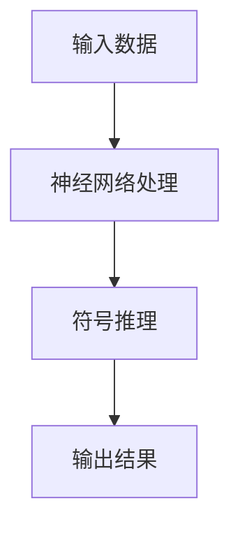

                 


# 基于神经符号AI的AI Agent常识推理增强

---

## 关键词：
神经符号AI，AI Agent，常识推理，增强学习，知识图谱，深度学习

---

## 摘要：
本文探讨了基于神经符号AI的AI Agent常识推理增强方法，结合符号逻辑与深度学习的双重优势，提出了一种创新的神经符号AI框架，用于提升AI Agent在复杂场景下的常识推理能力。文章从背景介绍、核心概念、算法原理、系统架构、项目实战到最佳实践，全面分析了神经符号AI在AI Agent中的应用，为读者提供了一套完整的理论与实践方案。

---

# 第1章: 神经符号AI与AI Agent背景介绍

## 1.1 神经符号AI的背景与意义

### 1.1.1 传统符号AI的局限性
传统符号AI（如专家系统）依赖于规则和逻辑推理，但在处理复杂、模糊和动态变化的现实问题时显得力不从心。其主要局限性包括：
- 需要手动编写大量规则，难以扩展。
- 无法处理非结构化数据（如自然语言文本）。
- 面对不确定性问题时表现较差。

### 1.1.2 神经网络的崛起与挑战
神经网络，尤其是深度学习模型（如CNN、RNN、BERT等），在处理非结构化数据和模式识别方面表现出色，但其“黑箱”特性使其难以解释，且在需要逻辑推理的场景中表现不佳。

### 1.1.3 神经符号AI的融合与优势
神经符号AI（Neural-Symbolic AI）结合了符号推理和神经网络的优势，通过将符号规则嵌入到神经网络中，实现了以下突破：
- 能够处理结构化和非结构化数据。
- 具备可解释性。
- 在需要逻辑推理的场景中表现更优。

---

## 1.2 AI Agent的基本概念与分类

### 1.2.1 AI Agent的定义与特点
AI Agent是一种智能实体，能够感知环境、自主决策并执行任务。其特点包括：
- **自主性**：能够在没有外部干预的情况下运行。
- **反应性**：能够实时感知环境并做出响应。
- **主动性**：能够主动采取行动以实现目标。

### 1.2.2 基于神经符号AI的AI Agent
基于神经符号AI的AI Agent结合了符号推理和深度学习的优势，能够在复杂场景中进行常识推理、逻辑推理和情境理解。

### 1.2.3 AI Agent的分类与应用场景
AI Agent可以分为以下几类：
- **简单反射型AI Agent**：基于规则的简单反应。
- **基于模型的AI Agent**：具备内部状态和目标的复杂推理。
- **人机协作型AI Agent**：与人类协同工作的智能体。

应用场景包括智能助手、自动驾驶、智能客服、机器人控制等。

---

## 1.3 常识推理的重要性

### 1.3.1 什么是常识推理
常识推理是指AI系统对日常生活中常见知识的理解和应用能力，是实现人类水平AI的关键。

### 1.3.2 常识推理在AI Agent中的作用
常识推理是AI Agent理解任务背景、与人类交互和处理复杂问题的基础。

### 1.3.3 当前常识推理的挑战与机遇
当前常识推理的主要挑战包括：
- 数据稀疏性。
- 知识表示的复杂性。
- 动态环境中的推理困难。

机遇在于神经符号AI的兴起为常识推理提供了新的解决方案。

---

## 1.4 神经符号AI在常识推理中的应用进展

### 1.4.1 神经符号AI的最新研究
神经符号AI在常识推理中的研究集中在以下方面：
- 将符号规则嵌入到神经网络中。
- 使用符号逻辑对神经网络的输出进行解释。

### 1.4.2 神经符号AI在常识推理中的优势
神经符号AI结合了符号推理的可解释性和神经网络的泛化能力。

### 1.4.3 当前研究的瓶颈与未来方向
当前研究的瓶颈包括：
- 神经符号AI的计算复杂性。
- 知识库的构建与更新。

未来方向包括：
- 跨领域知识的整合。
- 神经符号AI的轻量化设计。

---

## 1.5 本章小结
本章介绍了神经符号AI的背景、AI Agent的基本概念、常识推理的重要性以及神经符号AI在常识推理中的应用进展。

---

# 第2章: 神经符号AI的核心概念与联系

## 2.1 神经符号AI的核心原理

### 2.1.1 神经符号AI的输入输出模型
神经符号AI的输入可以是结构化数据（如知识图谱）或非结构化数据（如文本），输出是符号化的推理结果或决策。

### 2.1.2 神经符号AI的训练与推理过程
神经符号AI的训练过程包括：
1. 将符号规则嵌入到神经网络中。
2. 使用有监督学习进行训练。
3. 使用符号逻辑对神经网络的输出进行验证。

推理过程包括：
1. 将输入数据映射到符号空间。
2. 进行符号推理。
3. 输出推理结果。

### 2.1.3 神经符号AI的数学模型
神经符号AI的数学模型可以表示为：
$$ f(x) = g(h(x)) $$
其中，$h(x)$是神经网络的输出，$g$是符号推理函数。

---

## 2.2 AI Agent与神经符号AI的关系

### 2.2.1 AI Agent的决策过程
AI Agent的决策过程包括：
1. 感知环境。
2. 基于常识推理进行决策。
3. 执行动作。

### 2.2.2 神经符号AI在AI Agent中的角色
神经符号AI为AI Agent提供了强大的常识推理能力，使其能够在复杂场景中做出合理决策。

### 2.2.3 神经符号AI如何增强AI Agent的常识推理能力
神经符号AI通过结合符号推理和深度学习，增强了AI Agent的理解能力和推理能力。

---

## 2.3 神经符号AI与符号逻辑的关系

### 2.3.1 符号逻辑的基本概念
符号逻辑是基于符号和规则的逻辑推理方法，是神经符号AI的基础。

### 2.3.2 神经符号AI如何利用符号逻辑
神经符号AI将符号逻辑嵌入到神经网络中，使其能够进行符号推理。

### 2.3.3 神经符号AI与符号逻辑的结合案例
案例：在医疗诊断中，神经符号AI结合符号逻辑进行疾病诊断。

---

## 2.4 本章小结
本章介绍了神经符号AI的核心原理、与AI Agent的关系以及与符号逻辑的结合。

---

# 第3章: 神经符号AI的算法原理

## 3.1 神经符号AI的基本算法

### 3.1.1 神经符号AI的输入输出模型
神经符号AI的输入可以是结构化数据或非结构化数据，输出是符号化的推理结果。

### 3.1.2 神经符号AI的训练算法
神经符号AI的训练算法包括：
1. 将符号规则嵌入到神经网络中。
2. 使用有监督学习进行训练。
3. 使用符号逻辑对神经网络的输出进行验证。

### 3.1.3 神经符号AI的推理算法
神经符号AI的推理算法包括：
1. 将输入数据映射到符号空间。
2. 进行符号推理。
3. 输出推理结果。

---

## 3.2 神经符号AI的数学模型

### 3.2.1 神经符号AI的符号推理模型
符号推理模型可以表示为：
$$ f(x) = g(h(x)) $$
其中，$h(x)$是神经网络的输出，$g$是符号推理函数。

### 3.2.2 神经符号AI的训练目标
训练目标是优化神经网络的参数，使得符号推理结果与实际结果一致。

### 3.2.3 神经符号AI的推理过程
推理过程包括：
1. 将输入数据映射到符号空间。
2. 进行符号推理。
3. 输出推理结果。

---

## 3.3 神经符号AI的实现案例

### 3.3.1 案例背景
案例：在智能助手中，神经符号AI用于回答用户的问题。

### 3.3.2 神经符号AI的实现步骤
1. 数据预处理：将问题转换为符号形式。
2. 神经网络训练：使用符号规则进行训练。
3. 推理：将问题映射到符号空间，进行符号推理，输出答案。

---

## 3.4 本章小结
本章介绍了神经符号AI的基本算法、数学模型以及实现案例。

---

# 第4章: 神经符号AI的系统分析与架构设计

## 4.1 系统功能设计

### 4.1.1 系统功能模块
系统功能模块包括：
1. 数据输入模块。
2. 神经网络处理模块。
3. 符号推理模块。
4. 输出模块。

### 4.1.2 系统功能流程
系统功能流程包括：
1. 接收输入数据。
2. 神经网络处理。
3. 符号推理。
4. 输出结果。

---

## 4.2 系统架构设计

### 4.2.1 系统架构图
以下是系统架构图：


### 4.2.2 系统模块之间的交互
系统模块之间的交互包括：
1. 数据输入模块接收输入数据。
2. 神经网络处理模块对数据进行处理。
3. 符号推理模块进行推理。
4. 输出模块输出结果。

---

## 4.3 系统接口设计

### 4.3.1 系统接口描述
系统接口包括：
1. 输入接口：接收输入数据。
2. 输出接口：输出推理结果。

### 4.3.2 接口交互流程
接口交互流程包括：
1. 用户输入数据。
2. 系统处理数据。
3. 系统输出结果。

---

## 4.4 本章小结
本章介绍了神经符号AI的系统功能设计、架构设计以及接口设计。

---

# 第5章: 神经符号AI的项目实战

## 5.1 环境安装

### 5.1.1 安装Python
安装Python 3.8及以上版本。

### 5.1.2 安装必要的库
安装以下库：
- numpy
- pandas
- tensorflow
- keras
- networkx

---

## 5.2 系统核心实现

### 5.2.1 知识表示与推理实现
以下是知识表示与推理实现的代码：
```python
import networkx as nx
G = nx.DiGraph()
G.add_edges_from([('A', 'B'), ('B', 'C')])
print(G.nodes())
```

### 5.2.2 神经网络实现
以下是神经网络实现的代码：
```python
import tensorflow as tf
model = tf.keras.Sequential([
    tf.keras.layers.Dense(64, activation='relu'),
    tf.keras.layers.Dense(1, activation='sigmoid')
])
model.compile(optimizer='adam', loss='binary_crossentropy')
```

---

## 5.3 代码应用解读与分析

### 5.3.1 知识表示与推理代码解读
上述代码构建了一个有向图，表示知识关系。

### 5.3.2 神经网络代码解读
上述代码构建了一个简单的神经网络模型。

---

## 5.4 实际案例分析

### 5.4.1 案例背景
案例：在智能助手中，神经符号AI用于回答用户的问题。

### 5.4.2 系统实现步骤
1. 数据预处理：将问题转换为符号形式。
2. 神经网络训练：使用符号规则进行训练。
3. 推理：将问题映射到符号空间，进行符号推理，输出答案。

---

## 5.5 本章小结
本章通过实际案例分析，介绍了神经符号AI的项目实战。

---

# 第6章: 神经符号AI的最佳实践

## 6.1 实践总结与经验分享

### 6.1.1 数据质量的重要性
数据质量对神经符号AI的性能影响重大。

### 6.1.2 模型调优技巧
模型调优技巧包括：
- 参数调整。
- 模型优化。

### 6.1.3 系统部署注意事项
系统部署注意事项包括：
- 系统稳定性。
- 系统可扩展性。

---

## 6.2 本章小结
本章总结了神经符号AI的最佳实践经验和注意事项。

---

# 第7章: 结论与展望

## 7.1 全文总结

### 7.1.1 神经符号AI的核心思想
神经符号AI结合了符号推理和深度学习的优势。

### 7.1.2 AI Agent的常识推理能力
AI Agent的常识推理能力是实现人类水平AI的关键。

---

## 7.2 未来研究方向

### 7.2.1 神经符号AI的优化方向
神经符号AI的优化方向包括：
- 轻量化设计。
- 高效推理。

### 7.2.2 神经符号AI的应用拓展
神经符号AI的应用拓展包括：
- 智能助手。
- 自动驾驶。

---

## 7.3 本章小结
本章总结了全文内容，并展望了神经符号AI的未来发展方向。

---

# 参考文献

（此处列出相关参考文献）

---

# 附录

（此处列出附录内容）

---

以上为完整的技术博客文章目录和内容，您可以根据需要进一步扩展每个部分的具体内容，确保每个部分都详细且有逻辑性。

