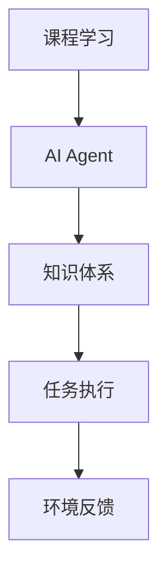
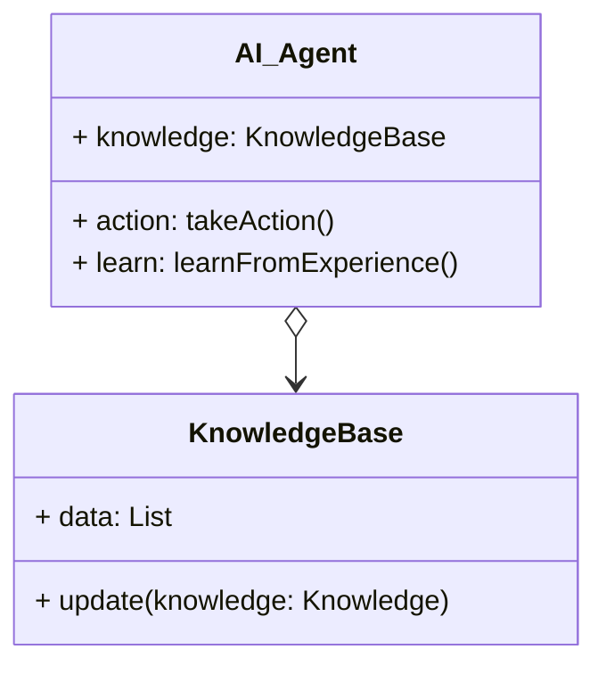
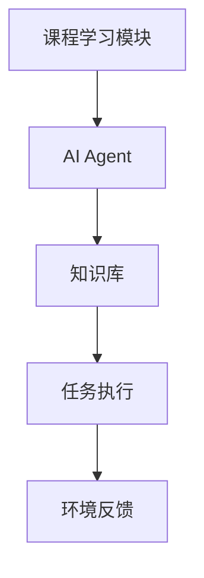

                 


# 基于课程学习的AI Agent能力阶梯式提升

> 关键词：课程学习，AI Agent，能力提升，算法原理，系统架构

> 摘要：本文探讨了通过课程学习来系统性地提升AI Agent能力的方法。从背景介绍、核心概念到算法原理，再到系统架构和项目实战，详细阐述了如何通过阶梯式学习策略优化AI Agent的能力，帮助读者全面理解并应用相关技术。

---

## 第一部分：课程学习与AI Agent的背景介绍

### 第1章：课程学习与AI Agent概述

#### 1.1 课程学习的背景与定义

课程学习是一种系统化的教学方法，通过设计合理的知识序列，引导学习者逐步掌握复杂概念。在AI领域，课程学习被用于提升AI Agent的学习效率和效果。AI Agent需要通过课程学习逐步构建知识体系，增强问题解决能力。

#### 1.2 AI Agent的基本概念

AI Agent（智能体）是能够感知环境并采取行动的实体。它可以分为简单反射型、基于模型的反射型、目标驱动型和效用驱动型。AI Agent的核心能力包括感知、学习和决策能力。

#### 1.3 课程学习与AI Agent的关系

课程学习为AI Agent提供了一种系统性的学习路径，帮助其逐步掌握复杂任务。通过课程学习，AI Agent能够高效地构建知识体系，提升问题解决能力。例如，在自然语言处理任务中，课程学习可以帮助AI Agent逐步掌握词法分析、句法分析等任务。

---

## 第二部分：课程学习与AI Agent的核心概念

### 第2章：课程学习与AI Agent的核心概念与联系

#### 2.1 核心概念对比

| **核心概念** | **课程学习** | **AI Agent** |
|--------------|--------------|--------------|
| **目标**     | 系统性知识传递 | 高效问题解决 |
| **方法**     | 知识序列设计 | 感知、学习、决策 |
| **结果**     | 知识体系构建 | 任务执行能力提升 |

#### 2.2 实体关系图



课程学习为AI Agent提供知识体系，AI Agent通过执行任务与环境互动，进一步优化知识体系。

---

## 第三部分：课程学习与AI Agent的算法原理

### 第3章：课程学习算法的原理与实现

#### 3.1 强化学习算法

强化学习是一种通过试错学习优化决策模型的算法。其核心是通过与环境互动，学习最优策略。例如，使用Q-learning算法：

$$ Q(s, a) = Q(s, a) + \alpha [r + \max Q(s', a') - Q(s, a)] $$

其中，$Q(s, a)$表示状态$s$和动作$a$的评估值，$\alpha$是学习率，$r$是奖励，$s'$是新状态。

#### 3.2 监督学习算法

监督学习通过标记数据训练模型，使其能够预测新数据的标签。例如，线性回归模型：

$$ y = \theta^T x + b $$

其中，$x$是输入，$\theta$是权重，$b$是偏置。

---

## 第四部分：系统分析与架构设计

### 第4章：系统设计与架构

#### 4.1 项目背景

我们设计了一个基于课程学习的AI Agent系统，旨在提升其在自然语言处理任务中的能力。

#### 4.2 系统功能设计



知识库存储AI Agent的学习内容，AI Agent通过学习方法更新知识库。

#### 4.3 系统架构设计



课程学习模块设计知识序列，AI Agent执行任务并更新知识库。

---

## 第五部分：项目实战

### 第5章：项目实现与分析

#### 5.1 环境安装

安装Python和相关库：

```bash
pip install numpy matplotlib
```

#### 5.2 核心代码实现

```python
import numpy as np

class AIAgent:
    def __init__(self):
        self.knowledge = {}

    def learn(self, data):
        # 训练模型，更新知识库
        pass

    def take_action(self, input):
        # 根据知识库采取行动
        return action
```

#### 5.3 实际案例分析

在自然语言处理任务中，AI Agent通过课程学习逐步掌握词法分析、句法分析等任务，提升处理复杂文本的能力。

---

## 第六部分：最佳实践与小结

### 第6章：总结与展望

#### 6.1 最佳实践

1. **课程设计**：合理设计知识序列，确保AI Agent逐步掌握核心概念。
2. **反馈机制**：建立有效的反馈机制，及时优化学习路径。
3. **算法选择**：根据具体任务选择合适的算法，提升学习效率。

#### 6.2 未来展望

随着AI技术的发展，课程学习将更加智能化，AI Agent的能力提升将更加高效和精准。

---

通过系统化的课程学习，AI Agent能够阶梯式地提升其能力，从基础任务逐步掌握复杂任务，实现高效的问题解决。

