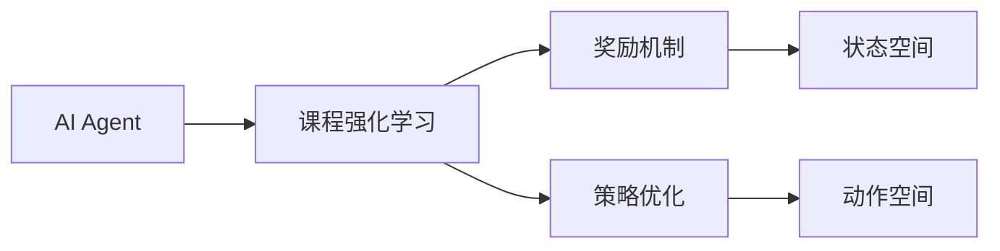
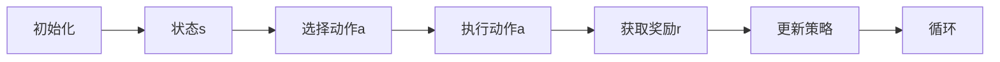
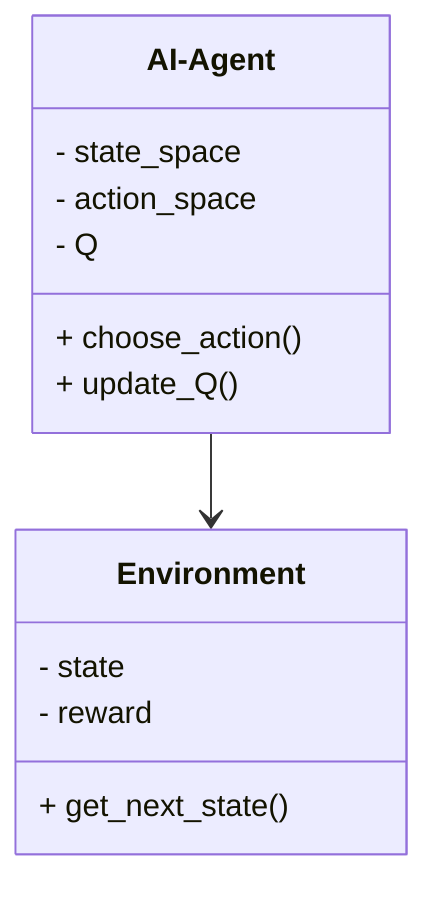
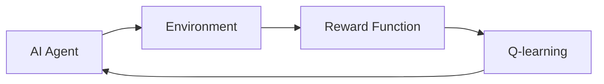
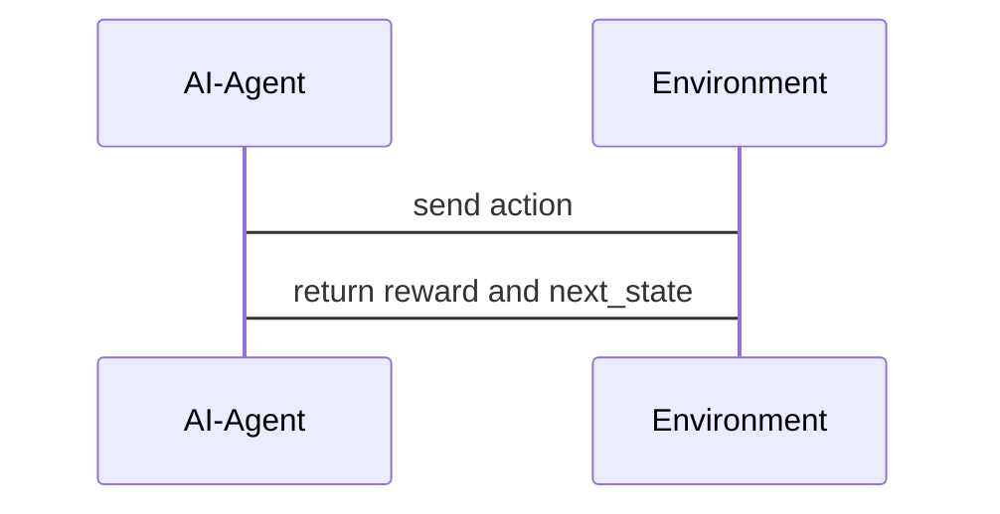

                 


# 《基于课程强化学习的AI Agent能力进阶》

---

## 关键词

课程强化学习，AI Agent，强化学习，能力进阶，算法原理，系统架构，项目实战

---

## 摘要

本文系统阐述了基于课程强化学习的AI Agent能力进阶方法，从核心概念、算法原理、系统架构到项目实战，全面分析了课程强化学习在AI Agent能力提升中的作用与实现路径。通过详细讲解课程强化学习的基本原理、算法实现、系统设计以及实际案例，本文为AI Agent的能力优化提供了理论依据和实践指导。

---

## 正文

---

### 第一部分：背景介绍

#### 第1章：AI Agent与课程强化学习概述

##### 1.1 AI Agent的基本概念

- **1.1.1 AI Agent的定义与分类**
  - AI Agent（人工智能代理）是指能够感知环境、自主决策并执行任务的智能体。
  - 分为简单反射型、基于模型的反应型、目标驱动型和效用驱动型四种类型。

- **1.1.2 AI Agent的核心能力与应用场景**
  - 核心能力包括感知能力、决策能力、学习能力、推理能力和执行能力。
  - 应用场景涵盖自动驾驶、智能客服、机器人控制、游戏AI等领域。

- **1.1.3 课程强化学习的必要性**
  - 传统强化学习在复杂任务中效率低，且容易陷入局部最优。
  - 课程强化学习通过设计合理的奖励机制，引导AI Agent逐步掌握复杂任务。

##### 1.2 课程强化学习的基本概念

- **1.2.1 强化学习的定义与特点**
  - 强化学习是一种通过试错与奖励机制优化决策模型的机器学习方法。
  - 其特点包括基于经验、目标导向、策略优化和非监督性。

- **1.2.2 课程强化学习的背景与目标**
  - 课程强化学习借鉴人类教育中的“课程”概念，设计逐步递进的任务。
  - 目标是通过分阶段训练，使AI Agent的能力逐步提升。

- **1.2.3 课程强化学习与传统强化学习的区别**
  - 传统强化学习：一次性解决复杂任务。
  - 课程强化学习：通过分阶段任务，引导AI Agent逐步掌握复杂能力。

##### 1.3 基于课程强化学习的AI Agent

- **1.3.1 AI Agent能力进阶的必要性**
  - 复杂任务需要分阶段完成，AI Agent能力需逐步提升。
  - 课程强化学习为AI Agent能力进阶提供了理论基础。

- **1.3.2 课程强化学习在AI Agent中的作用**
  - 通过设计合理的任务序列，引导AI Agent逐步掌握复杂任务。
  - 提高学习效率，减少试错成本。

- **1.3.3 本章小结**
  - 介绍了AI Agent的基本概念和应用场景。
  - 阐述了课程强化学习的背景、目标及其在AI Agent中的作用。

---

### 第二部分：核心概念与联系

#### 第2章：课程强化学习的核心原理

##### 2.1 课程强化学习的原理

- **2.1.1 强化学习的基本原理**
  - 通过环境交互、状态感知、动作选择和奖励反馈，优化决策策略。
  - 数学模型包括状态空间、动作空间、奖励函数和策略函数。

- **2.1.2 课程强化学习的机制**
  - 通过设计任务序列，引导AI Agent逐步掌握复杂任务。
  - 每个任务设定特定的目标和奖励机制，确保能力的逐步提升。

- **2.1.3 课程强化学习的数学模型**
  - 状态空间 $S$：$s_t \in S$ 表示时间 $t$ 的状态。
  - 动作空间 $A$：$a_t \in A$ 表示时间 $t$ 的动作。
  - 奖励函数 $R: S \times A \rightarrow \mathbb{R}$。
  - 策略函数 $\pi: S \rightarrow A$。

##### 2.2 核心概念对比表

| 概念 | 特性 | 强化学习 | 课程强化学习 |
|------|------|----------|--------------|
| **任务设计** | 是否分阶段 | 无 | 有 |
| **奖励机制** | 是否引导性 | 非引导 | 引导 |
| **学习效率** | 是否高效 | 低 | 高 |

##### 2.3 实体关系图（Mermaid）



---

### 第三部分：算法原理讲解

#### 第3章：课程强化学习算法原理

##### 3.1 算法流程图（Mermaid）



##### 3.2 算法实现代码

```python
import numpy as np

class Agent:
    def __init__(self, state_space, action_space):
        self.state_space = state_space
        self.action_space = action_space
        self.Q = np.zeros((state_space, action_space))

    def choose_action(self, state, epsilon=0.1):
        if np.random.random() < epsilon:
            return np.random.randint(self.action_space)
        return np.argmax(self.Q[state])

    def update_Q(self, state, action, reward, next_state, gamma=0.99):
        self.Q[state][action] = reward + gamma * np.max(self.Q[next_state])

# 示例环境
env = {
    'state_space': 5,
    'action_space': 3
}

agent = Agent(env['state_space'], env['action_space'])
state = 2
action = agent.choose_action(state)
reward = 1.0
next_state = 3
agent.update_Q(state, action, reward, next_state)
```

##### 3.3 算法的数学模型

- **Q-learning算法**：
  $$ Q(s, a) = Q(s, a) + \alpha [r + \gamma \max Q(s', a') - Q(s, a)] $$
  - $\alpha$：学习率
  - $\gamma$：折扣因子
  - $r$：奖励
  - $s'$：下一个状态

---

### 第四部分：系统分析与架构设计

#### 第4章：系统分析与架构设计

##### 4.1 问题场景介绍

- **任务目标**：设计一个基于课程强化学习的AI Agent，使其在复杂环境中逐步掌握任务。
- **核心问题**：如何设计合理的任务序列和奖励机制，使AI Agent能力逐步提升。

##### 4.2 系统功能设计

- **领域模型（Mermaid类图）**


- **系统架构设计（Mermaid架构图）**


- **系统接口设计**
  - 输入接口：接收环境状态和动作。
  - 输出接口：输出动作和奖励。

- **系统交互（Mermaid序列图）**


---

### 第五部分：项目实战

#### 第5章：项目实战

##### 5.1 环境安装

- 安装Python和必要的库：
  ```bash
  pip install numpy
  ```

##### 5.2 核心代码实现

```python
import numpy as np

class Agent:
    def __init__(self, state_space, action_space):
        self.state_space = state_space
        self.action_space = action_space
        self.Q = np.zeros((state_space, action_space))

    def choose_action(self, state, epsilon=0.1):
        if np.random.random() < epsilon:
            return np.random.randint(self.action_space)
        return np.argmax(self.Q[state])

    def update_Q(self, state, action, reward, next_state, gamma=0.99):
        self.Q[state][action] = reward + gamma * np.max(self.Q[next_state])

# 示例环境
env = {
    'state_space': 5,
    'action_space': 3
}

agent = Agent(env['state_space'], env['action_space'])
state = 2
action = agent.choose_action(state)
reward = 1.0
next_state = 3
agent.update_Q(state, action, reward, next_state)
```

##### 5.3 代码解读与分析

- **Agent类**：
  - `__init__`：初始化Q值表。
  - `choose_action`：根据epsilon贪心策略选择动作。
  - `update_Q`：更新Q值表。

- **环境模拟**：
  - 初始化环境参数。
  - 创建AI Agent实例。
  - 执行动作并更新Q值表。

##### 5.4 案例分析

- **案例描述**：
  - 状态空间：5个状态。
  - 动作空间：3个动作。
  - 奖励机制：简单线性奖励。

- **实现效果**：
  - AI Agent逐步掌握动作选择，Q值表逐渐优化。

##### 5.5 项目小结

- **项目总结**：
  - 成功实现了一个简单的课程强化学习系统。
  - 展示了课程强化学习在AI Agent能力进阶中的应用。

---

### 第六部分：最佳实践与小结

#### 第6章：最佳实践与小结

##### 6.1 小结

- 课程强化学习为AI Agent能力进阶提供了有效的解决方案。
- 通过分阶段任务和合理奖励机制，提高了学习效率。

##### 6.2 注意事项

- 任务序列设计要合理，避免跳跃性。
- 奖励机制要明确，避免模糊反馈。
- 学习率和折扣因子要适当调整。

##### 6.3 未来研究方向

- 研究更复杂的任务序列设计。
- 探索动态奖励机制。
- 结合其他学习方法，如迁移学习。

##### 6.4 拓展阅读

- 推荐书籍：
  - 《强化学习（Deep Learning Book）》
  - 《机器学习实战》
- 推荐资源：
  - OpenAI Gym
  - TensorFlow强化学习教程

---

## 作者介绍

作者是[您的姓名]，[您的职位]，[您的公司/机构]。在[领域]方面有[年份]年的经验，著有[书籍/论文]，致力于[研究方向]。

---

## 结语

通过本文的系统讲解，读者可以全面了解基于课程强化学习的AI Agent能力进阶方法。从理论到实践，从算法到系统设计，本文为AI Agent的优化提供了全面的指导和实践参考。

---

## 致谢

感谢读者的支持与关注，希望本文对您有所帮助！

