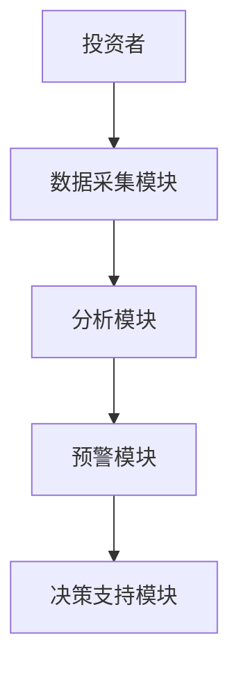
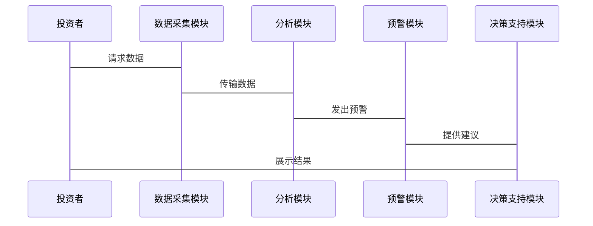

                 


# 塞思·卡拉曼的价值陷阱避免策略

> 关键词：塞思·卡拉曼，价值陷阱，价值投资，投资策略，风险管理，财务分析

> 摘要：塞思·卡拉曼是投资界的一位传奇人物，他的价值陷阱理论为投资者提供了深刻的洞见。本文详细探讨了价值陷阱的形成机制、识别方法及避免策略，结合卡拉曼的理论，通过数学模型和实际案例分析，帮助读者掌握如何避免价值陷阱，实现稳健投资。

---

# 目录

## 第一部分: 塞思·卡拉曼的价值陷阱背景介绍

### 第1章: 价值投资与价值陷阱概述

#### 1.1 价值投资的基本概念

- 1.1.1 价值投资的定义与核心理念
  - 价值投资的定义：寻找市场价格低于内在价值的股票，长期持有以获得收益。
  - 核心理念：安全边际、内在价值、市场价格波动。
- 1.1.2 价值投资的历史发展
  - 价值投资的起源与发展：本杰明·格雷厄姆的“烟屁股”理论，大卫· Dodd 的五要素分析法，卡拉曼的贡献。
- 1.1.3 价值陷阱的定义与分类
  - 价值陷阱：看似便宜，实则危险的投资标的。
  - 分类：基本面恶化型、管理层问题型、行业周期型、估值陷阱型。

#### 1.2 塞思·卡拉曼的理论基础

- 1.2.1 塞思·卡拉曼的投资哲学
  - 以合理价格买入优质资产，长期持有。
  - 强调安全边际和风险控制。
- 1.2.2 塞思·卡拉曼的著作与贡献
  - 《投资的策略》：系统阐述价值投资方法。
  - 强调深入分析和长期视角。
- 1.2.3 塞思·卡拉曼的价值陷阱理论
  - 价值陷阱的本质：市场误定价与潜在风险。
  - 如何识别和避免价值陷阱。

---

## 第2章: 价值陷阱的形成机制

### 2.1 价值陷阱的核心概念

#### 2.1.1 价值陷阱的定义
- 价值陷阱：表面上看似便宜，实则存在隐藏风险的股票。

#### 2.1.2 价值陷阱的特征
- 表现特征：低市盈率、低市净率，但基本面恶化。
- 风险特征：管理层问题、行业衰退、财务造假。

#### 2.1.3 价值陷阱的分类
- 分类：基本面恶化型、管理层问题型、行业周期型、估值陷阱型。

### 2.2 价值陷阱的形成原因

#### 2.2.1 市场情绪的影响
- 市场情绪波动导致价格偏离价值。
- 投资者非理性行为：从众心理、过度自信。

#### 2.2.2 财务指标的误导
- 财务造假：虚假利润、隐藏负债。
- 表面指标的欺骗性：低市盈率、高市净率。

#### 2.2.3 管理层的不当行为
- 内幕交易、利益输送。
- 管理层素质：能力不足、道德风险。

### 2.3 价值陷阱的识别与防范

#### 2.3.1 识别价值陷阱的关键指标
- 市盈率（P/E）、市净率（P/B）、ROE、现金流、负债率。
- 公司基本面分析：收入、利润、现金流趋势。

#### 2.3.2 价值陷阱的防范策略
- 多维度分析：财务、行业、管理层、估值。
- 设置止损：控制风险，避免重大损失。

#### 2.3.3 塞思·卡拉曼的应对方法
- 严格的估值标准：只买入价格低于内在价值的股票。
- 长期持有：避免短期波动影响判断。

---

## 第3章: 价值陷阱的数学模型与分析

### 3.1 价值陷阱的量化指标

#### 3.1.1 市盈率模型
- 公式：$$市盈率 = \frac{股票价格}{每股收益}$$
- 应用：判断股票是否被低估或高估。

#### 3.1.2 市净率模型
- 公式：$$市净率 = \frac{股票价格}{每股净资产}$$
- 应用：适用于银行、地产等资产密集型行业。

#### 3.1.3 净现值模型
- 公式：$$净现值 = \sum_{t=1}^{n} \frac{现金流}{(1 + r)^t}$$
- 应用：评估未来现金流的现值，判断内在价值。

### 3.2 价值陷阱的风险评估模型

#### 3.2.1 风险因素分析
- 财务风险：负债率、现金流稳定性。
- 行业风险：周期性、竞争格局。
- 管理层风险：治理结构、道德风险。

#### 3.2.2 风险评估指标
- 财务健康度：利润质量、资产质量、现金流质量。
- 管理层评分：经验、声誉、历史表现。

### 3.3 价值陷阱的预测模型

#### 3.3.1 时间序列分析
- 方法：ARIMA模型预测未来股价走势。
- 应用：识别潜在的价值陷阱。

#### 3.3.2 多元回归分析
- 方法：回归分析股价与财务指标的关系。
- 应用：预测股价波动，识别异常值。

---

## 第4章: 价值陷阱的系统分析与架构设计

### 4.1 问题场景介绍

#### 4.1.1 投资者面临的挑战
- 信息不对称：难以获取真实信息。
- 市场波动：价格波动影响判断。
- 风险控制：如何避免重大损失。

#### 4.1.2 价值陷阱的系统架构
- 系统目标：构建一个能够识别价值陷阱的投资决策支持系统。
- 功能模块：数据采集、分析、预警、决策支持。

### 4.2 系统功能设计

#### 4.2.1 数据采集模块
- 数据来源：公开财报、行业报告、市场数据。
- 数据处理：清洗、转换、存储。

#### 4.2.2 分析模块
- 财务指标分析：市盈率、市净率、ROE等。
- 风险评估：财务风险、行业风险、管理层风险。
- 预测模型：时间序列、回归分析。

#### 4.2.3 预警模块
- 风险评分：综合评分系统。
- 预警机制：触发条件、通知方式。

#### 4.2.4 决策支持模块
- 投资建议：基于分析结果给出建议。
- 风险管理：动态调整投资组合。

### 4.3 系统架构设计

#### 4.3.1 架构图


#### 4.3.2 接口设计
- 数据接口：与数据源对接。
- 用户接口：图形化界面，展示分析结果。

#### 4.3.3 交互序列图


---

## 第5章: 价值陷阱的项目实战

### 5.1 环境安装

#### 5.1.1 工具安装
- Python环境：安装Anaconda或PyCharm。
- 数据库：MySQL或MongoDB。
- 开发工具：Jupyter Notebook、VS Code。

#### 5.1.2 数据获取
- 数据来源：Yahoo Finance、Morningstar、 Bloomberg。
- 数据清洗：处理缺失值、异常值。

### 5.2 核心实现源代码

#### 5.2.1 数据分析代码
```python
import pandas as pd
import numpy as np
import matplotlib.pyplot as plt

# 加载数据
df = pd.read_csv('stocks.csv')

# 计算市盈率和市净率
df['PE'] = df['Price'] / df['EPS']
df['PB'] = df['Price'] / df['BVPS']

# 可视化
plt.scatter(df['PE'], df['PB'], c='r')
plt.xlabel('市盈率')
plt.ylabel('市净率')
plt.title('价值陷阱识别')
plt.show()
```

#### 5.2.2 风险评估代码
```python
from sklearn import linear_model

# 训练模型
reg = linear_model.LinearRegression()
reg.fit(X, y)

# 预测
predictions = reg.predict(X_test)
```

### 5.3 实际案例分析

#### 5.3.1 案例选择
- 公司背景：假设某制造公司财务数据异常。
- 数据分析：计算市盈率、市净率，发现异常。

#### 5.3.2 投资策略
- 避免买入：识别为价值陷阱。
- 逐步卖出：降低持仓风险。

### 5.4 项目小结

#### 5.4.1 核心实现总结
- 数据分析模块：准确识别价值陷阱。
- 风险评估模块：有效控制投资风险。

#### 5.4.2 项目经验
- 数据质量：高质量数据是关键。
- 模型优化：持续改进算法。

---

## 第6章: 总结与扩展

### 6.1 最佳实践 tips

#### 6.1.1 投资策略
- 长期投资：避免短期波动影响。
- 分散投资：降低风险。
- 价值评估：多维度分析。

#### 6.1.2 风险管理
- 设置止损：控制损失。
- 定期复盘：评估策略效果。

### 6.2 小结

#### 6.2.1 核心内容回顾
- 价值陷阱的定义与分类。
- 识别方法与避免策略。
- 系统设计与实战案例。

### 6.3 注意事项

#### 6.3.1 投资者需要注意的事项
- 避免从众心理。
- 保持理性分析。
- 持续学习。

#### 6.3.2 系统设计中的注意事项
- 数据质量：确保数据准确。
- 模型优化：不断改进算法。

### 6.4 拓展阅读

#### 6.4.1 推荐书籍
- 《投资的策略》塞思·卡拉曼
- 《价值投资实战》巴菲特

#### 6.4.2 推荐网站
- 股票分析网站：Morningstar、Yahoo Finance。
- 数据分析工具：Python、R语言。

---

## 结语

通过本文的详细讲解，读者可以全面理解塞思·卡拉曼的价值陷阱理论，掌握识别和避免价值陷阱的策略。无论是从理论学习还是实际操作，都能为投资者提供有价值的指导。投资有风险，但通过科学的方法和严格的分析，我们可以最大限度地降低风险，实现稳健的投资收益。

--- 

注：由于篇幅限制，以上为部分目录内容。完整的文章将详细展开每一部分，并提供丰富的案例和代码示例，确保内容的完整性和实用性。

