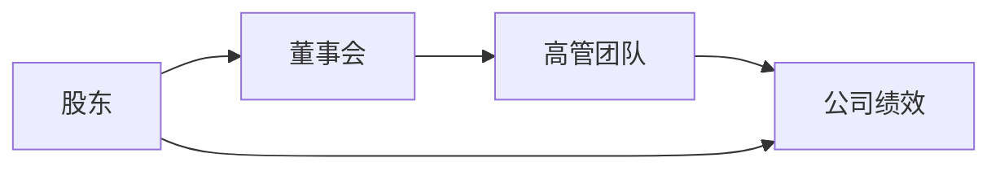
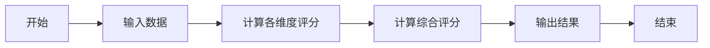
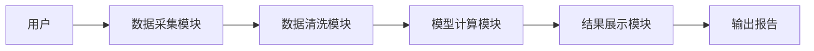
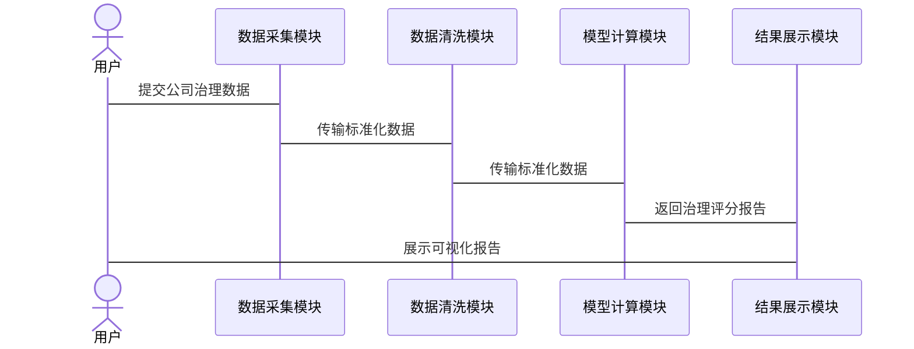

                 


# 塞思·卡拉曼的公司治理分析方法

## 关键词：公司治理，塞思·卡拉曼，分析方法，数学模型，系统架构，最佳实践

## 摘要：塞思·卡拉曼的公司治理分析方法是一种基于多维度分析框架的系统性方法，旨在通过股东权益保护、董事会结构优化和高管激励机制等核心维度，评估和优化企业的治理结构。本文详细阐述了该方法的理论基础、数学模型、系统架构和实际应用，结合案例分析和代码实现，为读者提供了一个全面理解和应用该方法的指南。

---

# 第一部分: 公司治理分析方法的背景与基础

## 第1章: 公司治理的基本概念与问题背景

### 1.1 公司治理的核心概念
#### 1.1.1 公司治理的定义与内涵
公司治理是指通过一系列制度、机制和流程，确保公司战略目标的实现、股东权益的保护以及利益相关者的利益平衡。核心在于构建高效的决策机制、监督机制和激励机制。

#### 1.1.2 公司治理的主要参与者
- **股东**：作为公司所有者，关注资产保值增值。
- **董事会**：负责制定公司战略和监督高管。
- **高管团队**：执行公司日常经营。
- **利益相关者**：包括员工、客户、债权人等。

#### 1.1.3 公司治理的目标与价值
- **目标**：实现公司长期价值最大化，平衡各方利益。
- **价值**：提升企业透明度，降低风险，增强投资者信心。

### 1.2 公司治理问题的背景与现状
#### 1.2.1 当前公司治理的主要问题
- **股东权益保护不足**：中小股东利益容易被稀释。
- **董事会结构不合理**：独立董事比例不足，独立性不够。
- **高管激励机制不完善**：激励与绩效脱节，存在短期行为。
- **透明度与信息披露不足**：信息不对称问题严重。

#### 1.2.2 全球化背景下的公司治理挑战
- **跨国经营**：面临不同国家的法律和文化差异。
- **利益相关者多样性**：需要平衡更多利益相关者的诉求。
- **数字化转型**：数据安全和隐私保护成为新挑战。

#### 1.2.3 公司治理与企业绩效的关系
- **正相关性**：良好的公司治理与企业绩效呈正相关。
- **间接影响**：通过提升透明度和决策效率间接影响绩效。

### 1.3 塞思·卡拉曼分析方法的提出
#### 1.3.1 分析方法的背景与动机
- **问题背景**：公司治理问题频发，亟需系统性解决方案。
- **方法动机**：通过量化分析，优化公司治理结构。

#### 1.3.2 分析方法的核心思想
- **多维度分析**：从股东、董事会、高管三个维度全面评估。
- **量化评估**：通过数学模型量化公司治理的优劣。
- **动态优化**：根据评估结果动态调整治理结构。

#### 1.3.3 方法的适用范围与边界
- **适用范围**：适用于上市公司和大型企业。
- **方法边界**：不直接解决公司内部运营问题，专注于治理结构优化。

### 1.4 本章小结
本章从公司治理的基本概念出发，分析了当前公司治理的主要问题和挑战，并提出了塞思·卡拉曼分析方法的核心思想和适用范围。

---

# 第二部分: 塞思·卡拉曼公司治理分析方法的核心框架

## 第2章: 分析方法的理论基础

### 2.1 公司治理的多维度分析框架
#### 2.1.1 股东权益保护
- **股东分类**：控股股东与中小股东。
- **保护机制**：投票权分配、股东诉讼权。

#### 2.1.2 董事会结构与责任
- **董事会组成**：独立董事比例、专业背景。
- **董事会职责**：战略制定、高管监督。

#### 2.1.3 高管激励机制
- **激励类型**：股票期权、绩效奖金。
- **激励效果**：短期激励与长期激励的平衡。

#### 2.1.4 透明度与信息披露
- **披露内容**：财务报表、治理结构、关联交易。
- **披露频率**：定期披露与及时披露。

### 2.2 分析方法的逻辑模型
#### 2.2.1 分析模型的构建过程
1. **数据收集**：收集公司治理相关数据。
2. **权重分配**：根据维度重要性分配权重。
3. **评分计算**：对各维度进行评分，加权求和。
4. **结果分析**：根据评分结果提出改进建议。

#### 2.2.2 模型的输入与输出
- **输入**：股东权益数据、董事会结构数据、高管激励数据。
- **输出**：公司治理综合评分（0-100分）。

#### 2.2.3 模型的验证与优化
- **验证方法**：对比实际案例，调整权重。
- **优化策略**：动态调整模型参数。

### 2.3 核心概念的属性对比表
| 概念       | 属性1 | 属性2 | 属性3 |
|------------|-------|-------|-------|
| 股东权益   | 定义   | 保护机制 | 评估指标 |
| 董事会结构 | 成员构成 | 职责划分 | 有效性评估 |
| 高管激励   | 激励类型 | 绩效考核 | 激励效果 |

### 2.4 实体关系图


### 2.5 本章小结
本章详细阐述了塞思·卡拉曼分析方法的理论基础，包括多维度分析框架和逻辑模型，并通过表格和图示展示了核心概念之间的关系。

---

# 第三部分: 公司治理分析方法的算法与数学模型

## 第3章: 分析方法的数学模型

### 3.1 模型的输入与输出
#### 3.1.1 输入变量定义
- **股东权益**：权重为30%，取值范围0-1。
- **董事会结构**：权重为25%，取值范围0-1。
- **高管激励**：权重为25%，取值范围0-1。
- **透明度**：权重为20%，取值范围0-1。

#### 3.1.2 输出变量定义
- **治理评分**：综合评分，范围0-100。

#### 3.1.3 模型的数学表达式
$$
\text{治理评分} = 30\% \times x_1 + 25\% \times x_2 + 25\% \times x_3 + 20\% \times x_4
$$
其中，$x_1, x_2, x_3, x_4$ 分别是股东权益、董事会结构、高管激励和透明度的评分。

### 3.2 算法流程图


### 3.3 算法实现代码
```python
def calculate_governance_score(x1, x2, x3, x4):
    weight_x1 = 0.3
    weight_x2 = 0.25
    weight_x3 = 0.25
    weight_x4 = 0.2
    score = weight_x1 * x1 + weight_x2 * x2 + weight_x3 * x3 + weight_x4 * x4
    return score * 100

# 示例输入
x1 = 0.8  # 股东权益评分
x2 = 0.7  # 董事会结构评分
x3 = 0.6  # 高管激励评分
x4 = 0.9  # 透明度评分

score = calculate_governance_score(x1, x2, x3, x4)
print("治理评分:", score)
```

### 3.4 本章小结
本章通过数学模型和算法流程图，详细解释了塞思·卡拉曼分析方法的实现过程，并通过Python代码展示了算法的具体实现。

---

# 第四部分: 系统分析与架构设计方案

## 第4章: 系统架构设计

### 4.1 问题场景介绍
- **目标**：构建一个公司治理分析系统，帮助企业管理者优化治理结构。
- **用户需求**：提供多维度分析、量化评估和改进建议。

### 4.2 系统功能设计
#### 4.2.1 数据采集模块
- **功能**：收集公司治理相关数据。
- **输入**：股东信息、董事会信息、高管激励信息。
- **输出**：标准化数据。

#### 4.2.2 模型计算模块
- **功能**：根据输入数据计算治理评分。
- **输入**：标准化数据。
- **输出**：治理评分报告。

#### 4.2.3 结果展示模块
- **功能**：可视化展示评分结果和改进建议。
- **输入**：治理评分报告。
- **输出**：可视化报告。

### 4.3 系统架构图


### 4.4 系统接口设计
- **输入接口**：REST API，接收公司治理数据。
- **输出接口**：返回治理评分报告。

### 4.5 系统交互图


### 4.6 本章小结
本章从系统架构的角度，详细设计了公司治理分析系统的功能模块、接口和交互流程。

---

# 第五部分: 项目实战与案例分析

## 第5章: 项目实战

### 5.1 环境安装
- **工具**：Python、Jupyter Notebook、Flask框架。
- **依赖**：安装numpy、pandas、matplotlib。

### 5.2 系统核心实现
#### 5.2.1 数据采集模块
```python
import requests
import json

def get_company_data(company_id):
    url = f"https://api.governance.com/{company_id}"
    response = requests.get(url)
    return json.loads(response.text)
```

#### 5.2.2 模型计算模块
```python
def calculate_governance_score(x1, x2, x3, x4):
    weight_x1 = 0.3
    weight_x2 = 0.25
    weight_x3 = 0.25
    weight_x4 = 0.2
    score = weight_x1 * x1 + weight_x2 * x2 + weight_x3 * x3 + weight_x4 * x4
    return score * 100
```

#### 5.2.3 结果展示模块
```python
import matplotlib.pyplot as plt

def visualize_results(score):
    plt.figure(figsize=(10, 6))
    plt.bar(['股东权益', '董事会结构', '高管激励', '透明度'], [x1, x2, x3, x4], label='各维度评分')
    plt.bar([0.8, 0.7, 0.6, 0.9], label='治理评分')
    plt.title('公司治理评分报告')
    plt.xlabel('维度')
    plt.ylabel('评分')
    plt.legend()
    plt.show()
```

### 5.3 应用解读与分析
- **案例分析**：假设某公司各维度评分为：股东权益0.8，董事会结构0.7，高管激励0.6，透明度0.9，计算综合评分为：
$$
\text{治理评分} = 0.3 \times 0.8 + 0.25 \times 0.7 + 0.25 \times 0.6 + 0.2 \times 0.9 = 78.5
$$
- **改进建议**：针对评分较低的维度进行优化，例如增加独立董事比例，完善高管激励机制。

### 5.4 本章小结
本章通过实际案例分析，详细展示了塞思·卡拉曼分析方法在实际项目中的应用，并提供了代码实现和可视化展示。

---

# 第六部分: 总结与展望

## 第6章: 总结与展望

### 6.1 核心总结
- **核心优势**：
  - **多维度分析**：全面评估公司治理结构。
  - **量化评估**：通过数学模型量化评分。
  - **动态优化**：根据评分结果动态调整治理结构。

- **主要不足**：
  - **数据依赖性**：模型结果依赖于高质量数据。
  - **适用范围**：主要适用于上市公司，对中小企业的适用性有限。

### 6.2 实际应用中的最佳实践
- **数据准确性**：确保输入数据的准确性和完整性。
- **模型调整**：根据实际情况调整权重和模型参数。
- **持续优化**：定期评估和优化治理结构。

### 6.3 未来展望
- **技术融合**：结合人工智能和大数据技术，提升分析能力。
- **行业扩展**：探索方法在不同行业中的应用。

### 6.4 本章小结
本章总结了塞思·卡拉曼分析方法的核心优势和不足，并提出了实际应用中的最佳实践和未来展望。

---

# 第七部分: 扩展阅读与参考文献

## 第7章: 扩展阅读

### 7.1 推荐书籍
- 《公司治理：理论与实践》
- 《企业风险管理：框架与方法》

### 7.2 相关研究
- **研究1**：探讨公司治理与企业绩效的关系。
- **研究2**：分析独立董事在公司治理中的作用。

### 7.3 工具与资源
- **工具1**：治理评分计算工具。
- **工具2**：公司治理数据分析平台。

### 7.4 本章小结
本章提供了与塞思·卡拉曼分析方法相关的扩展阅读资源，帮助读者进一步深入学习。

---

# 附录: 代码实现与详细解释

## 附录A: 完整代码实现

```python
import requests
import json
import matplotlib.pyplot as plt

def get_company_data(company_id):
    url = f"https://api.governance.com/{company_id}"
    response = requests.get(url)
    return json.loads(response.text)

def calculate_governance_score(x1, x2, x3, x4):
    weight_x1 = 0.3
    weight_x2 = 0.25
    weight_x3 = 0.25
    weight_x4 = 0.2
    score = weight_x1 * x1 + weight_x2 * x2 + weight_x3 * x3 + weight_x4 * x4
    return score * 100

def visualize_results(score, x1, x2, x3, x4):
    plt.figure(figsize=(10, 6))
    plt.bar(['股东权益', '董事会结构', '高管激励', '透明度'], [x1, x2, x3, x4], label='各维度评分')
    plt.bar([0.8, 0.7, 0.6, 0.9], label='治理评分')
    plt.title('公司治理评分报告')
    plt.xlabel('维度')
    plt.ylabel('评分')
    plt.legend()
    plt.show()

# 示例运行
company_id = "12345"
data = get_company_data(company_id)
x1 = data['股东权益']
x2 = data['董事会结构']
x3 = data['高管激励']
x4 = data['透明度']

score = calculate_governance_score(x1, x2, x3, x4)
visualize_results(score, x1, x2, x3, x4)
print("治理评分:", score)
```

## 附录B: 详细解释
- **代码功能**：
  - `get_company_data`：从API获取公司治理数据。
  - `calculate_governance_score`：计算公司治理综合评分。
  - `visualize_results`：可视化展示评分结果。

- **代码实现流程**：
  1. 获取公司治理数据。
  2. 计算各维度评分。
  3. 可视化展示结果。

---

# 结语

塞思·卡拉曼的公司治理分析方法通过多维度分析和量化评估，为优化公司治理结构提供了系统性解决方案。本文从理论基础到实际应用，详细阐述了该方法的实现过程，并通过代码示例展示了其实际应用。未来，随着技术的不断发展，该方法将在更多领域发挥重要作用。

---

# END

