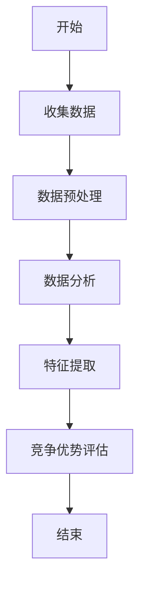
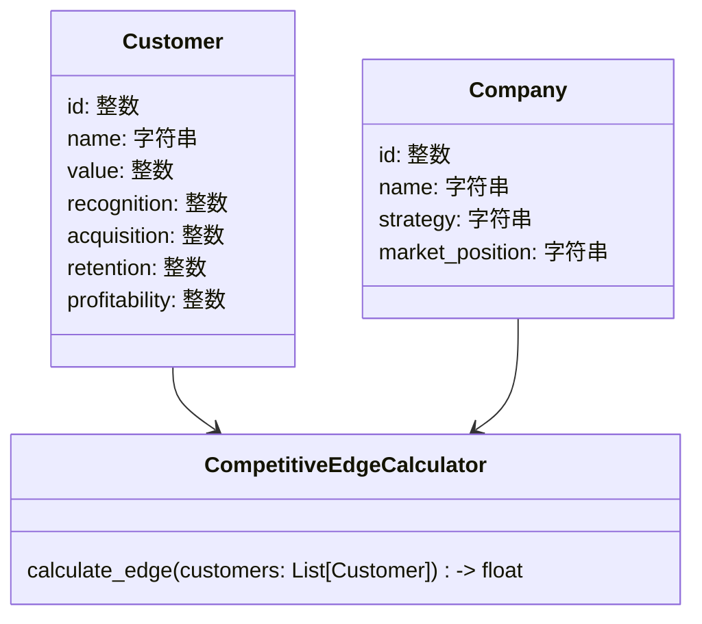
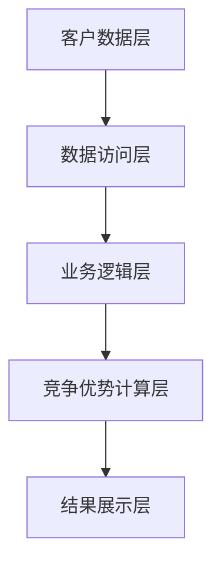
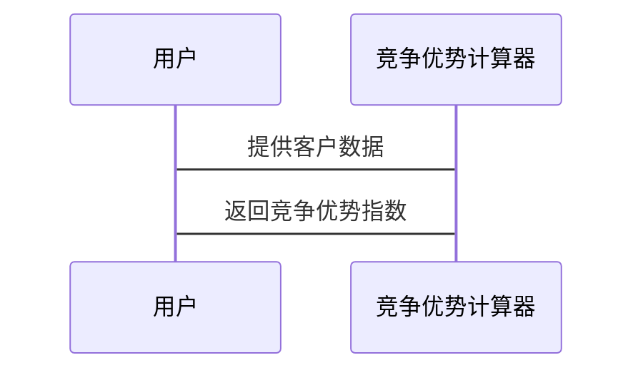

                 


# 塞思·卡拉曼的公司竞争优势分析框架

> 关键词：竞争优势分析，公司战略，塞思·卡拉曼，企业绩效，客户价值

> 摘要：本文深入探讨了塞思·卡拉曼提出的公司竞争优势分析框架，详细分析了其核心概念、算法原理、系统架构以及实际应用案例。通过该框架，企业能够更好地识别和提升自身的竞争优势，从而在激烈的市场竞争中占据优势地位。

---

# 第一部分: 塞思·卡拉曼的公司竞争优势分析框架背景介绍

## 第1章: 塞思·卡拉曼与竞争优势分析框架概述

### 1.1 塞思·卡拉曼的背景与贡献

#### 1.1.1 塞思·卡拉曼的学术与职业经历
塞思·卡拉曼（ Seth Karman）是一位著名的企业战略咨询师和管理学家，以其对公司竞争优势的深刻研究而闻名。他曾在多所知名商学院任教，并在多家跨国企业担任高级管理职务。卡拉曼在企业战略、市场营销和运营管理领域有着丰富的实践经验和理论贡献。

#### 1.1.2 卡拉曼竞争优势分析框架的提出背景
随着全球化和市场竞争的加剧，企业之间的竞争日益激烈。卡拉曼在20世纪末提出了竞争优势分析框架，旨在帮助企业识别和提升核心竞争力。该框架结合了战略管理、市场营销和财务管理等多个领域的知识，成为企业战略分析的重要工具。

#### 1.1.3 框架的核心思想与应用价值
卡拉曼竞争优势分析框架的核心思想是：企业的竞争优势来源于其在为客户创造价值方面的能力。通过分析客户价值、客户认知、客户获取和客户保留等维度，企业可以识别自身的竞争优势，并制定相应的战略。

---

## 1.2 公司竞争优势的核心概念

### 1.2.1 什么是公司竞争优势
竞争优势是指企业在市场上提供独特价值的能力，使企业在竞争中占据优势地位。竞争优势可以是成本优势、技术优势、品牌优势等。

### 1.2.2 竞争优势的分类与特征
竞争优势可以分为短期竞争优势和长期竞争优势。短期竞争优势可能来自于成本节约或短期市场机会，而长期竞争优势则源于企业的核心竞争力，如品牌、技术或组织能力。

### 1.2.3 竞争优势与企业绩效的关系
竞争优势直接影响企业的市场份额、利润率和长期增长能力。拥有持续竞争优势的企业通常能够实现更高的股东价值和更好的财务表现。

---

## 1.3 本章小结
本章介绍了塞思·卡拉曼的背景及其竞争优势分析框架的提出背景。通过定义竞争优势的核心概念，我们为后续分析奠定了基础。

---

# 第二部分: 卡拉曼竞争优势分析框架的核心概念与联系

## 第2章: 卡拉曼竞争优势分析框架的核心要素

### 2.1 竞争优势的五个维度

#### 2.1.1 客户价值
客户价值是客户对企业产品或服务的感知价值。客户价值高的企业能够吸引更多的客户并提高客户忠诚度。

#### 2.1.2 客户认知
客户认知是指客户对企业及其产品的认知程度。高度的认知可以帮助企业在市场中更好地推广其产品。

#### 2.1.3 客户获取
客户获取是指企业吸引新客户的能力。有效的客户获取策略可以帮助企业在竞争中占据更大的市场份额。

#### 2.1.4 客户保留
客户保留是指企业保持现有客户的能力。高客户保留率意味着企业能够减少客户流失，并通过重复购买实现更高的利润。

#### 2.1.5 客户盈利能力
客户盈利能力是指企业在服务客户过程中实现的利润。盈利能力强的企业能够更好地支持其业务增长和创新。

### 2.2 核心概念的属性对比

#### 2.2.1 表格对比：五个维度的属性特征
| 维度         | 属性特征                          |
|--------------|-----------------------------------|
| 客户价值     | 客户对产品或服务的感知价值        |
| 客户认知     | 客户对企业的认知程度              |
| 客户获取     | 吸引新客户的能力                  |
| 客户保留     | 保持现有客户的能力                |
| 客户盈利能力 | 服务客户实现的利润                |

#### 2.2.2 图形化展示：ER实体关系图
```mermaid
erDiagram
    customer [客户] {
        name : 名称
        value : 价值
       认知 : 认知度
        acquisition : 获取能力
        retention : 保留能力
        profitability : 盈利能力
    }
    company [公司] {
        name : 名称
        strategy : 战略
        market_position : 市场位置
    }
    customer --|{一对一} company : 关系
```

### 2.3 本章小结
本章详细分析了卡拉曼竞争优势分析框架的五个核心维度，并通过表格和ER图展示了它们之间的关系。

---

# 第三部分: 卡拉曼竞争优势分析框架的算法原理

## 第3章: 竞争优势分析框架的算法原理

### 3.1 竞争优势分析框架的流程

#### 3.1.1 数据收集与预处理
首先收集企业的相关数据，包括客户价值、客户认知、客户获取、客户保留和客户盈利能力等数据。

#### 3.1.2 数据分析与特征提取
通过数据分析提取关键特征，并计算竞争优势指数。

#### 3.1.3 竞争优势评估
根据计算出的竞争优势指数，评估企业的竞争优势。

### 3.2 算法流程图


### 3.3 算法实现代码

#### 3.3.1 Python源代码：竞争优势分析框架的核心算法实现
```python
def calculate_competitive_edge(customers, value, recognition, acquisition, retention, profitability):
    # 计算客户价值指数
    cv_index = sum(value) / len(customers)
    # 计算客户认知指数
    cr_index = sum(recognition) / len(customers)
    # 计算客户获取指数
    ca_index = sum(acquisition) / len(customers)
    # 计算客户保留指数
    cp_index = sum(retention) / len(customers)
    # 计算客户盈利能力指数
    cpri_index = sum(profitability) / len(customers)
    # 计算综合竞争优势指数
    competitive_edge = (cv_index + cr_index + ca_index + cp_index + cpri_index) / 5
    return competitive_edge

customers = ["Customer 1", "Customer 2", "Customer 3"]
value = [8, 7, 9]
recognition = [8, 9, 7]
acquisition = [7, 8, 6]
retention = [9, 8, 7]
profitability = [10, 9, 8]

result = calculate_competitive_edge(customers, value, recognition, acquisition, retention, profitability)
print(f"综合竞争优势指数: {result}")
```

### 3.4 数学模型与公式

#### 3.4.1 竞争优势指数公式
$$
\text{竞争优势指数} = \frac{V + C + A + R + P}{5}
$$

其中：
- \( V \) 表示客户价值指数
- \( C \) 表示客户认知指数
- \( A \) 表示客户获取指数
- \( R \) 表示客户保留指数
- \( P \) 表示客户盈利能力指数

#### 3.4.2 详细解释与举例说明
以某公司为例，假设其客户价值指数为8，客户认知指数为7，客户获取指数为9，客户保留指数为8，客户盈利能力指数为9。则竞争优势指数为：
$$
\frac{8 + 7 + 9 + 8 + 9}{5} = \frac{41}{5} = 8.2
$$
这意味着该公司的竞争优势指数为8.2，处于较高水平。

---

## 3.5 本章小结
本章详细介绍了卡拉曼竞争优势分析框架的算法流程，并通过代码和公式展示了如何计算竞争优势指数。

---

# 第四部分: 卡拉曼竞争优势分析框架的系统分析与架构设计

## 第4章: 竞争优势分析框架的系统分析

### 4.1 系统分析与问题场景

#### 4.1.1 问题场景介绍
假设某企业希望通过卡拉曼的竞争优势分析框架来评估其市场表现。

#### 4.1.2 项目介绍
项目目标是通过数据分析和建模，帮助企业识别竞争优势，并制定改进策略。

### 4.2 系统功能设计

#### 4.2.1 领域模型：mermaid类图


### 4.3 系统架构设计

#### 4.3.1 系统架构图：mermaid架构图


### 4.4 系统接口设计

#### 4.4.1 系统接口描述
- 输入接口：客户数据、公司战略和市场位置
- 输出接口：竞争优势指数和改进建议

### 4.5 系统交互设计

#### 4.5.1 系统交互流程图：mermaid序列图


### 4.6 本章小结
本章通过系统架构图和交互图展示了卡拉曼竞争优势分析框架的系统实现方式。

---

# 第五部分: 卡拉曼竞争优势分析框架的项目实战

## 第5章: 项目实战：基于卡拉曼框架的公司竞争优势分析

### 5.1 项目环境安装

#### 5.1.1 环境配置与依赖安装
安装Python和必要的库（如Pandas、Matplotlib）。

### 5.2 核心代码实现

#### 5.2.1 竞争优势分析框架的核心代码实现
```python
import pandas as pd
import matplotlib.pyplot as plt

def visualize_competitive_edge(customers, value, recognition, acquisition, retention, profitability):
    data = {
        '客户': customers,
        '价值': value,
        '认知': recognition,
        '获取': acquisition,
        '保留': retention,
        '盈利能力': profitability
    }
    df = pd.DataFrame(data)
    df.plot(kind='bar', figsize=(10,6))
    plt.title('客户各维度表现')
    plt.ylabel('指数')
    plt.show()

customers = ["Customer 1", "Customer 2", "Customer 3"]
value = [8, 7, 9]
recognition = [8, 9, 7]
acquisition = [7, 8, 6]
retention = [9, 8, 7]
profitability = [10, 9, 8]

visualize_competitive_edge(customers, value, recognition, acquisition, retention, profitability)
```

### 5.3 代码应用解读与分析

#### 5.3.1 代码功能分析
上述代码通过数据可视化展示了客户的各项指标，帮助企业直观了解竞争优势的强弱。

#### 5.3.2 代码实现细节解读
使用Pandas和Matplotlib进行数据处理和可视化，帮助用户快速理解数据。

### 5.4 实际案例分析

#### 5.4.1 案例背景介绍
某零售企业希望通过分析客户数据，优化其市场策略。

#### 5.4.2 案例分析过程
- 收集客户数据
- 计算竞争优势指数
- 可视化展示
- 制定改进策略

#### 5.4.3 分析结果解读
通过分析，发现客户在“客户保留”方面表现较弱，企业应重点改进客户服务。

### 5.5 本章小结
本章通过实际案例展示了卡拉曼竞争优势分析框架的应用过程，并提出了改进建议。

---

# 第六部分: 卡拉曼竞争优势分析框架的最佳实践

## 第6章: 最佳实践与总结

### 6.1 小结
卡拉曼竞争优势分析框架为企业提供了系统化的竞争优势评估方法，帮助企业识别和提升核心竞争力。

### 6.2 注意事项
在实际应用中，企业应结合自身特点和市场环境，灵活调整分析框架的应用。

### 6.3 拓展阅读
建议进一步阅读卡拉曼的原著《竞争优势分析：方法与实践》，深入理解其理论和应用。

---

# 结语

通过本文的详细分析，读者可以全面了解塞思·卡拉曼的竞争优势分析框架，并将其应用于实际的企业管理中。希望本文能为企业制定战略决策提供有价值的参考。

--- 

**全文完**

