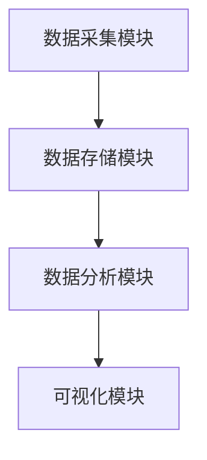
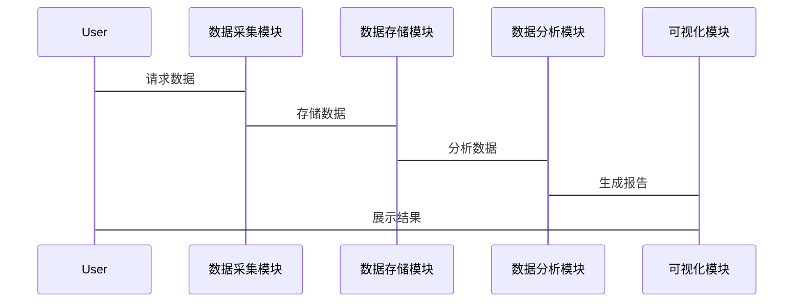

                 

# 塞思·卡拉曼的公司财务报表深度解析

> 关键词：塞思·卡拉曼, 财务报表分析, 投资决策, 财务比率, 公司估值

> 摘要：本文深入解析塞思·卡拉曼的财务报表分析方法，探讨其如何通过财务数据评估公司价值和投资机会。通过系统化的方法，结合实例分析，帮助读者掌握如何利用财务报表做出明智的投资决策。

---

## 第1章: 公司财务报表概述

### 1.1 财务报表的基本概念

#### 1.1.1 财务报表的定义与作用
财务报表是企业在一定会计期间内财务状况和经营成果的总结，主要包括资产负债表、利润表和现金流量表。财务报表的作用在于帮助投资者、债权人等利益相关者评估公司的财务健康状况和盈利能力。

#### 1.1.2 财务报表的主要类型
- 资产负债表：反映企业在某一特定日期的资产、负债和所有者权益的状况。
- 利润表：展示企业在一定会计期间的收入、费用和利润情况。
- 现金流量表：记录企业在一定会计期间内现金的流入和流出情况。

#### 1.1.3 财务报表的使用者与目的
- 投资者：评估公司的盈利能力、成长潜力和风险。
- 债权人：了解公司的偿债能力，评估贷款风险。
- 管理层：监控公司运营效率，优化财务管理。
- 股票分析师：通过财务数据预测公司未来表现。

---

### 1.2 财务报表的核心要素

#### 1.2.1 资产、负债、所有者权益的定义与关系
- 资产：公司拥有或控制的资源，预期能带来经济利益。
- 负债：公司因过去的交易或事件而产生的义务，需在未来偿还。
- 所有者权益：公司资产减去负债后的剩余部分，代表股东对公司的所有权。

#### 1.2.2 收入、费用、利润的构成与计算
- 收入：企业在日常经营活动中产生的经济利益流入。
- 费用：企业在经营过程中发生的各项支出。
- 利润：收入减去费用后的净收益。

#### 1.2.3 财务报表的编制基础与假设
- 财务报表基于持续经营假设，即假设公司在可预见的未来不会破产。
- 财务报表反映的是历史信息，无法预测未来。

---

## 第2章: 财务报表的结构与分析框架

### 2.1 资产负债表分析

#### 2.1.1 资产的分类与评估
资产分为流动资产和非流动资产：
- 流动资产：可以在一年内变现或耗用的资产，如现金、应收账款、存货。
- 非流动资产：无法在一年内变现的资产，如固定资产、无形资产。

#### 2.1.2 负债的分类与偿付顺序
负债分为流动负债和非流动负债：
- 流动负债：需在一年内偿还的债务，如应付账款、短期借款。
- 非流动负债：偿还期限超过一年的债务，如长期借款。

#### 2.1.3 所有者权益的构成与变动
所有者权益包括股本、资本公积、盈余公积和未分配利润等，反映公司净资产的价值。

---

### 2.2 利润表分析

#### 2.2.1 收入的确认与计量
收入确认遵循权责发生制，需满足以下条件：
1. 交易已完成或履行。
2. 收款权利已经产生。
3. 交易的成本能够可靠计量。

#### 2.2.2 费用的分类与控制
费用分为营业成本和期间费用：
- 营业成本：直接与产品或服务相关的成本。
- 期间费用：销售费用、管理费用、研发费用。

#### 2.2.3 利润的计算与影响因素
利润=收入-费用，影响利润的主要因素包括收入增长、成本控制和税率变化。

---

### 2.3 现金流量表分析

#### 2.3.1 现金流入与流出的主要来源
- 经营活动：主营业务产生的现金流。
- 投资活动：购买或出售资产的现金流。
- 筹资活动：股权或债务融资的现金流。

#### 2.3.2 现金流量的结构与健康度评估
健康的现金流结构应具备：
- 经营活动现金流为正，表明公司具备自我造血能力。
- 投资活动现金流流出合理，避免过度投资。
- 筹资活动现金流补充及时，确保公司运营资金充足。

#### 2.3.3 现金流量表与资产负债表、利润表的联系
- 现金流量表反映现金的动态变化，与资产负债表中的现金流项目相衔接。
- 利润表中的净利润与现金流量表中的经营活动现金流存在差异，需通过调整净利润计算经营活动现金流。

---

## 第3章: 财务比率分析与公司估值

### 3.1 财务比率的核心概念

#### 3.1.1 流动比率与速动比率
- 流动比率=流动资产/流动负债，衡量公司短期偿债能力。
- 速动比率=（流动资产-存货）/流动负债，进一步剔除难以变现的存货。

#### 3.1.2 负债比率与权益比率
- 负债比率=总负债/总资产，衡量公司杠杆风险。
- 权益比率=所有者权益/总资产，衡量公司资本结构的稳健性。

#### 3.1.3 营运能力比率与盈利能力比率
- 营运能力比率：如存货周转率、应收账款周转率，衡量公司运营效率。
- 盈利能力比率：如净利率、ROE（净资产收益率），衡量公司盈利能力。

---

### 3.2 财务比率的计算与应用

#### 3.2.1 流动资产与流动负债的比率分析
- 高流动比率表明公司短期偿债能力强，但也可能意味着资金闲置。
- 低流动比率可能表明公司面临短期偿债压力。

#### 3.2.2 净资产收益率与资产回报率的计算
- 净资产收益率（ROE）=净利润/平均净资产，衡量公司使用股东资金的效率。
- 资产回报率（ROA）=净利润/平均总资产，衡量公司整体资产的盈利能力。

#### 3.2.3 现金流量比率与偿债能力评估
- 现金流量比率=经营活动现金流/流动负债，衡量公司短期偿债能力。
- 现金利息保障倍数=经营活动现金流/利息支出，衡量公司支付利息的能力。

---

## 第4章: 塞思·卡拉曼的财务分析方法

### 4.1 投资决策的核心要素

#### 4.1.1 公司基本面分析的重要性
卡拉曼强调基本面分析，认为财务报表是评估公司价值的核心工具。

#### 4.1.2 财务报表在投资决策中的作用
- 通过财务报表识别公司盈利能力、成长性和风险。
- 通过财务比率评估公司估值和投资价值。

#### 4.1.3 卡拉曼的投资理念与方法
- 价值投资：寻找被市场低估的公司。
- 避免过度关注短期市场波动，注重长期投资价值。

---

### 4.2 财务报表分析的实战应用

#### 4.2.1 如何识别低估的公司
- 比较市盈率、市净率等估值指标，寻找低于行业平均水平的公司。
- 结合财务报表分析公司盈利能力和发展潜力。

#### 4.2.2 如何评估管理层的质量
- 通过财务报表分析管理层的财务决策能力和透明度。
- 关注公司财务造假的迹象，如应收账款大幅增加、存货周转率异常等。

#### 4.2.3 如何识别财务造假的线索
- 关注财务数据的合理性，如收入与利润不匹配、现金流与净利润差异过大。
- 分析财务报表附注，识别潜在的财务风险。

---

## 第5章: 财务报表分析的系统架构

### 5.1 数据收集与处理

#### 5.1.1 数据来源与获取方式
- 公司公开披露的财务报表。
- 第三方数据平台（如FactSet、Morningstar）。

#### 5.1.2 数据清洗与标准化
- 清洗缺失值、异常值。
- 标准化数据格式，确保一致性。

#### 5.1.3 数据存储与管理
- 使用数据库存储财务数据。
- 建立数据仓库，便于多维度分析。

---

### 5.2 系统分析与架构设计

#### 5.2.1 系统功能模块划分
- 数据采集模块：负责数据的收集和处理。
- 数据分析模块：包括财务比率计算、估值模型等。
- 可视化模块：生成图表和报告，便于用户理解。

#### 5.2.2 系统架构的Mermaid图

#### 5.2.3 系统接口设计与交互流程

---

## 第6章: 项目实战与案例分析

### 6.1 案例分析: 某公司财务报表解读

#### 6.1.1 公司背景与财务报表数据
假设某公司2022年财务报表数据如下：
- 资产负债表：资产总额10亿元，负债总额6亿元，所有者权益4亿元。
- 利润表：营业收入8亿元，净利润2亿元。
- 现金流量表：经营活动现金流净额3亿元，投资活动现金流净额-2亿元，筹资活动现金流净额1亿元。

#### 6.1.2 资产负债表的详细分析
- 流动资产占比70%，流动负债占比60%，表明公司短期偿债能力较强。
- 所有者权益占比较低，说明公司杠杆较高，存在一定偿债压力。

#### 6.1.3 利润表与现金流量表的解读
- 净利率为2.5%，低于行业平均水平，表明公司盈利能力一般。
- 经营活动现金流净额为正，但投资活动现金流为负，需关注公司资本支出情况。

---

### 6.2 投资决策的实战演练

#### 6.2.1 如何利用财务比率进行估值
- 计算市盈率：2亿元净利润，假设股价为10元，则市盈率=10/0.2=50。
- 计算市净率：4亿元所有者权益，股价10元，则市净率=10/0.4=25。

#### 6.2.2 如何识别潜在的投资机会
- 寻找市盈率和市净率低于行业平均水平的公司。
- 结合财务报表分析公司成长性和风险。

#### 6.2.3 如何制定投资策略与风险管理
- 分散投资，降低风险。
- 定期复评，及时调整投资组合。

---

## 第7章: 总结与最佳实践

### 7.1 总结
财务报表分析是投资决策的核心工具，通过深入分析财务数据，可以帮助投资者识别低估的公司、评估管理层质量、识别财务风险。

### 7.2 最佳实践 tips
- 定期更新财务报表数据，关注公司最新动态。
- 结合宏观经济环境和行业趋势，全面评估公司价值。
- 避免仅依赖单一估值指标，综合运用多种分析方法。

### 7.3 小结
通过系统化的财务报表分析，投资者可以更好地理解公司的财务状况，制定科学的投资策略，实现长期稳健的投资收益。

---

以上是《塞思·卡拉曼的公司财务报表深度解析》的完整目录和内容概要，涵盖了从基础概念到实战应用的各个方面，旨在帮助读者掌握塞思·卡拉曼的财务分析方法，提升投资决策能力。

