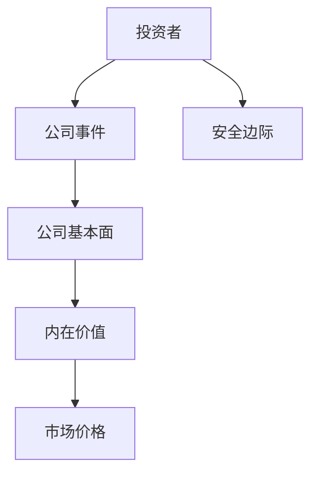
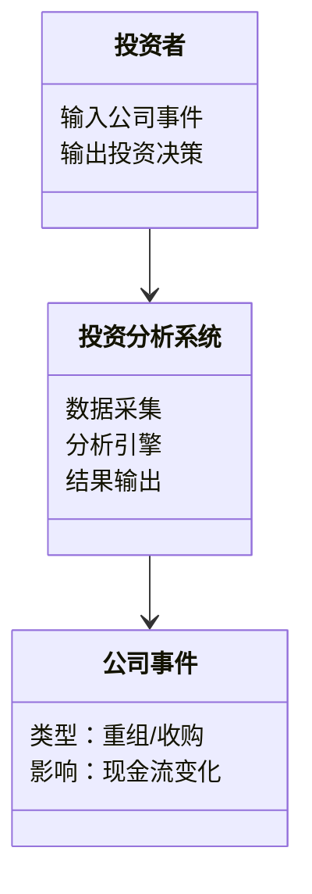

                 


# 塞思·卡拉曼的特殊情况价值投资：从公司事件中获利

> 关键词：价值投资，塞思·卡拉曼，公司事件，特殊情况，投资策略，数学模型

> 摘要：本文深入探讨了塞思·卡拉曼的特殊情况价值投资策略，从公司事件中获利的方法。通过分析公司重组、杠杆收购等特殊情况，结合数学模型和算法，提供了一套系统化的投资分析框架，帮助投资者在复杂市场中识别投资机会，制定科学的投资决策。

---

# 目录

1. 价值投资的基本概念  
   1.1 价值投资的定义与核心理念  
   1.2 特殊情况下的价值投资  
   1.3 从公司事件中获利的逻辑  

2. 价值投资的核心概念与联系  
   2.1 核心概念原理  
   2.2 核心概念对比表格  
   2.3 ER实体关系图  

3. 价值投资的数学模型与公式  
   3.1 数学模型概述  
   3.2 投资价值评估公式  
   3.3 公司事件分析算法  

4. 价值投资的系统分析与架构设计  
   4.1 问题场景介绍  
   4.2 系统功能设计  
   4.3 系统架构设计  
   4.4 系统接口设计  
   4.5 系统交互设计  

5. 价值投资的项目实战  
   5.1 环境安装与数据准备  
   5.2 核心代码实现  
   5.3 案例分析与结果解读  
   5.4 项目小结  

6. 价值投资的最佳实践与小结  
   6.1 投资策略的注意事项  
   6.2 投资决策的未来展望  
   6.3 价值投资的持续学习与优化  

---

# 正文

## 第一部分：价值投资的基本概念

### 1.1 价值投资的定义与核心理念

价值投资是一种投资策略，强调以低于其内在价值的价格购买优质资产。塞思·卡拉曼是该领域的权威，他强调通过分析公司基本面，尤其是特殊情况下的公司事件，来寻找被市场低估的投资机会。

#### 1.1.1 价值投资的起源与发展

价值投资的起源可以追溯到本杰明·格雷厄姆和戴维·多德的工作，他们提出了“安全边际”概念。塞思·卡拉曼继承并发展了这一理论，特别关注公司重组、杠杆收购等特殊情况下的投资机会。

#### 1.1.2 价值投资的核心理念

价值投资的核心理念是寻找市场低估的公司，并长期持有这些公司，直到市场认识到其真实价值。卡拉曼强调，投资成功的关键在于对公司基本面的深入分析，尤其是公司事件对公司价值的影响。

#### 1.1.3 塞思·卡拉曼的价值投资方法

卡拉曼的价值投资方法包括以下几个方面：
1. **深入分析公司基本面**：包括财务报表分析、管理层素质评估等。
2. **识别特殊情况**：如公司重组、杠杆收购、资产剥离等。
3. **评估市场反应**：市场对公司事件的反应往往过于情绪化，投资者需要冷静分析。

### 1.2 特殊情况下的价值投资

#### 1.2.1 特殊情况的定义与分类

特殊情况是指那些可能影响公司价值的事件，如：
- 公司重组
- 杠杆收购
- 资产剥离
- 破产重整
- 收购与合并

#### 1.2.2 特殊情况投资的特点

- **短期市场反应**：市场对特殊情况的反应往往是短期的，这为长期投资者提供了机会。
- **低估值**：在市场恐慌时，优质资产可能被低估。
- **高风险与高回报**：特殊情况投资风险较高，但潜在回报也较大。

#### 1.2.3 从公司事件中获利的逻辑

卡拉曼认为，公司事件通常会导致市场对公司的重新估值。通过分析这些事件，投资者可以找到那些被市场低估的公司，并在市场反应过度时介入。

---

## 第二部分：价值投资的核心概念与联系

### 2.1 核心概念原理

#### 2.1.1 核心要素

价值投资的核心要素包括：
- **内在价值**：公司的真实价值，不依赖于市场波动。
- **安全边际**：购买价格低于内在价值的幅度。
- **公司事件**：影响公司价值的关键事件。

#### 2.1.2 概念属性特征对比表格

| 概念       | 特征描述                                   |
|------------|------------------------------------------|
| 内在价值   | 公司未来现金流的现值                     |
| 安全边际   | 购买价格与内在价值的差额                 |
| 公司事件   | 影响公司价值的特殊事件，如重组、收购等   |

#### 2.1.3 ER实体关系图



---

## 第三部分：价值投资的数学模型与公式

### 3.1 数学模型概述

价值投资的数学模型主要用于评估公司的内在价值和安全边际。

#### 3.1.1 内在价值计算公式

$$ \text{内在价值} = \sum_{t=1}^{n} \frac{\text{现金流}_t}{(1 + r)^t} $$

其中，\( r \) 是折现率，\( \text{现金流}_t \) 是第 \( t \) 年的现金流。

#### 3.1.2 安全边际计算公式

$$ \text{安全边际} = \text{内在价值} - \text{市场价格} $$

---

## 第四部分：价值投资的系统分析与架构设计

### 4.1 问题场景介绍

为了系统化地分析公司事件，我们需要构建一个投资分析系统，包括数据采集、分析引擎和结果输出模块。

### 4.2 系统功能设计



### 4.3 系统架构设计


---

## 第五部分：价值投资的项目实战

### 5.1 环境安装与数据准备

- **环境安装**：安装Python、数据分析库（如Pandas、NumPy）和可视化工具（如Matplotlib）。
- **数据准备**：收集目标公司的财务数据和市场数据。

### 5.2 核心代码实现

```python
import pandas as pd
import numpy as np

def calculate_intrinsic_value(cash_flows, discount_rate):
    return np.sum(cash_flows / (1 + discount_rate)**np.arange(len(cash_flows)))

# 示例数据
cash_flows = [100, 150, 200]
discount_rate = 0.1

iv = calculate_intrinsic_value(cash_flows, discount_rate)
print(f"内在价值：{iv:.2f}")
```

### 5.3 案例分析与结果解读

假设某公司发生重组事件，现金流预测为[200, 300, 400]，折现率为10%。计算内在价值：

$$ \text{内在价值} = \frac{200}{1.1} + \frac{300}{1.1^2} + \frac{400}{1.1^3} \approx 754.71 $$

如果市场价格为700，安全边际为54.71，表明投资该股票具有较高的安全边际。

### 5.4 项目小结

通过代码实现，我们可以快速计算公司的内在价值和安全边际，为投资决策提供科学依据。

---

## 第六部分：价值投资的最佳实践与小结

### 6.1 投资策略的注意事项

- **风险管理**：避免过度集中投资。
- **持续学习**：市场变化快，需不断更新知识。
- **耐心持有**：价值投资需要时间，耐心等待市场回归。

### 6.2 投资决策的未来展望

随着人工智能和大数据技术的发展，未来价值投资将更加依赖于量化分析和系统化决策。

### 6.3 价值投资的持续学习与优化

投资者应不断优化自己的分析模型，结合市场变化调整投资策略。

---

# 结语

通过系统化的方法和深入的分析，塞思·卡拉曼的特殊情况价值投资策略为投资者提供了在复杂市场中获利的可能。希望本文能为投资者提供有价值的参考，帮助他们在投资道路上走得更远。

