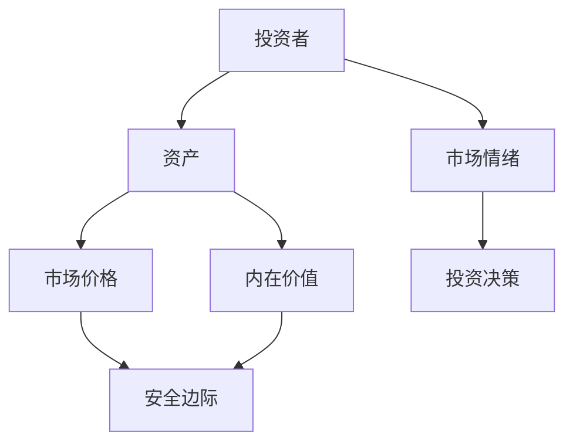
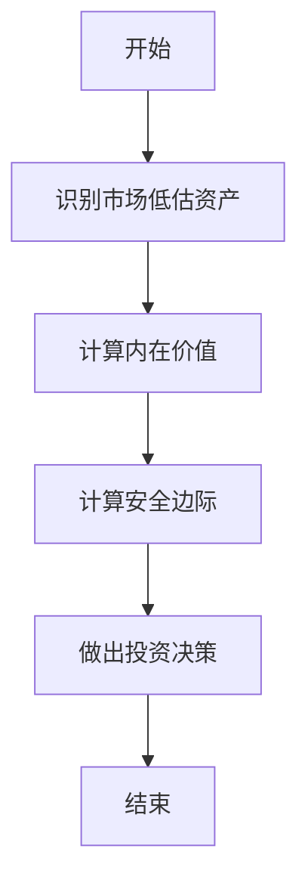
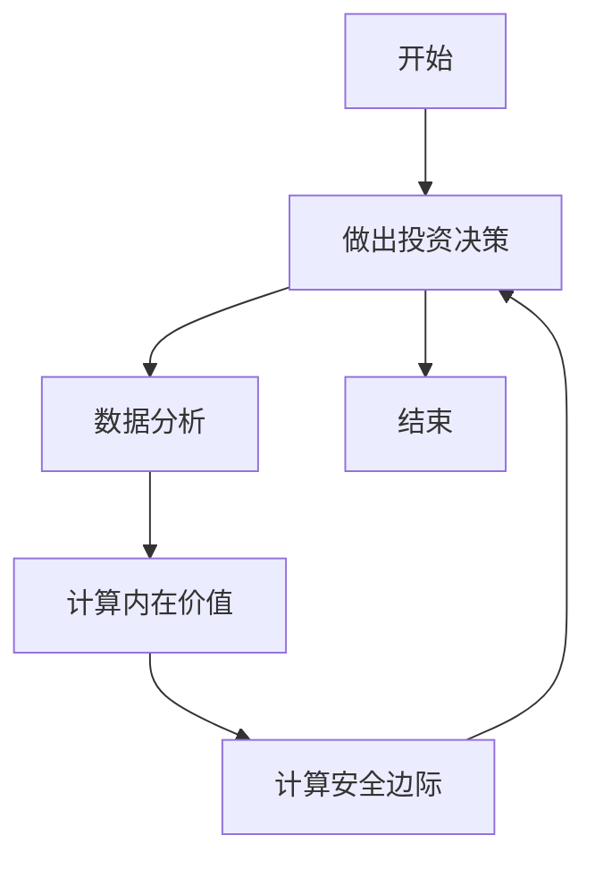
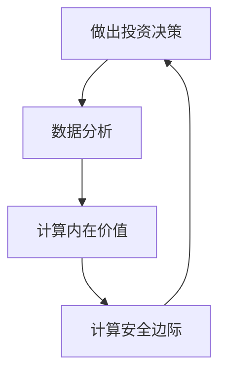

                 


# 塞思·卡拉曼的特殊情况投资

> 关键词：塞思·卡拉曼，安全边际，逆向投资，价值投资，特殊情况投资，投资策略

> 摘要：塞思·卡拉曼是投资领域中一位极具影响力的人物，他以其独特的“特殊情况投资”策略闻名。本文将详细分析卡拉曼的投资理念，探讨其核心概念，包括安全边际、逆向投资等，并通过系统化的分析和实际案例，展示其策略在现代投资中的应用。

---

# 第一部分: 塞思·卡拉曼的生平与投资理念

## 第1章: 塞思·卡拉曼的生平介绍

### 1.1 早年经历与教育背景

塞思·卡拉曼（ Seth Klarman）出生于1956年，成长于波士顿的马萨诸塞州。他在学术上表现出色，进入哈佛大学学习经济学，并于1981年获得学士学位。随后，他在麻省理工学院（MIT）完成了金融数学的硕士学位，这为他后来的投资事业奠定了坚实的理论基础。

### 1.2 投资生涯的起点与发展

卡拉曼的职业生涯始于1980年代初期，当时他进入投资银行界，为机构投资者提供咨询服务。他的敏锐洞察力和对市场的深刻理解使他在职业生涯中迅速崭露头角。1985年，卡拉曼创立了自己的对冲基金公司——Baupost Group，专注于特殊情况投资。该公司的投资策略以“安全边际”为核心，致力于寻找市场低估的机会，尤其是在企业陷入困境时。

### 1.3 卡拉曼投资理念的核心思想

卡拉曼的投资理念深受本杰明·格雷厄姆的影响，他强调以合理的价格投资于具有强大内在价值的企业。卡拉曼的策略主要包括以下几点：
1. **安全边际**：投资时，确保买入价格远低于企业的内在价值，以降低投资风险。
2. **逆向投资**：在市场恐慌时买入被低估的资产，在市场狂热时卖出。
3. **价值投资**：寻找那些被市场忽视或低估的企业，长期持有，等待其价值回归。

---

## 第2章: 特殊情况投资的背景与定义

### 2.1 特殊情况投资的背景分析

特殊情况投资是指在市场中寻找那些由于某种特殊原因导致价格被严重低估的资产或企业。这种投资策略在经济周期的低谷期尤其有效，因为许多企业在市场低迷时会被市场忽视或低估。

### 2.2 特殊情况投资的定义与特点

#### 2.2.1 定义
特殊情况投资是指投资者在市场中寻找那些由于市场失灵、信息不对称或其他特殊原因导致价格低于其内在价值的资产或企业。

#### 2.2.2 核心特点
- **市场低估**：资产的价格远低于其实际价值。
- **逆周期性**：在市场低迷时更容易找到低估资产。
- **高风险与高回报**：由于市场的不确定性，风险较高，但潜在回报也较大。

### 2.3 特殊情况投资的分类与应用场景

#### 2.3.1 不同类型的情况分析
- **企业困境**：企业因管理不善、财务问题或行业衰退导致价值被低估。
- **市场恐慌**：市场恐慌导致资产价格急剧下跌。
- **行业周期**：某些行业在周期低谷时，企业价值被低估。

#### 2.3.2 应用场景
- **困境企业投资**：购买处于困境中的企业债券或股权。
- **市场恐慌期间投资**：在市场恐慌时买入被低估的资产。
- **行业周期低谷投资**：在行业低谷时投资于该行业的龙头企业。

---

## 第3章: 卡拉曼投资策略的核心概念与联系

### 3.1 卡拉曼投资策略的核心概念

#### 3.1.1 安全边际的数学模型

安全边际可以通过以下公式计算：
$$
\text{安全边际} = \text{内在价值} - \text{市场价格}
$$

#### 3.1.2 逆向投资的逻辑框架

逆向投资的逻辑框架可以用以下步骤表示：
1. 识别市场的非理性行为。
2. 分析市场情绪与实际价值的偏离。
3. 在市场低估时买入，在市场高估时卖出。

#### 3.1.3 股票估值的关键指标

股票估值的关键指标包括：
- 市盈率（P/E）：$$ \text{P/E} = \frac{\text{股价}}{\text{每股收益}} $$
- 市净率（P/B）：$$ \text{P/B} = \frac{\text{股价}}{\text{每股净资产}} $$
- 内在价值：通过现金流折现法（DCF）计算。

---

### 3.2 卡拉曼投资策略的概念属性特征对比表格

| 概念       | 描述                               | 关键公式                         |
|------------|------------------------------------|---------------------------------|
| 安全边际   | 内在价值与市场价格的差额           | $$ \text{安全边际} = \text{内在价值} - \text{市场价格} $$ |
| 逆向投资   | 在市场恐慌时买入，在市场狂热时卖出 | 市场情绪与实际价值的偏离         |
| 股票估值   | 通过DCF等方法计算内在价值         | $$ \text{内在价值} = \sum_{t=1}^{n} \frac{\text{现金流}}{(1 + r)^t} $$ |

---

### 3.3 卡拉曼投资策略的ER实体关系图架构

以下是卡拉曼投资策略的实体关系图：



---

## 第4章: 卡拉曼投资策略的算法原理讲解

### 4.1 卡拉曼投资模型的算法流程

以下是卡拉曼投资模型的算法流程图：



---

### 4.2 算法原理的数学模型与公式

#### 4.2.1 安全边际计算的数学公式

$$
\text{安全边际} = \text{内在价值} - \text{市场价格}
$$

#### 4.2.2 逆向投资策略的数学模型

逆向投资策略可以通过以下步骤实现：
1. 计算市场情绪指标（例如恐慌指数）。
2. 比较市场情绪指标与历史平均水平。
3. 在市场情绪低于平均水平时买入，在市场情绪高于平均水平时卖出。

---

### 4.3 算法原理的详细讲解与实例分析

#### 4.3.1 安全边际计算的实例分析

假设某公司的内在价值为$50，市场价格为$30。则安全边际为：
$$
\text{安全边际} = 50 - 30 = 20
$$

---

## 第5章: 卡拉曼投资策略的系统分析与架构设计方案

### 5.1 投资决策系统的总体架构

投资决策系统的总体架构可以用以下步骤表示：



---

### 5.2 投资决策系统的功能模块设计

#### 5.2.1 数据采集模块的功能设计

数据采集模块负责收集以下数据：
- 市场价格
- 财务数据
- 行业数据

---

### 5.2.2 数据分析模块的功能实现

数据分析模块负责：
1. 计算内在价值
2. 计算安全边际
3. 分析市场情绪

---

### 5.2.3 决策支持模块的功能规划

决策支持模块负责：
1. 提供投资建议
2. 监控市场变化
3. 调整投资组合

---

### 5.3 投资决策系统的架构图展示

以下是投资决策系统的架构图：



---

## 第6章: 项目实战

### 6.1 项目背景

假设某公司因行业衰退导致股价暴跌，但其内在价值并未受到影响。

### 6.2 系统核心实现源代码

以下是计算内在价值的Python代码：

```python
def calculate_intrinsic_value(cash_flows, discount_rate):
    present_value = 0
    for year, cash_flow in enumerate(cash_flows):
        present_value += cash_flow / (1 + discount_rate) ** year
    return present_value

cash_flows = [100, 150, 200, 250]
discount_rate = 0.1
intrinsic_value = calculate_intrinsic_value(cash_flows, discount_rate)
print(f"内在价值为：{intrinsic_value}")
```

---

### 6.3 代码应用解读与分析

运行上述代码，可以得到该公司的内在价值。假设计算结果为$500，而市场价格为$300，则安全边际为：
$$
\text{安全边际} = 500 - 300 = 200
$$

---

### 6.4 实际案例分析和详细讲解剖析

在上述案例中，投资者可以利用卡拉曼的策略在市场低估时买入该公司的股票，等待其价值回归。

---

## 第7章: 总结与注意事项

### 7.1 总结

塞思·卡拉曼的特殊情况投资策略以安全边际为核心，强调逆向投资和长期持有。通过系统化的分析和实际案例，我们可以看到，这种策略在市场低估时尤其有效。

### 7.2 注意事项

- **风险管理**：投资者需要严格控制风险，确保安全边际足够大。
- **市场理解**：深入理解市场和企业的基本面，避免盲目跟风。
- **长期视角**：特殊情况投资需要耐心，等待价值回归。

---

## 第8章: 最佳实践与拓展阅读

### 8.1 最佳实践 tips

- 定期评估投资组合的安全边际。
- 保持对市场的敏感性，及时调整投资策略。

### 8.2 小结

塞思·卡拉曼的特殊情况投资策略为投资者提供了一种在市场低谷中寻找机会的方法。通过深入理解其理念和方法，投资者可以在复杂多变的市场中找到成功的路径。

### 8.3 注意事项

- 投资者需要具备扎实的财务分析能力。
- 风险管理是投资成功的关键。

### 8.4 拓展阅读

- 《The Most Successful Investors in the World》
- 《Value Investing: A Research Review》

---

通过以上分析，我们可以看到塞思·卡拉曼的特殊情况投资策略不仅是一种投资方法，更是一种哲学。它教会我们如何在市场中保持冷静，如何在混乱中寻找机会。希望本文能为您提供有价值的见解和启发。

