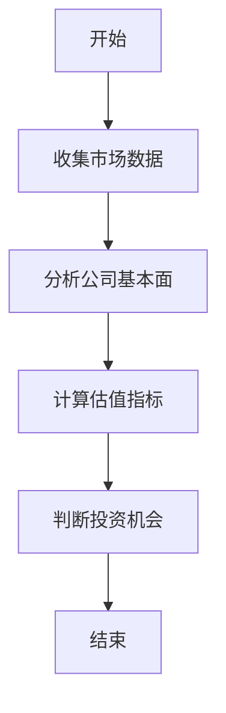
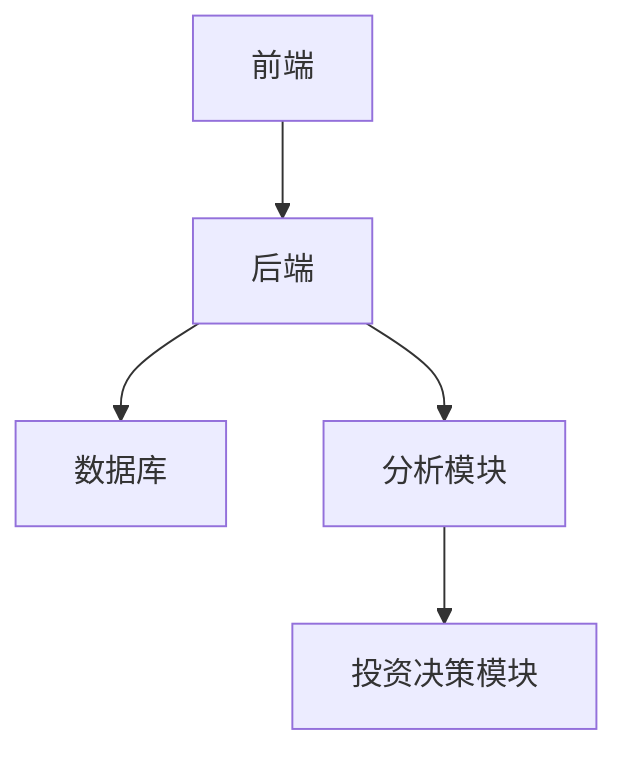

                 


# 塞思·卡拉曼的特殊情况投资案例研究

**关键词**：塞思·卡拉曼、特殊情况投资、投资案例、价值评估模型、投资策略

**摘要**：本文深入分析塞思·卡拉曼的特殊情况投资案例，探讨其独特的投资策略和方法。通过对卡拉曼投资模型的详细解读，结合实际案例分析，揭示如何在复杂市场中识别和利用特殊情况，帮助读者掌握高效的投资方法。

---

## 正文

### 第1章：特殊情况投资的背景与概念

#### 1.1 问题背景

- **投资领域的复杂性**：投资市场充满不确定性，投资者需应对市场波动、经济变化等多重挑战。
- **特殊情况投资的定义**：指在特定市场环境下，利用独特的机会或优势进行投资，通常涉及高风险和高回报。
- **塞思·卡拉曼的地位**：作为投资大师，卡拉曼以其独特的方法在特殊情况下取得显著成功。

#### 1.2 问题描述

- **投资者面临的挑战**：市场波动、信息不对称、投资机会的不确定性。
- **特殊情况投资的特殊性**：机会独特、时间敏感、高风险高回报。
- **卡拉曼投资方法的独特性**：强调基本面分析和逆向投资，善于在市场低谷时寻找机会。

#### 1.3 问题解决

- **卡拉曼的投资策略**：专注于价值投资，寻找被低估的资产。
- **如何应对特殊情况**：通过深入分析和严格筛选，识别具有长期潜力的投资标的。
- **投资决策的关键因素**：基本面分析、市场趋势、团队研究能力。

#### 1.4 边界与外延

- **投资范围的界定**：专注于特定行业或资产类别，避免分散投资。
- **特殊情况的识别标准**：低估值、高壁垒、管理优秀。
- **投资策略的适用范围**：适用于市场低迷或结构性调整时期。

#### 1.5 概念结构与核心要素

- **投资模型的核心要素**：价值评估、风险控制、市场时机。
- **模型的输入与输出**：输入市场数据和公司基本面，输出投资建议和风险评估。
- **模型的逻辑关系**：通过分析公司基本面和市场趋势，评估其投资价值。

---

### 第2章：卡拉曼投资模型的核心概念

#### 2.1 投资模型的原理

- **基本原理**：通过基本面分析和逆向投资，寻找被市场低估的机会。
- **数学基础**：运用财务指标和估值模型，如市盈率、市净率等。
- **适用场景**：市场低迷、行业整合、经济周期低谷。

#### 2.2 核心概念的属性对比

| 属性 | 定义 | 特征 | 关系 |
|------|------|------|------|
| 价值评估 | 公司内在价值 | 相对于市场价格 | 核心驱动因素 |
| 风险控制 | 投资风险 | 通过分散投资降低 | 保障投资安全 |
| 市场时机 | 投资时机 | 基于市场周期判断 | 提高投资收益 |

#### 2.3 ER实体关系图

```mermaid
erd
    项目
    ----> 市场数据
    项目
    ----> 公司基本面
    项目
    ----> 投资策略
```

---

### 第3章：卡拉曼投资模型的算法原理

#### 3.1 算法原理概述



- **代码实现**：

```python
def calculate_value(company_data):
    # 计算市盈率
    pe = company_data['市盈率']
    # 计算市净率
    pb = company_data['市净率']
    # 判断是否低估
    if pe < 市场平均pe and pb < 市场平均pb:
        return "投资机会"
    else:
        return "无投资机会"
```

- **数学模型**：

$$
\text{投资价值} = \text{内在价值} - \text{市场价格}
$$

---

### 第4章：系统分析与架构设计方案

#### 4.1 问题场景介绍

- **系统目标**：构建一个基于卡拉曼模型的投资分析系统，帮助投资者识别特殊情况投资机会。

#### 4.2 系统功能设计


#### 4.3 系统架构设计



---

### 第5章：项目实战与最佳实践

#### 5.1 项目实战

- **环境安装**：安装Python和相关库（如Pandas、NumPy）。
- **核心代码实现**：

```python
import pandas as pd

def analyze_company(company_data):
    # 计算市盈率和市净率
    pe = company_data['市盈率']
    pb = company_data['市净率']
    # 判断是否低估
    if pe < 市场平均pe and pb < 市场平均pb:
        return "投资机会"
    else:
        return "无投资机会"
```

- **案例分析**：分析某公司数据，得出投资建议，并解释分析过程。

#### 5.2 最佳实践

- **小结**：卡拉曼的特殊投资策略强调基本面分析和逆向投资，帮助投资者在复杂市场中找到机会。
- **注意事项**：投资者需具备深入的行业知识和分析能力，严格控制风险。
- **拓展阅读**：建议阅读卡拉曼的经典著作，深入学习其投资理念。

---

### 总结

通过本文的分析，读者可以深入理解塞思·卡拉曼的特殊情况投资策略，并在实际投资中灵活运用这些方法，提高投资效率和成功率。

