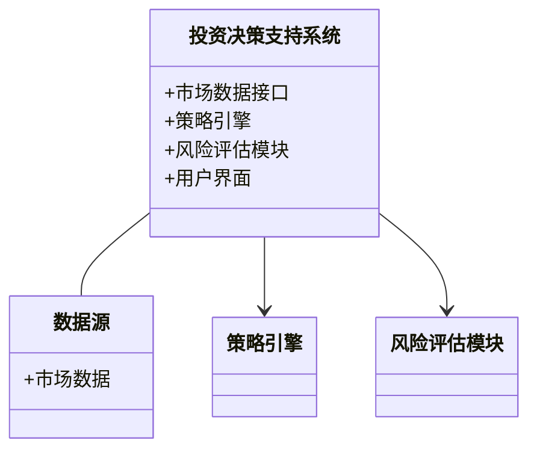
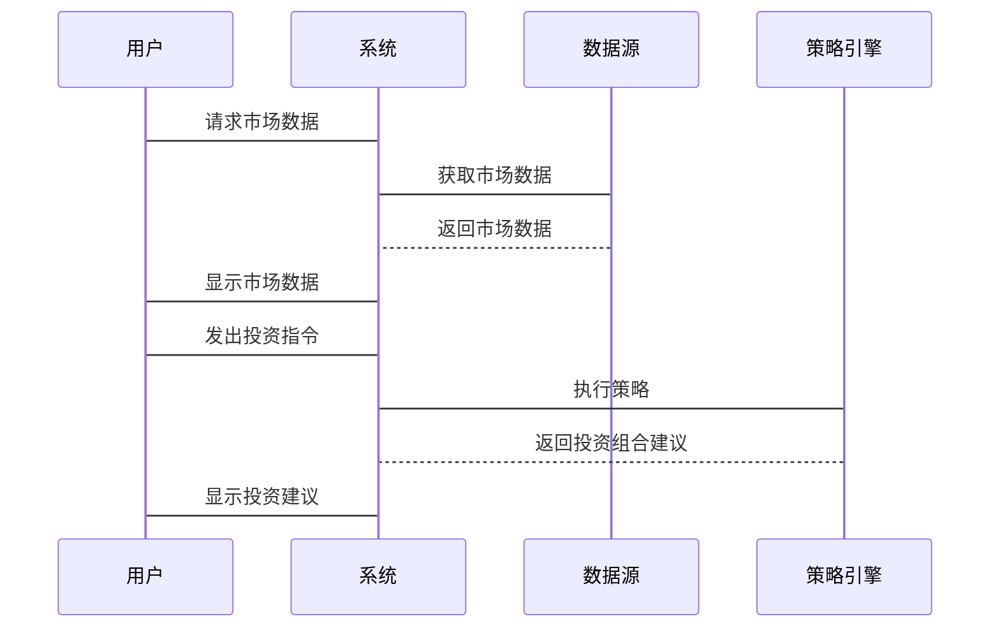

                 


# 塞思·卡拉曼的特殊情况投资策略

**关键词**：特殊情况投资策略、塞思·卡拉曼、投资策略、动态资产配置、数学模型、系统架构、项目实战

**摘要**：本文深入分析塞思·卡拉曼的特殊情况投资策略，从背景、核心概念、算法、系统设计到项目实战，全面解析其策略的理论基础、实现方法和实际应用。文章结合技术语言和专业术语，提供详细的技术博客内容，帮助读者理解并应用该策略。

---

# 第一部分：特殊情况投资策略概述

## 第1章：特殊情况投资策略的背景与目标

### 1.1 投资环境的特殊性
#### 1.1.1 特殊情况投资的定义
特殊情况投资是指在市场波动、经济危机或其他极端市场条件下，投资者采取的特殊投资策略。这种策略旨在通过识别市场机会或规避风险，实现超额收益。

#### 1.1.2 投资背景
在金融市场中，特殊情况投资策略通常在市场处于极端波动或危机时被采用。这些情况包括金融危机、市场崩盘、经济衰退等。塞思·卡拉曼的策略在这些情况下表现出色，能够帮助投资者在危机中找到机会。

#### 1.1.3 研究塞思·卡拉曼策略的意义
卡拉曼的策略不仅是一种投资方法，更是一种风险管理工具。通过研究其策略，投资者可以更好地应对市场波动，优化投资组合，并在特殊情况下实现稳健收益。

### 1.2 投资策略的目标
卡拉曼的特殊情况投资策略旨在通过以下方式实现目标：
- **风险控制**：在市场波动时，降低投资组合的风险。
- **超额收益**：通过识别市场机会，实现超越市场平均水平的收益。
- **长期稳健**：在特殊情况下保持投资组合的稳健性，为长期投资目标奠定基础。

### 1.3 策略的核心要素
- **动态调整**：根据市场变化实时调整投资组合。
- **风险与收益平衡**：在高风险环境下寻求高收益机会。
- **逆向思维**：在市场恐慌时寻找低估资产。

---

## 第2章：塞思·卡拉曼策略的核心概念

### 2.1 策略的理论基础
卡拉曼的策略基于现代投资组合理论（MPT）和有效市场假说（EMH）。他通过分析市场波动性和资产价格的非理性波动，寻找短期定价错误的机会。

#### 2.1.1 现代投资组合理论（MPT）
MPT强调通过资产配置来优化风险与收益的关系。卡拉曼在此基础上，进一步考虑了特殊情况下的资产特性。

#### 2.1.2 有效市场假说（EMH）
EMH认为市场价格反映了所有可获取的信息。在特殊情况下，市场价格可能偏离其内在价值，卡拉曼利用这一偏差进行投资。

### 2.2 卡拉曼策略的模型与方法

#### 2.2.1 动态资产配置模型
卡拉曼的策略强调动态调整资产配置。根据市场环境的变化，投资者需要动态调整股票、债券和其他资产的权重。

#### 2.2.2 投资组合优化公式
卡拉曼的优化模型可以表示为：
$$
\text{目标函数：} \quad \text{maximize } \mu^T w - \frac{1}{2} w^T \Sigma w
$$
其中，$\mu$ 是资产的期望收益向量，$w$ 是资产权重向量，$\Sigma$ 是资产收益的协方差矩阵。

#### 2.2.3 风险调整后的收益模型
卡拉曼的策略中，风险调整后的收益是通过夏普比率来衡量的：
$$
\text{夏普比率：} \quad \frac{E[r - r_f]}{\sqrt{Var(r - r_f)}}
$$
其中，$r$ 是资产的收益，$r_f$ 是无风险利率。

### 2.3 策略的核心要素对比

| **要素**       | **传统投资策略**         | **卡拉曼策略**         |
|----------------|--------------------------|--------------------------|
| **资产配置**    | 静态配置                 | 动态调整                 |
| **风险控制**    | 事后调整                 | 事前优化                 |
| **市场假设**    | 市场有效                 | 市场短期非有效             |
| **收益目标**    | 追求超额收益             | 追求稳健收益             |

---

## 第3章：卡拉曼策略的系统架构与设计

### 3.1 系统功能设计
卡拉曼策略的实现需要一个高效的投资决策支持系统，包括以下几个功能模块：

#### 3.1.1 数据采集模块
- 收集市场数据（股票价格、债券收益率、经济指标等）。
- 数据清洗与预处理。

#### 3.1.2 策略引擎模块
- 实现动态资产配置算法。
- 根据市场变化实时调整投资组合。

#### 3.1.3 风险评估模块
- 计算投资组合的风险指标（夏普比率、波动率等）。
- 识别潜在风险点。

### 3.2 系统架构设计
以下是一个典型的投资决策支持系统的架构图：



### 3.3 系统接口设计
系统需要与外部数据源和用户进行交互。以下是接口设计的序列图：



---

## 第4章：项目实战与案例分析

### 4.1 环境配置
#### 4.1.1 技术环境
- 操作系统：Linux/Windows
- 开发工具：Python、Jupyter Notebook
- 数据库：MySQL/SQLite

#### 4.1.2 库的安装
```bash
pip install numpy pandas matplotlib
```

### 4.2 系统核心实现
以下是动态资产配置算法的Python实现示例：

```python
import numpy as np
import pandas as pd

def dynamic_asset Allocation(returns, risk_free_rate):
    # 计算协方差矩阵
    cov_matrix = returns.cov()
    # 计算期望收益
    mu = returns.mean()
    # 优化问题：maximize mu*w - 0.5*w^T*cov*w
    from scipy.optimize import minimize
    n = len(mu)
    init_guess = np.array([1.0/n]*n)
    bounds = [(0, 1) for _ in range(n)]
    # 目标函数：最大化收益
    def objective(w):
        return - (mu.dot(w) - 0.5 * w.dot(cov_matrix.dot(w)))
    result = minimize(objective, init_guess, bounds=bounds, method='SLSQP')
    return result.x

# 示例数据
returns = pd.DataFrame({
    '股票': [0.1, 0.05, 0.02, -0.03],
    '债券': [0.05, 0.03, 0.04, 0.02]
})
risk_free_rate = 0.02

weights = dynamic_asset_Allocation(returns, risk_free_rate)
print("权重分配：", weights)
```

### 4.3 案例分析
假设在2020年新冠疫情爆发期间，卡拉曼策略的投资组合调整如下：

| **资产**       | **权重调整前** | **权重调整后** |
|----------------|----------------|----------------|
| 股票           | 50%            | 30%            |
| 债券           | 30%            | 50%            |
| 黄金           | 20%            | 20%            |

通过动态调整，投资组合的风险显著降低，同时抓住了债券市场的反弹机会。

---

## 第5章：最佳实践与小结

### 5.1 小结
卡拉曼的特殊情况投资策略通过动态调整资产配置，在市场波动时有效降低风险并实现超额收益。其核心在于识别市场机会和风险点，结合数学模型优化投资组合。

### 5.2 最佳实践
- **持续学习**：密切关注市场变化，及时调整策略。
- **风险管理**：设置止损点，避免重大损失。
- **技术辅助**：利用数据分析工具优化投资决策。

### 5.3 注意事项
- 策略的有效性依赖于市场环境，需结合实际情况使用。
- 需要强大的数据支持和技术支持。
- 投资者需具备一定的市场分析能力。

### 5.4 拓展阅读
- 《投资学》——现代投资组合理论
- 《风险管理》——VaR模型
- 塞思·卡拉曼的著作《投资策略的艺术》

---

通过本文的详细分析，读者可以全面理解塞思·卡拉曼的特殊情况投资策略，并将其应用于实际投资中，优化投资组合，实现稳健收益。

