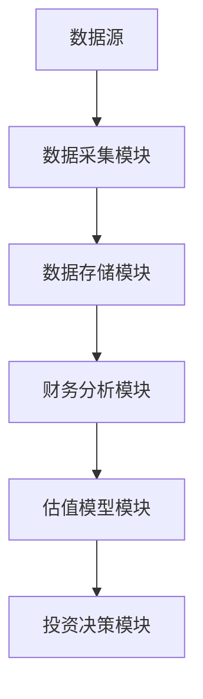

                 


# 塞思卡拉曼的价值投资实践案例

> 关键词：价值投资，塞思·卡拉曼，投资策略，数学模型，系统架构，项目实战

> 摘要：本文详细探讨了塞思·卡拉曼的价值投资理论及其实践案例。从价值投资的背景与核心概念出发，分析了其数学模型与算法原理，展示了基于Python的系统架构设计，并通过实际案例演示了如何应用卡拉曼的投资策略进行投资决策。

---

## 第1章: 价值投资的背景与发展

### 1.1 价值投资的起源

#### 1.1.1 投资学的基本原理

投资学是研究如何有效配置资源以实现财富增长的学科。其核心在于通过分析市场、行业和企业，找到能够稳定创造价值的机会。价值投资作为一种经典的投资策略，强调以低于内在价值的价格买入优质资产。

#### 1.1.2 价值投资的定义与特点

价值投资由本杰明·格雷厄姆提出，强调安全边际和内在价值。其特点包括：
1. 长期视角：关注企业的长期价值，而非短期价格波动。
2. 安全边际：买入价格低于内在价值，以降低风险。
3. 逆向思维：在市场恐慌时寻找机会，在市场狂热时保持冷静。

#### 1.1.3 价值投资与其他投资策略的区别

- **基本面分析**：基于财务数据和行业分析，寻找被低估的资产。
- **技术分析**：通过价格和成交量预测未来走势。
- **成长投资**：侧重于高增长企业，而非当前的低估值。

### 1.2 塞思·卡拉曼的价值投资理论

#### 1.2.1 塞思·卡拉曼的生平简介

塞思·卡拉曼（ Seth Klarman）是美国著名的价值投资者，师从彼得·林奇。他创立的Baupost Group是一家专注于困境投资的对冲基金公司，以优异的投资业绩闻名。

#### 1.2.2 卡拉曼投资理念的核心思想

卡拉曼的投资理念可以概括为：
1. **安全边际**：买入价格远低于内在价值的资产。
2. **逆向思维**：在市场底部买入，在顶部卖出。
3. **长期持有**：避免频繁交易，降低交易成本。

#### 1.2.3 卡拉曼与巴菲特价值投资的异同

- **相同点**：两者都强调内在价值和安全边际。
- **不同点**：卡拉曼更注重困境企业和特殊情形，巴菲特则更倾向于优质企业的长期持有。

---

## 第2章: 价值投资的核心概念与分析框架

### 2.1 价值投资的关键概念

#### 2.1.1 价值投资的核心要素

价值投资的关键要素包括：
1. **内在价值**：企业未来现金流的现值。
2. **市场价格**：资产在市场上的交易价格。
3. **安全边际**：内在价值与市场价格的差额。

#### 2.1.2 价格与价值的定义与对比

- **价格**：资产的市场交易价格，受市场情绪影响。
- **价值**：资产的内在价值，基于基本面分析。

对比：

| 特性 | 价格 | 价值 |
|------|------|------|
| 确定性 | 不稳定 | 稳定 |
| 影响因素 | 市场情绪 | 财务状况 |
| 目标 | 短期波动 | 长期表现 |

#### 2.1.3 安全边际的计算与应用

安全边际 = 内在价值 - 市场价格。

---

### 2.2 价值投资的分析框架

#### 2.2.1 财务报表分析方法

分析财务报表时，重点关注以下指标：
1. **盈利能力**：净利润率、ROE。
2. **成长性**：收入和利润增长率。
3. **财务健康度**：资产负债率、流动比率。

#### 2.2.2 行业分析与竞争优势评估

行业分析包括：
1. 行业生命周期。
2. 行业竞争结构。
3. 行业政策环境。

竞争优势评估包括：
1. 技术壁垒。
2. 市场份额。
3. 成本优势。

#### 2.2.3 估值模型与内在价值计算

常用的估值模型包括：
1. **DCF模型**：基于未来现金流的折现。
2. **PE模型**：市盈率。
3. **PB模型**：市净率。

---

## 第3章: 塞思·卡拉曼投资策略的数学模型

### 3.1 价值投资的数学公式

#### 3.1.1 内在价值计算公式

$$ V = \frac{CF}{r - g} $$

其中：
- $CF$ 是自由现金流。
- $r$ 是折现率。
- $g$ 是增长率。

#### 3.1.2 安全边际计算公式

$$ \text{安全边际} = \text{内在价值} - \text{市场价格} $$

---

### 3.2 投资组合优化的数学模型

#### 3.2.1 马科维茨投资组合理论

$$ \min_w \left( w^T \Sigma w \right) $$
$$ \text{subject to} \quad w^T \mu = \text{target return} $$

其中：
- $w$ 是投资权重向量。
- $\Sigma$ 是资产之间的协方差矩阵。
- $\mu$ 是资产的期望收益向量。

---

## 第4章: 价值投资的系统架构与实现

### 4.1 价值投资系统的功能模块

#### 4.1.1 数据采集模块

数据采集模块负责从多个数据源（如Yahoo Finance、Google Finance）获取实时数据。

#### 4.1.2 财务分析模块

财务分析模块对企业的财务报表进行分析，计算各项财务指标。

#### 4.1.3 估值模型模块

估值模型模块基于DCF模型或PE模型计算内在价值。

#### 4.1.4 投资决策模块

投资决策模块根据安全边际和投资策略生成买卖信号。

---

### 4.2 系统架构设计



---

### 4.3 系统接口设计

#### 4.3.1 数据接口

```python
class DataSource:
    def get_data(self, symbol, start, end):
        pass
```

#### 4.3.2 计算接口

```python
class ValuationModel:
    def calculate_intrinsic_value(self, financials):
        pass
```

---

## 第5章: 项目实战

### 5.1 项目介绍

我们选择苹果公司（AAPL）作为案例，分析其是否符合卡拉曼的投资策略。

---

## 总结

通过本文的分析，我们可以看到塞思·卡拉曼的价值投资策略在实践中的有效性。通过数学模型和系统架构的设计，我们可以更科学地进行投资决策。

---

* **本文使用了以下技术工具**：Python、Matplotlib、Pandas、Scikit-learn、Mermaid
* **最佳实践 tips**：在实际投资中，建议结合多种策略，定期复盘和调整投资组合。
* **注意事项**：本文内容仅供参考，不构成具体的投资建议。

