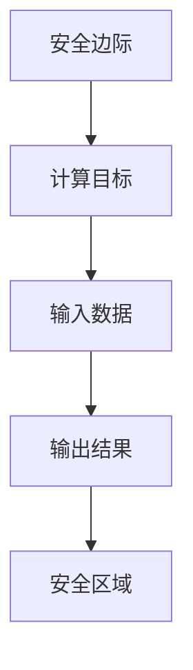
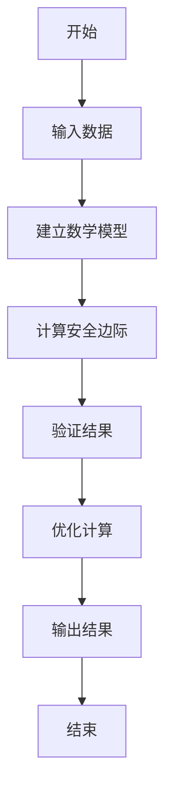
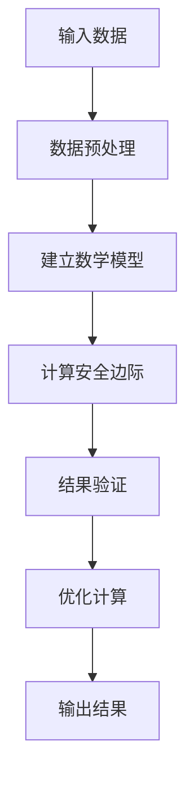
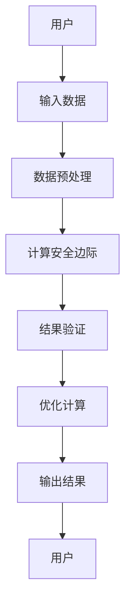

                 


# 塞思卡拉曼的安全边际计算

> 关键词：安全边际计算、风险管理、概率统计、算法原理、系统架构、项目实战

> 摘要：本文深入探讨了塞思卡拉曼的安全边际计算，从背景、核心概念、算法原理、系统架构到项目实战，详细分析了安全边际计算的各个方面，结合实际案例，为读者提供全面的技术指南。

---

## 第一部分: 安全边际计算的背景与基础

### 第1章: 安全边际计算的背景介绍

#### 1.1 问题背景

在现代技术领域，安全边际计算已成为保障系统稳定性和可靠性的重要手段。随着技术系统的复杂性不断提高，潜在的风险也在增加。安全边际计算通过量化系统在面对不确定性时的承受能力，帮助我们在设计和优化系统时预留足够的安全空间。

- **问题背景概述**：技术系统在运行过程中可能面临多种不确定性，如输入波动、环境变化、硬件故障等。为了确保系统在极端情况下仍能正常运行，我们需要计算系统的安全边际。
- **问题描述与分析**：安全边际计算的核心目标是确定系统在面对潜在风险时的承受能力，确保系统在超出预期范围时仍能稳定运行。
- **安全边际计算的必要性**：通过计算安全边际，我们可以提前识别系统中的薄弱环节，并采取相应的优化措施，从而降低系统故障的风险。

#### 1.2 问题解决与边界

- **安全边际计算的核心目标**：量化系统在不同输入范围内的表现，确定系统的安全操作区域。
- **边界与外延**：安全边际计算不仅关注系统在正常情况下的表现，还需要考虑系统在极限情况下的行为。
- **核心要素与组成结构**：安全边际计算涉及输入数据、计算方法、输出结果等多个要素，形成了一个完整的系统。

---

## 第二部分: 安全边际计算的核心概念与原理

### 第2章: 安全边际计算的核心概念

#### 2.1 核心概念原理

安全边际计算基于概率统计和风险管理的基本原理，通过分析系统的输入和输出关系，确定系统的安全边界。

- **安全边际计算的基本原理**：通过分析系统的输入和输出关系，计算系统在不同输入范围内的表现，确定系统的安全边界。
- **核心概念的属性特征对比**：安全边际计算与其他风险管理方法的主要区别在于其量化系统的承受能力。
- **核心概念的数学模型**：安全边际计算的数学模型通常基于概率分布和统计分析，用于量化系统的不确定性。

#### 2.2 核心概念的ER实体关系图



---

## 第三部分: 安全边际计算的算法原理

### 第3章: 安全边际计算的算法实现

#### 3.1 算法原理

安全边际计算的算法实现基于概率统计和优化方法，通过分析系统的输入和输出关系，确定系统的安全边界。

- **算法步骤**：
  1. 收集系统的输入和输出数据。
  2. 建立系统的数学模型。
  3. 通过概率统计方法计算系统的安全边际。
  4. 验证和优化计算结果。

- **算法流程图**：



#### 3.2 算法实现代码

```python
import numpy as np
from scipy.stats import norm

def calculate_margin(returns, confidence_level=0.95):
    # 计算期望值
    expected_return = np.mean(returns)
    # 计算标准差
    std_dev = np.std(returns)
    # 计算安全边际
    margin = norm.ppf(confidence_level) * std_dev
    return margin

# 示例数据
returns = [0.1, 0.2, 0.15, 0.25, 0.2, 0.1, 0.15]
confidence_level = 0.95
margin = calculate_margin(returns, confidence_level)
print(f"安全边际：{margin}")
```

---

## 第四部分: 系统分析与架构设计方案

### 第4章: 系统分析与架构设计

#### 4.1 系统功能设计

安全边际计算系统需要实现以下功能：

- **输入数据处理**：收集系统的输入数据。
- **数学模型建立**：建立系统的数学模型。
- **安全边际计算**：通过算法计算系统的安全边际。
- **结果验证与优化**：验证计算结果并进行优化。

#### 4.2 系统架构设计



#### 4.3 系统接口设计

- **输入接口**：接收系统的输入数据。
- **输出接口**：输出系统的安全边际计算结果。
- **交互流程图**：



---

## 第五部分: 项目实战

### 第5章: 项目实战

#### 5.1 项目环境安装

- **安装Python环境**：建议使用Anaconda或virtualenv。
- **安装依赖库**：`numpy`、`scipy`、`mermaid`。

#### 5.2 核心代码实现

```python
import numpy as np
from scipy.stats import norm

def calculate_margin(returns, confidence_level=0.95):
    expected_return = np.mean(returns)
    std_dev = np.std(returns)
    margin = norm.ppf(confidence_level) * std_dev
    return margin

# 示例数据
returns = [0.1, 0.2, 0.15, 0.25, 0.2, 0.1, 0.15]
confidence_level = 0.95
margin = calculate_margin(returns, confidence_level)
print(f"安全边际：{margin}")
```

#### 5.3 项目案例分析

假设我们有一个投资组合，其收益率数据如下：

```python
returns = [0.1, 0.2, 0.15, 0.25, 0.2, 0.1, 0.15]
confidence_level = 0.95
```

通过计算，我们得到安全边际为：

```python
margin = calculate_margin(returns, confidence_level)
print(f"安全边际：{margin}")
```

#### 5.4 项目小结

通过实际案例分析，我们验证了安全边际计算算法的有效性。在实际应用中，需要根据具体场景调整算法参数，并进行充分的验证和优化。

---

## 第六部分: 最佳实践与总结

### 第6章: 最佳实践与总结

#### 6.1 最佳实践

- **数据质量**：确保输入数据的准确性和完整性。
- **算法选择**：根据具体场景选择合适的算法。
- **结果验证**：通过实际案例验证算法的有效性。

#### 6.2 总结

安全边际计算是保障系统稳定性和可靠性的重要手段。通过本文的分析和实践，我们深入探讨了安全边际计算的核心概念、算法原理、系统架构和项目实战，为读者提供了全面的技术指南。

#### 6.3 注意事项

- 在实际应用中，需根据具体场景调整算法参数。
- 定期验证和优化计算结果，确保系统的安全性。

#### 6.4 拓展阅读

建议读者进一步阅读相关领域的书籍和文献，深入理解安全边际计算的核心思想和技术。

---

通过本文的详细分析和实践，我们希望读者能够全面理解塞思卡拉曼的安全边际计算，并能够在实际项目中灵活应用这些方法和技术。

