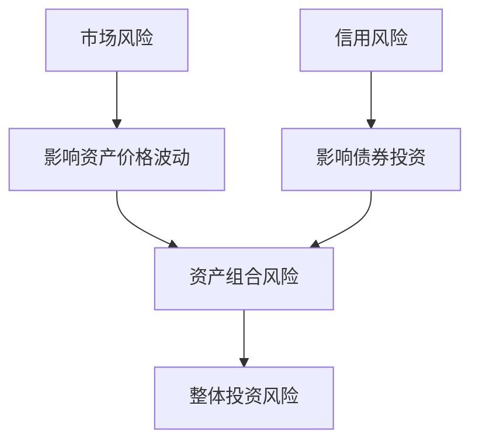
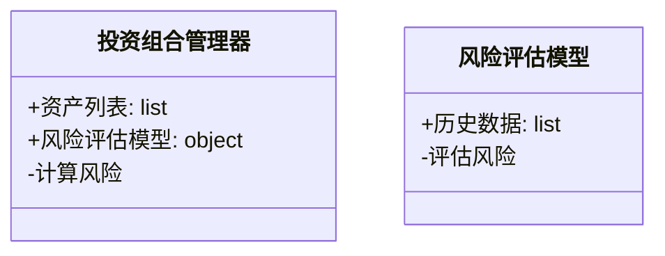

                 


# 塞思卡拉曼的投资风险评估

## 关键词：投资风险评估，塞思·卡拉曼，价值投资，风险模型，Python代码实现

## 摘要：本文系统地探讨了塞思·卡拉曼的投资风险评估方法，从理论基础到实际应用，详细分析了其核心概念、数学模型和系统架构。通过案例分析和代码实现，展示了如何在实际投资中应用这些方法，帮助投资者做出更明智的决策。

---

## 第一部分：投资风险评估基础

### 第1章：投资风险概述

#### 1.1 风险的定义与分类
- **风险的定义**：投资风险是指投资的未来收益的不确定性，通常表现为收益波动或本金损失的可能性。
- **风险的分类**：根据来源分为市场风险、流动性风险、信用风险等。
- **风险与收益的关系**：高风险通常意味着高收益，但并非绝对。

#### 1.2 投资风险的重要性
- **风险管理的重要性**：是投资决策的核心，直接影响投资组合的稳定性和收益。
- **风险与决策的关系**：通过量化风险，投资者可以更好地平衡风险与收益。

#### 1.3 塞思·卡拉曼的理论基础
- **简介**：塞思·卡拉曼是价值投资的倡导者，强调安全边际和深入的分析。
- **核心思想**：通过基本面分析，寻找被市场低估的资产，降低投资风险。

---

## 第二部分：塞思·卡拉曼的风险评估方法

### 第2章：风险评估的核心概念

#### 2.1 风险评估的原理
- **原理**：通过量化分析和基本面研究，识别和评估投资中的潜在风险。

#### 2.2 核心概念与联系

| 风险类型 | 定义 | 计算公式 | 示例 |
|----------|------|-----------|------|
| 市场风险 | 整体市场的波动性 | 方差或标准差 | 股票市场下跌导致投资组合价值减少 |
| 信用风险 | 债务人违约风险 | 违约概率 × 损失 | 债券发行人无法偿还本金 |



---

## 第三部分：数学模型与算法

### 第3章：风险评估的数学模型

#### 3.1 方差与标准差
- **公式**：方差为期望收益的平方偏差的期望，标准差为方差的平方根。
  $$ \text{方差} = E[(r_i - \mu)^2] $$
  $$ \text{标准差} = \sqrt{\text{方差}} $$

#### 3.2 Python代码实现
```python
import numpy as np

def calculate_variance_std(data):
    variance = np.var(data)
    std_deviation = np.std(data)
    return variance, std_deviation

data = [0.1, 0.2, 0.15, 0.05, 0.25]
variance, std_deviation = calculate_variance_std(data)
print(f"方差: {variance}, 标准差: {std_deviation}")
```

---

## 第四部分：系统架构设计

### 第4章：系统设计与实现

#### 4.1 系统功能设计（类图）


#### 4.2 系统架构设计（架构图）
```mermaid
container 宏观架构 {
    service 投资组合管理器
    service 风险评估模型
    service 数据库
}
```

---

## 第五部分：项目实战

### 第5章：案例分析与代码实现

#### 5.1 数据分析与建模
```python
import pandas as pd

# 数据加载
data = pd.read_csv('stock_data.csv')

# 计算每日收益率
returns = data['收盘价'].pct_change()

# 风险评估
variance = returns.var()
print(f"方差: {variance}")
```

---

## 第六部分：最佳实践与总结

### 第6章：总结与建议

#### 6.1 最佳实践
- 定期重新评估投资组合的风险。
- 结合定量分析和定性分析。

#### 6.2 小结
塞思·卡拉曼的风险评估方法强调安全边际和深入分析，投资者应结合市场变化进行动态调整。

#### 6.3 注意事项
- 风险评估模型需定期更新。
- 考虑市场波动对投资组合的影响。

#### 6.4 拓展阅读
建议阅读《投资学基础》和相关风险管理的书籍。

---

通过以上内容，我们详细探讨了塞思·卡拉曼的投资风险评估方法，从理论到实践，帮助投资者更好地管理风险，做出明智的投资决策。

