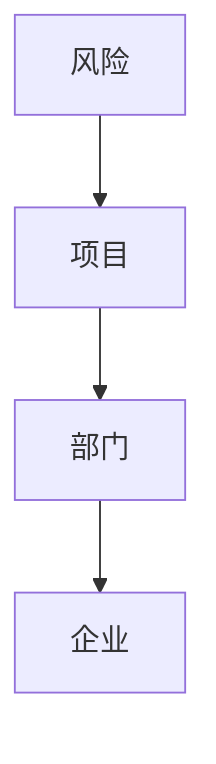
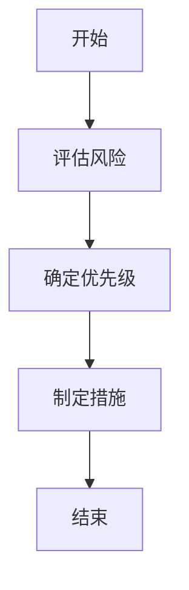
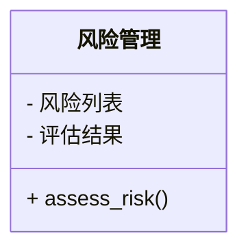
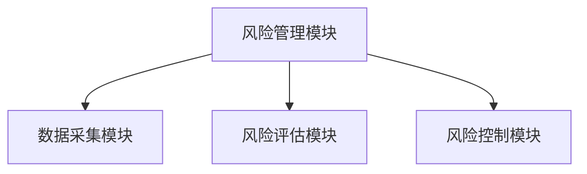
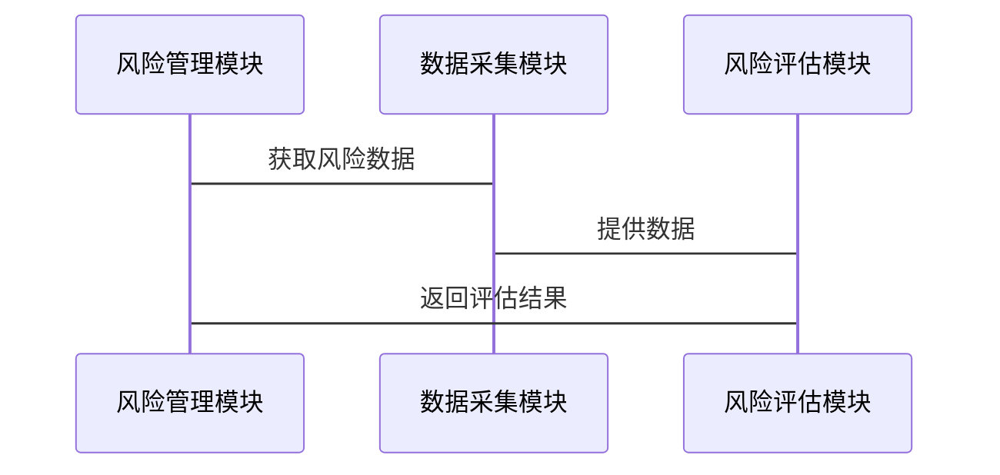

                 


# 塞思卡拉曼的风险规避策略

---

## 关键词
- 风险规避
- 塞思卡拉曼
- 风险管理
- 算法原理
- 系统架构

---

## 摘要
本文深入探讨塞思卡拉曼的风险规避策略，从背景到核心概念，详细解析其算法原理、系统架构及实际应用。通过案例分析和最佳实践，为企业提供有效管理风险的指导。

---

## 第1章: 风险规避策略的背景与重要性

### 1.1 风险规避的定义与核心概念
#### 1.1.1 风险规避的定义
风险规避是指通过识别、评估和控制潜在风险，采取措施减少其发生概率或影响，从而保护目标免受不利影响。

#### 1.1.2 风险规避的核心要素
- **风险识别**：发现潜在风险源。
- **风险评估**：量化风险的可能性和影响。
- **风险控制**：制定和实施控制措施。
- **风险监控**：持续监测风险状态。

#### 1.1.3 风险规避的边界与外延
风险规避关注的是可管理且可控的风险，不涉及完全消除风险或超出企业能力范围的风险。

### 1.2 塞思卡拉曼风险规避策略的背景
#### 1.2.1 当前风险管理的挑战
企业面临日益复杂的风险环境，传统方法难以应对高频率、高复杂性的风险。

#### 1.2.2 塞思卡拉曼策略的提出背景
为应对复杂风险，塞思卡拉曼策略结合现代技术，提出系统化的风险管理方法。

#### 1.2.3 风险规避在企业中的应用前景
广泛应用于金融、IT等领域，帮助企业在数字化时代有效管理风险。

---

## 第2章: 核心概念与联系

### 2.1 核心概念原理
#### 2.1.1 风险评估模型
- **定性评估**：描述风险特征。
- **定量评估**：量化风险影响。
- **混合评估**：结合定性和定量方法。

#### 2.1.2 风险控制机制
- **预防措施**：防止风险发生。
- **缓解措施**：降低风险影响。
- **转移措施**：将风险转嫁给他人。

#### 2.1.3 风险规避的数学模型
$$ R = \sum_{i=1}^{n} w_i \cdot r_i $$
其中，\( R \) 为总体风险，\( w_i \) 为权重，\( r_i \) 为各风险的影响。

### 2.2 核心概念属性对比表
| 风险类型 | 低概率高影响 | 高概率低影响 |
|---------|--------------|--------------|
| 评估方法 | 模糊分析     | 蒙特卡洛模拟 |
| 控制策略 | 风险转移     | 风险缓解     |

### 2.3 ER实体关系图


---

## 第3章: 算法原理与数学模型

### 3.1 算法原理
#### 3.1.1 风险评估算法
- **步骤一**：识别风险。
- **步骤二**：评估风险。
- **步骤三**：确定优先级。

#### 3.1.2 风险控制算法
- **输入**：风险列表。
- **输出**：控制措施。

#### 3.1.3 风险规避算法


### 3.2 数学模型与公式
#### 3.2.1 风险评估模型
$$ R = \sum_{i=1}^{n} w_i \cdot r_i $$

#### 3.2.2 风险控制模型
$$ C = \frac{R}{S} $$

#### 3.2.3 风险规避模型
$$ G = 1 - \frac{R}{T} $$

### 3.3 算法流程图


### 3.4 代码实现
#### 3.4.1 Python代码示例
```python
def assess_risk(risks):
    for risk in risks:
        print(f"风险{risk}已被评估")
```

---

## 第4章: 系统分析与架构设计方案

### 4.1 问题场景介绍
企业面临多种风险，需构建系统化管理方案。

### 4.2 系统功能设计
#### 4.2.1 领域模型类图


### 4.3 系统架构设计
#### 4.3.1 系统架构图


### 4.4 系统接口设计
- **输入接口**：接收风险数据。
- **输出接口**：提供评估结果。

### 4.5 系统交互图


---

## 第5章: 项目实战

### 5.1 环境安装
- 安装Python和相关库。

### 5.2 核心代码实现
```python
def risk_assessment(risks):
    return sorted(risks, key=lambda x: x['impact'], reverse=True)
```

### 5.3 案例分析
分析某企业供应链风险，应用塞思卡拉曼策略进行管理。

### 5.4 项目小结
通过实战，验证策略的有效性。

---

## 第6章: 最佳实践与总结

### 6.1 最佳实践 tips
- 定期更新风险模型。
- 结合企业实际情况调整策略。

### 6.2 小结
塞思卡拉曼策略为企业提供系统化的风险管理方法，帮助企业有效规避风险。

### 6.3 注意事项
- 风险模型需持续优化。
- 注重团队协作与沟通。

### 6.4 拓展阅读
推荐相关书籍和文献，供读者深入学习。

---

通过以上结构，文章详细阐述了塞思卡拉曼的风险规避策略，结合理论与实践，为企业提供有效的风险管理方案。

