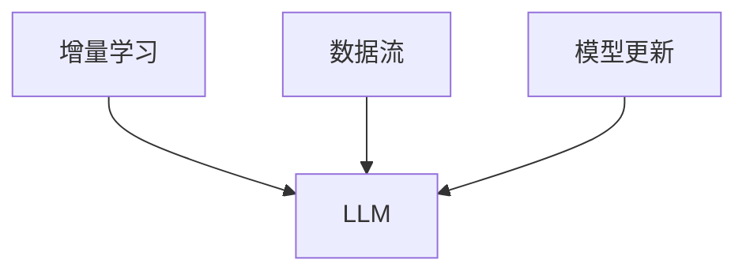
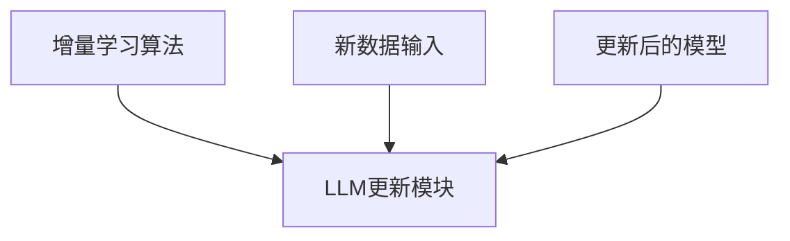
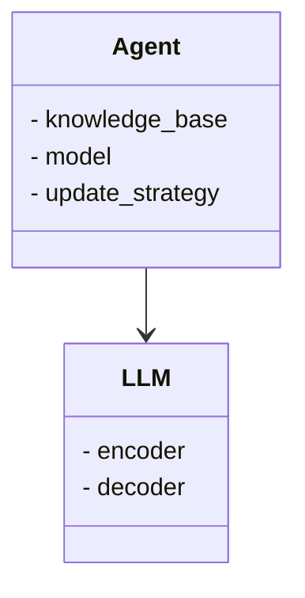
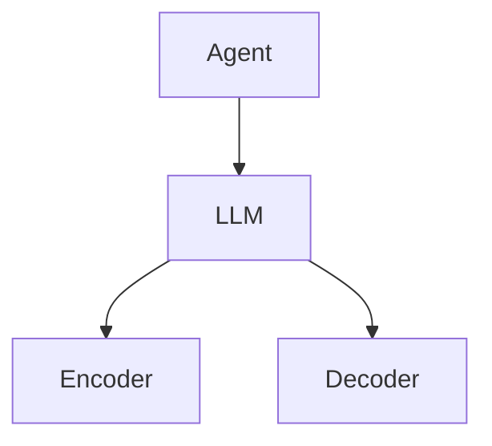
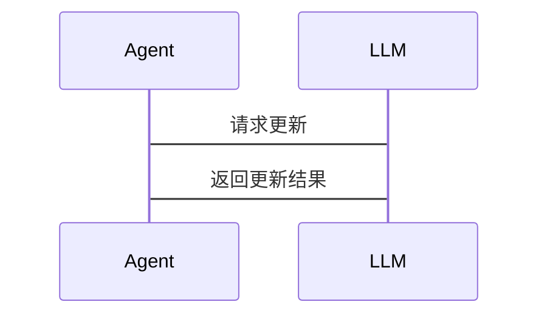

                 

# 《增量学习AI Agent：LLM的持续知识更新机制》

---

## 关键词：
- 增量学习
- AI Agent
- 大语言模型（LLM）
- 知识更新机制
- 持续学习
- 自适应系统

---

## 摘要：
本文系统探讨了增量学习AI Agent在大语言模型（LLM）中的持续知识更新机制。通过分析增量学习的核心原理、算法实现、数学模型以及系统架构，结合实际案例和项目实战，深入解读了LLM如何通过增量学习实现知识的动态更新与优化。文章旨在为AI开发者、研究人员以及技术爱好者提供理论支持和实践指导，帮助他们更好地理解和应用增量学习技术，提升LLM的性能与适应性。

---

# 第一章：背景介绍

## 1.1 问题背景

### 1.1.1 增量学习的定义与特点
增量学习是一种机器学习方法，其核心特征在于模型能够通过逐步接收新的数据样本或信息，不断优化自身性能，而无需重新训练整个模型。其特点包括：
- **实时性**：能够快速响应新数据。
- **高效性**：仅更新与新数据相关的部分。
- **持续性**：支持长期的知识积累与更新。

### 1.1.2 LLM的持续知识更新需求
大语言模型（LLM）如GPT系列在实际应用中面临着知识快速变化的挑战，需要不断吸收新知识以保持性能。例如：
- 新闻事件的更新。
- 专业领域知识的扩展。
- 用户需求的动态变化。

### 1.1.3 当前LLM更新机制的局限性
传统LLM的训练方式存在以下问题：
- **计算成本高**：每次更新需要重新训练整个模型。
- **知识过载**：难以高效处理新增数据。
- **实时性不足**：无法快速响应实时需求。

## 1.2 问题描述

### 1.2.1 增量学习在AI Agent中的作用
AI Agent需要实时感知环境变化并做出决策，增量学习为其提供了动态更新知识的能力。

### 1.2.2 LLM知识更新的核心问题
- 如何高效更新模型参数。
- 如何保持模型的稳定性与准确性。
- 如何处理数据稀疏性与噪声。

### 1.2.3 问题解决的必要性与可行性
- 必要性：满足实时性和效率需求。
- 可行性：通过增量学习实现局部优化。

## 1.3 问题解决

### 1.3.1 增量学习AI Agent的设计思路
- **模块化设计**：将模型划分为可独立更新的部分。
- **增量更新策略**：根据数据重要性动态调整更新幅度。

### 1.3.2 LLM持续知识更新的实现路径
- **增量训练**：仅更新与新数据相关的参数。
- **知识蒸馏**：通过教师模型指导学生模型更新。

### 1.3.3 解决方案的边界与外延
- 边界：仅关注模型更新机制，不涉及数据采集与预处理。
- 外延：可扩展至其他AI系统。

## 1.4 核心概念与联系

### 1.4.1 增量学习与LLM的关系
- 增量学习为LLM提供动态更新能力。
- LLM为增量学习提供丰富的知识表示形式。

### 1.4.2 核心概念的属性特征对比（表格形式）

| 概念       | 增量学习             | LLM             |
|------------|----------------------|-----------------|
| 核心目标    | 动态更新模型参数      | 表示与生成文本   |
| 输入形式    | 新增数据样本          | 文本数据         |
| 输出形式    | 更新后的模型参数      | 生成的文本       |
| 计算复杂度  | 低（仅更新部分参数）  | 高（全模型计算）  |

### 1.4.3 实体关系图（Mermaid流程图）

---

# 第二章：核心概念与联系

## 2.1 增量学习的原理

### 2.1.1 增量学习的基本原理
- 模型通过处理新数据逐步优化。
- 更新过程通常基于梯度下降等优化算法。

### 2.1.2 增量学习的核心算法
- **在线学习**：实时更新模型。
- **任务增量学习**：针对新任务进行更新。

### 2.1.3 增量学习的数学模型
- 损失函数：$L(w|x,y)$
- 更新规则：$w \leftarrow w - \eta \nabla L(w|x,y)$

## 2.2 LLM的知识更新机制

### 2.2.1 LLM的知识表示方式
- 使用Transformer架构进行编码。
- 通过注意力机制捕捉上下文关系。

### 2.2.2 LLM的知识更新策略
- 微调策略：仅更新特定参数。
- 知识蒸馏：利用教师模型指导更新。

### 2.2.3 LLM的知识更新算法
- 基于增量学习的更新算法。

## 2.3 增量学习与LLM的结合

### 2.3.1 增量学习在LLM更新中的应用
- 动态更新模型参数以适应新数据。

### 2.3.2 LLM更新机制对增量学习的依赖
- 需要高效的增量更新算法。

### 2.3.3 两者结合的系统架构（Mermaid流程图）

---

# 第三章：算法原理讲解

## 3.1 增量学习算法

### 3.1.1 增量学习算法的分类
- 在线增量学习：实时更新。
- 批量增量学习：分批更新。

### 3.1.2 增量学习算法的实现步骤
1. 初始化模型参数。
2. 接收新数据样本。
3. 计算梯度并更新参数。

### 3.1.3 增量学习算法的优缺点
- 优点：高效、实时。
- 缺点：可能遗忘旧知识。

## 3.2 LLM知识更新算法

### 3.2.1 基于增量学习的LLM更新算法
- 使用在线训练方法更新特定参数。

### 3.2.2 增量学习在LLM更新中的具体实现
- 代码示例：Python实现。

## 3.3 算法的数学模型与公式

### 3.3.1 增量学习的数学模型
- 损失函数：$L(w|x,y)$
- 更新规则：$w \leftarrow w - \eta \nabla L(w|x,y)$

### 3.3.2 LLM更新的数学公式
- 注意力机制：$QK^T$。

---

# 第四章：数学模型与公式

## 4.1 增量学习的数学模型

### 4.1.1 增量学习的概率分布模型
- 分布更新：$p(x|w)$

### 4.1.2 增量学习的损失函数
- 按任务定义：$L_i(w)$

### 4.1.3 增量学习的优化算法
- 使用Adam优化器：$\theta \leftarrow \theta - \alpha \nabla L(\theta)$

## 4.2 LLM知识更新的数学公式

### 4.2.1 LLM更新的数学表达式
- 软件更新公式：$w \leftarrow w + \Delta w$

### 4.2.2 增量学习在LLM更新中
- 知识蒸馏公式：$p(y|x)$

---

# 第五章：系统分析与架构设计

## 5.1 系统功能设计

### 5.1.1 领域模型（Mermaid类图）

## 5.2 系统架构设计

### 5.2.1 系统架构（Mermaid架构图）

## 5.3 系统接口设计

### 5.3.1 接口定义
- 输入接口：接收新数据。
- 输出接口：提供更新后的模型。

## 5.4 系统交互流程

### 5.4.1 交互流程（Mermaid序列图）

---

# 第六章：项目实战

## 6.1 环境安装

### 6.1.1 安装Python环境
- 使用Anaconda安装虚拟环境。

## 6.2 系统核心实现

### 6.2.1 核心代码实现
- 增量学习代码示例。

## 6.3 案例分析

### 6.3.1 案例选择
- 选择一个具体场景进行分析。

## 6.4 代码解读与分析

### 6.4.1 代码实现步骤
- 步骤说明。

## 6.5 实际案例分析

### 6.5.1 案例实现细节
- 详细说明实现过程。

## 6.6 项目小结

### 6.6.1 项目总结
- 总结项目实现过程。

---

# 第七章：最佳实践

## 7.1 小结

### 7.1.1 核心知识点回顾
- 回顾文章核心内容。

## 7.2 注意事项

### 7.2.1 实践中的注意事项
- 提供实际建议。

## 7.3 拓展阅读

### 7.3.1 推荐阅读资料
- 推荐相关书籍和论文。

---

# 第八章：总结

## 8.1 本书总结
- 回顾全书内容。

## 8.2 展望未来
- 展望增量学习与LLM的未来发展。

---

# 附录

## 附录A：术语表
- 解释核心术语。

## 附录B：参考文献
- 列出参考文献。

## 附录C：代码仓库
- 提供代码仓库链接。

---

**全文完。**

