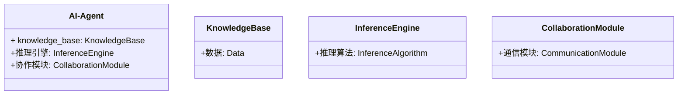
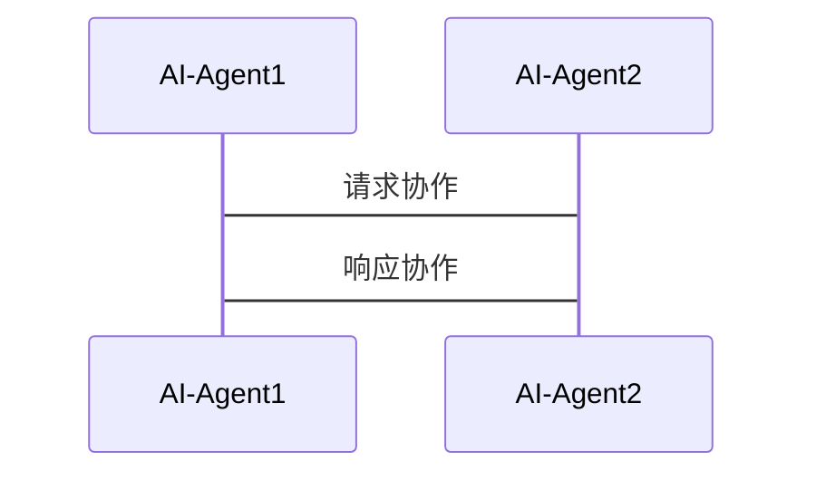
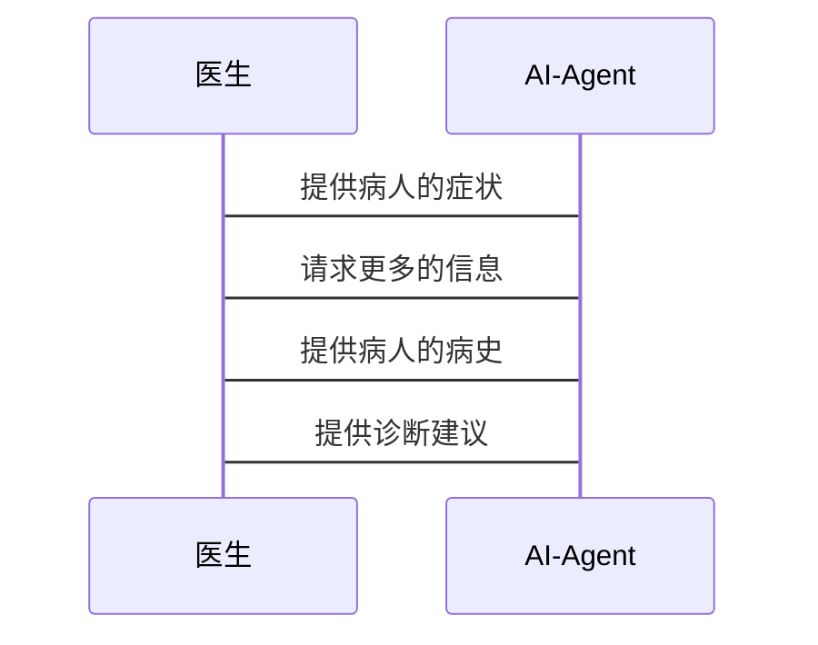

                 


# 复杂问题解决AI Agent：利用LLM进行多步骤推理

> **关键词**：AI Agent, 大语言模型, 多步骤推理, 系统架构, 项目实战

> **摘要**：  
本文详细探讨了复杂问题解决AI Agent的设计与实现，重点分析了如何利用大语言模型（LLM）进行多步骤推理。文章从背景介绍、核心概念、算法原理、系统架构到项目实战，全面解析了AI Agent在复杂问题中的应用。通过具体案例和代码实现，展示了如何构建一个高效、协作的AI Agent系统，并总结了最佳实践和注意事项。

---

# 第一部分：复杂问题解决AI Agent概述

## 第1章：复杂问题解决AI Agent的背景与概念

### 1.1 问题背景

在当今快速发展的技术环境中，复杂问题的解决变得越来越依赖于人工智能（AI）技术。传统的单一任务AI系统在面对复杂问题时显得力不从心，因为它们无法有效处理多步骤、多维度的问题。而AI Agent的出现，通过结合大语言模型（LLM）的自然语言处理能力和多步骤推理能力，为复杂问题的解决提供了新的可能性。

#### 1.1.1 当前复杂问题的挑战

复杂问题通常涉及多个步骤、多个变量和不确定因素。例如，在医疗诊断中，AI Agent需要分析病人的病史、症状、检查结果等多个信息，进行多步骤推理，才能得出准确的诊断。传统的AI系统往往只能处理单一任务，无法适应这种复杂性。

#### 1.1.2 传统AI的局限性

传统AI系统在处理复杂问题时存在以下局限性：
1. **单一任务处理**：传统AI系统通常针对特定任务设计，无法扩展到多任务或多步骤推理。
2. **缺乏协作能力**：传统AI系统难以与其他系统或人类协作，共同解决问题。
3. **不够灵活**：传统AI系统在面对新的或未见过的问题时，往往无法有效调整策略。

#### 1.1.3 LLM的出现与优势

大语言模型（LLM）的出现，为AI Agent的多步骤推理提供了强大的自然语言处理能力。LLM通过海量数据的训练，能够理解和生成人类语言，并结合上下文进行推理。这使得AI Agent能够处理复杂问题中的多个步骤，并通过协作提高解决问题的效率。

---

### 1.2 问题描述

复杂问题的解决需要AI Agent具备以下能力：
1. **问题分解**：将复杂问题分解为多个子问题。
2. **多步骤推理**：逐步解决每个子问题，并将结果整合。
3. **协作能力**：与其他AI Agent或人类协作，共同解决问题。

#### 1.2.1 复杂问题的定义与特征

复杂问题通常具有以下特征：
- **多步骤性**：问题需要分解为多个步骤，逐步解决。
- **多维度性**：问题涉及多个维度或方面。
- **不确定性**：问题中存在不确定因素，需要动态调整策略。

#### 1.2.2 多步骤推理的必要性

多步骤推理是解决复杂问题的关键。通过分解问题，AI Agent可以逐步缩小问题范围，提高解决问题的效率和准确性。

#### 1.2.3 AI Agent在复杂问题中的角色

AI Agent在复杂问题中扮演以下几个角色：
- **问题分解者**：将复杂问题分解为多个子问题。
- **推理者**：通过多步骤推理解决问题。
- **协作者**：与其他系统或人类协作，共同解决问题。

---

### 1.3 问题解决思路

解决复杂问题的思路包括以下几个步骤：
1. **问题分解**：将复杂问题分解为多个子问题。
2. **推理步骤设计**：为每个子问题设计推理步骤。
3. **协作机制设计**：设计AI Agent之间的协作机制。

#### 1.3.1 分解问题的方法

问题分解的方法包括：
- **层次分解法**：将问题分解为多个层次，逐步解决。
- **目标分解法**：将问题分解为目标和子目标。

#### 1.3.2 多步骤推理的流程

多步骤推理的流程包括：
1. **初始化**：明确问题和目标。
2. **分解问题**：将问题分解为多个子问题。
3. **推理子问题**：逐步解决每个子问题。
4. **整合结果**：将子问题的结果整合，得出最终答案。

#### 1.3.3 AI Agent的协作机制

协作机制包括：
- **信息共享**：AI Agent之间共享信息和数据。
- **任务分配**：根据AI Agent的能力，分配任务。
- **结果整合**：整合多个AI Agent的推理结果。

---

### 1.4 边界与外延

#### 1.4.1 AI Agent的能力边界

AI Agent的能力边界包括：
- **知识范围**：AI Agent的知识来源于训练数据，无法处理超出数据范围的问题。
- **推理能力**：AI Agent的推理能力受限于模型的设计和训练数据。

#### 1.4.2 问题复杂度的分类

问题复杂度可以分为以下几类：
- **简单问题**：可以通过单一任务解决。
- **中等复杂问题**：需要分解为多个子问题，逐步解决。
- **高度复杂问题**：需要多个AI Agent协作解决。

#### 1.4.3 多步骤推理的适用场景

多步骤推理适用于以下场景：
- **医疗诊断**：需要分析病人的病史、症状、检查结果等多个信息。
- **金融分析**：需要分析市场趋势、公司财务数据等多个因素。
- **法律咨询**：需要分析法律条文、案例等多个因素。

---

### 1.5 核心概念

#### 1.5.1 复杂问题的构成要素

复杂问题的构成要素包括：
- **问题目标**：问题的最终目标。
- **问题分解**：问题分解的方法和步骤。
- **推理步骤**：每个子问题的推理步骤。

#### 1.5.2 多步骤推理的逻辑结构

多步骤推理的逻辑结构包括：
- **初始问题**：问题的起点。
- **子问题分解**：问题分解为多个子问题。
- **推理步骤**：逐步解决每个子问题。
- **结果整合**：整合子问题的结果，得出最终答案。

#### 1.5.3 AI Agent的核心要素

AI Agent的核心要素包括：
- **知识库**：AI Agent的知识来源。
- **推理引擎**：AI Agent的推理能力。
- **协作机制**：AI Agent之间的协作能力。

---

## 第2章：复杂问题解决AI Agent的核心概念

### 2.1 LLM的基本原理

#### 2.1.1 大语言模型的定义

大语言模型（LLM）是一种基于深度学习的自然语言处理模型，能够理解和生成人类语言。LLM的核心是其巨大的参数数量和复杂的网络结构。

#### 2.1.2 概率生成机制

LLM通过概率生成机制，根据上下文生成最可能的后续文本。这种机制使得LLM能够进行自然的对话和推理。

#### 2.1.3 模型的训练与优化

LLM的训练过程包括：
1. **数据预处理**：清洗和格式化数据。
2. **模型训练**：使用训练数据训练模型。
3. **参数优化**：通过优化算法调整模型参数，提高模型性能。

---

### 2.2 多步骤推理的原理

#### 2.2.1 推理步骤的分解

多步骤推理的步骤分解包括：
- **初始问题**：明确问题和目标。
- **子问题分解**：将问题分解为多个子问题。
- **推理子问题**：逐步解决每个子问题。
- **结果整合**：整合子问题的结果，得出最终答案。

#### 2.2.2 状态空间的构建

状态空间的构建包括：
- **状态定义**：明确问题中的状态。
- **状态转移**：根据推理步骤，转移状态。

#### 2.2.3 动作选择的策略

动作选择的策略包括：
- **贪心策略**：每一步选择当前最优的动作。
- **随机策略**：随机选择动作。
- **深度优先策略**：优先探索深度路径。

---

### 2.3 AI Agent的协作机制

#### 2.3.1 Agent的角色分配

AI Agent的角色分配包括：
- **主导Agent**：负责协调和管理其他Agent。
- **执行Agent**：负责具体任务的执行。
- **监控Agent**：负责监控整个协作过程。

#### 2.3.2 信息共享的方式

信息共享的方式包括：
- **共享知识库**：所有Agent共享同一个知识库。
- **点对点通信**：Agent之间通过点对点通信共享信息。

#### 2.3.3 协作过程中的冲突解决

协作过程中的冲突解决包括：
- **协商机制**：通过协商解决冲突。
- **仲裁机制**：通过仲裁机制解决冲突。

---

### 2.4 核心概念对比表

#### 2.4.1 LLM与传统AI的对比

| 对比维度 | LLM | 传统AI |
|----------|------|--------|
| 知识来源 | 大量文本数据 | 特定任务数据 |
| 处理能力 | 自然语言处理 | 单一任务处理 |
| 灵活性 | 高 | 低 |

---

## 第3章：复杂问题解决AI Agent的算法原理

### 3.1 大语言模型的训练过程

#### 3.1.1 数据预处理

数据预处理包括：
- **清洗数据**：去除噪声数据。
- **格式化数据**：将数据格式化为统一的形式。

#### 3.1.2 模型训练

模型训练包括：
- **选择模型架构**：选择适合的模型架构。
- **训练数据输入**：将预处理后的数据输入模型。
- **参数优化**：通过优化算法调整模型参数。

#### 3.1.3 参数优化

参数优化包括：
- **选择优化算法**：如随机梯度下降（SGD）或Adam优化器。
- **调整学习率**：根据训练过程调整学习率。

---

### 3.2 多步骤推理的算法实现

#### 3.2.1 分解问题的算法

分解问题的算法包括：
- **层次分解法**：将问题分解为多个层次。
- **目标分解法**：将问题分解为目标和子目标。

#### 3.2.2 推理步骤的算法

推理步骤的算法包括：
- **贪心算法**：每一步选择当前最优的动作。
- **深度优先搜索**：优先探索深度路径。

#### 3.2.3 动作选择的算法

动作选择的算法包括：
- **Q-learning**：通过Q值选择动作。
- **策略网络**：通过策略网络选择动作。

---

### 3.3 AI Agent的协作算法

#### 3.3.1 信息共享算法

信息共享算法包括：
- **共享知识库**：所有Agent共享同一个知识库。
- **点对点通信**：Agent之间通过点对点通信共享信息。

#### 3.3.2 冲突解决算法

冲突解决算法包括：
- **协商机制**：通过协商解决冲突。
- **仲裁机制**：通过仲裁机制解决冲突。

---

## 第4章：复杂问题解决AI Agent的系统架构

### 4.1 系统功能设计

系统功能设计包括：
- **问题分解模块**：将复杂问题分解为多个子问题。
- **推理模块**：逐步解决每个子问题。
- **协作模块**：管理AI Agent之间的协作。

#### 4.1.1 领域模型（Mermaid类图）



---

### 4.2 系统架构设计

系统架构设计包括：
- **分层架构**：将系统分为多个层次，每个层次负责不同的功能。
- **模块化架构**：将系统划分为多个模块，每个模块负责不同的功能。

#### 4.2.1 系统架构（Mermaid架构图）


---

### 4.3 系统接口设计

系统接口设计包括：
- **API接口**：AI Agent之间的通信接口。
- **数据接口**：数据存储和检索接口。

#### 4.3.1 系统接口（Mermaid序列图）



---

## 第5章：复杂问题解决AI Agent的项目实战

### 5.1 环境安装

项目实战需要以下环境：
- **Python**：3.8+
- **深度学习框架**：TensorFlow或PyTorch
- **大语言模型**：如GPT-3或BERT

#### 5.1.1 安装Python

```bash
python --version
pip install --upgrade pip
```

---

### 5.2 系统核心实现源代码

以下是一个简单的AI Agent实现示例：

```python
class AI-Agent:
    def __init__(self, knowledge_base):
        self.knowledge_base = knowledge_base
        self推理引擎 = InferenceEngine()
        self协作模块 = CollaborationModule()

    def solve_problem(self, problem):
        # 分解问题
        sub_problems = decompose_problem(problem)
        # 推理子问题
        results = []
        for sub_problem in sub_problems:
            result = self推理引擎.inference(sub_problem)
            results.append(result)
        # 整合结果
        final_result = self.协作模块整合结果(results)
        return final_result
```

---

### 5.3 代码应用解读与分析

代码解读：
- **AI-Agent类**：AI Agent的核心类。
- **solve_problem方法**：解决复杂问题的方法。
- **decompose_problem函数**：分解问题的函数。

---

### 5.4 实际案例分析

以下是一个医疗诊断的案例分析：



---

## 第6章：复杂问题解决AI Agent的最佳实践

### 6.1 Tips

- **数据质量**：确保训练数据的质量和多样性。
- **模型优化**：定期优化模型参数，提高推理效率。
- **协作机制**：设计高效的协作机制，减少冲突。

---

### 6.2 小结

本文详细探讨了复杂问题解决AI Agent的设计与实现，重点分析了如何利用大语言模型（LLM）进行多步骤推理。通过具体案例和代码实现，展示了如何构建一个高效、协作的AI Agent系统。

---

### 6.3 注意事项

- **数据隐私**：确保数据的隐私和安全。
- **模型泛化能力**：提高模型的泛化能力，适应不同场景。
- **协作效率**：优化协作机制，提高协作效率。

---

### 6.4 拓展阅读

- **相关书籍**：《深度学习》
- **论文推荐**：《Attention Is All You Need》
- **在线资源**：OpenAI官方文档

---

通过本文的详细讲解，读者可以深入了解复杂问题解决AI Agent的设计与实现，并能够将其应用到实际项目中。

