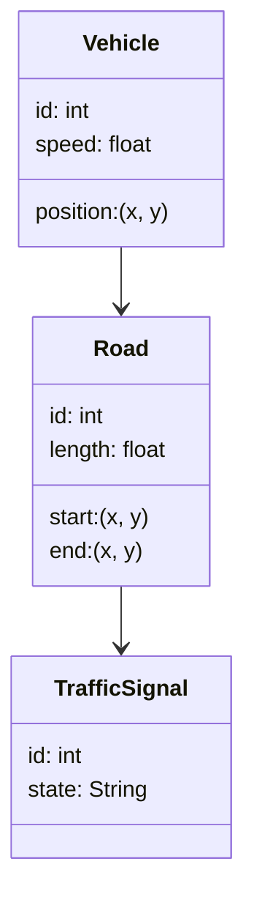
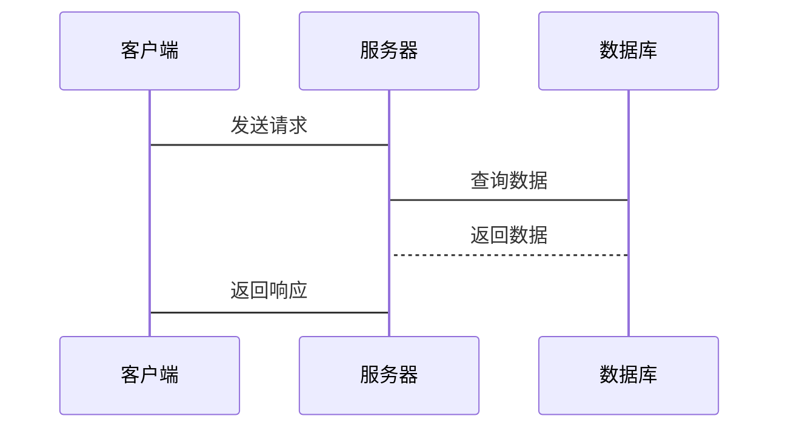

                 


# 多Agent博弈系统：策略学习与优化技术

## 关键词：
多Agent系统、博弈论、策略学习、强化学习、优化技术、纳什均衡、系统架构

## 摘要：
多Agent博弈系统是人工智能领域的重要研究方向，涉及多个智能体在动态博弈环境中的策略学习与优化。本文从多Agent系统的基本概念出发，探讨其在博弈中的策略学习方法，包括强化学习算法、博弈论基础、纳什均衡的计算与应用，以及多Agent系统的优化技术。通过详细分析算法原理、系统架构设计和项目实战，本文为读者提供全面的技术指导，帮助他们在实际应用中优化多Agent系统的性能。

---

## 第1章：多Agent博弈系统概述

### 1.1 多Agent系统的基本概念

#### 1.1.1 多Agent系统的定义与特点
多Agent系统是由多个智能体（Agent）组成的分布式系统，每个Agent能够独立感知环境并采取行动。其特点包括自治性、反应性、协作性和社会性。

#### 1.1.2 多Agent系统的核心要素
- **Agent**：具有自主性、反应性、目标导向和社交能力的实体。
- **环境**：Agent所处的外部世界，包括物理环境和任务环境。
- **交互**：Agent之间或与环境之间的信息交换和行为影响。

#### 1.1.3 多Agent系统与传统单Agent系统的区别
- **独立性**：多Agent系统中各Agent独立决策，而单Agent系统通常由中央控制。
- **协作性**：多Agent系统强调协作，单Agent系统则强调独立完成任务。
- **复杂性**：多Agent系统的复杂性更高，因为需要处理多个Agent之间的互动。

### 1.2 博弈论基础

#### 1.2.1 博弈论的基本概念
- **博弈**：两个或多个参与者（Player）在规则下进行决策的过程。
- **策略**：参与者为达到目标而采取的行动计划。
- ** payoff**：参与者在博弈中的收益或损失。

#### 1.2.2 竞争与合作的博弈模型
- **竞争模型**：参与者对抗，追求自身利益最大化。
- **合作模型**：参与者协作，共同追求群体利益最大化。

#### 1.2.3 多Agent博弈的定义与分类
- **定义**：多个Agent在博弈环境中进行互动，每个Agent采取策略以实现目标。
- **分类**：完全理性博弈、非理性博弈、完全信息博弈和非完全信息博弈。

### 1.3 多Agent博弈系统的应用场景

#### 1.3.1 智能交通系统
- **案例分析**：自动驾驶车辆之间的博弈，协调交通流量，避免碰撞。

#### 1.3.2 电子商务中的推荐系统
- **案例分析**：多个推荐系统协作，为用户提供最优推荐。

#### 1.3.3 多人在线游戏中的AI对手
- **案例分析**：游戏中的AI对手通过博弈策略与玩家互动。

---

## 第2章：多Agent博弈系统的策略学习基础

### 2.1 策略学习的基本概念

#### 2.1.1 策略的定义与表示
- **策略**：Agent在特定状态下的行动规则。
- **表示**：策略可以表示为函数或树状结构，描述状态到动作的映射。

#### 2.1.2 策略学习的目标与方法
- **目标**：通过经验优化策略，最大化预期收益。
- **方法**：监督学习、强化学习和无监督学习。

### 2.2 强化学习基础

#### 2.2.1 强化学习的基本原理
- **定义**：Agent通过与环境互动，学习策略以最大化累积奖励。
- **关键概念**：状态（State）、动作（Action）、奖励（Reward）、策略（Policy）、值函数（Value Function）。

#### 2.2.2 Q-learning算法
- **算法流程**：
  1. 初始化Q表为零。
  2. 选择动作（探索与利用）。
  3. 执行动作，获得奖励和新状态。
  4. 更新Q值：Q(s, a) = Q(s, a) + α(r + γ * max Q(s', a'))。
- **数学模型**：
  $$ Q(s, a) \leftarrow Q(s, a) + \alpha \left(r + \gamma \max_{a'} Q(s', a') - Q(s, a)\right) $$

#### 2.2.3 策略梯度方法
- **原理**：通过梯度下降优化策略参数，直接最大化期望奖励。
- **算法示例**：策略梯度法（Policy Gradient Method）。

### 2.3 多Agent强化学习

#### 2.3.1 多智能体强化学习的挑战
- **状态空间**：多个Agent的状态组合，导致状态空间爆炸。
- **动作空间**：多个Agent的协同动作复杂，难以协调。

#### 2.3.2 基于价值分解的多Agent学习
- **价值分解**：将整体价值函数分解为各Agent的贡献。
- **算法**：分解式多智能体Q-learning（Decentralized Q-learning）。

#### 2.3.3 协作与竞争的平衡
- **协作**：Agent之间共享信息，共同优化策略。
- **竞争**：Agent之间对抗，学习最优策略。

---

## 第3章：博弈论与纳什均衡

### 3.1 博弈论的核心概念

#### 3.1.1 竞争与合作的博弈模型
- **囚徒困境**：合作与背叛的经典案例。

#### 3.1.2 纯策略与混合策略
- **纯策略**：Agent在某个状态下总是选择固定动作。
- **混合策略**：Agent以概率分布选择动作。

#### 3.1.3 占优策略与纳什均衡
- **占优策略**：无论对方选择什么，该策略都是最优的。
- **纳什均衡**：在均衡状态下，每个Agent的策略都是最优反应。

### 3.2 纳什均衡的计算与应用

#### 3.2.1 纳什均衡的定义与性质
- **定义**：一组策略，使得每个Agent在其他Agent策略不变的情况下，无法通过单方面改变策略而获得更高的收益。

#### 3.2.2 如何计算纳什均衡
- **步骤**：
  1. 列举所有可能的策略组合。
  2. 检查每个策略是否是最佳反应。

#### 3.2.3 纳什均衡在多Agent系统中的应用
- **拍卖机制**：设计纳什均衡策略，确保市场稳定。

### 3.3 博弈论与多Agent系统的结合

#### 3.3.1 博弈论在多Agent系统中的应用案例
- **供应链管理**：优化供应商与零售商的策略，提高整体效率。

#### 3.3.2 如何利用博弈论优化多Agent系统
- **机制设计**：通过博弈论设计激励机制，促进Agent间的协作。

---

## 第4章：多Agent系统的优化方法

### 4.1 分布式优化技术

#### 4.1.1 分布式优化的挑战
- **通信开销**：多Agent之间的信息交换可能带来高通信成本。
- **同步问题**：Agent之间的策略更新需要同步，否则可能导致不一致。

#### 4.1.2 分布式优化算法
- **分布式梯度下降**：各Agent独立更新参数，通过通信共享梯度信息。

#### 4.1.3 异构环境下的优化策略
- **异构计算**：利用不同计算资源的特点，优化任务分配。

### 4.2 鲁棒性与安全性优化

#### 4.2.1 鲁棒性优化
- **定义**：系统在面对不确定性时仍能保持良好性能。
- **方法**：强化学习中的鲁棒策略优化，考虑多种可能的环境变化。

#### 4.2.2 安全性优化
- **定义**：系统在对抗攻击时仍能保持安全。
- **方法**：基于博弈论设计安全机制，防止恶意Agent的影响。

---

## 第5章：多Agent系统的架构设计

### 5.1 领域模型设计

#### 5.1.1 领域模型的概念
- **领域模型**：描述问题领域的核心概念及其关系。

#### 5.1.2 多Agent系统的领域模型
- **示例**：智能交通系统中的车辆、道路、交通信号灯等元素的关系。

#### 5.1.3 领域模型的Mermaid类图


### 5.2 系统架构设计

#### 5.2.1 分层架构
- **感知层**：收集环境信息。
- **决策层**：制定策略。
- **执行层**：执行动作。

#### 5.2.2 微服务架构
- **服务化设计**：每个服务负责特定功能，如路径规划、碰撞避免。

#### 5.2.3 系统架构的Mermaid图


### 5.3 系统接口设计

#### 5.3.1 接口定义
- **RESTful API**：用于Agent之间的通信和数据交换。

#### 5.3.2 接口交互的Mermaid序列图


---

## 第6章：项目实战——多Agent协作优化问题

### 6.1 环境搭建

#### 6.1.1 开发环境
- **工具**：Python、TensorFlow、OpenAI Gym。

### 6.2 代码实现

#### 6.2.1 环境定义
```python
class MultiAgentEnv:
    def __init__(self):
        self.agents = [Agent(i) for i in range(n_agents)]
        self.state = initial_state
```

#### 6.2.2 策略网络
```python
class PolicyNetwork:
    def __init__(self, state_dim, action_dim):
        self.model = build_model(state_dim, action_dim)
    
    def act(self, state):
        return self.model.predict(state)[0]
```

#### 6.2.3 强化学习算法实现
```python
class DQN:
    def __init__(self, state_dim, action_dim):
        self.memory = []
        self.gamma = 0.99
        self.epsilon = 0.1
        self.policy_net = PolicyNetwork(state_dim, action_dim)
        self.target_net = PolicyNetwork(state_dim, action_dim)
    
    def remember(self, state, action, reward, next_state):
        self.memory.append((state, action, reward, next_state))
    
    def act(self, state):
        if random.random() < self.epsilon:
            return random.randint(0, action_dim-1)
        return self.policy_net.act(state)
    
    def replay(self, batch_size):
        if len(self.memory) < batch_size:
            return
        minibatch = random.sample(self.memory, batch_size)
        # 更新策略网络
        ...
```

### 6.3 系统分析

#### 6.3.1 系统性能分析
- **收敛速度**：策略网络的训练速度和效果。
- **稳定性分析**：系统在动态环境中的稳定性和适应性。

### 6.4 实际案例分析

#### 6.4.1 案例介绍
- **案例**：智能交通系统的多Agent协作优化。

#### 6.4.2 案例分析
- **结果**：通过协作优化，提高了交通效率，减少了拥堵。

---

## 第7章：优化与应用

### 7.1 技术挑战与解决方案

#### 7.1.1 当前技术挑战
- **计算复杂度**：多Agent系统的计算资源需求高。
- **通信开销**：Agent之间的信息交换可能导致延迟和能耗增加。

#### 7.1.2 解决方案
- **分布式计算**：利用边缘计算和分布式系统降低通信开销。
- **异构计算**：结合不同计算资源，优化性能。

### 7.2 应用场景与未来趋势

#### 7.2.1 当前应用场景
- **智能电网**：优化能源分配。
- **智能制造**：优化生产流程。

#### 7.2.2 未来发展趋势
- **边缘AI**：多Agent系统在边缘设备上的应用。
- **人机协作**：人与Agent的协作优化。

### 7.3 最佳实践与注意事项

#### 7.3.1 最佳实践
- **模块化设计**：各Agent独立设计，便于维护和扩展。
- **容错设计**：系统具备容错能力，确保部分Agent故障不影响整体运行。

#### 7.3.2 注意事项
- **安全性**：防止恶意Agent攻击。
- **可扩展性**：系统应具备良好的扩展性，适应未来需求。

---

## 附录

### A.1 附录：数学公式

- **Q-learning公式**：
  $$ Q(s, a) \leftarrow Q(s, a) + \alpha \left(r + \gamma \max_{a'} Q(s', a') - Q(s, a)\right) $$

### A.2 工具与库

- **强化学习库**：TensorFlow、Keras、OpenAI Gym。
- **博弈论工具**：Game Theory Explorer。

### A.3 参考文献

- [1] 现代博弈论基础，作者：博弈论专家。
- [2] 多智能体强化学习，作者：强化学习专家。

---

## 小结

本文系统地介绍了多Agent博弈系统中的策略学习与优化技术，从基础概念到实际应用，为读者提供了全面的技术指导。通过详细分析算法原理、系统架构和项目实战，帮助读者在实际应用中优化多Agent系统的性能，解决复杂问题。

