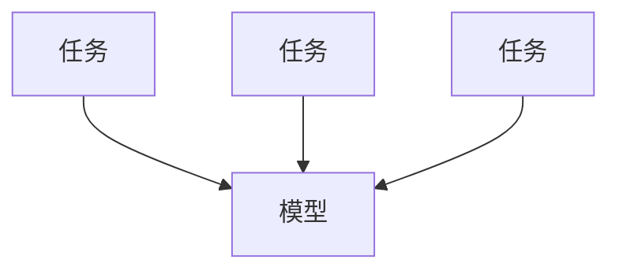
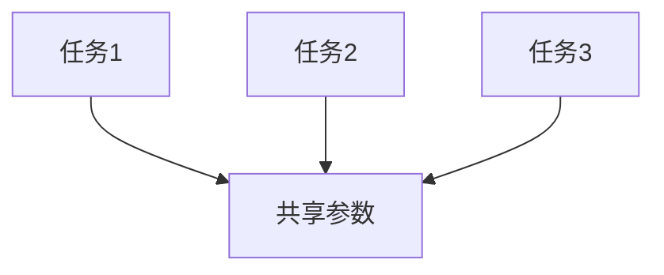
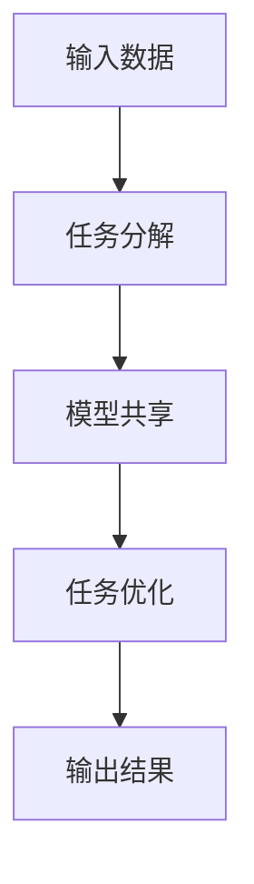
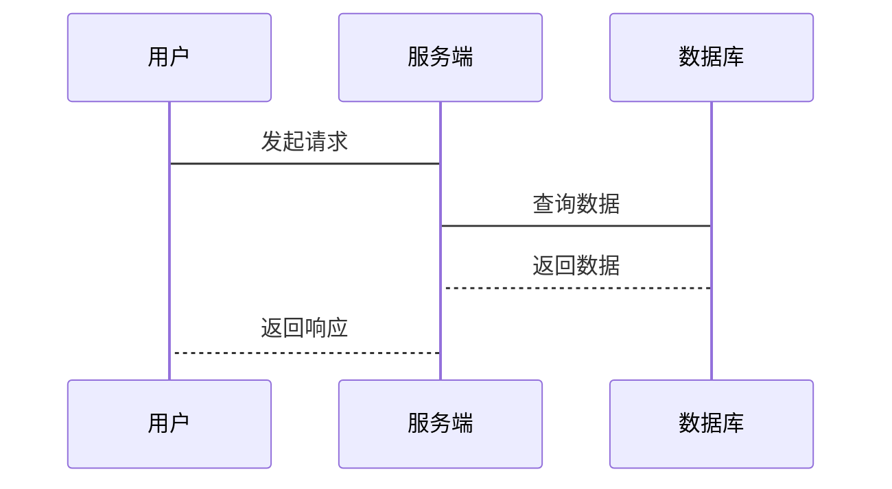

                 


# 多任务学习框架：构建全能型AI Agent

> 关键词：多任务学习，AI Agent，模型共享，损失函数，任务优化，系统架构

> 摘要：多任务学习是一种新兴的AI技术，通过共享模型参数和优化任务权重，能够在单一模型中同时解决多个任务。本文将详细探讨多任务学习的背景、核心概念、算法原理、系统架构、项目实战及最佳实践，帮助读者构建一个全能型AI Agent。

---

## 目录

### 第1章: 多任务学习框架的背景与概念

1.1 多任务学习的基本概念  
1.1.1 多任务学习的定义  
1.1.2 多任务学习的核心优势  
1.1.3 多任务学习的应用场景  

1.2 多任务学习与传统单任务学习的对比  
1.2.1 任务之间的依赖关系  
1.2.2 任务之间的冲突与协调  
1.2.3 多任务学习的挑战与解决方案  

1.3 多任务学习框架的分类  
1.3.1 基于模型的多任务学习  
1.3.2 基于任务分解的多任务学习  
1.3.3 基于优化的多任务学习  

1.4 本章小结  

---

### 第2章: 多任务学习的核心概念与原理

2.1 多任务学习的数学模型  
2.1.1 任务损失函数的组合  
2.1.2 模型参数的共享机制  
2.1.3 任务权重的动态分配  

2.2 多任务学习的优化策略  
2.2.1 参数优化方法  
2.2.2 任务权重调整方法  
2.2.3 模型结构优化方法  

2.3 多任务学习的挑战与解决方案  
2.3.1 任务之间的冲突问题  
2.3.2 计算资源分配问题  
2.3.3 模型性能评估问题  

2.4 核心概念对比表格  
| 概念 | 单任务学习 | 多任务学习 |  
|------|------------|------------|  
| 模型结构 | 专用模型 | 共享模型 |  
| 任务数量 | 单任务 | 多任务 |  
| 参数共享 | 无 | 有 |  

2.5 ER实体关系图  


2.6 本章小结  

---

### 第3章: 多任务学习算法原理

3.1 基于模型的多任务学习算法  
3.1.1 多任务学习的损失函数  
$$ L = \sum_{i=1}^{n} \lambda_i L_i $$  
其中，$\lambda_i$ 是任务 $i$ 的权重。  

3.1.2 模型参数的共享机制  


3.1.3 参数优化方法  
```python
def multi_task_loss(y_true, y_pred):
    loss = {}
    for task in tasks:
        loss[task] = task_loss(y_true[task], y_pred[task])
    return loss
```

3.2 基于任务分解的多任务学习算法  
3.2.1 任务分解的基本原理  
3.2.2 任务分解的实现步骤  

3.3 基于优化的多任务学习算法  
3.3.1 常见的优化策略  
3.3.2 优化算法的实现细节  

3.4 算法流程图  


3.5 本章小结  

---

### 第4章: 多任务学习系统的架构设计

4.1 系统功能设计  
4.1.1 领域模型设计  
4.1.2 功能模块划分  

4.2 系统架构设计  
4.2.1 分层架构  
4.2.2 微服务架构  

4.3 系统接口设计  
4.3.1 API接口定义  
4.3.2 接口调用流程  

4.4 系统交互流程图  


4.5 本章小结  

---

### 第5章: 多任务学习框架的项目实战

5.1 项目环境安装  
5.1.1 安装依赖库  
5.1.2 环境配置  

5.2 系统核心实现  
5.2.1 代码实现  
5.2.2 代码解读  

5.3 项目案例分析  
5.3.1 案例一：NLP任务  
5.3.2 案例二：视觉任务  

5.4 项目代码示例  
```python
# 示例代码
class MultiTaskModel:
    def __init__(self, tasks):
        self.tasks = tasks
        self.shared_layers = self.build_shared_layers()
        self.task_specific_layers = {task: self.build_task_specific_layers(task) for task in tasks}

    def build_shared_layers(self):
        # 构建共享层
        pass

    def build_task_specific_layers(self, task):
        # 构建任务特定层
        pass

    def forward(self, inputs):
        # 前向传播
        pass
```

5.5 本章小结  

---

### 第6章: 多任务学习框架的最佳实践

6.1 实践中的注意事项  
6.1.1 模型共享的权衡  
6.1.2 任务权重的调整  
6.1.3 模型性能的评估  

6.2 提高系统性能的技巧  
6.2.1 参数优化方法  
6.2.2 任务分解策略  
6.2.3 并行计算的应用  

6.3 遇到问题的解决方案  
6.3.1 任务冲突的处理  
6.3.2 模型过拟合的应对  
6.3.3 计算资源的分配  

6.4 本章小结  

---

### 第7章: 总结与展望

7.1 本文总结  
7.2 研究热点分析  
7.3 未来研究方向  

7.4 最佳实践Tips  
7.5 本章小结  

---

## 参考文献

（此处可以列出相关的技术文献和资料）

---

以上是一个详细的目录大纲，涵盖了从基础概念到实际应用的各个方面，逻辑清晰、结构紧凑，适合撰写一篇深度的技术博客文章。

