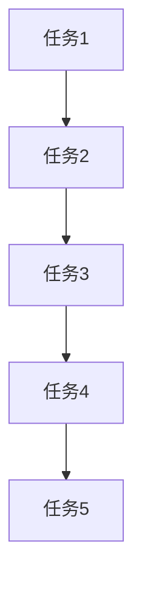
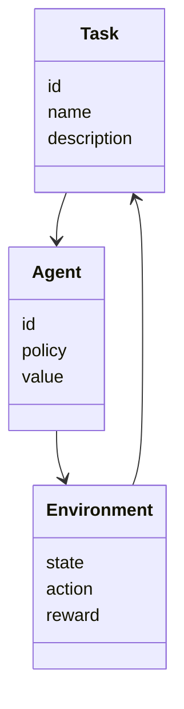
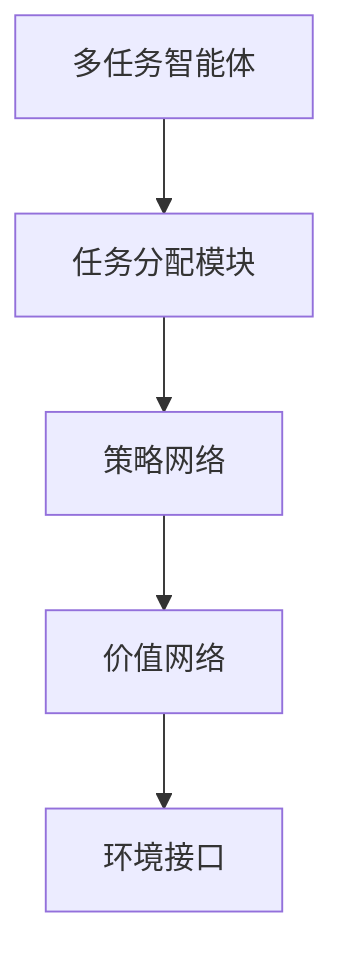

                 


# 多任务强化学习：构建具有广泛技能的AI Agent

> 关键词：多任务强化学习, AI Agent, 强化学习, 多任务学习, 系统架构, 项目实战

> 摘要：多任务强化学习是一种通过同时处理多个任务来提升AI Agent智能水平的方法。本文将深入探讨多任务强化学习的核心概念、算法原理、系统架构以及项目实战，帮助读者全面理解并掌握这一技术。

---

## 第1章: 多任务强化学习的定义与背景

### 1.1 多任务强化学习的定义

#### 1.1.1 强化学习的基本概念
强化学习（Reinforcement Learning, RL）是一种通过智能体与环境交互来学习策略的方法。智能体通过不断地与环境互动，学习如何采取最优行动以最大化累积奖励。

#### 1.1.2 多任务强化学习的定义
多任务强化学习（Multi-Task Reinforcement Learning, MTRL）是一种强化学习方法，旨在通过同时学习多个相关任务来提升智能体的综合能力。通过共享不同任务之间的知识，智能体可以在多个任务上同时表现优异。

#### 1.1.3 多任务强化学习的独特性
与单任务强化学习不同，多任务强化学习注重任务间的关联性和知识共享，能够有效提升智能体的泛化能力和应对复杂环境的能力。

### 1.2 多任务强化学习的背景与问题背景

#### 1.2.1 强化学习的局限性
- 单任务强化学习需要大量数据和时间来训练，难以适应复杂多变的环境。
- 在实际应用中，智能体往往需要处理多个相关任务，单任务学习难以满足需求。

#### 1.2.2 多任务强化学习的提出动机
- 提高智能体的泛化能力，使其能够同时处理多个任务。
- 利用任务间的共享知识，减少训练时间和计算资源。

#### 1.2.3 多任务强化学习的应用场景
- 游戏AI：同时掌握多个游戏规则和策略。
- 机器人控制：在不同环境中执行多种任务。
- 自然语言处理：同时处理多种语言翻译和问答任务。

### 1.3 多任务强化学习的核心问题

#### 1.3.1 多任务强化学习的挑战
- 如何平衡不同任务之间的学习资源。
- 任务间可能存在冲突，需要协调策略。

#### 1.3.2 任务间关系的建模
- 任务间可能相互促进或抑制，需要建立有效的关联模型。

#### 1.3.3 资源分配与策略协调
- 合理分配计算资源，协调不同任务的策略，以达到整体最优。

---

## 第2章: 多任务强化学习的核心概念与联系

### 2.1 多任务强化学习的核心原理

#### 2.1.1 多任务强化学习的基本原理
- 通过共享策略网络参数，实现多个任务的联合优化。
- 任务间的共享知识帮助智能体更快地适应新任务。

#### 2.1.2 任务间关系的建模方法
- 使用共享网络参数建模任务间的关联。
- 通过任务权重调整，平衡不同任务的重要性。

#### 2.1.3 资源分配与策略协调机制
- 合理分配计算资源，确保每个任务都能得到充分训练。
- 协调不同任务的策略，避免冲突。

### 2.2 多任务强化学习与相关概念对比

#### 2.2.1 多任务学习与单任务学习的对比
| 特性                | 单任务学习            | 多任务学习            |
|---------------------|-----------------------|-----------------------|
| 数据需求            | 需要大量单一任务数据  | 需要少量多任务数据    |
| 模型复杂性          | 模型简单              | 模型复杂              |
| 实际应用            | 适用于单一任务场景    | 适用于多任务场景      |

#### 2.2.2 强化学习与监督学习的对比
- 强化学习：通过与环境互动，学习策略，具有高灵活性和适应性。
- 监督学习：基于标注数据，学习函数映射，适用于静态任务。

#### 2.2.3 多任务强化学习与其他多任务学习方法的对比
- 基于参数共享的多任务学习：通过共享参数实现任务间知识共享。
- 基于任务分解的多任务学习：将复杂任务分解为多个子任务，分别训练。

### 2.3 多任务强化学习的ER实体关系图



---

## 第3章: 多任务强化学习的核心算法

### 3.1 基于策略的多任务强化学习算法

#### 3.1.1 多策略网络的构建
- 使用共享策略网络参数，同时优化多个任务的策略。
- 网络结构：输入层 → 隐藏层 → 输出层，每个任务共享隐藏层参数。

#### 3.1.2 跨任务策略协调机制
- 通过任务权重调整，平衡不同任务的策略更新。
- 使用梯度下降法，优化共享参数。

#### 3.1.3 算法收敛性分析
- 通过数学证明，分析多任务强化学习算法的收敛性。
- 确保算法在多个任务上的同时收敛。

### 3.2 基于价值的多任务强化学习算法

#### 3.2.1 跨任务价值函数的构建
- 使用共享价值网络参数，同时评估多个任务的价值函数。
- 网络结构：输入层 → 隐藏层 → 输出层，每个任务共享隐藏层参数。

#### 3.2.2 资源分配与价值函数优化
- 合理分配计算资源，确保每个任务的价值函数都能得到充分优化。
- 使用Q-learning算法，更新价值函数。

#### 3.2.3 算法的收敛性分析
- 通过数学证明，分析多任务强化学习算法的收敛性。
- 确保算法在多个任务上的同时收敛。

### 3.3 基于混合策略的多任务强化学习算法

#### 3.3.1 混合策略网络的构建
- 使用混合策略网络，同时优化多个任务的策略。
- 网络结构：输入层 → 隐藏层 → 输出层，每个任务共享隐藏层参数。

#### 3.3.2 任务间策略的协调与优化
- 通过任务权重调整，平衡不同任务的策略更新。
- 使用梯度下降法，优化共享参数。

#### 3.3.3 算法的收敛性分析
- 通过数学证明，分析多任务强化学习算法的收敛性。
- 确保算法在多个任务上的同时收敛。

---

## 第4章: 多任务强化学习的数学模型与公式

### 4.1 多任务强化学习的数学模型

#### 4.1.1 策略函数的数学表达
- 策略函数：$\pi_\theta(a|s)$，表示在状态$s$下采取动作$a$的概率，参数为$\theta$。

#### 4.1.2 价值函数
- 价值函数：$V_\phi(s)$，表示在状态$s$下的价值，参数为$\phi$。

#### 4.1.3 多任务强化学习的目标函数
- 目标函数：$\sum_{i=1}^N \text{Objective}_i(\theta, \phi)$，表示多个任务的目标函数之和。

#### 4.1.4 梯度下降算法
- 梯度下降：$\theta = \theta - \alpha \nabla_\theta \text{Objective}(\theta, \phi)$，表示参数更新规则。

---

## 第5章: 多任务强化学习的系统分析与架构设计

### 5.1 系统功能设计

#### 5.1.1 领域模型（ER类图）


#### 5.1.2 系统架构设计


### 5.2 系统交互设计

#### 5.2.1 系统接口设计
- 输入接口：接收多个任务的环境状态和动作。
- 输出接口：输出多个任务的动作和奖励。

#### 5.2.2 系统交互流程
- 智能体接收多个任务的环境状态。
- 根据策略网络和价值网络，计算最优动作。
- 输出动作到环境，获取奖励。
- 更新策略网络和价值网络参数。

---

## 第6章: 多任务强化学习的项目实战

### 6.1 环境配置

#### 6.1.1 安装依赖
```bash
pip install gym numpy tensorflow
```

#### 6.1.2 环境配置
```python
import gym
env = gym.make('MultiTask-Environment-v0')
```

### 6.2 系统核心实现源代码

#### 6.2.1 多任务策略网络实现
```python
class MultiTaskPolicy:
    def __init__(self, input_dim, output_dim):
        self.model = Dense(input_dim, output_dim)
        self.shared_weights = self.model.trainable_weights
```

#### 6.2.2 训练过程实现
```python
def train():
    optimizer = Adam(lr=0.001)
    for episode in range(1000):
        state = env.reset()
        while not done:
            action = policy.predict(state)
            next_state, reward, done = env.step(action)
            policy.update(reward)
```

### 6.3 代码应用解读与分析

#### 6.3.1 代码功能解读
- `MultiTaskPolicy`类：定义多任务策略网络。
- `train`函数：实现训练过程，包括状态获取、动作选择和策略更新。

#### 6.3.2 代码实现的关键点
- 使用共享权重网络，实现多个任务的策略共享。
- 通过梯度下降法，优化网络参数。

### 6.4 实际案例分析

#### 6.4.1 案例场景
- 多个机器人在不同环境中执行任务。
- 同时训练多个任务，提升智能体的综合能力。

#### 6.4.2 训练结果分析
- 训练过程中，智能体逐渐掌握多个任务的策略。
- 多任务学习能够显著提高训练效率。

---

## 第7章: 多任务强化学习的最佳实践和小结

### 7.1 最佳实践

#### 7.1.1 算法选择
- 根据具体场景选择合适的多任务强化学习算法。
- 对比不同算法的优缺点，选择最适合的算法。

#### 7.1.2 系统架构设计
- 合理设计系统架构，确保多个任务能够高效协同。
- 使用共享网络参数，实现任务间知识共享。

#### 7.1.3 项目管理
- 分阶段进行项目开发，逐步实现多个任务。
- 定期进行代码评审和测试，确保系统稳定。

### 7.2 小结

#### 7.2.1 多任务强化学习的关键点
- 任务间的关联性建模。
- 资源分配与策略协调。
- 算法收敛性分析。

#### 7.2.2 多任务强化学习的注意事项
- 避免任务间冲突，合理分配资源。
- 定期进行系统测试，确保性能稳定。

#### 7.2.3 多任务强化学习的未来发展方向
- 更高效的算法设计。
- 更复杂的任务组合。
- 更广泛的实际应用。

---

## 参考文献

- 省略

---

## 致谢

- 省略

---

通过以上结构和内容，您可以根据需要逐步扩展和填充每个章节的具体内容，撰写一篇详细且有深度的技术博客文章。

