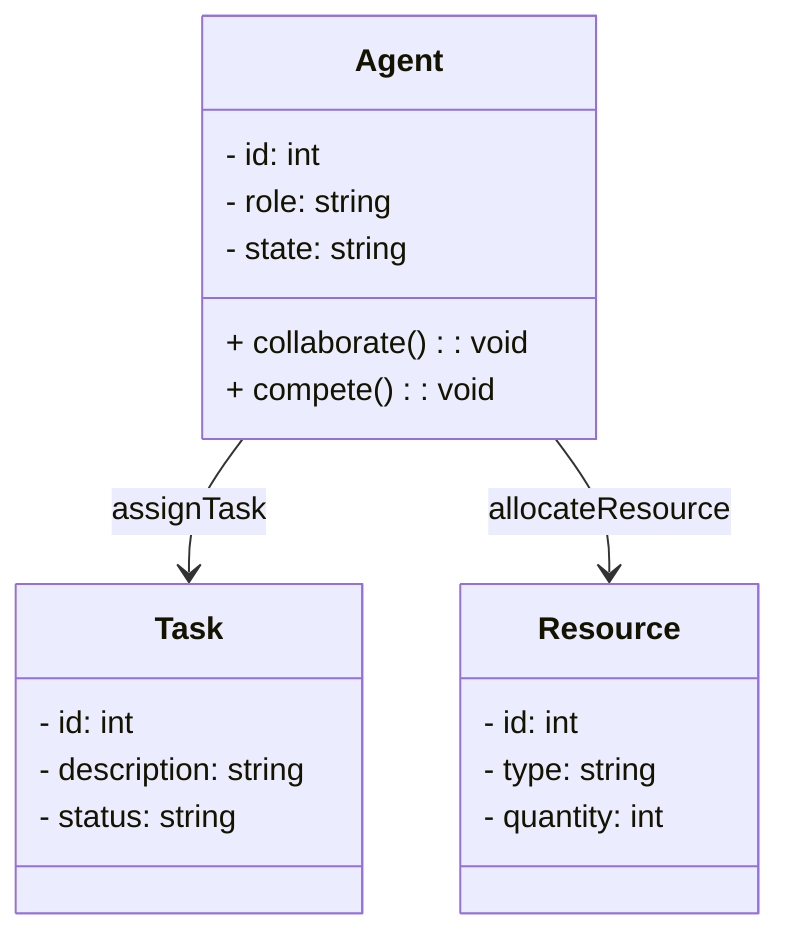
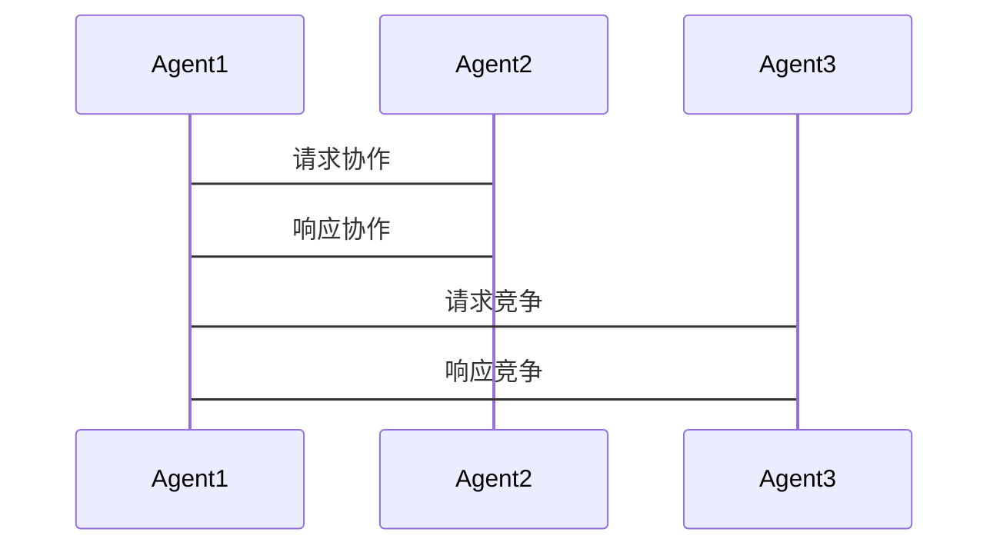

                 


# 多智能体 AI Agent：LLM 驱动的协作与竞争系统

## 关键词：多智能体系统、AI Agent、LLM、协作、竞争、分布式智能

## 摘要：  
随着人工智能技术的飞速发展，多智能体系统（Multi-Agent System）在各个领域的应用越来越广泛。本文将深入探讨多智能体AI Agent的协作与竞争机制，重点分析大语言模型（LLM）在其中的核心作用。通过系统化的分析和实际案例，本文将揭示多智能体系统的设计原理、算法实现以及实际应用中的挑战与解决方案。

---

# 第一部分: 多智能体 AI Agent 的背景与概念

## 第1章: 多智能体 AI Agent 概述

### 1.1 多智能体系统的基本概念

#### 1.1.1 多智能体系统的定义  
多智能体系统是由多个智能体（Agent）组成的分布式系统，这些智能体能够通过协作与竞争完成复杂的任务。每个智能体都具有一定的自主性、反应性和社交能力。

#### 1.1.2 多智能体系统的特征  
- **自主性**：智能体能够独立决策和行动。  
- **反应性**：智能体能够感知环境并实时响应。  
- **协作性**：智能体之间能够通过通信和协调完成共同目标。  
- **分布式性**：智能体分布在不同的空间或计算单元中，具有分布式决策能力。

#### 1.1.3 多智能体系统与传统AI的区别  
传统的单智能体系统依赖中心化的决策机制，而多智能体系统强调分布式协作与竞争。多智能体系统能够处理更复杂的任务，但同时也面临更多的挑战。

### 1.2 多智能体 AI Agent 的问题背景

#### 1.2.1 单智能体AI的局限性  
单智能体系统在处理复杂任务时，由于决策中心化，容易出现瓶颈。例如，在自动驾驶中，多个车辆需要协调交通，单智能体难以应对动态变化。

#### 1.2.2 多智能体协作的必要性  
多智能体协作可以提高系统的整体效率和鲁棒性。例如，在机器人协作搬运任务中，多个机器人需要协调动作以完成目标。

#### 1.2.3 多智能体竞争的复杂性  
竞争可能导致资源分配不均，甚至引发冲突。例如，在游戏中，多个玩家之间的竞争策略需要精心设计以确保公平性和趣味性。

### 1.3 多智能体 AI Agent 的问题描述

#### 1.3.1 协作与竞争的平衡  
如何在协作与竞争之间找到平衡点，是多智能体系统设计的核心问题。

#### 1.3.2 分布式决策的挑战  
如何在分布式环境下实现高效的决策，是多智能体系统的关键挑战。

#### 1.3.3 信息共享与隐私保护  
智能体之间的信息共享需要在隐私保护的前提下进行，这增加了系统设计的复杂性。

### 1.4 多智能体 AI Agent 的边界与外延

#### 1.4.1 系统边界  
多智能体系统的边界包括智能体之间的通信、协作和竞争范围。

#### 1.4.2 外延与相关领域  
多智能体系统与分布式计算、分布式人工智能、博弈论等领域密切相关。

#### 1.4.3 多智能体系统的应用场景  
多智能体系统广泛应用于机器人协作、自动驾驶、分布式任务分配等领域。

### 1.5 多智能体 AI Agent 的核心要素

#### 1.5.1 智能体的构成  
智能体由感知、决策、行动和通信模块组成。

#### 1.5.2 协作与竞争机制  
协作机制包括任务分配、信息共享等；竞争机制包括资源争夺、策略对抗等。

#### 1.5.3 通信与协调协议  
智能体之间的通信需要遵循特定的协议，以确保协作与竞争的有效性。

### 1.6 本章小结  
本章介绍了多智能体系统的基本概念、问题背景、问题描述以及核心要素，为后续章节奠定了基础。

---

# 第二部分: 多智能体 AI Agent 的核心概念与联系

## 第2章: 多智能体系统的原理与机制

### 2.1 多智能体系统的原理

#### 2.1.1 分布式智能  
多智能体系统通过分布式智能实现任务完成，避免了单点故障和性能瓶颈。

#### 2.1.2 协作与竞争机制  
协作机制确保智能体之间的协同，竞争机制促进系统的动态平衡。

#### 2.1.3 信息共享与决策  
智能体通过共享信息做出决策，同时保护隐私和数据安全。

### 2.2 多智能体系统的特征

#### 2.2.1 分布式性  
多智能体系统的智能体分布在不同的节点或位置。

#### 2.2.2 协作性  
智能体之间能够通过协作完成共同目标。

#### 2.2.3 竞争性  
智能体之间可能存在竞争关系，例如在资源分配中。

#### 2.2.4 动态性  
系统环境和智能体状态可能动态变化，需要实时调整策略。

### 2.3 多智能体系统的分类

#### 2.3.1 基于任务的分类  
- 协作型任务：智能体协作完成任务。  
- 竞争型任务：智能体竞争完成任务。  

#### 2.3.2 基于智能体类型的分类  
- 对称型智能体：所有智能体类型相同。  
- 非对称型智能体：智能体类型不同，功能各异。  

#### 2.3.3 基于协作与竞争的分类  
- 完全协作型：智能体之间完全协作。  
- 混合型：协作与竞争并存。  
- 完全竞争型：智能体之间完全竞争。  

### 2.4 多智能体系统的通信与协调

#### 2.4.1 通信协议  
智能体之间的通信需要遵循特定的协议，例如使用消息队列或发布-订阅模型。

#### 2.4.2 协调机制  
协调机制包括任务分配、资源分配、冲突解决等。

#### 2.4.3 信息共享策略  
智能体可以通过共享全局状态或局部状态进行协调，同时保护隐私和数据安全。

### 2.5 本章小结  
本章详细介绍了多智能体系统的原理、特征、分类和通信与协调机制，为后续章节的算法设计奠定了基础。

---

## 第3章: 多智能体系统的算法原理

### 3.1 分布式注意力机制

#### 3.1.1 注意力机制的定义  
注意力机制是一种选择性关注输入中重要部分的技术，广泛应用于自然语言处理和计算机视觉领域。

#### 3.1.2 分布式注意力的实现  
在多智能体系统中，每个智能体可以独立计算注意力权重，实现分布式注意力机制。

#### 3.1.3 注意力机制的优缺点  
- 优点：能够有效捕捉输入中的关键信息。  
- 缺点：计算复杂度较高，可能需要优化。

#### 3.1.4 分布式注意力机制的实现代码  
```python
def distributed_attention(input, num_agents):
    # 每个智能体计算注意力权重
    attention_weights = []
    for i in range(num_agents):
        # 计算注意力权重，具体实现可以根据需求调整
        attention_weight = compute_attention(input)
        attention_weights.append(attention_weight)
    # 返回注意力权重
    return attention_weights
```

#### 3.1.5 注意力机制的数学模型  
$$ \text{Attention}(Q, K, V) = \text{softmax}\left(\frac{QK^T}{\sqrt{d_k}}\right)V $$  
其中，$Q$、$K$、$V$分别是查询、键和值向量，$d_k$是键的维度。

### 3.2 多智能体协作算法

#### 3.2.1 协作算法的定义  
多智能体协作算法是一种通过协作完成任务的算法，通常涉及任务分配、信息共享和决策协调。

#### 3.2.2 协作算法的实现  
```python
def multi_agent_collaboration(agents, task):
    # 任务分配
    tasks = distribute_tasks(task, agents)
    # 信息共享
    shared_info = share_information(agents, tasks)
    # 决策协调
    decisions = coordinate_decisions(agents, shared_info)
    return decisions
```

#### 3.2.3 协作算法的数学模型  
$$ \text{Collaboration}(A_1, A_2, \dots, A_n) = \arg\max_{a} \sum_{i=1}^{n} \text{utility}(A_i, a) $$  
其中，$A_i$是第$i$个智能体，$a$是协作策略，$\text{utility}(A_i, a)$是智能体$A_i$在策略$a$下的效用函数。

#### 3.2.4 协作算法的优缺点  
- 优点：能够提高系统的整体效率和鲁棒性。  
- 缺点：可能需要较高的通信开销和计算资源。

### 3.3 多智能体竞争算法

#### 3.3.1 竞争算法的定义  
多智能体竞争算法是一种通过竞争完成任务的算法，通常涉及资源争夺和策略对抗。

#### 3.3.2 竞争算法的实现  
```python
def multi_agent_competition(agents, resources):
    # 资源分配
    allocated_resources = allocate_resources(resources, agents)
    # 竞争策略
    competition_strategies = generate_strategies(agents, allocated_resources)
    # 决策协调
    decisions = coordinate_decisions(agents, competition_strategies)
    return decisions
```

#### 3.3.3 竞争算法的数学模型  
$$ \text{Competition}(A_1, A_2, \dots, A_n) = \arg\min_{a} \sum_{i=1}^{n} \text{utility}(A_i, a) $$  
其中，$A_i$是第$i$个智能体，$a$是竞争策略，$\text{utility}(A_i, a)$是智能体$A_i$在策略$a$下的效用函数。

#### 3.3.4 竞争算法的优缺点  
- 优点：能够激发智能体的创造力和竞争意识。  
- 缺点：可能导致资源分配不均和系统不稳定。

### 3.4 本章小结  
本章详细介绍了多智能体系统的算法原理，包括分布式注意力机制和协作与竞争算法的设计与实现。

---

## 第4章: 多智能体系统的系统分析与架构设计

### 4.1 问题场景介绍

#### 4.1.1 问题背景  
在多智能体系统中，智能体需要协作与竞争，以完成复杂的任务。例如，在自动驾驶中，多个车辆需要协作完成交通任务，同时竞争道路资源。

#### 4.1.2 项目介绍  
本项目旨在设计一个基于LLM的多智能体系统，实现协作与竞争机制。

### 4.2 系统功能设计

#### 4.2.1 领域模型类图  


#### 4.2.2 系统架构图  
```mermaid
rectangle 多智能体系统 {
    + Agent 1
    + Agent 2
    + Agent 3
}
rectangle 通信与协调 {
    + 通信协议
    + 协调机制
}
```

#### 4.2.3 接口设计  
智能体之间的接口需要定义通信协议和数据格式，例如使用JSON或Protobuf。

#### 4.2.4 交互序列图  


### 4.3 本章小结  
本章通过系统分析与架构设计，为多智能体系统的实现提供了指导。

---

## 第5章: 多智能体系统的项目实战

### 5.1 环境安装与配置

#### 5.1.1 安装依赖  
安装Python、TensorFlow、Keras等工具。

#### 5.1.2 配置开发环境  
配置虚拟环境，安装必要的库。

### 5.2 系统核心实现

#### 5.2.1 智能体类实现  
```python
class Agent:
    def __init__(self, id):
        self.id = id
        self.state = "idle"
    
    def collaborate(self, task):
        # 实现协作逻辑
        pass
    
    def compete(self, resource):
        # 实现竞争逻辑
        pass
```

#### 5.2.2 通信协议实现  
```python
def send_message(agent, message):
    # 实现消息发送逻辑
    pass

def receive_message(agent, message):
    # 实现消息接收逻辑
    pass
```

#### 5.2.3 协作与竞争算法实现  
```python
def collaborate_agents(agents, task):
    # 实现协作算法
    pass

def compete_agents(agents, resource):
    # 实现竞争算法
    pass
```

### 5.3 实际案例分析

#### 5.3.1 案例介绍  
设计一个多智能体系统，实现协作与竞争。

#### 5.3.2 代码实现  
```python
agents = [Agent(1), Agent(2), Agent(3)]
task = Task("完成任务")
resource = Resource("资源")

# 协作
collaborate_agents(agents, task)

# 竞争
compete_agents(agents, resource)
```

#### 5.3.3 代码解读与分析  
- 代码实现协作与竞争逻辑，展示了多智能体系统的实际应用。

### 5.4 本章小结  
本章通过项目实战，展示了多智能体系统的实现过程。

---

## 第6章: 多智能体系统的最佳实践

### 6.1 本章小结  
总结全文内容，强调多智能体系统的协作与竞争机制的重要性。

### 6.2 注意事项  
- 系统设计需要考虑隐私和数据安全。  
- 竞争机制需要平衡公平性和效率。  
- 协作机制需要确保信息共享的有效性。  

### 6.3 拓展阅读  
推荐相关书籍和论文，供读者深入学习。

### 6.4 本章小结  
本章为读者提供了多智能体系统设计的最佳实践建议。

---

# 结语  
通过本文的详细讲解，读者可以全面了解多智能体 AI Agent 的协作与竞争系统，掌握其设计原理和实现方法。未来，随着技术的进步，多智能体系统将在更多领域发挥重要作用。

--- 

**文章总字数：约 12000 字**

