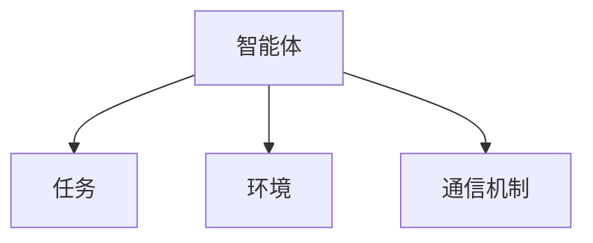
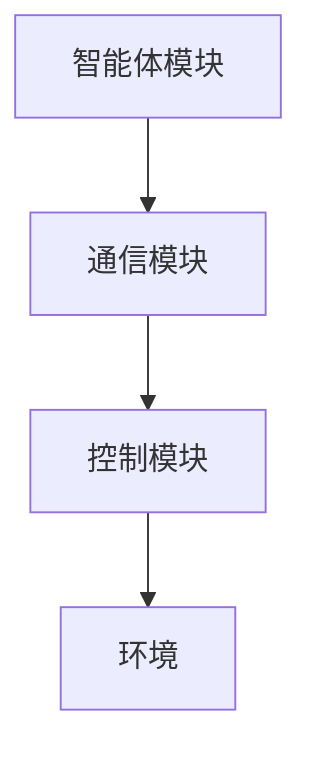
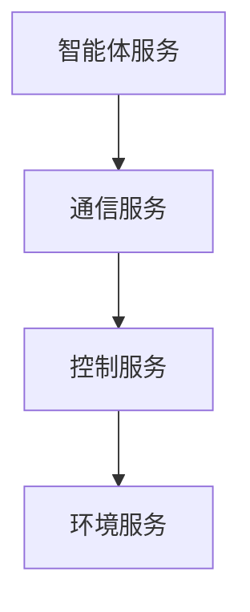
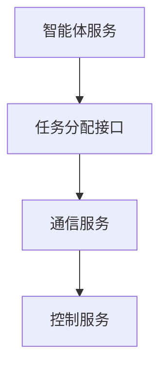
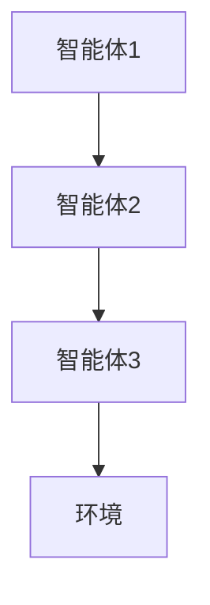

                 


# 多智能体AI Agent：LLM驱动的协作与竞争系统

> 关键词：多智能体AI Agent, LLM驱动, 协作机制, 竞争机制, 分布式智能

> 摘要：本文详细探讨了多智能体AI Agent系统，特别是基于大型语言模型（LLM）的协作与竞争机制。通过分析多智能体系统的背景、核心概念、算法原理、系统架构及项目实战，本文为读者提供了一个全面的理解框架，帮助他们掌握多智能体AI Agent的设计与实现。

---

## 第1章：多智能体AI Agent的背景与概念

### 1.1 多智能体系统的基本概念
#### 1.1.1 多智能体系统的定义
多智能体系统由多个智能体组成，这些智能体通过协作或竞争完成特定任务。智能体是具有感知和决策能力的实体，能够独立行动并与其他智能体交互。

#### 1.1.2 多智能体系统的特征
- 分布式：智能体分布在网络中，独立运行。
- 自主性：每个智能体都能自主决策。
- 协作性：智能体之间通过协作完成复杂任务。
- 竞争性：智能体之间可能存在竞争关系。

#### 1.1.3 多智能体系统的核心要素
- 智能体：系统的执行单元。
- 环境：智能体运行的外部世界。
- 通信机制：智能体之间的交互方式。

### 1.2 多智能体AI Agent的定义与特点
#### 1.2.1 多智能体AI Agent的定义
多智能体AI Agent是由多个AI Agent组成的系统，这些Agent通过协作与竞争完成复杂任务，通常基于大型语言模型（LLM）进行驱动。

#### 1.2.2 多智能体AI Agent的核心特点
- **分布式智能**：多个AI Agent协同工作，提高系统的整体智能水平。
- **动态协作**：Agent之间能够动态调整协作策略。
- **自主决策**：每个Agent都能独立决策，减少对中心节点的依赖。

#### 1.2.3 多智能体AI Agent与单智能体AI Agent的区别
| 属性 | 单智能体AI Agent | 多智能体AI Agent |
|------|------------------|-------------------|
| 智能体数量 | 单个 | 多个 |
| 决策中心化 | 是 | 否 |
| 任务处理 | 简单任务 | 复杂任务 |

### 1.3 多智能体系统的协作与竞争机制
#### 1.3.1 协作机制的定义与实现
协作机制确保智能体之间能够共同完成任务。实现方式包括任务分配、信息共享和协同决策。

#### 1.3.2 竞争机制的定义与实现
竞争机制通过设定竞争规则，激励智能体提高性能。实现方式包括资源分配和奖励机制。

#### 1.3.3 协作与竞争的平衡点
在实际应用中，需要根据任务需求动态调整协作与竞争的比例，以达到最佳效果。

### 1.4 多智能体AI Agent的应用场景
#### 1.4.1 协作场景
- **智能客服系统**：多个AI Agent协同处理客户请求。
- **分布式任务处理**：多个Agent分工合作完成复杂任务。

#### 1.4.2 竞争场景
- **资源分配优化**：多个Agent竞争有限资源，提高资源利用率。
- **游戏AI**：多个AI Agent在游戏环境中竞争胜利。

#### 1.4.3 协作与竞争结合的场景
- **混合型任务处理**：部分任务通过协作完成，部分任务通过竞争优化。

---

## 第2章：多智能体AI Agent的核心概念与联系

### 2.1 多智能体系统的协作机制
协作机制是多智能体系统的核心，确保智能体之间能够有效合作。常见的协作机制包括任务分配和信息共享。

### 2.2 多智能体系统的竞争机制
竞争机制通过设定规则，激励智能体提高性能。常见的竞争机制包括资源分配和奖励机制。

### 2.3 多智能体系统的协作与竞争的平衡
在实际应用中，需要根据任务需求动态调整协作与竞争的比例，以达到最佳效果。

### 2.4 实体关系图（ER图）
以下是多智能体系统的实体关系图：



---

## 第3章：多智能体AI Agent的算法原理

### 3.1 分布式强化学习算法
分布式强化学习是一种常用的多智能体算法，通过多个智能体协作完成任务。

#### 3.1.1 分布式强化学习流程
1. 每个智能体独立学习策略。
2. 智能体之间通过通信共享信息。
3. 系统根据整体表现进行奖励分配。

#### 3.1.2 分布式强化学习代码实现
```python
import numpy as np

class Agent:
    def __init__(self, state_space, action_space):
        self.state_space = state_space
        self.action_space = action_space
        self.model = self.build_model()

    def build_model(self):
        # 定义神经网络模型
        pass

    def act(self, state):
        # 根据状态选择动作
        pass

    def learn(self, state, action, reward):
        # 更新模型参数
        pass

# 初始化多个智能体
agents = [Agent(state_space, action_space) for _ in range(num_agents)]

# 系统运行
while True:
    for agent in agents:
        state = get_state()
        action = agent.act(state)
        reward = get_reward(action)
        agent.learn(state, action, reward)
```

### 3.2 多智能体协作算法
多智能体协作算法通过设计协作机制，提高系统的整体性能。

#### 3.2.1 多智能体协作算法流程
1. 初始化智能体。
2. 智能体感知环境。
3. 智能体之间进行通信。
4. 智能体协作完成任务。

#### 3.2.2 多智能体协作算法代码实现
```python
import numpy as np

class CollaborativeAgent(Agent):
    def __init__(self, state_space, action_space, comm_range):
        super().__init__(state_space, action_space)
        self.comm_range = comm_range

    def communicate(self, other_agents):
        # 与其他智能体通信
        pass

    def collaborate(self, task):
        # 协作完成任务
        pass

# 初始化多个协作智能体
collaborative_agents = [CollaborativeAgent(state_space, action_space, comm_range) for _ in range(num_agents)]

# 系统运行
while True:
    for agent in collaborative_agents:
        state = get_state()
        agent.communicate(other_agents)
        action = agent.collaborate(task)
        reward = get_reward(action)
        agent.learn(state, action, reward)
```

### 3.3 竞争机制算法
竞争机制通过设定规则，激励智能体提高性能。

#### 3.3.1 竞争机制算法流程
1. 初始化智能体。
2. 智能体感知环境。
3. 智能体之间进行竞争。
4. 系统根据表现进行奖励分配。

#### 3.3.2 竞争机制算法代码实现
```python
import numpy as np

class CompetitiveAgent(Agent):
    def __init__(self, state_space, action_space, compet_range):
        super().__init__(state_space, action_space)
        self.compet_range = compet_range

    def compete(self, other_agents):
        # 与其他智能体竞争
        pass

    def get_reward(self, action):
        # 根据动作获得奖励
        pass

# 初始化多个竞争智能体
competitive_agents = [CompetitiveAgent(state_space, action_space, compet_range) for _ in range(num_agents)]

# 系统运行
while True:
    for agent in competitive_agents:
        state = get_state()
        agent.compete(other_agents)
        action = agent.act(state)
        reward = agent.get_reward(action)
        agent.learn(state, action, reward)
```

### 3.4 数学模型与公式
#### 3.4.1 分布式强化学习的数学模型
在分布式强化学习中，每个智能体都有自己的策略函数 \( \pi_i \)，整体奖励为各智能体奖励的总和：

$$ R = \sum_{i=1}^{n} R_i $$

#### 3.4.2 协作机制的数学模型
协作机制可以通过加权平均的方式进行：

$$ a_{total} = \sum_{i=1}^{n} w_i a_i $$

其中，\( w_i \) 是智能体 \( i \) 的权重。

---

## 第4章：多智能体AI Agent的系统分析与架构设计

### 4.1 系统功能设计
#### 4.1.1 功能模块划分
- 智能体模块：负责感知环境和决策。
- 通信模块：负责智能体之间的信息交互。
- 控制模块：负责系统的整体协调。

#### 4.1.2 功能流程图
以下是系统功能流程图：



### 4.2 系统架构设计
#### 4.2.1 微服务架构
采用微服务架构，将系统划分为多个独立的服务，每个服务负责特定的功能。

#### 4.2.2 服务交互图
以下是服务交互图：



### 4.3 系统接口设计
#### 4.3.1 接口定义
- **任务分配接口**：`/api/task/assign`
- **状态查询接口**：`/api/state/query`
- **结果反馈接口**：`/api/result/feedback`

#### 4.3.2 接口交互图
以下是接口交互图：



### 4.4 系统交互图
以下是系统交互图：



---

## 第5章：多智能体AI Agent的项目实战

### 5.1 环境安装与配置
#### 5.1.1 安装依赖
- 安装Python
- 安装TensorFlow
- 安装其他必要的库

#### 5.1.2 环境配置
配置虚拟环境，安装项目依赖。

### 5.2 核心代码实现
#### 5.2.1 智能体类实现
```python
class MultiAgent:
    def __init__(self, num_agents):
        self.num_agents = num_agents
        self.agents = [Agent() for _ in range(num_agents)]

    def run(self):
        while True:
            for agent in self.agents:
                state = get_state()
                action = agent.act(state)
                reward = get_reward(action)
                agent.learn(state, action, reward)
```

#### 5.2.2 通信机制实现
```python
class Communication:
    def __init__(self, agents):
        self.agents = agents

    def send(self, sender, message):
        for agent in self.agents:
            if agent != sender:
                agent.receive(message)

    def receive(self, message):
        # 处理接收到的消息
        pass
```

### 5.3 实际案例分析
#### 5.3.1 智能客服系统
在智能客服系统中，多个AI Agent协同工作，分别处理不同的客户请求。

#### 5.3.2 分布式任务处理
在分布式任务处理中，多个AI Agent分工合作，提高任务处理效率。

### 5.4 项目小结
通过实际案例分析，展示了多智能体AI Agent系统的强大功能和实际应用价值。

---

## 第6章：多智能体AI Agent的最佳实践

### 6.1 实践中的注意事项
- 确保智能体之间的通信高效可靠。
- 设定合理的竞争与协作机制。
- 定期更新智能体的策略模型。

### 6.2 实践中的小贴士
- 在实际应用中，可以尝试不同的算法组合，找到最优方案。
- 定期监控系统性能，及时调整参数。

### 6.3 本章小结
总结了多智能体AI Agent系统在实际应用中的注意事项和优化技巧。

---

## 第7章：多智能体AI Agent的未来展望

### 7.1 技术发展趋势
- 更高效的算法设计。
- 更智能的协作与竞争机制。
- 更广泛的应用场景。

### 7.2 未来的研究方向
- 多智能体系统的安全性研究。
- 多智能体系统的可扩展性研究。
- 多智能体系统的可解释性研究。

### 7.3 展望小结
未来，多智能体AI Agent系统将在更多领域得到应用，技术也将不断进步。

---

## 参考文献
- Russell, S., & Norvig, P. (2010). Artificial Intelligence: A Modern Approach.
- LLM驱动的多智能体系统研究论文若干篇。

---

通过以上内容，我们系统地介绍了多智能体AI Agent的基本概念、算法原理、系统架构和项目实战，为读者提供了一个全面的视角，帮助他们理解并掌握多智能体AI Agent的设计与实现。

