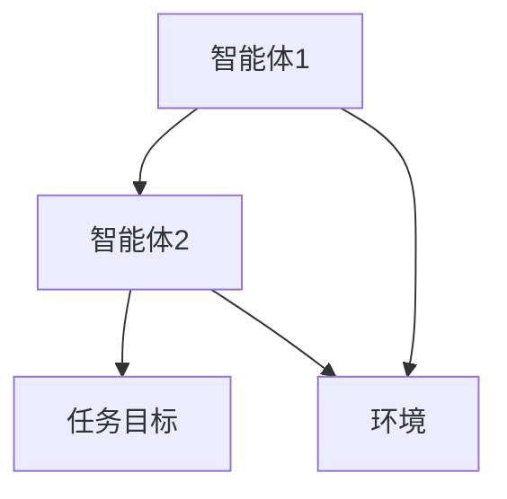
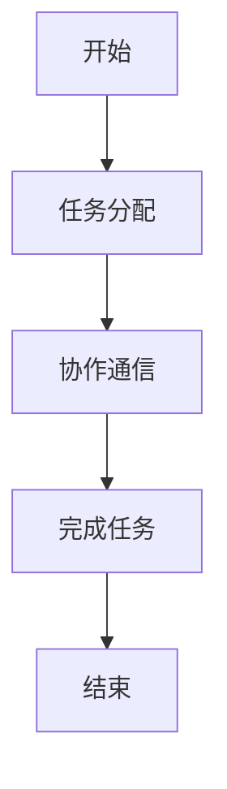
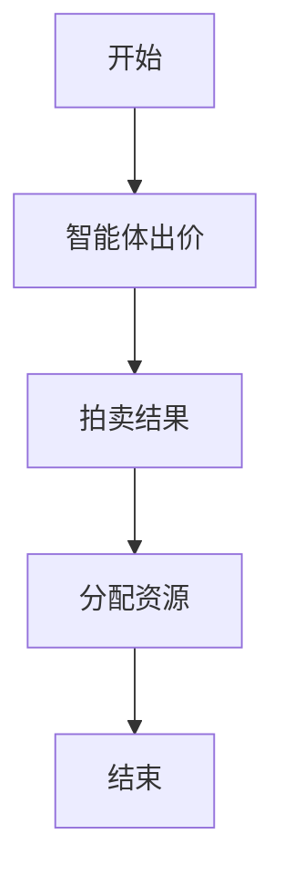
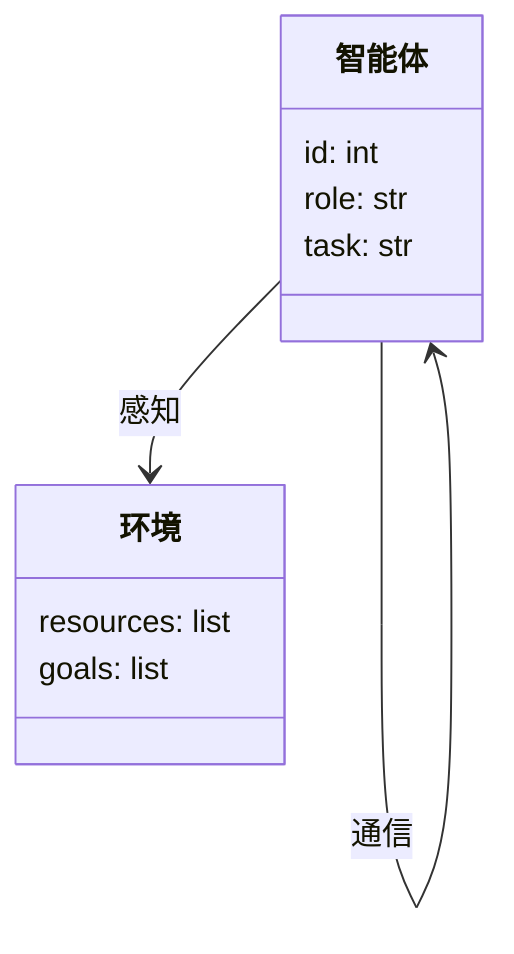
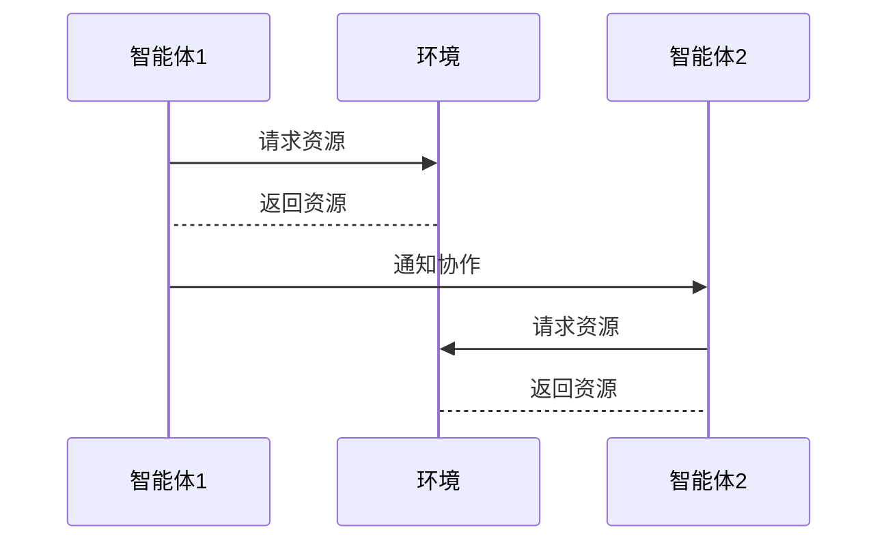
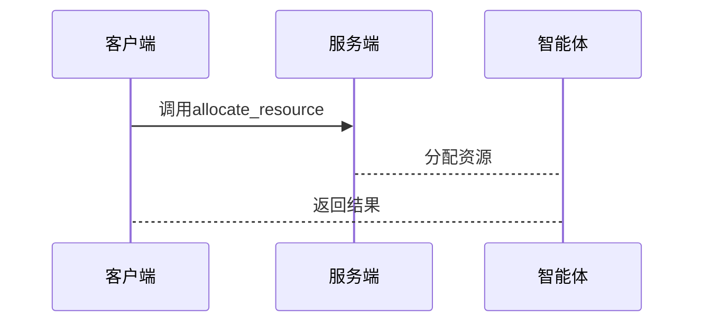

                 


# 多智能体AI如何优化公司核心竞争力分析

> 关键词：多智能体AI, 企业核心竞争力, AI优化, 算法原理, 系统架构

> 摘要：本文深入分析了多智能体AI如何优化公司核心竞争力，从多智能体AI的核心概念、算法原理、系统架构到实际项目案例，全面解析了多智能体AI在企业中的应用价值和优化潜力。

---

# 第一部分: 多智能体AI与企业核心竞争力概述

## 第1章: 多智能体AI的核心概念与背景

### 1.1 多智能体系统的基本概念

#### 1.1.1 什么是多智能体系统
多智能体系统（Multi-Agent System, MAS）是由多个智能体组成的系统，这些智能体能够通过协作和通信完成复杂任务。与单智能体系统相比，多智能体系统具有分布式、协作性和自主性的特点。

#### 1.1.2 多智能体系统的特点
- 分布式：智能体独立运行，不存在中心节点。
- 协作性：智能体之间通过协作完成共同目标。
- 自主性：智能体能够自主决策和行动。
- 反应性：智能体能够感知环境并实时响应。

#### 1.1.3 多智能体与传统AI的区别
- 单智能体系统：单个智能体完成任务，决策集中。
- 多智能体系统：多个智能体协作，决策分布。

### 1.2 多智能体AI在企业中的应用背景

#### 1.2.1 企业核心竞争力的定义
企业核心竞争力是指企业在市场上独特的优势，包括技术、管理、资源等方面。

#### 1.2.2 多智能体AI如何优化企业竞争力
- 提高效率：通过协作优化资源配置。
- 支持决策：通过数据分析提供科学决策支持。
- 增强灵活性：快速适应市场变化。

#### 1.2.3 当前企业面临的挑战与机遇
- 挑战：传统管理模式效率低下，资源浪费。
- 机遇：多智能体AI能够通过协作和优化提升企业竞争力。

### 1.3 多智能体AI的潜在价值

#### 1.3.1 提高企业效率的潜力
- 通过协作减少重复劳动，提高效率。
- 通过智能分配资源，减少浪费。

#### 1.3.2 优化资源配置的可能性
- 多智能体AI能够通过协作优化资源分配。
- 通过动态调整资源分配应对市场变化。

#### 1.3.3 支持决策科学化的可能性
- 多智能体AI能够提供实时数据分析支持决策。
- 通过模拟和预测优化决策。

### 1.4 本章小结
本章介绍了多智能体AI的基本概念，分析了其在企业中的应用背景，探讨了其优化企业核心竞争力的潜力。

---

# 第二部分: 多智能体AI的核心概念与原理

## 第2章: 多智能体AI的核心概念与联系

### 2.1 多智能体系统的组成与结构

#### 2.1.1 实体关系分析
- 智能体：具有自主性、反应性和协作性的实体。
- 环境：智能体所处的外部环境，包括其他智能体和任务目标。

#### 2.1.2 Mermaid实体关系图


### 2.2 多智能体AI的协作机制

#### 2.2.1 协作原理
- 智能体之间通过通信和协商完成协作。
- 协作目标是完成共同任务。

#### 2.2.2 通信协议
- 智能体之间通过消息传递进行通信。
- 通信协议定义了消息的格式和内容。

#### 2.2.3 任务分配
- 根据智能体的能力和环境需求分配任务。
- 任务分配算法需要考虑智能体的资源和能力。

### 2.3 多智能体AI的属性特征对比

#### 2.3.1 属性特征表格对比

| 属性       | 单智能体系统 | 多智能体系统 |
|------------|-------------|--------------|
| 结构化      | 集中式       | 分布式       |
| 协作性      | 低           | 高            |
| 自主性      | 低           | 高            |
| 反应性      | 低           | 高            |

#### 2.3.2 Mermaid流程图展示


### 2.4 本章小结
本章分析了多智能体系统的组成与结构，探讨了协作机制和任务分配的原理，通过对比分析了多智能体系统与单智能体系统的区别。

---

# 第三部分: 多智能体AI的算法原理与数学模型

## 第3章: 多智能体AI的典型算法

### 3.1 基于拍卖的资源分配算法

#### 3.1.1 算法原理
- 通过拍卖机制分配资源。
- 每个智能体根据自身需求和能力出价。

#### 3.1.2 Mermaid流程图展示


#### 3.1.3 Python实现代码
```python
def auction_algorithm(bids):
    max_bid = max(bids)
    winner = bids.index(max_bid)
    return winner
```

### 3.2 基于纳什均衡的协作算法

#### 3.2.1 纳什均衡的定义
- 纳什均衡是指在策略组合下，每个智能体的策略都是最优的，即没有智能体有动机单方面改变策略。

#### 3.2.2 算法数学模型
$$ 纳什均衡的条件是：对于所有i，u_i(s_i, s_{-i}) \geq u_i(s'_i, s_{-i}) $$

其中，$u_i$是智能体i的效用函数，$s_i$是当前策略，$s_{-i}$是其他智能体的策略。

#### 3.2.3 实际案例分析
- 案例：两个智能体分配任务，任务价值分别为$10和$20，智能体1的策略是$10，智能体2的策略是$20，纳什均衡是智能体1分配$10任务，智能体2分配$20任务。

### 3.3 多智能体学习算法

#### 3.3.1 基于强化学习的协作
- 强化学习通过奖励机制训练智能体协作。

#### 3.3.2 算法数学公式
$$ R = \sum_{i=1}^n r_i $$
其中，$R$是总奖励，$r_i$是智能体i的奖励。

#### 3.3.3 代码实现与分析
```python
def reinforcement_learning(rewards):
    total_reward = sum(rewards)
    return total_reward
```

### 3.4 本章小结
本章分析了多智能体AI的典型算法，包括基于拍卖的资源分配算法和纳什均衡的协作算法，探讨了强化学习的应用。

---

# 第四部分: 多智能体AI的系统分析与架构设计

## 第4章: 多智能体AI的系统分析

### 4.1 项目背景与目标

#### 4.1.1 项目介绍
- 项目名称：多智能体AI优化企业资源分配。
- 项目目标：通过多智能体协作优化企业资源分配效率。

#### 4.1.2 项目目标
- 提高资源分配效率。
- 减少资源浪费。
- 提高企业竞争力。

### 4.2 系统功能设计

#### 4.2.1 领域模型设计


#### 4.2.2 Mermaid架构图展示


### 4.3 系统架构设计

#### 4.3.1 分层架构设计
- 数据层：存储资源和任务数据。
- 逻辑层：实现智能体协作和资源分配。
- 接口层：提供API供其他系统调用。

#### 4.3.2 Mermaid序列图展示


### 4.4 系统接口与交互设计

#### 4.4.1 系统接口设计
- 接口名称：`allocate_resource`
- 输入参数：智能体ID，任务需求。
- 输出参数：分配结果。

#### 4.4.2 Mermaid序列图展示


### 4.5 本章小结
本章分析了多智能体AI的系统架构设计，包括领域模型设计、系统架构和接口设计。

---

# 第五部分: 多智能体AI的项目实战与案例分析

## 第5章: 项目实战与案例分析

### 5.1 环境安装与配置

#### 5.1.1 开发环境搭建
- 安装Python和相关库（如`numpy`, `pandas`）。
- 安装多智能体AI框架（如`Multi-Agent Framework`）。

#### 5.1.2 环境配置
- 设置智能体数量和任务目标。
- 配置通信协议和资源分配算法。

### 5.2 系统核心实现

#### 5.2.1 核心功能实现
- 实现智能体协作和通信功能。
- 实现资源分配算法。

#### 5.2.2 代码实现与解读
```python
def allocate_resource(intelligence_id, task_demand):
    # 实现资源分配逻辑
    return allocation_result
```

### 5.3 项目案例分析

#### 5.3.1 案例介绍
- 案例名称：某企业资源分配优化项目。
- 项目目标：通过多智能体AI优化企业资源分配效率。

#### 5.3.2 案例分析
- 分析项目实施前后的效率变化。
- 总结项目实施的经验和教训。

### 5.4 本章小结
本章通过实际项目案例分析，展示了多智能体AI在企业中的应用价值和优化潜力。

---

# 结语

多智能体AI通过协作和优化，能够显著提升企业的核心竞争力。通过本文的分析，读者可以深入了解多智能体AI的基本概念、算法原理和系统架构，为实际应用提供理论和实践指导。未来，随着AI技术的不断发展，多智能体AI将在企业中发挥更大的作用。

