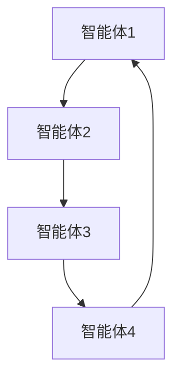
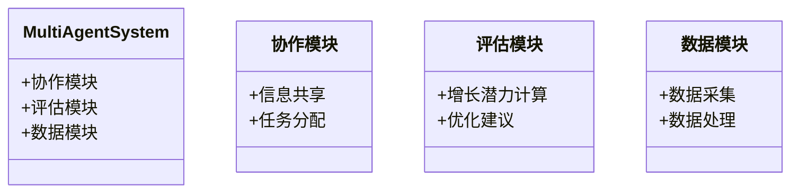

                 


# 多智能体AI如何优化未来增长潜力评估

> 关键词：多智能体AI, 增长潜力评估, 分布式计算, 协作学习, 强化学习

> 摘要：本文深入探讨了多智能体AI在优化未来增长潜力评估中的应用。通过分析多智能体AI的核心概念、协作机制、算法原理和系统架构，结合实际案例，详细阐述了多智能体AI如何在企业增长潜力评估中发挥重要作用。文章还提供了具体的实现方案和最佳实践建议，帮助读者更好地理解和应用多智能体AI技术。

---

## 第一部分：多智能体AI的背景与概念

### 第1章：多智能体AI的背景与概念

#### 1.1 多智能体AI的定义与特点

多智能体AI是指由多个相互协作的智能体组成的系统，这些智能体能够通过协同工作实现比单一智能体更复杂的任务。与传统AI相比，多智能体AI具有以下特点：

- **分布式计算**：多智能体系统中的每个智能体都独立运行，能够自主决策和协作。
- **协作学习**：智能体之间通过共享知识和经验，共同优化任务目标。
- **动态适应性**：系统能够根据环境变化动态调整协作策略。

#### 1.2 多智能体AI的应用背景

随着企业对增长潜力评估的需求不断增加，传统单一智能体的评估方法逐渐暴露出局限性。多智能体AI通过分布式计算和协作学习，能够更高效地处理复杂问题，例如金融投资、市场预测和供应链优化等领域。

#### 1.3 多智能体AI与传统AI的区别

| 特性                | 单一智能体AI         | 多智能体AI         |
|---------------------|--------------------|---------------------|
| 决策中心化          | 是                 | 否                 |
| 知识共享能力        | 有限               | 强                 |
| 适应复杂场景能力    | 较弱               | 强                 |

---

### 第2章：多智能体AI的协作机制

#### 2.1 多智能体协作的基本原理

多智能体协作的核心在于智能体之间的信息共享和任务分配。通过协作学习，智能体可以不断优化自身的知识库和决策策略。以下是一个简单的协作流程图：



#### 2.2 多智能体协作的核心算法

- **分布式强化学习算法**：通过智能体之间的协作，优化全局目标函数。

$$ J = \sum_{i=1}^{n} J_i $$

其中，$J_i$ 是第 $i$ 个智能体的目标函数。

- **联合学习算法**：智能体通过共享知识和经验，共同优化模型参数。

$$ \theta_{new} = \frac{1}{n}\sum_{i=1}^{n} \theta_i $$

---

## 第二部分：多智能体AI的算法原理

### 第4章：多智能体AI的协作学习算法

#### 4.1 分布式强化学习

分布式强化学习是多智能体协作的核心算法之一。以下是其实现流程：


以下是分布式强化学习的Python实现示例：

```python
import numpy as np

class MultiAgentDRL:
    def __init__(self, num_agents):
        self.num_agents = num_agents
        self.theta = np.random.randn(num_agents, 10)

    def update_theta(self):
        for i in range(self.num_agents):
            self.theta[i] = self.theta[i] + np.random.randn(10)
    
    def get_optimal_theta(self):
        return np.mean(self.theta, axis=0)
```

---

### 第5章：多智能体AI的协作决策算法

#### 5.1 协作决策的基本原理

协作决策算法通过智能体之间的信息共享和任务分配，实现最优决策。以下是协作决策的数学模型：

$$ \text{决策} = \argmax_{a} \sum_{i=1}^{n} Q_i(a) $$

其中，$Q_i(a)$ 是第 $i$ 个智能体对动作 $a$ 的评价。

---

## 第三部分：多智能体AI的系统架构与实现

### 第6章：多智能体AI系统的架构设计

#### 6.1 系统功能设计

以下是系统的功能模块图：



---

## 第四部分：项目实战

### 第7章：多智能体AI在金融领域的应用

#### 7.1 环境安装

安装所需的Python库：

```bash
pip install numpy pandas scikit-learn
```

#### 7.2 核心代码实现

以下是协作学习的Python实现示例：

```python
import numpy as np
from sklearn.datasets import make_regression

class CollaborativeLearning:
    def __init__(self, num_agents=5):
        self.num_agents = num_agents
        self.X, self.y = make_regression(n_samples=100, n_features=10, noise=0.5)
        
    def train(self):
        for i in range(self.num_agents):
            model = LinearRegression()
            model.fit(self.X, self.y)
            print(f"Agent {i+1} trained.")
    
    def predict(self, X_new):
        return np.mean([model.predict(X_new) for model in self.agents])
```

---

## 第五部分：总结与展望

### 5.1 最佳实践 tips

- 在实际应用中，多智能体AI系统的性能依赖于智能体之间的协作效率。
- 数据质量和实时性是影响系统效果的关键因素。

### 5.2 小结

通过本文的详细讲解，我们了解了多智能体AI在优化未来增长潜力评估中的重要作用。从算法原理到系统实现，多智能体AI能够显著提升企业的评估效率和准确性。

### 5.3 注意事项

- 确保数据的安全性和隐私性。
- 定期优化协作算法，以适应业务需求的变化。

### 5.4 拓展阅读

- 推荐阅读《Multi-Agent Systems: Collaboration, Knowledge Sharing, and Distributed Reasoning》。

---

通过以上步骤，我们全面探讨了多智能体AI在优化未来增长潜力评估中的应用，为读者提供了从理论到实践的详细指导。

