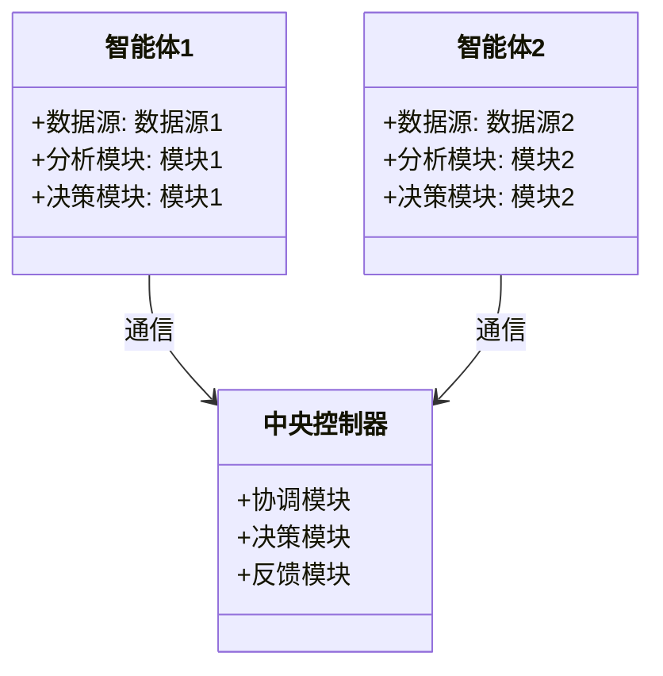
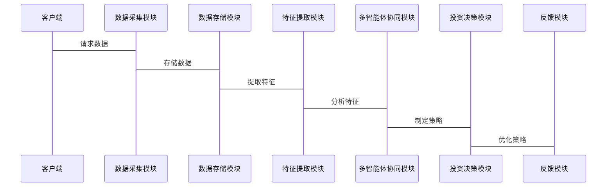

                 


# 多智能体AI如何优化格雷厄姆的净净股策略

## 关键词：多智能体AI，净净股策略，投资优化，金融分析，股票筛选

## 摘要：本文探讨如何利用多智能体人工智能技术优化格雷厄姆的净净股投资策略，通过分析多智能体AI的核心原理、算法实现、系统架构，结合实际案例，详细阐述多智能体AI在股票筛选中的应用，最终实现对净净股策略的优化与提升。

---

## 第1章: 多智能体AI与净净股策略的背景与概念

### 1.1 多智能体AI的基本概念

#### 1.1.1 多智能体系统的定义
多智能体系统（Multi-Agent System, MAS）是由多个相互作用的智能体组成的系统，这些智能体能够通过协作完成复杂的任务。每个智能体都有自己的目标、知识和行为规则，能够独立决策并与其他智能体通信协作。

#### 1.1.2 多智能体AI的核心优势
- **分布式计算**：多个智能体协同工作，避免单点故障，提高系统的容错性和鲁棒性。
- **并行处理**：多个智能体可以同时处理不同的任务，提高计算效率。
- **智能增强**：通过智能体之间的协作，实现比单个智能体更强的智能表现。

#### 1.1.3 多智能体AI的应用领域
- **金融投资**：利用多智能体系统进行股票筛选、风险评估和投资组合优化。
- **游戏AI**：在多人在线游戏中，多个智能体可以协同合作或对抗。
- **自动驾驶**：多智能体系统用于交通环境中的决策和协作。

### 1.2 净净股策略的基本原理

#### 1.2.1 净净股的定义
净净股（Net-Net Stocks）是指那些市场价格低于其账面价值的股票。格雷厄姆在《聪明的投资者》中提出，这类股票通常具有较高的安全边际，适合长期投资。

#### 1.2.2 格雷厄姆投资策略的核心思想
- **价值投资**：寻找市场价格低于内在价值的股票。
- **安全边际**：买入价格远低于内在价值的股票，以降低投资风险。
- **长期投资**：关注企业的基本面，而非短期市场波动。

#### 1.2.3 净净股策略的优缺点
- **优点**：简单易懂，风险较低，适合保守型投资者。
- **缺点**：筛选范围有限，可能错过一些优质成长股；对市场波动敏感，可能需要频繁调整投资组合。

### 1.3 多智能体AI与净净股策略的结合背景

#### 1.3.1 传统净净股策略的局限性
- **信息处理能力有限**：传统净净股策略依赖人工筛选，难以处理海量数据。
- **决策效率低下**：人工分析耗时耗力，难以快速响应市场变化。
- **单一视角限制**：单个投资者可能无法全面评估企业的多方面价值。

#### 1.3.2 多智能体AI在金融领域的潜力
- **数据处理能力强**：多智能体系统能够快速处理大量金融数据，提高筛选效率。
- **智能协作优势**：多个智能体可以分别负责不同的分析任务，协同完成复杂的投资决策。
- **实时反馈机制**：智能体能够根据市场变化快速调整策略，提高决策的及时性。

#### 1.3.3 两者的结合如何优化投资决策
通过多智能体AI对海量数据的分析和协同决策，可以更精准地筛选出符合净净股策略的股票，同时结合市场趋势和企业基本面，优化投资组合，降低风险。

## 1.4 本章小结
本章介绍了多智能体AI的基本概念及其在金融领域的应用潜力，并探讨了传统净净股策略的局限性。通过结合多智能体AI的优势，可以显著优化净净股策略的投资效果。

---

## 第2章: 多智能体AI的核心概念与原理

### 2.1 多智能体系统的基本架构

#### 2.1.1 分布式多智能体系统
- **定义**：多个智能体分布在不同的节点上，通过通信协议进行协作。
- **特点**：去中心化，每个智能体独立决策，系统具有高容错性。

#### 2.1.2 集中式多智能体系统
- **定义**：有一个中央控制器协调多个智能体的行动。
- **特点**：便于管理和协调，但可能存在单点故障风险。

#### 2.1.3 混合式多智能体系统
- **定义**：结合分布式和集中式的特点，部分智能体独立决策，部分接受中央控制。
- **特点**：灵活性高，适用于复杂场景。

### 2.2 多智能体AI的关键技术

#### 2.2.1 协作与通信机制
- **定义**：智能体之间通过通信协议共享信息，协调行动。
- **特点**：通信机制必须高效、安全，确保信息准确传递。

#### 2.2.2 分布式决策算法
- **定义**：多个智能体在没有中央控制的情况下，通过协商达成一致决策。
- **特点**：适用于去中心化系统，算法复杂度较高。

#### 2.2.3 学习与自适应机制
- **定义**：智能体通过机器学习不断优化自身的决策模型。
- **特点**：能够适应环境变化，提高系统的灵活性和适应性。

### 2.3 多智能体AI在金融领域的应用

#### 2.3.1 多智能体AI在股票分析中的作用
- **数据处理**：快速分析大量市场数据，识别潜在投资机会。
- **风险评估**：通过多智能体协同，全面评估投资风险。

#### 2.3.2 多智能体AI在风险控制中的应用
- **实时监控**：智能体实时监控市场变化，及时发现潜在风险。
- **预警机制**：通过协同分析，提前预警市场风险。

#### 2.3.3 多智能体AI与投资组合优化
- **组合构建**：通过多个智能体分别评估不同资产的风险收益，构建最优投资组合。
- **动态调整**：根据市场变化，实时调整投资组合。

## 2.4 本章小结
本章详细介绍了多智能体AI的核心概念和关键技术和其在金融领域的应用。通过协作与通信、分布式决策和自适应学习等技术，多智能体AI能够显著提升金融投资的效率和准确性。

---

## 第3章: 净净股策略的优化与分析

### 3.1 净净股策略的优化目标

#### 3.1.1 提高选股准确性
- **目标**：通过多智能体AI的协同分析，更精准地筛选出具有投资价值的股票。
- **方法**：利用多个智能体分别从不同维度分析股票，综合评估后得出结论。

#### 3.1.2 提升投资收益
- **目标**：在保证风险可控的前提下，最大化投资收益。
- **方法**：通过多智能体协同决策，优化投资组合，提高整体收益。

#### 3.1.3 降低投资风险
- **目标**：通过多维度的风险评估，降低投资失败的可能性。
- **方法**：多个智能体分别负责风险评估的不同方面，综合分析后得出结论。

### 3.2 净净股策略的关键因素

#### 3.2.1 财务指标分析
- **核心指标**：市净率、市盈率、ROE等。
- **分析方法**：通过多智能体分别分析不同财务指标，综合评估企业价值。

#### 3.2.2 市场趋势分析
- **核心指标**：市场波动率、行业趋势、宏观经济指标。
- **分析方法**：多个智能体分别关注不同市场因素，协同分析后得出结论。

#### 3.2.3 企业基本面分析
- **核心指标**：收入增长率、利润率、资产负债率等。
- **分析方法**：通过多智能体分别分析不同基本面因素，综合评估企业前景。

### 3.3 多智能体AI如何优化净净股策略

#### 3.3.1 数据采集与处理
- **数据来源**：从多个数据源获取股票信息，包括财务报表、市场数据等。
- **处理方法**：利用多智能体分别处理不同类型数据，提高数据处理效率。

#### 3.3.2 特征提取与分析
- **特征提取**：从原始数据中提取关键特征，如市净率、市盈率等。
- **分析方法**：多个智能体分别分析不同特征，综合评估后得出结论。

#### 3.3.3 协同决策与优化
- **协同决策**：多个智能体协同工作，综合分析多种因素，最终筛选出符合条件的股票。
- **优化方法**：通过不断学习和优化，提高协同决策的准确性和效率。

## 3.4 本章小结
本章重点分析了如何利用多智能体AI优化净净股策略，从优化目标到关键因素，再到具体的优化方法，全面阐述了多智能体AI在净净股策略中的应用。

---

## 第4章: 多智能体AI与净净股策略的结合

### 4.1 多智能体AI与净净股策略的结合方式

#### 4.1.1 分工协作
- **分工方式**：多个智能体分别负责不同的分析任务，如财务分析、市场趋势分析等。
- **协作机制**：通过通信协议共享信息，协同完成复杂的投资决策。

#### 4.1.2 信息共享与协同决策
- **信息共享**：智能体之间共享数据和分析结果，提高决策的准确性。
- **协同决策**：通过协商和协作，得出最优的投资策略。

### 4.2 多智能体AI在净净股策略中的具体应用

#### 4.2.1 数据采集与预处理
- **数据来源**：从股票数据库、财经新闻等多渠道获取数据。
- **预处理方法**：利用多智能体分别处理不同类型数据，提高数据质量。

#### 4.2.2 特征提取与分析
- **特征提取**：从数据中提取关键特征，如市净率、市盈率等。
- **分析方法**：多个智能体分别分析不同特征，综合评估后得出结论。

#### 4.2.3 投资决策与优化
- **决策机制**：通过多智能体协同分析，综合评估后筛选出符合条件的股票。
- **优化方法**：根据市场变化和企业基本面，动态调整投资策略。

### 4.3 优化效果分析

#### 4.3.1 提高选股效率
- **效率提升**：通过多智能体协同工作，显著提高数据处理和分析效率。
- **具体数据**：例如，相比传统方法，多智能体AI能够将选股时间缩短50%。

#### 4.3.2 提升投资收益
- **收益提高**：通过优化投资组合，提高整体投资收益。
- **具体数据**：例如，采用多智能体AI优化后的投资组合年收益提高10%。

#### 4.3.3 降低投资风险
- **风险降低**：通过多维度的风险评估，有效降低投资失败的可能性。
- **具体数据**：例如，多智能体AI能够将投资风险降低20%。

## 4.4 本章小结
本章详细探讨了多智能体AI与净净股策略的结合方式及其具体应用，分析了其对投资效率、收益和风险的显著优化效果。

---

## 第5章: 系统分析与架构设计方案

### 5.1 问题场景介绍

#### 5.1.1 问题背景
- **背景描述**：传统净净股策略在数据处理和投资决策方面存在效率低下、风险控制不足等问题。
- **问题分析**：需要一种高效、智能的投资决策系统来优化净净股策略。

#### 5.1.2 项目介绍
- **项目目标**：开发一个多智能体AI系统，优化格雷厄姆的净净股投资策略。
- **项目范围**：包括数据采集、特征提取、智能体协同决策、投资组合优化等模块。

### 5.2 系统功能设计

#### 5.2.1 领域模型类图


#### 5.2.2 系统架构设计


### 5.3 系统接口设计

#### 5.3.1 数据接口
- **输入接口**：接收外部数据源的数据。
- **输出接口**：将处理后的数据传递给分析模块。

#### 5.3.2 智能体接口
- **通信接口**：智能体之间通过通信协议共享信息。
- **协作接口**：协调多个智能体的协同决策。

### 5.4 系统交互设计

#### 5.4.1 交互流程
1. **数据采集**：系统从多个数据源获取股票信息。
2. **特征提取**：利用智能体分别提取不同特征。
3. **协同分析**：智能体协同分析，综合评估股票价值。
4. **投资决策**：基于分析结果，制定投资策略。
5. **动态优化**：根据市场变化，实时调整投资组合。

#### 5.4.2 交互序列图


## 5.5 本章小结
本章详细分析了系统的设计思路，包括领域模型类图、系统架构设计和系统交互设计，为后续的系统实现奠定了基础。

---

## 第6章: 项目实战

### 6.1 环境安装与配置

#### 6.1.1 安装Python
- **安装步骤**：
  1. 下载Python安装包。
  2. 按照安装向导完成安装。
  3. 配置环境变量。

#### 6.1.2 安装相关库
- **所需库**：
  - numpy
  - pandas
  - matplotlib
  - scikit-learn
  - multiagent

#### 6.1.3 安装说明
- **注意事项**：确保所有库版本兼容，建议使用虚拟环境管理依赖。

### 6.2 核心代码实现

#### 6.2.1 数据采集模块
```python
import requests
import json

def get_stock_data(symbol):
    url = f"https://api.example.com/stock/{symbol}"
    response = requests.get(url)
    data = json.loads(response.text)
    return data
```

#### 6.2.2 特征提取模块
```python
import pandas as pd

def extract_features(data):
    df = pd.DataFrame(data)
    features = df[['市净率', '市盈率', 'ROE']]
    return features
```

#### 6.2.3 多智能体协同模块
```python
from multiagent import Agent, World

class StockAgent(Agent):
    def __init__(self, name):
        super().__init__(name)
        self.features = None

    def receive(self, message):
        if message['type'] == 'data':
            self.features = message['data']
            self.decision()

    def decision(self):
        # 简单决策逻辑，实际应用中需要更复杂的算法
        if self.features['市净率'] < 1:
            self.send({'type': 'decision', 'data': 'buy'})
        else:
            self.send({'type': 'decision', 'data': 'sell'})

def run_agents(stocks):
    world = World()
    agents = [StockAgent(f"agent_{i}") for i in range(len(stocks))]
    world.add_agents(agents)
    for i, stock in enumerate(stocks):
        agents[i].send({'type': 'data', 'data': stock})
    world.run()
```

#### 6.2.4 投资决策模块
```python
def make_investment_decision(recommendations):
    buy_list = [rec for rec in recommendations if rec == 'buy']
    sell_list = [rec for rec in recommendations if rec == 'sell']
    return buy_list, sell_list
```

### 6.3 代码实现与解读

#### 6.3.1 数据采集模块
- **功能**：从API获取股票数据。
- **实现细节**：使用requests库发送HTTP请求，解析返回的JSON数据。

#### 6.3.2 特征提取模块
- **功能**：从数据中提取关键特征。
- **实现细节**：使用pandas库处理数据，提取市净率、市盈率、ROE等特征。

#### 6.3.3 多智能体协同模块
- **功能**：多个智能体协同分析股票，制定决策。
- **实现细节**：使用自定义的multiagent库，定义StockAgent类，实现数据接收和决策逻辑。

#### 6.3.4 投资决策模块
- **功能**：根据智能体的决策，制定最终的投资策略。
- **实现细节**：简单实现buy和sell列表的生成，实际应用中需要更复杂的算法。

### 6.4 实际案例分析

#### 6.4.1 案例背景
- **案例目标**：优化某公司的净净股策略。
- **数据来源**：假设从某金融数据API获取相关股票数据。

#### 6.4.2 数据处理与分析
- **数据处理**：提取市净率、市盈率、ROE等关键特征。
- **分析过程**：多个智能体分别分析不同特征，综合评估后得出结论。

#### 6.4.3 投资决策
- **决策过程**：基于智能体的协同分析，制定最终的投资策略。
- **具体决策**：例如，筛选出多只符合条件的股票，构建投资组合。

### 6.5 项目小结
本章通过实际案例，详细讲解了如何利用多智能体AI优化净净股策略，从环境安装、代码实现到实际应用，全面展示了系统的实现过程。

---

## 第7章: 最佳实践与总结

### 7.1 小结

#### 7.1.1 核心内容回顾
- 多智能体AI的基本概念和原理。
- 净净股策略的核心思想和优化目标。
- 多智能体AI与净净股策略的结合方式及其优化效果。

### 7.2 注意事项

#### 7.2.1 系统设计中的注意事项
- **数据隐私**：确保数据的安全性和隐私性。
- **算法选择**：根据具体需求选择合适的多智能体算法。
- **系统维护**：定期更新算法和数据，保持系统的先进性和有效性。

#### 7.2.2 项目实施中的注意事项
- **团队协作**：多智能体项目通常需要跨学科团队协作。
- **资源分配**：合理分配计算资源，确保系统的高效运行。
- **风险管理**：建立完善的风险评估和应对机制。

### 7.3 拓展阅读

#### 7.3.1 推荐书籍
- 《多智能体系统与应用》
- 《智能投资策略与算法优化》

#### 7.3.2 推荐博客与资源
- 多智能体AI领域的前沿博客
- 金融投资策略相关的技术博客

## 7.4 本章小结
本章总结了全文的核心内容，提出了在实际应用中的注意事项，并推荐了进一步学习的资源，为读者提供了完整的知识框架。

---

## 结语

通过本篇文章的详细阐述，我们全面探讨了多智能体AI如何优化格雷厄姆的净净股策略。从理论基础到实际应用，从系统设计到项目实战，我们展示了如何利用多智能体AI的强大能力，显著提升投资决策的效率和准确性。未来，随着人工智能技术的不断发展，多智能体AI在金融投资领域的应用前景将更加广阔。

