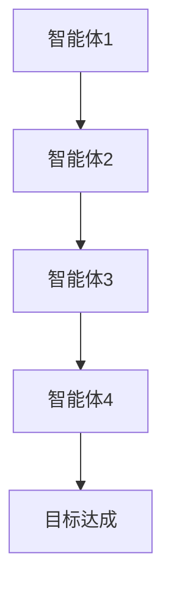
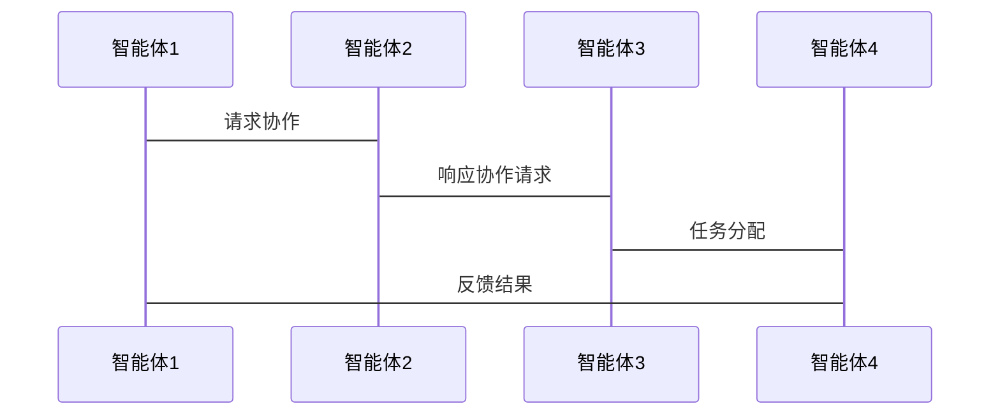

                 


---

# 多智能体AI如何优化研发效率评估流程

> 关键词：多智能体AI、研发效率评估、流程优化、协作机制、数学模型、系统架构

> 摘要：本文探讨多智能体AI在优化研发效率评估流程中的应用，分析其核心原理，结合算法、数学模型和系统架构，提供项目实战和最佳实践，全面展示多智能体AI如何提升研发效率评估的准确性和效率。

---

## 目录大纲

### 第一部分：多智能体AI与研发效率评估概述

#### 第1章：多智能体AI与研发效率评估的背景介绍

##### 1.1 问题背景与问题描述
- 1.1.1 研发效率评估的重要性
  - 开发效率是企业竞争力的关键因素。
  - 传统评估方法的局限性：数据孤岛、评估指标单一、反馈延迟。
  
- 1.1.2 问题描述
  - 传统评估方法难以应对复杂研发流程。
  - 数据分析能力不足，难以提供实时反馈。
  - 协作效率低下，团队沟通不畅。

- 1.1.3 多智能体AI的解决方法
  - 利用多智能体协作优化资源分配。
  - 提供实时数据分析与反馈。
  - 通过智能协作提升团队效率。

##### 1.2 问题解决与边界
- 1.2.1 多智能体AI的应用范围
  - 适用于复杂项目管理、资源分配、实时协作优化。
  - 适用于需要多团队协作的场景。

- 1.2.2 研发效率评估的边界与外延
  - 纯技术问题的边界。
  - 项目管理、人员协作的外延。

- 1.2.3 多智能体AI的边界与限制
  - 数据隐私和安全问题。
  - 系统复杂性增加后的维护难度。

##### 1.3 概念结构与核心要素
- 1.3.1 多智能体AI的核心要素
  - 分布式计算、协作机制、自我学习。
  
- 1.3.2 研发效率评估的指标体系
  - 代码提交频率、任务完成时间、团队协作效率、代码质量。
  
- 1.3.3 多智能体AI与研发效率评估的关联关系
  - 多智能体AI通过优化协作机制，提升研发效率评估的准确性和实时性。

#### 第2章：多智能体AI的核心概念与联系

##### 2.1 多智能体AI的核心原理
- 2.1.1 多智能体系统的定义与特点
  - 定义：由多个智能体组成的分布式系统。
  - 特点：协作性、分布性、自主性、动态性。

- 2.1.2 多智能体AI的核心算法
  - 协作算法、任务分配算法、信息共享算法。

- 2.1.3 多智能体AI与传统AI的区别
  - 传统AI：单点计算，数据集中处理。
  - 多智能体AI：分布式协作，数据分散处理。

##### 2.2 核心概念对比表
- 2.2.1 多智能体AI与单智能体AI的对比
  | 特性      | 单智能体AI         | 多智能体AI         |
  |-----------|-------------------|-------------------|
  | 结构      | 单一计算单元     | 多个计算单元     |
  | 协作      | 无协作           | 高度协作         |
  | 效率      | 依赖单点计算     | 依赖分布式计算   |

- 2.2.2 多智能体AI与分布式系统的关系
  - 多智能体AI是分布式系统的一种高级形式，具备更强的智能协作能力。

#### 第3章：多智能体AI的算法原理

##### 3.1 多智能体协作机制
- 3.1.1 分布式协作算法
  - 算法1：分布式任务分配。
  - 算法2：分布式协作学习。

- 3.1.2 联合推理算法
  - 联合推理模型：多个智能体协同推理，提升整体智能水平。

- 3.1.3 自适应调整算法
  - 根据实时数据调整协作策略。

##### 3.2 任务分配与资源调度
- 3.2.1 任务分配算法
  - 基于资源可用性和任务复杂度的分配策略。

- 3.2.2 资源调度算法
  - 动态资源分配，优化系统负载。

- 3.2.3 负载均衡算法
  - 基于负载情况实时调整资源分配。

##### 3.3 通信协议与信息共享
- 3.3.1 多智能体通信协议
  - 基于消息传递的协作机制。

- 3.3.2 信息共享机制
  - 数据共享与隐私保护的平衡。

- 3.3.3 信息同步算法
  - 基于一致性协议的同步机制。

#### 第4章：数学模型与公式

##### 4.1 多智能体协作的数学模型
- 4.1.1 协作目标函数
  $$ f(x) = \sum_{i=1}^{n} f_i(x_i) $$
  - 各智能体的目标函数之和。

- 4.1.2 资源分配模型
  $$ \text{Maximize } \sum_{i=1}^{n} u_i(x_i) $$
  - 最大化各智能体的效用函数之和。

- 4.1.3 信息共享模型
  $$ p(x|y) = \prod_{i=1}^{n} p(x_i|y) $$
  - 条件概率分布，表示各智能体的信息共享。

##### 4.2 算法流程图
- 4.2.1 多智能体协作流程图


### 第二部分：系统分析与架构设计

#### 第5章：系统分析与架构设计方案

##### 5.1 问题场景介绍
- 研发效率评估中的主要问题：数据分散、协作低效、反馈延迟。

##### 5.2 系统功能设计
- 领域模型设计：
  ```mermaid
  classDiagram
      class 智能体 {
          id
          role
          status
      }
      class 任务 {
          id
          priority
          deadline
      }
      class 资源 {
          id
          type
          availability
      }
      智能体 --> 任务
      智能体 --> 资源
  ```

- 系统架构设计：
  ```mermaid
  architecture
      Client --> Server
      Server --> Database
      Server --> 多智能体AI模块
  ```

##### 5.3 系统接口设计
- 接口说明：智能体间通信接口、数据采集接口、结果反馈接口。

##### 5.4 系统交互序列图


### 第三部分：项目实战

#### 第6章：项目实战

##### 6.1 环境安装
- 安装Python、机器学习库（如TensorFlow、PyTorch）。
- 安装多智能体协作框架（如Ray、Distributed AI）。

##### 6.2 系统核心实现源代码
- 核心代码示例：
  ```python
  import ray

  @ray.remote
  class Agent:
      def __init__(self, id):
          self.id = id

      def collaborate(self, task):
          # 协作逻辑
          return f"Agent {self.id} completed task {task}"

  # 初始化智能体
  agents = [Agent.remote(i) for i in range(4)]

  # 分配任务
  tasks = ["task1", "task2", "task3"]
  for task in tasks:
      agent = agents[task % 4]
      result = agent.collaborate.remote(task)
      print(ray.get(result))
  ```

##### 6.3 代码应用解读与分析
- 代码说明：展示多智能体协作的基本实现，包括任务分配和结果反馈。

##### 6.4 实际案例分析
- 案例分析：通过具体案例展示多智能体AI在研发效率评估中的应用效果。

##### 6.5 项目小结
- 总结项目实现的关键点和经验教训。

### 第四部分：最佳实践与拓展

#### 第7章：最佳实践

##### 7.1 小结
- 总结多智能体AI在优化研发效率评估中的核心作用。

##### 7.2 注意事项
- 数据隐私保护、系统维护成本、算法优化挑战。

##### 7.3 拓展阅读
- 推荐相关书籍和论文，鼓励深入学习。

---

### 总结
本文详细探讨了多智能体AI在优化研发效率评估流程中的应用，通过背景介绍、核心概念、算法原理、系统架构、项目实战和最佳实践，全面展示了多智能体AI如何提升研发效率评估的准确性和效率。

