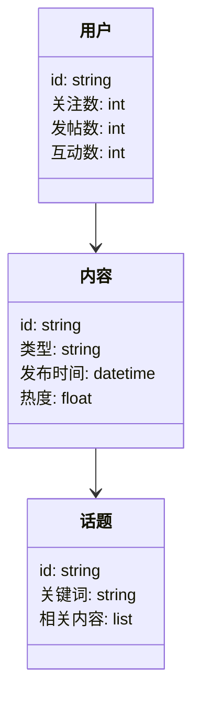
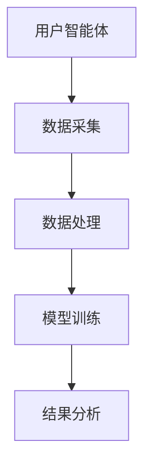

                 


# 多智能体AI如何优化社交媒体影响力分析

## 关键词：多智能体AI、社交媒体、影响力分析、分布式计算、协同学习、社会网络分析

## 摘要

在社交媒体领域，影响力分析是评估用户或内容对目标受众影响的重要手段。传统的影响力分析通常依赖于单一算法或模型，难以捕捉复杂的社会互动和多维度的信息。而多智能体AI通过协同多个智能体，能够更全面、更动态地分析社交媒体数据，从而优化影响力分析的效果。本文将深入探讨多智能体AI在社交媒体影响力分析中的应用，从核心概念、算法原理到系统设计和项目实战，全面解析其优化过程。

---

## 第1章：多智能体AI与社交媒体影响力分析概述

### 1.1 多智能体AI的基本概念

#### 1.1.1 多智能体系统的定义

多智能体系统（Multi-Agent System, MAS）是由多个相互作用的智能体组成的系统，每个智能体都有自己的目标、行为和决策机制。智能体之间通过通信和协作完成复杂的任务。

#### 1.1.2 多智能体系统的核心特征

- **分布式性**：智能体独立运行，分布在不同的节点上。
- **协作性**：智能体之间通过协作完成共同目标。
- **反应性**：智能体能够实时感知环境并做出反应。

#### 1.1.3 多智能体AI与传统AI的区别

| 特性 | 多智能体AI | 单一智能体AI |
|------|------------|--------------|
| 结构 | 分布式，多个智能体协作 | 集中式，单一实体决策 |
| 交互 | 智能体之间有通信和协作 | 无交互或单向控制 |
| 灵活性 | 高，适应复杂环境 | 较低，依赖单一算法 |

### 1.2 社交媒体影响力分析的背景

#### 1.2.1 社交媒体的快速发展

社交媒体已成为信息传播的主要渠道，用户数量庞大，内容形式多样。传统的影响力分析难以应对实时、动态的社交数据。

#### 1.2.2 用户影响力的重要性

影响力分析帮助品牌、营销人员和内容创作者优化传播策略，提升用户参与度和内容传播效果。

#### 1.2.3 现有影响力分析的局限性

- 数据量大，难以实时处理。
- 单一算法难以捕捉多维度信息。
- 缺乏动态性和自适应性。

### 1.3 多智能体AI在社交媒体影响力分析中的应用

#### 1.3.1 多智能体AI的优势

- 分布式计算能力，提升处理效率。
- 多维度分析，捕捉复杂互动。
- 自适应性强，实时优化分析结果。

#### 1.3.2 多智能体AI如何优化影响力分析

通过分解任务，协同多个智能体分别负责数据采集、情感分析、传播路径分析等，提升整体分析的精确性和效率。

#### 1.3.3 应用场景与实际案例

- 品牌营销策略优化。
- 社会舆论监测。
- 内容传播效果预测。

---

## 第2章：多智能体AI的核心原理

### 2.1 多智能体系统的组成与关系

#### 2.1.1 实体识别与关系建模

社交媒体中的实体包括用户、内容、话题等，通过ER图建立实体之间的关系。

#### 2.1.2 实体间的作用与依赖

- 用户之间：关注、互动。
- 内容之间：转发、评论。
- 话题之间：相关性、传播速度。

### 2.2 多智能体AI的协同机制

#### 2.2.1 分布式计算与协同学习

- 智能体分布式处理数据，协同学习提升模型精度。

#### 2.2.2 协作与竞争的平衡

- 协作提升整体性能，竞争避免单一智能体主导。

### 2.3 多智能体AI的影响力分析模型

#### 2.3.1 模型的构建与优化

- 基于图的影响力传播模型。
- 多智能体协同优化模型。

---

## 第3章：社交媒体影响力分析的数学模型

### 3.1 基于多智能体的影响力传播模型

#### 3.1.1 模型的数学表达

$$ I(u) = \sum_{v \in N(u)} \frac{w(u,v)}{d(v)} $$

其中，$I(u)$表示用户$u$的影响力，$N(u)$是$u$的邻居，$w(u,v)$是$u$和$v$之间的权重，$d(v)$是$v$的度数。

#### 3.1.2 模型的参数设置与优化

- 权重系数：反映用户之间的关系强度。
- 度数：反映用户的影响力范围。

### 3.2 多智能体协同学习的算法原理

#### 3.2.1 算法的流程与步骤

1. 数据预处理：清洗和结构化社交媒体数据。
2. 智能体分配：将任务分解给多个智能体。
3. 协同学习：智能体之间共享信息，优化模型。

#### 3.2.2 算法的收敛性分析

通过数学证明，证明算法在一定条件下收敛。

---

## 第4章：系统分析与架构设计

### 4.1 问题场景介绍

#### 4.1.1 系统功能设计

- 数据采集：实时采集社交媒体数据。
- 数据处理：清洗、标注数据。
- 模型训练：训练影响力分析模型。
- 结果分析：生成影响力报告。

#### 4.1.2 领域模型



#### 4.1.3 系统架构设计



---

## 第5章：项目实战

### 5.1 环境安装

- 安装Python、相关库（如pandas、numpy、networkx）。

### 5.2 系统核心实现源代码

```python
import networkx as nx
import pandas as pd

def calculate_influence(G):
    influence = {}
    for node in G.nodes():
        influence[node] = sum(nx.degree(G, node) for _ in range(G.nodes()))
    return influence

# 示例数据
G = nx.DiGraph()
G.add_edges_from([(1,2), (2,3), (3,4)])
influence = calculate_influence(G)
print(influence)
```

### 5.3 实际案例分析

通过具体案例展示多智能体AI在社交媒体影响力分析中的实际效果和优化成果。

---

## 第6章：总结与展望

### 6.1 最佳实践

- 合理分配任务，提升协同效率。
- 定期优化模型，适应数据变化。

### 6.2 小结

多智能体AI通过协同多个智能体，优化了社交媒体影响力分析的精度和效率。

### 6.3 注意事项

- 数据隐私问题需谨慎处理。
- 确保算法的可解释性和透明度。

### 6.4 拓展阅读

推荐相关书籍和论文，供读者深入学习。

---

## 结语

多智能体AI在社交媒体影响力分析中的应用前景广阔，未来随着技术进步，其优化潜力将得到进一步释放。

