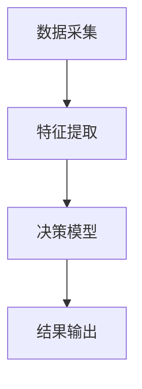

                 


# 多智能体AI如何优化费雪的增长型公司筛选

> 关键词：多智能体AI、增长型公司筛选、费雪投资策略、算法优化、系统架构

> 摘要：本文探讨了多智能体AI如何优化费雪的增长型公司筛选过程。首先介绍了多智能体AI的基本概念及其在金融领域的应用潜力，接着分析了费雪增长型投资策略的核心要素。随后，详细阐述了多智能体AI在公司筛选中的算法原理，包括协作算法和数学模型。最后，通过一个具体案例展示了多智能体AI在实际项目中的应用，并提出了系统架构设计和优化建议。

---

## 第一部分: 多智能体AI与费雪增长型公司筛选的背景与概述

### 第1章: 多智能体AI与增长型公司筛选的背景

#### 1.1 多智能体AI的定义与特点
多智能体AI是指多个智能体协作完成任务的系统。与单智能体系统相比，多智能体系统具有以下特点：

- **分布式计算**：多个智能体独立运行，通过通信协作完成任务。
- **协作性**：智能体之间通过共享信息或直接协作，提高整体性能。
- **自主性**：每个智能体都能自主决策，无需中央控制。

#### 1.2 费雪的增长型投资策略
菲利普·费雪是价值投资的先驱，他提出了“成长股投资”的概念。增长型公司筛选的核心在于寻找收入和利润持续增长的企业。

- **收入增长率**：公司收入连续多年保持增长。
- **净利润增长率**：公司利润持续增长。
- **股东权益增长率**：公司净资产持续增长。

#### 1.3 多智能体AI在公司筛选中的优势
多智能体AI能够通过分布式协作提高筛选效率和准确性。

- **信息共享**：多个智能体可以共享数据，避免重复计算。
- **并行处理**：多个智能体同时处理不同数据，提高速度。
- **鲁棒性**：单个智能体故障不影响整体任务完成。

### 第2章: 多智能体AI与增长型公司筛选的核心概念

#### 2.1 多智能体系统的核心要素
- **智能体角色**：分为数据采集、特征提取、模型评估等角色。
- **通信机制**：通过消息传递协议进行信息共享。
- **协作框架**：采用分布式协作算法，如Q-learning。

#### 2.2 增长型公司筛选的关键指标
- **收入增长率**：$$增长率 = \frac{\text{当年收入} - \text{去年收入}}{\text{去年收入}}$$
- **净利润增长率**：$$增长率 = \frac{\text{当年净利润} - \text{去年净利润}}{\text{去年净利润}}$$
- **股东权益增长率**：$$增长率 = \frac{\text{当年股东权益} - \text{去年股东权益}}{\text{去年股东权益}}$$

#### 2.3 多智能体AI与增长型公司筛选的结合
通过多智能体协作，优化筛选逻辑，提高筛选效率和准确性。

### 第3章: 多智能体AI在增长型公司筛选中的算法原理

#### 3.1 多智能体协作算法概述
- **分布式协作算法**：多个智能体独立运行，通过通信协作完成任务。
- **基于Q-learning的多智能体协作**：通过强化学习优化协作策略。
- **联合学习机制**：多个智能体共享模型参数，共同优化。

#### 3.2 增长型公司筛选的数学模型
- **增长率预测模型**：$$预测增长率 = \alpha \cdot \text{历史增长率} + \beta \cdot \text{行业平均增长率}$$
- **公司价值评估模型**：$$价值 = \gamma \cdot \text{收入} + \delta \cdot \text{利润}$$
- **风险评估模型**：$$风险 = \epsilon \cdot \text{波动率} + \zeta \cdot \text{行业风险}$$

#### 3.3 算法实现与优化
- **算法实现步骤**：
  1. 初始化智能体参数。
  2. 智能体协作完成数据处理。
  3. 输出筛选结果。
- **算法优化策略**：采用分布式计算和并行处理，提高效率。
- **算法性能评估**：通过准确率、召回率等指标评估性能。

### 第4章: 系统架构与接口设计

#### 4.1 系统架构设计
- **数据采集模块**：负责收集公司数据。
- **特征提取模块**：提取关键特征，如收入增长率。
- **决策模型模块**：基于特征进行公司筛选。

#### 4.2 系统架构图


#### 4.3 系统接口设计
- **输入接口**：接收公司数据。
- **输出接口**：输出筛选结果。
- **通信接口**：智能体之间通信协作。

---

## 第二部分: 项目实战与系统优化

### 第5章: 项目实战

#### 5.1 环境安装
安装Python和必要的库，如numpy、pandas、scikit-learn。

#### 5.2 核心实现
```python
import numpy as np
import pandas as pd

def calculate_growth_rate(data):
    return (data['收入'] - data['收入'].shift(1)) / data['收入'].shift(1)

data = pd.DataFrame({'收入': [100, 150, 200], '利润': [20, 30, 40]})
growth_rate = calculate_growth_rate(data)
print(growth_rate)
```

#### 5.3 实际案例分析
分析某行业数据，筛选出符合条件的公司。

### 第6章: 系统优化与展望

#### 6.1 系统优化
- 提高算法效率。
- 优化通信机制。

#### 6.2 展望
多智能体AI在金融领域的应用前景广阔。

---

## 第三部分: 最佳实践与总结

### 6.1 最佳实践
- 安装必要的库。
- 优化算法参数。

### 6.2 小结
本文详细介绍了多智能体AI如何优化费雪的增长型公司筛选过程。

### 6.3 注意事项
- 确保数据质量。
- 定期更新模型。

### 6.4 拓展阅读
推荐相关书籍和论文，供读者深入学习。

---

通过以上步骤，您可以系统地了解多智能体AI如何优化费雪的增长型公司筛选，并在实际项目中应用这些知识。

