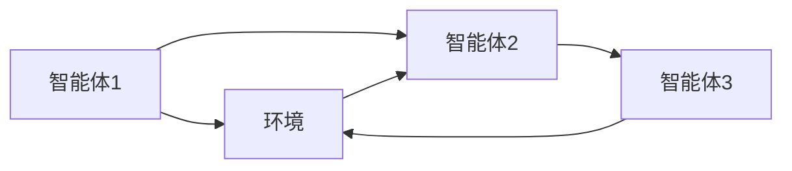
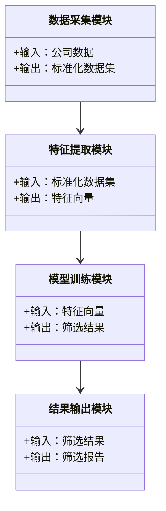

                 


# 多智能体AI如何优化费雪的成长型公司筛选

## 关键词：多智能体AI、成长型公司筛选、投资策略、费雪、AI优化

## 摘要：  
本文深入探讨了多智能体人工智能（AI）如何优化费雪的成长型公司筛选策略。通过分析多智能体AI的核心概念、算法原理和系统架构，结合实际应用场景，本文展示了如何利用多智能体AI的协同学习、决策优化和数据挖掘能力，提升成长型公司筛选的准确性和效率。文章还通过具体案例分析，验证了多智能体AI在投资决策中的实际应用价值。

---

## 第一部分: 多智能体AI与成长型公司筛选的背景与基础

## 第1章: 多智能体AI与成长型公司筛选概述

### 1.1 多智能体AI的基本概念

#### 1.1.1 多智能体系统的定义  
多智能体系统（Multi-Agent System, MAS）是由多个智能体（Agent）组成的分布式系统，这些智能体能够通过协同工作完成复杂任务。每个智能体都有自己的目标、知识、推理能力和行动能力。

#### 1.1.2 多智能体AI的核心特征  
- **分布式性**：智能体之间通过分布式计算协同工作。  
- **自主性**：每个智能体都能自主决策。  
- **社交能力**：智能体之间能够通信和协作。  
- **反应性**：智能体能够实时感知环境并做出反应。

#### 1.1.3 多智能体AI与单智能体AI的区别  
| 特性         | 单智能体AI                     | 多智能体AI                     |
|--------------|-------------------------------|-------------------------------|
| 决策方式     | 中央化决策                     | 分布式决策                     |
| 任务处理     | 单点处理                     | 并行处理                     |
| 系统复杂度   | 较低                         | 较高                         |

### 1.2 成长型公司筛选的定义与标准

#### 1.2.1 成长型公司的定义  
成长型公司是指那些能够持续增长，且具有较高盈利能力、良好市场前景和强大管理团队的公司。

#### 1.2.2 费雪投资策略的核心思想  
菲利普·费雪（Philip Fisher）是成长型投资策略的鼻祖，他提出以下核心思想：  
1. 投资于具有强大成长潜力的公司。  
2. 关注公司的管理团队和企业文化。  
3. 长期持有，避免频繁交易。

#### 1.2.3 成长型公司筛选的关键指标  
| 指标         | 描述                         | 示例                         |
|--------------|------------------------------|------------------------------|
| 收益增长率   | 净利润增长率                 | 近三年净利润年均增长20%以上   |
| 营业收入增长率 | 营业收入增长率                 | 近三年营业收入年均增长15%以上 |
| 净利润率     | 净利润与营业收入的比率         | 净利润率保持在10%以上       |
| ROE          | 净资产收益率                   | ROE稳定在15%以上           |
| 市盈率       | 当前股价与净利润的比率         | 市盈率低于行业平均水平       |

### 1.3 多智能体AI在成长型公司筛选中的应用前景

#### 1.3.1 传统公司筛选方法的局限性  
- 依赖人工经验，主观性强。  
- 数据处理能力有限，难以应对海量数据。  
- 策略单一，难以适应市场变化。

#### 1.3.2 多智能体AI的优势与潜力  
- 能够同时分析多个维度的数据，提高筛选效率。  
- 通过协同学习，优化决策结果。  
- 实时更新数据，适应市场动态变化。

#### 1.3.3 多智能体AI在投资领域的应用现状  
- 多智能体AI已在股票交易、风险评估等领域得到广泛应用。  
- 通过多智能体协同，实现更精准的投资决策。

### 1.4 本章小结  
本章介绍了多智能体AI的基本概念、成长型公司筛选的标准，以及多智能体AI在成长型公司筛选中的优势与潜力。

---

## 第二部分: 多智能体AI的核心概念与原理

## 第2章: 多智能体AI的核心概念与联系

### 2.1 多智能体AI的核心概念

#### 2.1.1 实体关系与核心要素  
- **智能体（Agent）**：能够感知环境并采取行动的实体。  
- **目标（Objective）**：智能体需要完成的任务或目标。  
- **环境（Environment）**：智能体所处的外部世界。  
- **交互（Interaction）**：智能体与环境或其他智能体之间的信息交换。

#### 2.1.2 多智能体AI的属性特征对比表  
| 特性         | 单智能体AI                     | 多智能体AI                     |
|--------------|-------------------------------|-------------------------------|
| 决策方式     | 中央化决策                     | 分布式决策                     |
| 任务处理     | 单点处理                     | 并行处理                     |
| 系统复杂度   | 较低                         | 较高                         |

#### 2.1.3 多智能体AI的ER实体关系图  
```mermaid
erDiagram
    customer[客户] {
        string id
        string name
        date dob
    }
    stock[股票] {
        string id
        string name
        decimal price
    }
    transaction[交易] {
        string id
        date date
        decimal amount
    }
    customer -> transaction : 买入
    customer -> transaction : 卖出
    stock -> transaction : 股票
```

### 2.2 多智能体AI的协同机制

#### 2.2.1 协同学习的基本原理  
协同学习（Collaborative Learning）是指多个智能体通过共享信息和知识，共同完成任务的学习方式。其数学模型如下：  
$$ \text{Total Reward} = \sum_{i=1}^{n} r_i $$  
其中，\( r_i \) 表示第 \( i \) 个智能体获得的奖励。

#### 2.2.2 协同决策的实现方式  
协同决策的核心是智能体之间通过通信和协商，共同制定决策。其流程如下：  
1. 每个智能体根据自身信息做出初步决策。  
2. 智能体之间交换信息，调整决策。  
3. 输出最终决策。

#### 2.2.3 协同优化的数学模型  
协同优化的目标是最优化整体收益。其数学模型如下：  
$$ \max_{x_i} \sum_{i=1}^{n} f_i(x_i, x_{-i}) $$  
其中，\( x_i \) 表示第 \( i \) 个智能体的决策变量，\( x_{-i} \) 表示其他智能体的决策变量。

### 2.3 本章小结  
本章详细讲解了多智能体AI的核心概念和协同机制，并通过表格和图示展示了多智能体AI的实体关系和协同优化的数学模型。

---

## 第三部分: 多智能体AI的算法原理与数学模型

## 第3章: 多智能体AI的核心算法原理

### 3.1 多智能体强化学习算法

#### 3.1.1 强化学习的基本原理  
强化学习（Reinforcement Learning, RL）通过智能体与环境的交互，学习最优策略。其数学模型如下：  
$$ Q(s, a) = r + \gamma \max_{a'} Q(s', a') $$  
其中，\( Q(s, a) \) 表示状态 \( s \) 下采取行动 \( a \) 的价值，\( r \) 是奖励，\( \gamma \) 是折扣因子。

#### 3.1.2 多智能体强化学习的数学模型  
多智能体强化学习的数学模型如下：  
$$ J = \mathbb{E} \left[ \sum_{t=0}^{\infty} \gamma^t r_t \right] $$  
其中，\( J \) 表示整体收益，\( r_t \) 是第 \( t \) 时刻的奖励。

#### 3.1.3 多智能体强化学习的mermaid流程图  


### 3.2 协同过滤算法

#### 3.2.1 协同过滤的基本原理  
协同过滤（Collaborative Filtering）通过分析用户行为和偏好，推荐相似的物品。其数学公式如下：  
$$ \text{预测评分} = \frac{1}{k} \sum_{i=1}^{k} r_i $$  
其中，\( r_i \) 是相似用户的评分，\( k \) 是相似用户的数量。

#### 3.2.2 协同过滤的数学公式  
$$ \text{预测评分} = \frac{\sum_{i=1}^{k} r_i}{k} $$

#### 3.2.3 协同过滤的实现步骤  
1. 收集用户行为数据。  
2. 计算用户相似性。  
3. 推荐相似物品。

### 3.3 联合学习算法

#### 3.3.1 联合学习的定义  
联合学习（Federated Learning）是指在分布式数据源上联合训练模型，而不共享数据。其数学模型如下：  
$$ \min_{\theta} \sum_{i=1}^{n} \mathcal{L}_i(\theta) $$  
其中，\( \mathcal{L}_i \) 是第 \( i \) 个数据源的损失函数。

#### 3.3.2 联合学习的数学模型  
$$ \min_{\theta} \sum_{i=1}^{n} \mathcal{L}_i(\theta) $$

#### 3.3.3 联合学习的实现流程  
1. 初始化模型参数。  
2. 每个数据源独立训练模型。  
3. 聚合模型参数。  
4. 更新全局模型。

### 3.4 本章小结  
本章详细讲解了多智能体AI的核心算法，包括强化学习、协同过滤和联合学习的原理、数学模型和实现流程。

---

## 第四部分: 系统分析与架构设计方案

## 第4章: 多智能体AI系统的系统分析与架构设计

### 4.1 问题场景介绍

#### 4.1.1 成长型公司筛选的场景描述  
成长型公司筛选需要综合分析财务指标、市场表现和管理团队等多维度信息。传统方法依赖人工分析，效率低且主观性强。

#### 4.1.2 多智能体AI在筛选过程中的应用  
多智能体AI可以通过协同学习和数据挖掘，提升筛选的准确性和效率。

#### 4.1.3 系统的目标与需求  
系统目标：实现多智能体AI辅助的公司筛选。  
系统需求：支持多维度数据采集、特征提取和模型训练。

### 4.2 系统功能设计

#### 4.2.1 数据采集模块  
功能：从多个数据源采集公司数据。  
输入：公司财务数据、市场数据等。  
输出：标准化数据集。

#### 4.2.2 特征提取模块  
功能：提取公司特征。  
输入：标准化数据集。  
输出：特征向量。

#### 4.2.3 模型训练模块  
功能：训练多智能体AI模型。  
输入：特征向量。  
输出：筛选结果。

#### 4.2.4 结果输出模块  
功能：输出筛选结果。  
输入：模型输出。  
输出：筛选报告。

### 4.3 系统架构设计

#### 4.3.1 系统架构的mermaid类图  


#### 4.3.2 系统

---

## 第五部分: 项目实战与应用案例

## 第5章: 多智能体AI在成长型公司筛选中的项目实战

### 5.1 环境安装与配置

#### 5.1.1 系统环境  
- 操作系统：Linux/Windows/MacOS  
- Python版本：3.8+  
- 依赖库：numpy, pandas, scikit-learn, tensorflow

#### 5.1.2 安装依赖  
```bash
pip install numpy pandas scikit-learn tensorflow
```

### 5.2 系统核心实现源代码

#### 5.2.1 数据采集模块  
```python
import pandas as pd

def collect_data():
    # 从多个数据源采集数据
    data1 = pd.read_csv('data1.csv')
    data2 = pd.read_csv('data2.csv')
    # 合并数据
    merged_data = pd.merge(data1, data2, on='company_id')
    return merged_data
```

#### 5.2.2 特征提取模块  
```python
import numpy as np

def extract_features(data):
    # 提取特征
    features = data[['revenue_growth', 'net_profit_margin', 'ro

