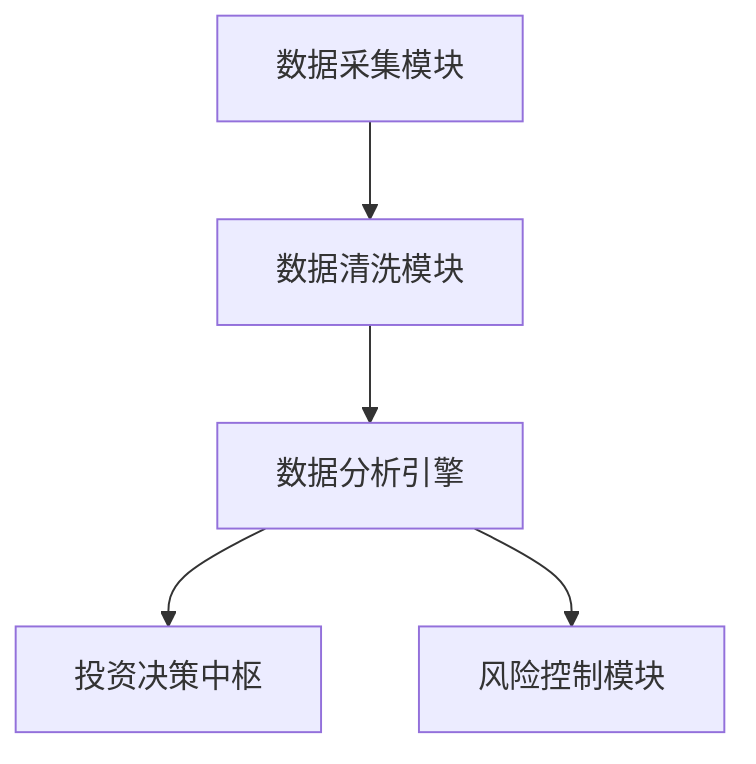

                 


# 多智能体AI如何增强价值投资的全球化视野

> 关键词：多智能体AI、价值投资、全球化视野、投资策略、金融数据分析、人工智能技术

> 摘要：本文探讨了多智能体人工智能在价值投资中的应用，特别是其如何通过全球化视野提升投资决策的质量和效率。文章从多智能体AI的基本概念、算法原理、系统架构设计、项目实战等多方面进行详细分析，展示了多智能体AI如何帮助投资者在全球化市场中做出更明智的投资决策。

---

## 第一部分: 多智能体AI与价值投资的全球化视野

### 第1章: 多智能体AI与价值投资概述

#### 1.1 多智能体AI的基本概念
##### 1.1.1 多智能体系统定义
多智能体系统（Multi-Agent System, MAS）是由多个相互作用的智能体组成的系统，这些智能体能够通过协作完成复杂任务。智能体具有自主性、反应性、目标导向和社交能力等特征。

##### 1.1.2 多智能体AI的核心特征
- **自主性**：每个智能体都能独立决策。
- **协作性**：智能体之间通过信息共享和协作完成任务。
- **分布式智能**：任务分布在多个智能体之间，避免单点故障。
- **动态适应性**：智能体能够根据环境变化调整策略。

##### 1.1.3 价值投资的基本原理
价值投资是一种投资策略，强调以低于内在价值的价格购买优质资产。核心在于识别市场中的估值偏差，通过基本面分析寻找被低估的投资标的。

#### 1.2 多智能体AI在金融领域的应用背景
##### 1.2.1 传统价值投资的局限性
- 信息处理能力有限：传统方法难以处理海量全球数据。
- 决策速度较慢：面对快速变化的市场，人工决策往往滞后。
- 风险分散不足：单一决策中心存在较高的风险集中度。

##### 1.2.2 全球化视野对投资决策的影响
- 全球市场联动性增强：一个地区的经济波动可能影响全球市场。
- 多元化投资需求：通过全球化配置资产降低风险。
- 数据多样性：全球化数据为投资决策提供了更多维度的支持。

##### 1.2.3 多智能体AI的优势与潜力
- **分布式计算能力**：多智能体系统能够并行处理海量数据。
- **协作优化**：智能体之间的协作能够提高决策的准确性和效率。
- **动态适应性**：系统能够快速响应市场变化，实时调整投资策略。

#### 1.3 多智能体AI与价值投资的结合
##### 1.3.1 多智能体AI如何增强投资决策
- **信息整合**：多个智能体分别负责不同领域的数据分析，如宏观经济、行业趋势、公司基本面等。
- **协作优化**：通过协作，系统能够综合多个视角的信息，提供更全面的投资建议。
- **动态调整**：智能体能够实时更新数据，快速响应市场变化。

##### 1.3.2 全球化数据的处理与分析
- **数据采集**：智能体从全球多个市场采集实时数据。
- **数据清洗与预处理**：对数据进行去噪和标准化处理。
- **跨市场分析**：通过多智能体协作，分析不同市场的联动效应。

##### 1.3.3 投资策略的优化与创新
- **组合优化**：多智能体协作优化投资组合，降低风险。
- **风险控制**：通过实时监控和调整，降低投资风险。
- **策略创新**：基于全球化数据的分析，发现新的投资机会。

---

### 第2章: 多智能体AI的核心概念与原理

#### 2.1 多智能体系统的核心要素
##### 2.1.1 智能体的定义与属性
智能体是一个能够感知环境、做出决策并采取行动的实体。其核心属性包括：
- **感知能力**：通过传感器或数据源获取信息。
- **决策能力**：基于感知信息做出决策。
- **行动能力**：执行决策并影响环境。

##### 2.1.2 多智能体系统的组成结构
多智能体系统由以下几个部分组成：
- **智能体**：负责具体任务的执行单元。
- **通信机制**：智能体之间交换信息的渠道。
- **协调机制**：确保智能体协作的规则和协议。
- **环境**：智能体所处的外部世界，如金融市场。

##### 2.1.3 智能体之间的协作机制
协作机制是多智能体系统的核心，常见的协作机制包括：
- **基于规则的协作**：通过预定义的规则进行协作。
- **基于市场的协作**：智能体通过市场机制进行资源分配。
- **基于博弈论的协作**：智能体通过博弈论模型优化协作效果。

#### 2.2 价值投资的全球化视角
##### 2.2.1 全球经济与市场的复杂性
全球经济的复杂性要求投资者具备全球化视野，能够分析多个市场的互动关系。

##### 2.2.2 跨国投资的挑战与机遇
- **挑战**：不同市场的法律法规、经济周期差异。
- **机遇**：全球化配置资产能够分散风险，捕捉不同市场的投资机会。

##### 2.2.3 价值投资的全球化策略
- **跨市场比较**：通过比较不同市场的估值水平，寻找低估资产。
- **全球化产业链分析**：分析全球产业链的分布，寻找投资机会。
- **宏观经济因素分析**：考虑全球宏观经济因素对投资决策的影响。

#### 2.3 多智能体AI与价值投资的结合模型
##### 2.3.1 模型的构建逻辑
多智能体AI与价值投资的结合模型通过以下步骤构建：
1. **数据采集**：从全球市场采集实时数据。
2. **数据分析**：通过多智能体协作，分析数据并提取有价值的信息。
3. **投资决策**：基于分析结果，生成投资策略。

##### 2.3.2 模型的输入与输出
- **输入**：全球市场的实时数据、宏观经济指标、公司基本面数据。
- **输出**：投资建议、风险评估、投资组合优化方案。

##### 2.3.3 模型的优化与调整
- **模型优化**：通过强化学习不断优化智能体的协作策略。
- **动态调整**：根据市场变化实时调整模型参数。

---

### 第3章: 多智能体AI的算法原理与数学模型

#### 3.1 多智能体协作算法
##### 3.1.1 基于强化学习的协作机制
强化学习是一种通过试错方式优化决策的算法。在多智能体系统中，智能体通过与环境和其他智能体的互动，学习最优策略。

##### 3.1.2 分布式决策算法
分布式决策算法通过将决策权分散到各个智能体，避免单点故障。

##### 3.1.3 聚合与分散策略
- **聚合策略**：将多个智能体的决策聚合为一个整体策略。
- **分散策略**：将任务分解为多个子任务，分别由不同的智能体完成。

#### 3.2 价值投资的数学模型
##### 3.2.1 投资组合优化模型
投资组合优化模型的目标是在给定风险水平下，最大化投资收益。

##### 3.2.2 风险评估与收益预测公式
- **风险评估公式**：使用方差或标准差衡量投资风险。
- **收益预测公式**：基于历史数据和市场趋势预测未来收益。

##### 3.2.3 时间序列分析模型
时间序列分析模型用于分析金融数据的时间依赖性，帮助预测未来走势。

#### 3.3 多智能体AI的数学公式
##### 3.3.1 强化学习的Q-learning公式
Q-learning是一种强化学习算法，其更新公式为：
$$ Q(s, a) = r + \gamma \max Q(s', a') $$

##### 3.3.2 聚合函数的数学表达
聚合函数用于将多个智能体的决策聚合为一个整体决策，例如：
$$ f(x) = \sum_{i=1}^{n} w_i x_i $$
其中，\( w_i \) 是权重，\( x_i \) 是输入。

##### 3.3.3 分散策略的优化函数
分散策略的优化函数通常是一个凸优化问题，例如：
$$ \min_{\theta} \sum_{i=1}^{n} (y_i - f_\theta(x_i))^2 $$

---

### 第4章: 全球化视野下的系统架构设计

#### 4.1 系统功能设计
##### 4.1.1 数据采集模块
数据采集模块负责从全球市场采集实时数据，包括股票价格、宏观经济指标、行业数据等。

##### 4.1.2 数据分析引擎
数据分析引擎负责对采集的数据进行清洗、分析和建模，生成投资建议。

##### 4.1.3 投资决策中枢
投资决策中枢负责根据分析结果，生成投资策略并实时调整。

##### 4.1.4 风险控制模块
风险控制模块负责监控投资组合的风险，及时发出预警并调整策略。

#### 4.2 系统架构设计
##### 4.2.1 系统功能模块
- **数据采集模块**：负责数据的采集和预处理。
- **数据分析引擎**：负责数据分析和建模。
- **投资决策中枢**：负责投资策略的生成和调整。
- **风险控制模块**：负责风险监控和管理。

##### 4.2.2 系统架构图


##### 4.2.3 系统交互流程
系统交互流程如下：
1. 数据采集模块采集全球市场数据。
2. 数据清洗模块对数据进行预处理。
3. 数据分析引擎对数据进行分析和建模。
4. 投资决策中枢根据分析结果生成投资策略。
5. 风险控制模块监控投资组合的风险。

#### 4.3 系统接口设计
##### 4.3.1 系统接口设计
- **数据接口**：与其他系统或数据库进行数据交互。
- **用户接口**：提供用户交互界面，展示投资建议和风险预警。

##### 4.3.2 系统交互流程
系统交互流程如下：
1. 用户通过用户接口提交投资需求。
2. 数据采集模块采集相关数据。
3. 数据分析引擎生成分析结果。
4. 投资决策中枢生成投资策略。
5. 风险控制模块监控投资组合风险。
6. 系统通过用户接口反馈投资建议和风险预警。

---

### 第5章: 项目实战

#### 5.1 环境安装
##### 5.1.1 安装Python
安装Python 3.8及以上版本。

##### 5.1.2 安装相关库
安装以下Python库：
- `numpy`：用于数值计算。
- `pandas`：用于数据处理。
- `matplotlib`：用于数据可视化。
- `scikit-learn`：用于机器学习算法。

#### 5.2 核心代码实现
##### 5.2.1 数据采集模块
```python
import requests
import json

def get_market_data(ticker):
    url = f"https://api.example.com/{ticker}"
    response = requests.get(url)
    data = json.loads(response.text)
    return data
```

##### 5.2.2 数据分析引擎
```python
import numpy as np
import pandas as pd

def analyze_data(data):
    df = pd.DataFrame(data)
    # 计算移动平均线
    df['MA'] = df['price'].rolling(10).mean()
    return df
```

##### 5.2.3 投资决策中枢
```python
def generate_strategy(data):
    if data['MA'] > data['price']:
        return 'Buy'
    elif data['MA'] < data['price']:
        return 'Sell'
    else:
        return 'Hold'
```

#### 5.3 代码应用解读与分析
##### 5.3.1 数据采集模块
数据采集模块通过API获取市场数据，包括股票价格、成交量等。

##### 5.3.2 数据分析引擎
数据分析引擎对采集的数据进行清洗和建模，生成分析结果。

##### 5.3.3 投资决策中枢
投资决策中枢根据分析结果生成投资策略，并实时调整。

#### 5.4 实际案例分析
##### 5.4.1 案例背景
假设我们有一个全球股票投资组合，需要通过多智能体AI优化投资策略。

##### 5.4.2 数据分析与建模
通过对全球市场的数据分析，发现某些市场存在低估的股票。

##### 5.4.3 投资策略生成
根据分析结果，生成投资策略并实时调整。

##### 5.4.4 投资效果评估
评估投资策略的效果，优化模型参数。

#### 5.5 项目小结
通过多智能体AI的协作，能够更高效地处理全球化数据，生成更优的投资策略，提高投资收益。

---

### 第6章: 最佳实践与小结

#### 6.1 小结
本文详细探讨了多智能体AI在价值投资中的应用，展示了其如何通过全球化视野提升投资决策的质量和效率。

#### 6.2 注意事项
- 数据质量对投资决策至关重要，需要确保数据的准确性和完整性。
- 模型需要定期优化和调整，以适应市场变化。
- 投资者需要具备一定的技术背景，才能更好地理解和应用多智能体AI。

#### 6.3 拓展阅读
- 《Multi-Agent Systems: Complexity, Decentralization, and Adaptation》
- 《Value Investing: The Classic Approach》
- 《Artificial Intelligence in Finance》

---

通过以上内容，我们可以看到，多智能体AI在价值投资中的应用前景广阔，能够通过全球化视野提升投资决策的质量和效率。未来，随着技术的不断发展，多智能体AI将在金融领域发挥更大的作用。

